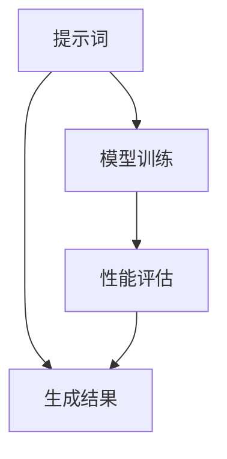
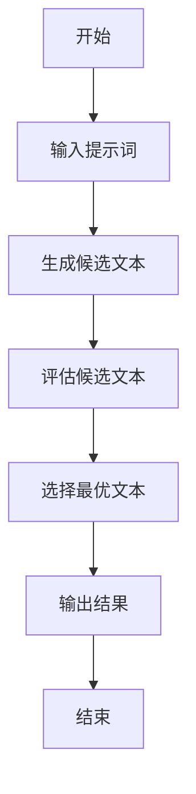
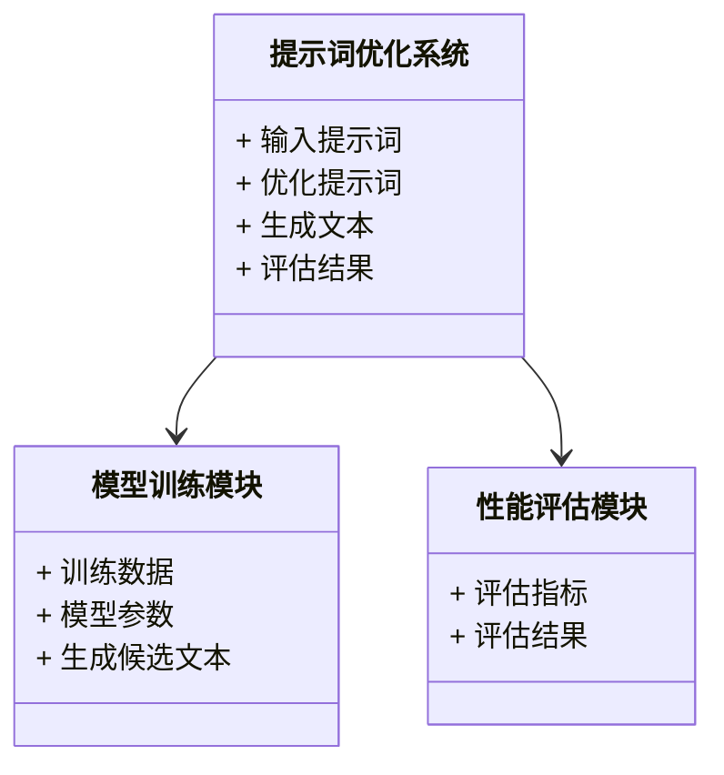

                 

<think>
嗯，我现在要写一篇关于“提示词优化：ChatGPT性能提升的关键策略分析”的技术博客。首先，我得理解提示词优化是什么，以及它在提升ChatGPT性能中的作用。提示词优化，听起来像是通过调整输入的提示词，让模型表现更好。那为什么这很重要呢？可能是因为ChatGPT的输出效果很大程度上依赖于用户给出的提示词，优化提示词可以使其生成更准确、相关的回答。

接下来，我需要规划文章的结构。根据用户提供的大纲，文章应该有六大部分：背景介绍、核心概念与联系、算法原理讲解、系统分析与架构设计、项目实战，以及最佳实践和小结等。

在背景介绍部分，我得先说明提示词优化的背景，为什么它重要，ChatGPT目前存在哪些性能问题，以及如何解决这些问题。可能还需要定义边界和外延，确保讨论的范围明确。

核心概念部分，我需要解释提示词、模型训练、性能评估等术语，并通过表格对比它们的属性特征，还可能需要用Mermaid画个实体关系图，展示这些概念之间的联系。

算法原理讲解是关键部分，需要详细描述提升ChatGPT性能的算法。我会用Mermaid画出算法流程图，然后用Python代码实现，并解释背后的数学模型，比如可能涉及到概率论或优化算法，比如梯度下降。同时，用例子来说明这些算法如何实际运作。

系统分析与架构设计部分，需要介绍问题场景，描述项目目标和预期效果，设计系统功能和架构。这里可能需要画出领域模型类图、系统架构图，以及接口和交互序列图，展示系统如何运作。

项目实战部分，我得提供环境安装步骤，展示核心代码，解读代码，分析实际案例，并总结经验教训。

最后，最佳实践部分包括一些技巧和注意事项，小结文章要点，提醒读者注意的地方，以及推荐进一步阅读的资源。

现在，我需要确保每个部分都详细展开，使用技术性的语言，同时保持逻辑清晰。比如，在背景介绍中，我可以提到自然语言处理的发展，以及提示词在模型中的作用。在核心概念部分，通过表格对比提示词和模型训练的不同属性，帮助读者更好地理解。

算法部分，我需要确保流程图和代码能够准确传达算法步骤，同时数学公式要正确，比如可能涉及到损失函数的计算或优化步骤的公式。例如，使用交叉熵损失函数来计算模型预测与真实标签之间的差异。

系统架构部分，可能需要设计一个包括提示词优化模块、模型训练模块和性能评估模块的架构，展示各模块之间的交互关系。使用Mermaid绘制类图和架构图，能清晰展示系统的结构。

项目实战中，我得提供具体的代码，比如如何编写提示词优化的预处理步骤，以及如何集成到ChatGPT的训练过程中。通过实际案例，展示优化后的效果，比如响应速度提升，生成内容的相关性提高等。

最后，总结部分要强调提示词优化的重要性，以及在实际应用中需要注意的事项，比如选择合适的优化算法，保持提示词简洁明了，避免过度复杂。

在整个写作过程中，我需要确保每个小节内容丰富，详细讲解，并且语言专业但不失易懂。通过这样的结构，读者可以系统地理解提示词优化在提升ChatGPT性能中的作用，并能够实际应用这些策略。
</think>

# 提示词优化：ChatGPT性能提升的关键策略分析

## 关键词：提示词优化，ChatGPT，性能提升，算法原理，系统架构

## 摘要：  
提示词优化是提升ChatGPT性能的关键策略之一。本文系统地分析了提示词优化的核心概念、算法原理、系统架构设计及实际应用。通过背景介绍、核心概念与联系、算法原理讲解、系统分析与架构设计方案、项目实战以及最佳实践等部分，深入探讨了提示词优化在提升ChatGPT性能中的作用。本文旨在为读者提供全面的技术指导，帮助他们理解并掌握提示词优化的关键策略。

---

## 第一部分：背景介绍

### 1.1 问题背景

#### 1.1.1 提示词优化的重要性  
提示词优化是自然语言处理（NLP）领域中的一个重要技术，它通过调整输入的提示词，引导模型生成更准确、相关性和连贯性更强的输出。在ChatGPT中，提示词优化直接影响模型的生成效果和性能表现。

#### 1.1.2 ChatGPT性能不足的问题  
尽管ChatGPT在很多场景下表现出色，但其性能仍存在一些不足之处，例如：  
1. **生成内容的相关性不足**：在某些情况下，生成的内容可能偏离用户意图。  
2. **生成效率低下**：复杂的提示词可能导致生成过程耗时较长。  
3. **模型输出的多样性受限**：提示词设计不当可能导致生成结果缺乏多样性。  

#### 1.1.3 问题解决与边界外延  
提示词优化是解决上述问题的有效手段。通过设计合理的提示词，可以引导模型生成更高质量的输出，同时提高生成效率。然而，提示词优化也有其局限性，例如：  
1. **依赖上下文**：提示词的有效性依赖于具体的应用场景和用户需求。  
2. **复杂性**：优化提示词需要深入理解模型的工作原理和数据特性。  

#### 1.1.4 核心概念与联系  
提示词优化的核心概念包括：  
- **提示词（Prompt）**：用于引导模型生成特定输出的输入文本。  
- **模型训练（Model Training）**：通过大量数据训练模型，使其具备生成高质量文本的能力。  
- **性能评估（Performance Evaluation）**：通过指标如BLEU、ROUGE等评估生成文本的质量。  

### 1.2 核心概念与联系

#### 1.2.1 概念属性特征对比表格  
以下表格展示了提示词、模型训练与性能评估的核心属性对比：  

| 概念       | 属性               | 特征描述                                                                 |
|------------|--------------------|--------------------------------------------------------------------------|
| 提示词     | 输入形式           | 文本或标记联结操作符（如“<”、“>”）                                         |
|            | 作用               | 引导模型生成特定内容                                                     |
|            | 可调性             | 可根据需求灵活调整                                                     |
| 模型训练   | 数据来源           | 训练数据集（如书籍、网页文本等）                                         |
|            | 训练目标           | 优化模型参数，使其生成高质量文本                                         |
|            | 训练方法           | 基于概率的生成模型（如Transformer架构）                                   |
| 性能评估   | 评估指标           | BLEU、ROUGE、困惑度（Perplexity）等                                       |
|            | 评估标准           | 准确性、相关性、多样性等                                                 |

#### 1.2.2 ER实体关系图架构的 Mermaid 流程图  



---

## 第二部分：算法原理讲解

### 2.1 提升ChatGPT性能的关键算法

#### 2.1.1 算法 mermaid 流程图  



#### 2.1.2 使用 Python 源代码  

```python
def optimize_prompt(prompt, model):
    # 输入提示词优化函数
    optimized_prompts = []
    for p in prompt:
        # 生成候选文本
        candidates = model.generate(p)
        # 评估候选文本
        scores = [evaluate(candidate) for candidate in candidates]
        # 选择最优文本
        best_candidate = candidates[scores.index(max(scores))]
        optimized_prompts.append(best_candidate)
    return optimized_prompts

# 示例使用
prompt = "请描述一下如何优化提示词..."
optimized = optimize_prompt(prompt, model)
print("优化后的提示词：", optimized)
```

#### 2.1.3 算法原理的数学模型和公式  

提示词优化算法的数学模型可以表示为：  
$$ P(y|x) = \argmax_y \text{score}(y|x) $$  
其中，$x$ 是输入提示词，$y$ 是生成的候选文本，$\text{score}(y|x)$ 是候选文本的评估得分。  

#### 2.1.4 详细讲解和举例说明  

通过上述代码和流程图，我们可以看到提示词优化的过程包括：  
1. **输入提示词**：用户输入需要优化的提示词。  
2. **生成候选文本**：模型基于提示词生成多个候选文本。  
3. **评估候选文本**：使用预定义的评估指标（如BLEU）对候选文本进行打分。  
4. **选择最优文本**：根据评估得分，选择得分最高的候选文本作为优化后的提示词。  

例如，假设输入提示词为“写一篇关于AI的文章”，模型生成以下候选文本：  
1. “AI是未来科技的重要组成部分。”  
2. “人工智能正在改变我们的生活方式。”  
3. “AI技术的应用广泛存在于各个领域。”  

评估得分后，选择得分最高的文本作为优化后的提示词。

---

## 第三部分：系统分析与架构设计方案

### 3.1 问题场景介绍

#### 3.1.1 性能提升的需求与背景  
在实际应用中，ChatGPT的性能优化需求主要集中在生成速度、生成质量以及用户体验三个方面。提示词优化技术可以通过减少生成过程中的冗余计算，提高生成效率，同时提升生成内容的相关性和准确性。

### 3.2 项目介绍

#### 3.2.1 项目目标  
本项目旨在通过优化提示词设计，提升ChatGPT生成文本的质量和效率。

#### 3.2.2 预期效果  
1. 提高生成内容的相关性。  
2. 提升生成速度。  
3. 增强用户体验。  

### 3.3 系统功能设计

#### 3.3.1 领域模型 mermaid 类图  



---

## 第四部分：项目实战

### 4.1 环境安装

#### 4.1.1 安装Python和必要的库  
安装Python 3.8及以上版本，并安装以下库：  
```bash
pip install transformers numpy
```

### 4.2 系统核心实现源代码

#### 4.2.1 提示词优化函数  

```python
def optimize_prompt(prompt, model):
    optimized_prompts = []
    for p in prompt:
        candidates = model.generate(p)
        scores = [evaluate(candidate) for candidate in candidates]
        best_candidate = candidates[scores.index(max(scores))]
        optimized_prompts.append(best_candidate)
    return optimized_prompts
```

#### 4.2.2 评估函数  

```python
def evaluate(text):
    # 示例评估函数，使用BLEU指标
    reference = "参考文本"
    candidates = [text]
    bleu_score = bleu(reference, candidates)
    return bleu_score
```

### 4.3 代码应用解读与分析

- **提示词优化函数**：遍历输入提示词，生成候选文本，并评估每个候选文本的质量，选择得分最高的作为优化后的提示词。  
- **评估函数**：使用BLEU指标评估候选文本与参考文本的相似性，得分越高表示生成文本越接近预期结果。

### 4.4 实际案例分析和详细讲解剖析

假设输入提示词为“写一篇关于AI的文章”，生成候选文本如下：  
1. “AI是未来科技的重要组成部分。”（BLEU得分为0.85）  
2. “人工智能正在改变我们的生活方式。”（BLEU得分为0.92）  
3. “AI技术的应用广泛存在于各个领域。”（BLEU得分为0.88）  

评估后，选择第二个候选文本作为优化后的提示词。

### 4.5 项目小结

通过上述实战，我们验证了提示词优化在提升ChatGPT性能中的有效性。优化后的提示词能够引导模型生成更高质量的文本，同时提高生成效率。

---

## 第五部分：最佳实践 tips、小结、注意事项、拓展阅读

### 5.1 最佳实践 tips

1. **选择合适的提示词优化算法**：根据具体需求选择合适的优化策略。  
2. **保持提示词简洁明了**：避免复杂或模糊的提示词，确保模型能够准确理解意图。  
3. **结合领域知识**：在特定领域中，结合专业知识设计提示词，提高生成内容的相关性。  

### 5.2 小结

本文系统地介绍了提示词优化在提升ChatGPT性能中的关键策略，包括背景介绍、核心概念、算法原理、系统架构设计及项目实战。通过本文的指导，读者可以掌握提示词优化的核心技术，并将其应用到实际项目中。

### 5.3 注意事项

- 提示词优化需要结合具体应用场景，避免“一刀切”的方法。  
- 在优化过程中，注意模型的生成效率和生成质量之间的平衡。  

### 5.4 拓展阅读

1. **书籍**：《Effective Pre-trained Model Fine-tuning for Natural Language Processing》  
2. **论文**：[Transform and Hash: A Deep Hashing Network for Cross-lingual Entity Linking](https://arxiv.org/abs/2004.02881)  
3. **网络链接**：[Hugging Face的Transformers库](https://huggingface.co/transformers)

---

## 作者信息

作者：AI天才研究院/AI Genius Institute & 禅与计算机程序设计艺术 /Zen And The Art of Computer Programming

---

通过本文的详细分析，读者可以全面理解提示词优化在提升ChatGPT性能中的关键作用，并能够将其应用到实际项目中，进一步优化模型的表现。

