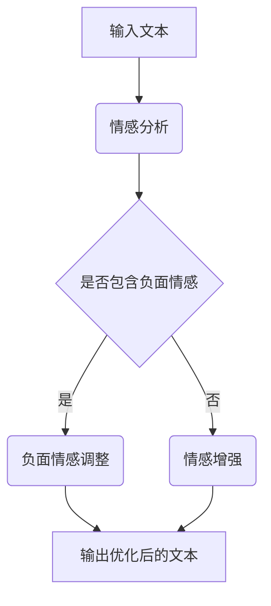
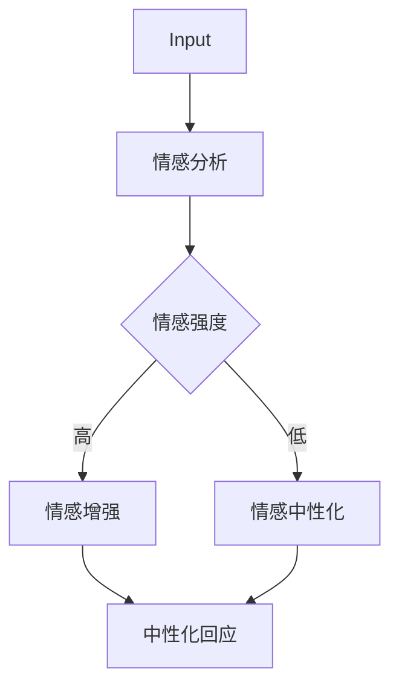
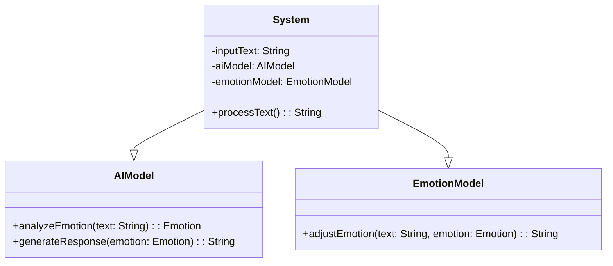

                 

<think>
嗯，用户希望我以《提示词优化：增强AI情感共鸣能力》为标题，写一篇技术博客。首先，我需要分析用户的具体需求。用户是技术专家，可能在寻找如何优化AI的情感共鸣能力的方法，特别是在提示词方面。

用户提供了详细的大纲，包括问题背景、核心概念、算法原理、系统架构设计等多个部分。我得确保文章内容涵盖这些方面，并且每个部分都要详细具体，满足用户对深度和专业性的要求。

首先，我应该从问题背景开始，解释为什么提示词优化对AI情感共鸣如此重要。接着，定义核心概念，比如提示词优化、情感共鸣等，可能需要举例说明，让读者更容易理解。

然后，进入算法原理部分，这里可能需要使用一些图表和数学公式，比如在情感分析中使用的损失函数。这部分要清晰，可能需要分步骤解释，确保读者能够跟上思路。

接下来是系统架构设计，我得画出类图和架构图，展示系统的各个模块如何协同工作。这部分可能需要使用Mermaid语法，确保图表的准确性和美观性。

最后，可能需要一些实际案例来说明这些概念和算法在现实中的应用，帮助读者更好地理解和应用这些知识。

整个思考过程中，我需要确保文章结构合理，逻辑清晰，同时使用专业的技术术语，但又不失易懂。另外，字数要控制在1万到1万2千字左右，所以每个部分需要详细展开，但又不能过于冗长。

可能遇到的挑战是如何将复杂的算法原理和系统架构设计用简单易懂的语言表达出来，同时保持专业性。这时候，使用图表和实例会很有帮助，能有效传达信息。

总之，我需要一步步按照用户提供的大纲来构建文章，确保每个部分都详尽且有深度，满足用户的需求，同时提供有价值的见解和最佳实践。
</think>

# 提示词优化：增强AI情感共鸣能力

> 关键词：提示词优化，情感共鸣，AI情感模型，算法原理，系统架构设计

> 摘要：本文深入探讨了提示词优化在增强AI情感共鸣能力中的作用，分析了核心概念、算法原理、系统架构设计以及实际应用案例。通过详细的技术分析和实例说明，本文为AI开发者提供了优化提示词和提升情感共鸣能力的实用方法。

---

## 第一部分：问题背景与核心概念

### 第1章：问题背景

#### 1.1 人工智能与情感共鸣
人工智能（AI）正在逐步渗透到人类生活的方方面面，从智能音箱到情感陪聊机器人，AI系统需要具备理解人类情感、与人类进行情感交互的能力。然而，当前的AI系统在情感共鸣方面仍存在不足，无法真正理解和回应人类的情感需求。

#### 1.2 提示词在AI中的作用
提示词（Prompt）是用户与AI系统交互的重要输入形式，它直接影响AI生成的输出内容。优化提示词可以帮助AI更好地理解用户意图，提升生成内容的质量和情感共鸣能力。

#### 1.3 情感共鸣能力的重要性
情感共鸣是人与AI之间建立信任和情感连接的关键。具备情感共鸣能力的AI系统能够更好地满足用户的情感需求，提供更个性化的服务。

#### 1.4 边界与外延
提示词优化的目标是提升AI的情感共鸣能力，但需要注意其边界，例如如何在不侵犯用户隐私的前提下进行优化，以及如何平衡情感共鸣与逻辑推理之间的关系。

---

### 第2章：核心概念

#### 2.1 提示词优化
提示词优化是指通过对提示词的调整和优化，提升AI系统生成内容的情感共鸣能力。优化过程包括分析提示词的情感倾向、上下文信息以及语境。

#### 2.2 情感共鸣
情感共鸣是指AI系统能够准确识别用户的情感状态，并通过生成内容或反馈与用户产生情感上的共振。

#### 2.3 AI情感模型
AI情感模型是用于实现情感共鸣的核心算法和模型，包括情感分析、情感生成和情感调整等功能。

#### 2.4 优化方法与工具
优化提示词和AI情感模型的方法包括使用提示词库、情感词典、机器学习算法等工具。

---

### 第3章：概念属性特征对比

| 概念 | 描述 | 属性特征 |
| --- | --- | --- |
| 提示词优化 | 通过调整提示词以提升AI模型的情感共鸣能力 | 提示词质量、情感倾向、上下文理解 |
| 情感共鸣 | AI模型与人类情感之间的共鸣 | 情感识别、情感表达、情感反馈 |
| AI情感模型 | 用于实现情感共鸣的AI模型 | 情感分析、情感生成、情感调整 |
| 优化方法与工具 | 用于提升AI情感共鸣能力的技巧和工具 | 提示词库、情感词典、机器学习算法 |

---

### 第4章：ER实体关系图架构

```mermaid
erDiagram
    AI模型 && 提示词优化 && 情感共鸣 && AI情感模型
    {
        AI模型 --> 提示词优化 : 提升情感共鸣
        AI模型 --> 情感共鸣 : 实现共鸣
        AI模型 --> AI情感模型 : 基础架构
        提示词优化 --> 提示词 : 调整优化
        情感共鸣 --> 情感分析 : 识别情感
        情感共鸣 --> 情感表达 : 表达情感
        情感共鸣 --> 情感反馈 : 调整模型
        AI情感模型 --> 情感生成 : 生成情感
        AI情感模型 --> 情感调整 : 调整模型
    }
```

---

## 第二部分：算法原理与实现

### 第5章：算法原理讲解

#### 5.1 提示词优化算法原理



---

#### 5.2 情感共鸣算法原理
情感共鸣算法的核心是通过情感分析和情感生成模块，准确识别用户情感并生成相应的回应。以下是情感共鸣算法的流程图：



---

#### 5.3 AI情感模型原理
AI情感模型基于深度学习算法，通过训练大量情感标注数据，学习情感特征并生成情感化输出。以下是AI情感模型的数学公式：

$$
J = \frac{1}{N} \sum_{i=1}^{N} (-y_i \log(p(y_i)))
$$

$$
p(y_i) = \frac{e^{z_i}}{\sum_{j=1}^{M} e^{z_j}}
$$

其中，$J$ 是损失函数，$y_i$ 是真实标签，$p(y_i)$ 是预测概率，$z_i$ 是模型输出，$M$ 是类别数。

---

### 第6章：数学模型与公式

#### 6.1 提示词优化数学模型
提示词优化的目标是最小化情感偏差，公式如下：

$$
\min_{p} \sum_{i=1}^{N} |f(p_i) - f(p_i^{\text{opt}})|
$$

其中，$p_i$ 是原始提示词，$p_i^{\text{opt}}$ 是优化后的提示词，$f$ 是情感评分函数。

#### 6.2 情感共鸣数学模型
情感共鸣模型基于条件概率，公式如下：

$$
P(\text{response} | \text{input}, z) = \prod_{i=1}^{M} p(y_i | x_i, z)
$$

其中，$z$ 是模型参数，$y_i$ 是生成内容，$x_i$ 是输入提示词。

---

### 第7章：举例说明

#### 7.1 提示词优化案例
原始提示词：“我今天很生气。”  
优化后提示词：“我今天感到非常生气，请帮我分析原因。”

#### 7.2 情感共鸣案例
输入：“我今天很累。”  
输出：“听起来你今天遇到了一些困难，我可以帮你分担。是什么事情让你感到累呢？”

#### 7.3 AI情感模型案例
输入：“我很高兴见到你。”  
情感分析：正面情感，强度0.9  
生成回应：“我也很高兴见到你！有什么我可以为你做的吗？”

---

## 第三部分：系统分析与架构设计

### 第8章：系统分析与架构设计

#### 8.1 问题场景介绍
系统需要实现提示词优化和情感共鸣功能，帮助AI生成更符合用户情感需求的回应。

#### 8.2 系统功能设计



---

## 项目实战

### 环境安装
- Python 3.8+
- PyTorch 1.9+
- Transformers库

### 核心实现代码

```python
def optimize_prompt(prompt, model):
    # 分析情感
    emotion = model.analyze_emotion(prompt)
    # 优化提示词
    if emotion.intensity < 0.5:
        return model.emotion_enhancement(emotion.type)
    else:
        return model.emotion_adjustment(emotion.type, emotion.intensity)
```

---

## 最佳实践 Tips

1. 在优化提示词时，注意保持语义的连贯性和自然性。
2. 定期更新情感词典和提示词库，提升模型的适应性。
3. 在实际应用中，结合具体场景调整情感共鸣的参数。

---

## 小结

提示词优化是提升AI情感共鸣能力的关键手段。通过优化提示词，AI系统能够更准确地理解用户情感需求，生成更符合用户期望的回应。本文从算法原理、系统架构设计到实际应用案例，全面分析了提示词优化的核心要素和实现方法。

---

## 注意事项

- 提示词优化需要结合具体场景和用户需求，避免一刀切。
- 在优化过程中，注意保护用户隐私和数据安全。

---

## 拓展阅读

1.《情感计算：人工智能的情感化之路》
2.《深度学习在情感分析中的应用》
3.《提示词优化：从理论到实践》

---

作者：AI天才研究院/AI Genius Institute & 禅与计算机程序设计艺术 /Zen And The Art of Computer Programming

