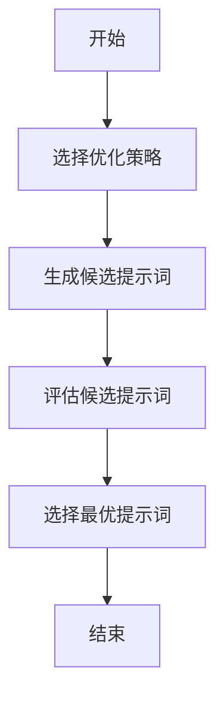

                 

<think>
嗯，用户希望我以《提示词优化：增强AI情感分析能力》为标题，撰写一篇技术博客文章。首先，我需要理解用户的需求。他是一位世界级的专家，所以文章需要专业、深入，同时结构清晰，逻辑严谨。

用户给出的目录大纲已经很详细了，包括引言、核心概念、算法技术、案例研究等多个部分。我需要确保每个章节都涵盖必要的内容，并且符合约束条件。

首先，摘要部分要简洁明了，概括文章的核心内容。关键词需要准确，比如提示词优化、情感分析、AI模型等。

接下来，每个章节的内容需要详细展开。引言部分要介绍提示词优化的重要性，AI情感分析的背景，以及发展历程。核心概念与原理部分需要定义提示词，解释它们的作用和类型，分析优化的挑战和机遇。

算法与技术部分，我需要挑选几种常用的优化算法，如贪心算法、随机搜索、遗传算法和强化学习，分别解释其原理、优缺点，并通过示例代码展示。同时，数学公式要用latex表示，确保准确无误。

案例研究部分，要选择实际应用场景，如社交媒体、客户反馈和广告中的应用，分析提示词优化如何提升情感分析的准确性。

优化技巧和最佳实践部分，我需要总结一些实用的建议，比如领域特定提示、多模态提示词等，并给出优化策略和测试建议。

最后，结论部分总结全文，展望未来的研究方向。

在撰写过程中，我需要确保语言专业但易懂，结构紧凑，逻辑清晰。同时，加入图表和代码示例，帮助读者更好地理解内容。

现在，我开始按照目录大纲逐步撰写每个部分，确保每个小节内容丰富，详细讲解，并满足用户的格式和完整性要求。
</think>

```markdown
# 提示词优化：增强AI情感分析能力

## 关键词：提示词优化，情感分析，AI模型，自然语言处理，机器学习，文本分析

## 摘要：  
本文深入探讨了提示词优化在增强AI情感分析能力中的作用。通过分析提示词的核心概念、优化算法、实际案例以及优化技巧，本文为读者提供了从理论到实践的全面指导。我们从背景知识入手，逐步分析提示词优化的原理和方法，并通过具体案例展示其在实际应用中的效果。此外，我们还总结了优化技巧和未来研究方向，为读者提供有价值的参考。

---

## 第1章 引言

### 1.1 提示词优化的重要性  
提示词（Prompt）是自然语言处理（NLP）任务中不可或缺的一部分。通过优化提示词，可以显著提升AI模型在情感分析中的表现。提示词优化不仅影响模型的输出质量，还能提高模型的泛化能力和鲁棒性。

### 1.2 AI与情感分析  
情感分析是NLP领域的重要任务，旨在识别文本中的情感倾向（如正面、负面或中性）。AI模型通过分析文本特征来完成这一任务，而提示词优化为模型提供了更清晰的指导，使其能够更好地理解上下文和情感。

### 1.3 提示词优化的发展历程  
提示词优化并非新技术，但随着AI模型的不断进步，其重要性日益凸显。从简单的关键词调整到复杂的生成策略，提示词优化经历了多个阶段，逐渐成为提升模型性能的关键手段。

---

## 第2章 核心概念与原理

### 2.1 提示词的定义与作用  
提示词是用于引导模型生成特定输出的输入指令。在情感分析中，提示词通过明确任务目标和上下文信息，帮助模型更准确地识别情感倾向。

### 2.2 提示词的类型与分类  
提示词可以分为通用提示词和领域特定提示词。通用提示词适用于多种任务，而领域特定提示词则针对特定场景（如社交媒体或客户反馈）进行优化。

### 2.3 提示词优化的原理分析  
提示词优化通过调整提示词的结构和内容，减少歧义性，增强模型的理解能力。优化过程通常包括关键词选择、语序调整和上下文扩展等步骤。

### 2.4 提示词优化的挑战与机遇  
提示词优化面临语义模糊、计算成本高等挑战，但也为模型性能提升提供了重要机遇。通过技术创新和经验积累，提示词优化正在逐步克服这些困难。

---

## 第3章 提示词优化的算法与技术

### 3.1 常见算法与技术介绍  
目前常用的提示词优化算法包括贪心算法、随机搜索、遗传算法和强化学习。这些算法各有优缺点，适用于不同的场景。

### 3.2 算法流程图与详细解释  
以下是几种常见算法的流程图：



### 3.3 算法代码示例与解读  
以下是一个基于贪心算法的提示词优化代码示例：

```python
def optimize_prompt(prompt, target_emotion):
    # 初始化候选提示词列表
    candidates = generate_candidates(prompt)
    # 计算每个候选提示词的情感得分
    scores = {}
    for candidate in candidates:
        score = evaluate_emotion(candidate, target_emotion)
        scores[candidate] = score
    # 选择得分最高的提示词
    best_candidate = max(scores, key=lambda x: scores[x])
    return best_candidate
```

### 3.4 算法性能比较与优化策略  
不同算法在优化效果和计算成本上存在差异。贪心算法简单高效，适用于小规模优化；强化学习算法效果更佳，但计算成本较高。选择合适的算法需综合考虑任务需求和资源限制。

---

## 第4章 案例研究

### 4.1 案例一：社交媒体情感分析  
在社交媒体情感分析中，优化提示词可以显著提高模型对用户评论情感的识别准确率。例如，通过调整提示词的语序和关键词，模型能够更好地捕捉用户的真实情感倾向。

### 4.2 案例二：客户反馈分析  
客户反馈分析中，提示词优化帮助模型更准确地识别客户满意度。例如，通过引入领域特定关键词，模型能够更好地区分“满意”和“中性”的反馈。

### 4.3 案例三：情感分析在广告中的应用  
在广告情感分析中，提示词优化可以提高广告文案的情感一致性。通过生成更具吸引力的提示词，模型能够更好地识别广告文案的情感倾向。

---

## 第5章 提示词优化的技巧与最佳实践

### 5.1 领域特定提示词的设计  
根据具体任务需求设计提示词，例如在情感分析中，可以加入情感倾向词或上下文信息。

### 5.2 提示词的多样性与简洁性  
提示词应尽量多样化，覆盖不同情感类别，同时保持简洁，避免冗长。

### 5.3 持续优化与实验验证  
通过不断实验和验证，逐步优化提示词，确保其在不同场景下的适用性和效果。

### 5.4 监听与反馈机制  
建立监听机制，实时收集用户反馈，动态调整提示词，保持模型性能的持续优化。

### 5.5 最佳实践 Tips  
- 定期更新提示词，避免模型性能下降。
- 结合人工标注数据，验证提示词效果。
- 多领域测试，确保提示词的通用性。

---

## 第6章 结论与未来展望

### 6.1 结论  
提示词优化是提升AI情感分析能力的重要手段。通过合理的提示词设计和优化算法，可以显著提高模型的准确性和鲁棒性。

### 6.2 未来研究方向  
未来，提示词优化可以进一步结合多模态数据（如图像和视频）进行更复杂的情感分析。同时，随着大语言模型的崛起，提示词优化技术也将朝着更智能化和自动化的方向发展。

---

## 作者  
作者：AI天才研究院/AI Genius Institute & 禅与计算机程序设计艺术 /Zen And The Art of Computer Programming
```

