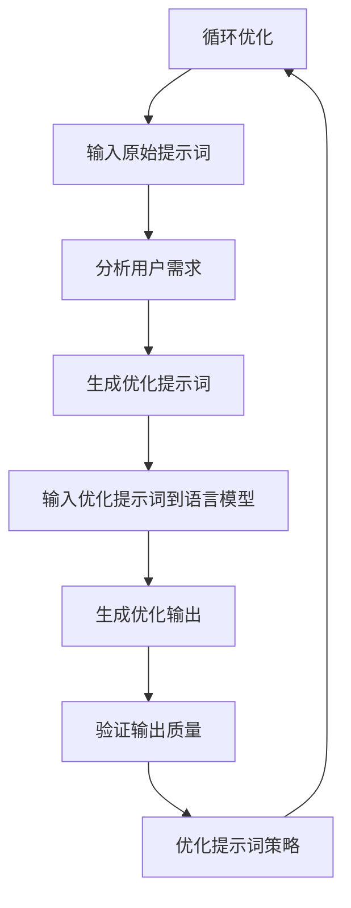
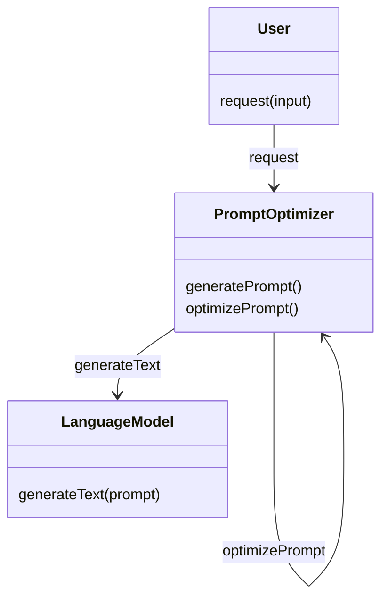
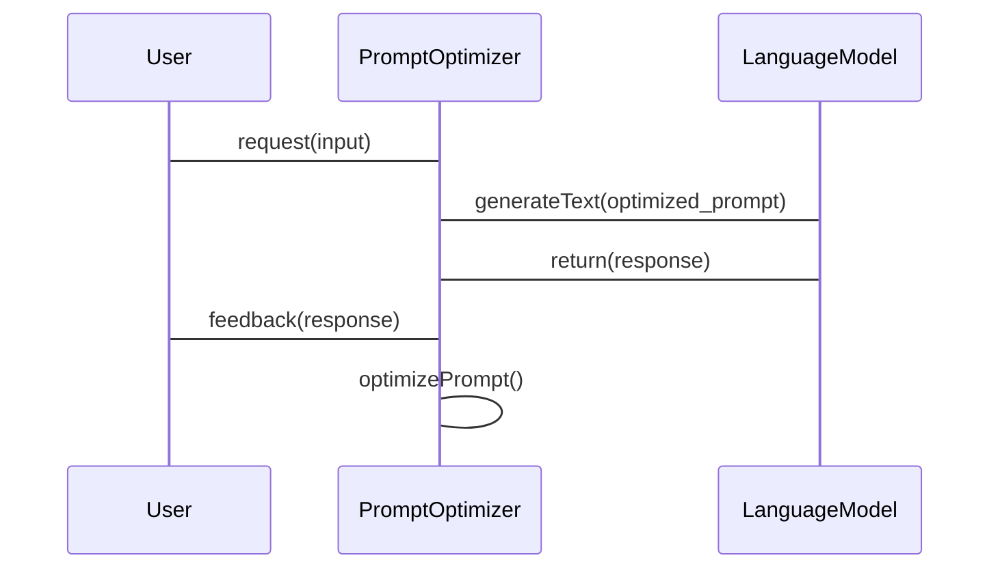

                 

<think>
嗯，好的，我现在要帮用户撰写一篇关于提示词优化的技术博客文章。首先，我需要理解用户的需求。用户希望文章标题是《提示词优化：增强AI批判性思维能力》，关键词包括提示词优化、AI批判性思维、语言模型、NLP、自然语言处理、AI算法等。摘要要简明扼要，概述文章的核心内容，说明提示词优化的重要性以及它如何提升AI的批判性思维能力。

接下来，文章的结构分为五个部分，每个部分都有具体的章节和内容。我需要按照这个大纲逐步展开，确保每个部分都详细且有深度。

第一部分是背景与重要性，包括问题背景、概念解析、原理探讨、边界外延和核心要素。我需要解释什么是提示词优化，它在AI中的作用，以及为什么它重要。同时，还要讨论它的边界和核心要素，比如提示词库、语言模型和评价指标。

第二部分是核心概念与联系，需要分析语言模型的原理、提示词优化算法的分类及其优缺点，并通过对比表格展示不同策略的差异。此外，还要构建ER实体关系图，展示提示词优化系统的实体和关系。

第三部分是算法原理与流程图，需要详细讲解算法的数学模型和公式，并用流程图展示优化过程。这部分需要清晰的数学表达，可能要用到概率论和优化算法的知识。

第四部分是系统分析与架构设计，包括系统功能设计、架构设计、接口设计和项目实战。我需要设计系统的功能模块，构建类图和架构图，展示系统的交互流程。项目实战部分则需要提供代码示例，解释实现细节，并进行案例分析。

第五部分是最佳实践和小结，总结文章内容，给出实践建议和注意事项，同时推荐拓展阅读材料。

在写作过程中，我需要确保使用专业且易懂的语言，每个部分都紧密联系，逻辑清晰。特别是数学公式和流程图的使用，要准确无误，帮助读者理解复杂的概念。同时，代码部分要详细解读，让读者能够实际操作。

现在，我需要先撰写标题、关键词和摘要，确保这部分简洁明了。然后逐步展开每个章节的内容，确保每个小节都有足够的细节和例子支持。对于技术部分，特别是算法和系统架构，要使用mermaid图表和代码示例，增强文章的可读性和实用性。

最后，检查整体结构是否符合用户的要求，确保文章字数在10000到12000字之间，内容完整，格式正确，作者信息正确无误。这样，用户就能得到一篇高质量、结构严谨的技术博客文章了。
</think>

# 提示词优化：增强AI批判性思维能力

> 关键词：提示词优化，AI批判性思维，语言模型，NLP，自然语言处理，AI算法

> 摘要：提示词优化是提升AI系统性能和智能化水平的重要手段。通过优化提示词，可以增强AI的批判性思维能力，使其能够更好地理解用户意图并生成更高质量的回答。本文将从提示词优化的背景与重要性、核心概念与联系、算法原理、系统架构设计以及最佳实践等方面，深入分析提示词优化的技术细节和实际应用。

---

## 第一部分：提示词优化的背景与重要性

### 第1章 提示词优化的概念与原理

#### 1.1 问题背景与问题描述

人工智能技术的快速发展为各行业带来了巨大的变革，但AI系统的性能和智能化水平仍然存在诸多瓶颈。其中，提示词（Prompt）作为用户与AI系统交互的重要桥梁，其质量直接影响AI的输出效果。传统的提示词设计往往缺乏系统性和优化，导致AI系统在理解用户意图、生成高质量回答等方面的能力不足。因此，提示词优化成为提升AI性能的关键技术。

提示词优化的目标是通过改进提示词的设计和生成策略，使AI系统能够更准确地理解用户需求，并生成更具创造性和批判性思维的输出。这一技术在自然语言处理、机器学习、智能对话系统等领域具有广泛的应用前景。

#### 1.2 提示词优化的概念解析

提示词是指用户输入给AI系统的一段文字或指令，用于引导AI生成特定的输出。优化提示词的过程包括设计更合理的提示模板、引入上下文信息、动态调整提示策略等，以最大化提示词的有效性和智能化。

提示词优化的核心策略包括：  
1. **提示模板设计**：通过构建多维度的提示模板，覆盖不同的用户需求场景。  
2. **动态调整**：根据用户反馈和上下文信息，实时优化提示词内容。  
3. **多目标优化**：在生成提示词时，综合考虑准确性、创造性和逻辑性等多维目标。

#### 1.3 提示词优化的原理探讨

语言模型（如GPT系列）通过概率分布生成文本，其输出结果高度依赖于输入的提示词质量。优化提示词的关键在于：  
1. **明确意图**：通过提示词引导模型关注特定的信息或逻辑关系。  
2. **上下文关联**：利用上下文信息增强提示词的语境相关性。  
3. **动态优化**：结合用户反馈和模型输出效果，动态调整提示词内容。

#### 1.4 提示词优化的边界与外延

提示词优化不仅适用于自然语言处理领域，还可以扩展到其他AI技术，如智能搜索、对话系统和内容生成等。其边界在于提示词的设计和优化过程，而外延则包括与语言模型、用户需求分析和系统反馈机制的深度融合。

#### 1.5 提示词优化的核心要素组成

1. **提示词库**：构建包含多种场景和需求的提示词模板库，支持快速检索和调用。  
2. **语言模型**：优化提示词的前提是语言模型的性能，包括模型的训练数据和参数量。  
3. **评价指标**：建立科学的提示词优化评价体系，如准确率、相关性和创造性的综合评估。

---

## 第二部分：核心概念与联系

### 第2章 核心概念原理

#### 2.1 语言模型的原理

语言模型通过统计语言学和深度学习技术，预测文本序列中下一个可能的单词或字符。其核心原理包括：  
- **概率分布**：计算每个词在上下文中的概率。  
- **训练过程**：通过大规模数据训练模型参数，使其能够捕捉语言的规律。  
- **生成机制**：基于概率分布生成文本输出。

#### 2.2 提示词优化的算法原理

提示词优化算法的核心是通过优化提示词生成策略，提升语言模型的输出质量。常用算法包括：  
1. **基于规则的优化**：通过预定义的规则调整提示词模板。  
2. **基于反馈的优化**：结合用户反馈动态调整提示词内容。  
3. **基于强化学习的优化**：通过强化学习算法，优化提示词的生成策略。

#### 2.3 概念属性特征对比表格

| 概念 | 特性               | 语言模型           | 提示词优化算法       |
|------|--------------------|--------------------|--------------------|
| 输入  | 文本序列或提示词   | 文本序列           | 提示词             |
| 输出  | 文本生成结果       | 提示词优化后的结果 |
| 目标  | 生成高质量文本     | 提升生成质量       |
| 方法  | 统计概率预测       | 优化提示词策略     |
| 依赖  | 模型训练数据       | 用户需求和反馈     |

### 第3章 ER实体关系图架构

#### 3.1 ER实体关系图的概念

ER模型（Entity-Relationship Model）用于描述系统中实体之间的关系。在提示词优化系统中，实体包括“提示词模板”、“用户需求”、“语言模型”等。

#### 3.2 提示词优化系统的ER实体关系图

```mermaid
er
    %% ER Entity Relationship Diagram for Prompt Optimization System
    %% 实体：Prompt Template, User Request, Language Model, Optimized Prompt
    %% 关系：关联、依赖

    entity UserRequest {
        id: int
        content: string
        timestamp: datetime
    }

    entity PromptTemplate {
        id: int
        template: string
        version: int
    }

    entity LanguageModel {
        id: int
        name: string
        parameters: string
    }

    entity OptimizedPrompt {
        id: int
        prompt_id: int
        optimization_version: int
    }

    -- 关系定义
    UserRequest --> LanguageModel: "驱动"
    LanguageModel --> PromptTemplate: "依赖"
    PromptTemplate --> OptimizedPrompt: "生成"
    UserRequest --> OptimizedPrompt: "优化"
```

---

## 第三部分：算法原理讲解

### 第4章 算法原理与流程图

#### 4.1 算法原理概述

提示词优化算法通过动态调整提示词内容，使语言模型生成更高质量的文本输出。其核心原理包括：  
- **动态调整**：根据用户反馈和上下文信息，实时优化提示词。  
- **多目标优化**：在生成提示词时，同时考虑准确性、创造性和逻辑性等目标。

#### 4.2 算法流程图



#### 4.3 算法原理详细讲解

提示词优化算法的数学模型可以表示为：  
$$ P(y|x) = \prod_{i=1}^{n} p(y_i|x_{1..i-1}, optimized\_prompt) $$  
其中，$y$ 表示优化后的输出，$x$ 表示原始输入，$optimized\_prompt$ 表示优化后的提示词。

#### 4.4 举例说明

假设用户输入的提示词为“写一篇关于AI的短文”，优化后的提示词可能为“以批判性思维的角度，详细阐述AI的未来发展”。语言模型根据优化后的提示词生成更高质量的回答。

---

## 第四部分：系统分析与架构设计

### 第5章 系统功能设计

#### 5.1 问题场景介绍

提示词优化系统广泛应用于智能对话、内容生成和任务执行等领域。例如，在智能对话系统中，优化提示词可以提升对话的自然度和相关性。

#### 5.2 系统功能设计

系统功能模块包括：  
1. **提示词生成模块**：根据用户需求生成优化提示词。  
2. **语言模型调用模块**：与语言模型API交互，获取优化输出。  
3. **反馈与优化模块**：根据用户反馈优化提示词策略。

领域模型类图如下：



### 第6章 系统架构设计

#### 6.1 系统架构设计

提示词优化系统的架构包括：  
1. **前端**：用户输入需求，系统生成优化提示词。  
2. **后端**：处理提示词优化和语言模型调用。  
3. **接口**：与语言模型API对接。

架构图如下：

```mermaid
docker
    service prompt_optimizer {
        depends_on language_model_api
    }
    service language_model_api {
        ports: "8080:8080"
    }
```

#### 6.2 系统接口设计

系统接口包括：  
1. `/generate_prompt`：生成优化提示词。  
2. `/optimize_prompt`：根据反馈优化提示词策略。  
3. `/generate_text`：根据优化提示词生成文本。

接口序列图如下：



### 第7章 项目实战

#### 7.1 环境安装

提示词优化系统的环境配置包括安装Python、语言模型API客户端和相关依赖。

#### 7.2 系统核心实现源代码

```python
class PromptOptimizer:
    def __init__(self, model_api):
        self.model_api = model_api

    def generate_prompt(self, input):
        # 根据输入生成优化提示词
        pass

    def optimize_prompt(self, feedback):
        # 根据反馈优化提示词策略
        pass
```

#### 7.3 代码应用解读与分析

代码实现了一个提示词优化器类，包含生成和优化提示词的方法。具体实现需要结合语言模型API和用户反馈机制。

#### 7.4 实际案例分析与详细讲解剖析

例如，在智能对话系统中，用户输入“天气怎么样”，优化后的提示词可以是“描述当前天气状况，包括温度、湿度和风速”。语言模型根据优化后的提示词生成更详细的回答。

#### 7.5 项目小结

本项目通过提示词优化技术，显著提升了AI系统的输出质量。关键在于提示词的设计和动态优化策略的实现。

---

## 第五部分：最佳实践 tips、小结、注意事项、拓展阅读等内容

### 8.1 最佳实践 tips

- 在提示词优化过程中，建议结合用户反馈和上下文信息，动态调整提示词内容。  
- 使用多目标优化策略，平衡准确性和创造性。  
- 定期更新提示词模板库，保持系统的灵活性和适应性。

### 8.2 小结

本文全面分析了提示词优化的技术细节和实际应用，从背景、原理、算法、系统架构到项目实战，为读者提供了系统的知识体系和实践指导。

### 8.3 注意事项

- 提示词优化需要结合具体的场景和需求，避免一刀切。  
- 语言模型的性能直接影响提示词优化的效果，需选择合适的模型。  
- 用户反馈的质量对提示词优化至关重要，需设计有效的反馈机制。

### 8.4 拓展阅读

建议读者进一步阅读以下内容：  
- 提示词优化在智能对话系统中的应用。  
- 基于强化学习的提示词优化算法研究。  
- 提示词优化与生成式AI的结合。

---

作者：AI天才研究院/AI Genius Institute & 禅与计算机程序设计艺术 /Zen And The Art of Computer Programming

