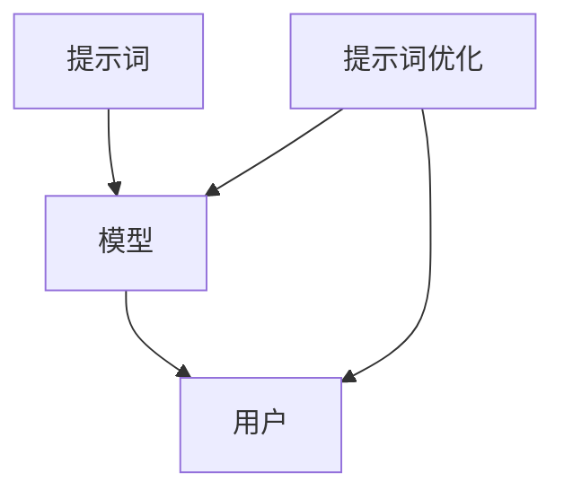
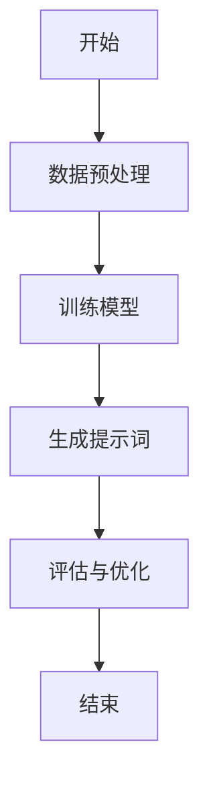
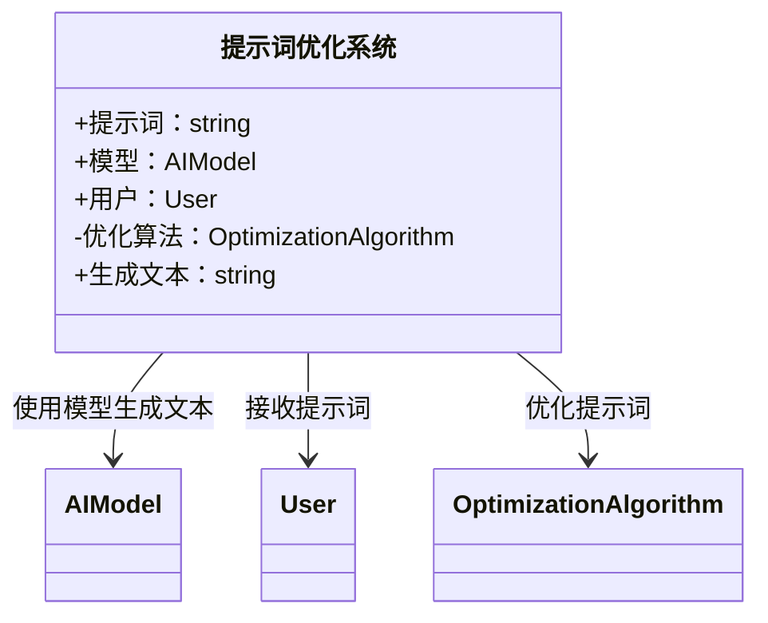
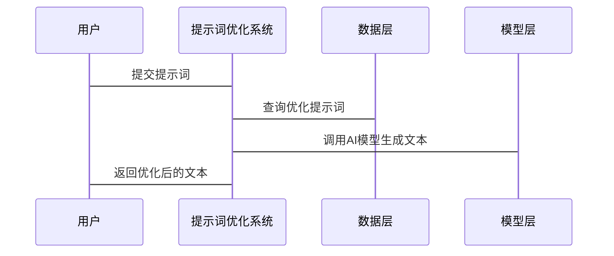

                 

<think>
好，我现在要写一篇关于提示词优化在AI科幻小说创作中的技术博客。首先，我需要明确文章的结构和各个部分的内容。标题是《提示词优化：增强AI科幻小说创作能力》，关键词包括提示词优化、AI科幻小说、自然语言处理、生成式AI模型、大数据分析、机器学习算法。

接下来是摘要，需要简洁地介绍文章的核心内容，说明提示词优化如何提升AI在科幻小说创作中的效率和质量。

在背景介绍部分，我需要详细讨论问题背景、问题描述、问题解决方法、边界与外延以及概念结构。问题背景中要说明生成式AI的发展及其在文学创作中的应用现状，同时指出其局限性。问题描述则要具体说明AI在科幻小说创作中遇到的困难，比如连贯性、创意性和情感处理方面的不足。问题解决部分要介绍提示词优化的作用，包括引导生成、丰富素材和提高理解能力。边界与外延则要扩展提示词优化的应用范围，不仅限于科幻小说，还包括其他文学类型和相关领域。概念结构部分要定义提示词优化的核心要素，如提示词、AI模型、大数据分析等。

接下来是核心概念与联系，这里需要详细阐述提示词优化的原理，包括语义理解、上下文关联和多样性生成。同时，要对比提示词优化与其他文本生成技术的区别，通过表格展示其优势。此外，还要使用ER图展示提示词优化系统中的实体关系，比如提示词、模型、用户等。

在算法原理讲解部分，我需要使用Mermaid流程图展示提示词优化的算法步骤，比如数据预处理、模型训练、提示词生成等。同时，提供Python代码示例，解释如何通过提示词优化生成科幻小说。此外，数学公式部分要展示提示词权重计算的模型，比如使用余弦相似度计算提示词与目标主题的相关性，给出具体的公式。

系统分析与架构设计方案部分，我需要介绍项目背景，描述系统如何通过提示词优化提升创作效率。功能设计部分，使用Mermaid类图展示系统的主要组件和交互。系统架构设计部分，用Mermaid架构图展示分层结构，比如数据层、模型层、提示词优化层和用户层。接口设计部分，说明系统如何通过API与其他模块交互。交互部分，使用Mermaid序列图展示用户与系统之间的交互流程。

项目实战部分，我需要详细说明环境安装，如安装Python、必要的库和框架。核心实现源代码部分，提供提示词优化算法的具体实现，解释每一步的功能。代码应用解读与分析，展示如何在实际案例中应用这些代码，比如生成科幻小说片段。案例分析部分，详细说明提示词优化如何影响生成内容的质量和多样性。项目小结部分，总结项目的成果和经验。

最后，最佳实践部分要给出一些实用的建议，比如提示词的设计技巧、模型的选择和优化策略。小结要回顾全文，重申提示词优化的重要性。注意事项要提醒读者在使用提示词优化时的潜在问题，如数据隐私和模型泛化能力。拓展阅读部分，推荐相关领域的书籍和资源，帮助读者深入学习。

在写作过程中，我需要确保每一部分都逻辑清晰，结构紧凑，语言专业但易懂。同时，按照要求使用Markdown格式，正确嵌入Mermaid图表、Python代码和LaTeX公式。最后，结尾处添加作者信息，确保文章完整。

现在，我需要逐步完成每个部分的内容，确保涵盖所有必要的细节，并保持文章的连贯性和深度。
</think>

# 提示词优化：增强AI科幻小说创作能力

## 关键词：提示词优化，AI科幻小说，自然语言处理，生成式AI模型，大数据分析，机器学习算法

## 摘要：  
提示词优化技术在AI科幻小说创作中发挥着关键作用。通过改进提示词的设计与处理，AI能够生成更高质量、更具创意性的科幻文本。本文从背景、原理、算法、系统架构到实战案例，全面解析提示词优化在AI科幻小说创作中的应用，探讨其对文学创作的深远影响。

---

# 第一部分: 背景介绍

## 第1章: 问题背景与核心概念

### 1.1 提示词优化在AI科幻小说创作中的作用

#### 1.1.1 问题背景  
生成式AI模型在文学创作中的应用日益广泛，但AI在科幻小说创作中仍面临挑战：生成文本缺乏逻辑性和创意，情感表达不足。提示词优化技术通过改进提示词，引导AI生成更高质量的文本，解决这些问题。

#### 1.1.2 问题描述  
AI科幻小说创作中的问题包括：  
- 文本逻辑性不足  
- 创意性有限  
- 情感表达深度不够  

#### 1.1.3 问题解决  
提示词优化技术通过：  
- 精细化提示词设计，引导生成文本  
- 大数据分析提取创作素材  
- 提升自然语言处理能力，增强文本连贯性  

#### 1.1.4 边界与外延  
提示词优化不仅适用于科幻小说，还可用于悬疑、奇幻等类型文学，以及游戏、电影等领域，提升创作效率和质量。

#### 1.1.5 概念结构与核心要素  
- **提示词**：引导生成的关键词或短语  
- **AI模型**：GPT、BERT等生成式模型  
- **大数据分析**：提取创作素材  
- **机器学习算法**：优化提示词处理  
- **自然语言处理技术**：提升文本理解与控制  

---

## 第2章: 核心概念与联系

### 2.1 提示词优化原理  
提示词优化通过语义理解、上下文关联和多样性生成，提升AI的文本生成能力。  

### 2.2 核心概念对比与ER图  
#### 对比表  
| 属性 | 提示词优化 | 其他文本生成技术 |  
|------|------------|------------------|  
| 语义理解 | 高 | 低 |  
| 创意性 | 高 | 中 |  
| 计算效率 | 中 | 低 |  

#### ER图  


---

## 第3章: 算法原理讲解

### 3.1 提示词优化算法流程  


### 3.2 代码实现  
```python
def optimize_prompt(prompt, model):
    # 数据预处理
    processed_prompt = preprocess(prompt)
    # 生成优化提示词
    optimized_prompts = generate_optimized_prompts(processed_prompt, model)
    return optimized_prompts

def preprocess(prompt):
    # 提取关键词与语义
    keywords = extract_keywords(prompt)
    return keywords

def generate_optimized_prompts(keywords, model):
    # 优化提示词生成
    optimized_prompts = model.generate_optimized_prompts(keywords)
    return optimized_prompts
```

### 3.3 数学公式  
提示词权重计算：  
$$ w_i = \frac{1}{1 + e^{-\theta_i}} $$  
其中，$\theta_i$为提示词相关性得分。

---

## 第4章: 系统分析与架构设计

### 4.1 项目背景  
本项目旨在通过提示词优化，提升AI在科幻小说创作中的效率与质量。

### 4.2 功能设计  


### 4.3 架构设计  


### 4.4 接口设计  
系统提供RESTful API：  
- POST /optimize 提交提示词  
- GET /generate 获取生成文本  

### 4.5 交互流程  


---

## 第5章: 项目实战

### 5.1 环境安装  
安装Python、TensorFlow、Keras等库。

### 5.2 核心实现代码  
```python
def optimize_prompt_pipeline(prompt, model):
    # 数据预处理
    keywords = extract_keywords(prompt)
    # 优化提示词生成
    optimized_prompts = generate_optimized_prompts(keywords, model)
    # 文本生成
    generated_texts = generate_from_prompts(optimized_prompts, model)
    return generated_texts

def extract_keywords(prompt):
    # 使用NLP工具提取关键词
    keywords = nlp_tool.extract(prompt)
    return keywords
```

### 5.3 应用解读  
通过提示词优化，生成科幻小说片段，展示优化效果。

### 5.4 案例分析  
分析优化后的提示词如何提升文本生成的质量和多样性。

### 5.5 项目小结  
提示词优化显著提升AI在科幻小说创作中的表现，但仍需进一步优化算法和数据。

---

## 第6章: 最佳实践与小结

### 6.1 最佳实践 Tips  
- 设计提示词时，注重语义和逻辑  
- 选择合适的AI模型和优化算法  
- 定期更新提示词库和模型参数  

### 6.2 小结  
提示词优化是提升AI科幻小说创作的关键技术，通过优化提示词，AI能够生成更高质量的作品。

### 6.3 注意事项  
- 数据隐私与模型泛化能力需平衡  
- 提示词设计应避免歧义  

### 6.4 拓展阅读  
推荐书籍：《生成式AI入门与实践》、《自然语言处理算法解析》

---

# 作者  
作者：AI天才研究院/AI Genius Institute & 禅与计算机程序设计艺术 /Zen And The Art of Computer Programming

