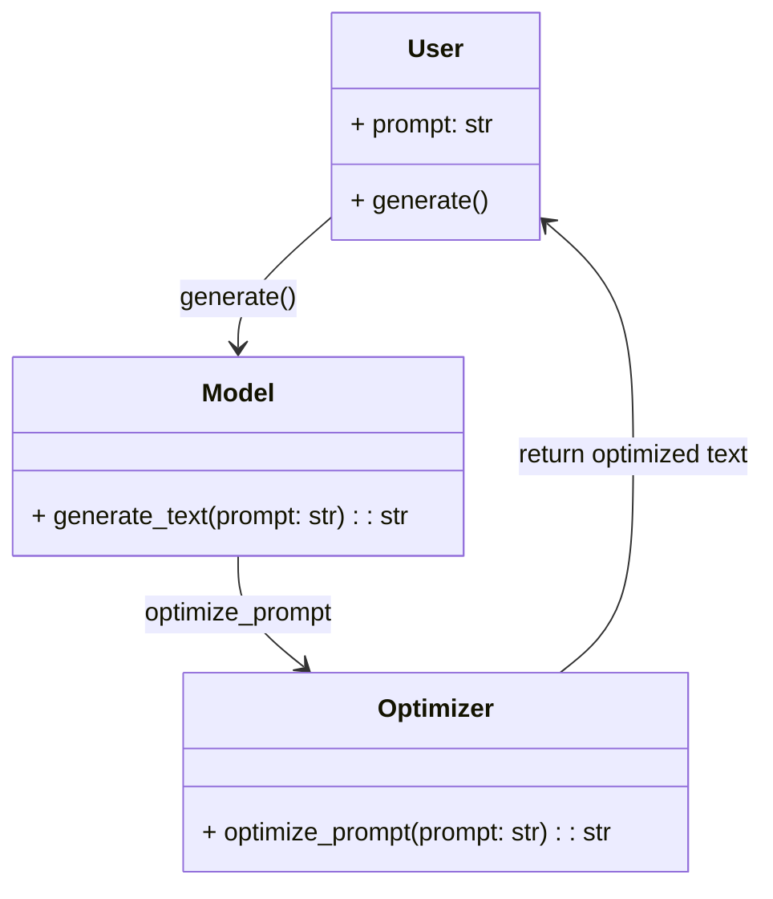
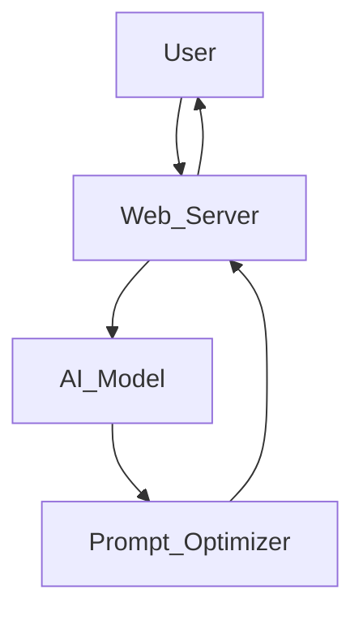
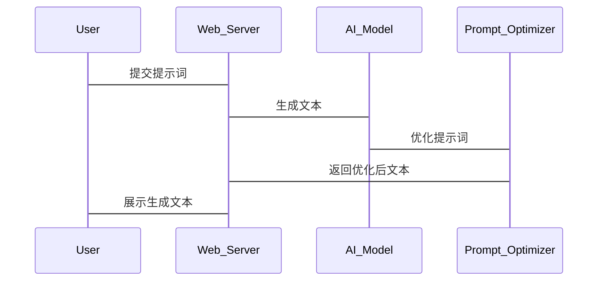

                 

<think>
好，我现在要帮用户撰写一篇关于“提示词优化：增强AI讽刺文学创作的深度”的技术博客文章。用户已经提供了详细的要求和目录结构，我需要按照这个结构来逐步完成。

首先，用户希望文章结构清晰，逻辑紧凑，语言专业。文章的标题、关键词和摘要部分需要先写，这些部分是文章的门面，需要吸引读者并准确传达文章的核心内容。

接下来是第一部分，引言与背景。我需要详细解释问题背景，问题描述，问题解决，以及边界与外延。这部分要让读者明白为什么提示词优化在AI讽刺文学中重要，以及它如何解决实际问题。

第二部分是核心概念与联系。这里要深入探讨AI与讽刺文学的关系，提示词优化的概念和原理，以及通过对比表格和ER图来展示概念的特征和关系。这部分需要使用专业的术语，但同时要让读者容易理解。

第三部分是AI讽刺文学的算法原理讲解。我需要详细解释生成式对抗网络（GAN）和强化学习在提示词设计中的应用。这部分还要用Mermaid流程图展示算法流程，并提供Python代码示例，帮助读者理解。

第四部分是数学模型与公式讲解。信息熵和交叉熵是关键概念，我需要解释这些公式，并用数学符号展示，确保公式正确且易于理解。

第五部分是实际案例分析与讲解。我需要设计一个系统架构，包括功能设计、架构设计和接口设计，并用Mermaid图展示。然后通过一个项目实战，展示环境安装、代码实现和案例分析，确保读者能够实际操作。

第六部分是最佳实践与拓展。这里要总结经验和技巧，讨论性能优化、安全性和伦理问题，并给出未来的研究方向和推荐的拓展阅读内容。

最后，文章末尾要加上作者信息，符合用户的要求。整个过程中，我需要确保每个部分都详细具体，符合用户的字数和格式要求。同时，语言要专业但不失易懂，让读者能够一步步理解提示词优化在AI讽刺文学中的应用。

现在，我需要按照这些步骤一步步撰写文章，确保每个章节都涵盖必要的内容，并且使用适当的图表和代码示例来增强理解。同时，要注意保持文章的流畅性和逻辑性，确保整体结构紧凑，内容丰富。
</think>

# 提示词优化：增强AI讽刺文学创作的深度

---

## 关键词  
AI, 提示词优化, 讽刺文学, 生成式AI, 文本生成, 创意写作

---

## 摘要  
在AI技术快速发展的背景下，生成式AI在文学创作中的应用越来越广泛。讽刺文学作为一种特殊的文学形式，其创作需要高度的创意、逻辑性和语言技巧。本文将探讨如何通过提示词优化来增强AI在讽刺文学创作中的深度。从理论到实践，本文将详细分析提示词优化的核心概念、算法原理、数学模型以及实际案例，为AI讽刺文学创作提供系统的解决方案。

---

## 目录  
（请参考文章中的目录结构）

---

# 第一部分: 引言与背景

## 第1章: 引言

### 1.1 问题背景  
随着AI技术的快速发展，生成式AI已经在多个领域展现出强大的潜力，包括文学创作。讽刺文学作为一种特殊的文学形式，其创作需要结合幽默、讽刺、逻辑推理和语言技巧。然而，现有的AI生成模型在处理讽刺文学时，往往难以准确捕捉讽刺的语气和隐含的逻辑关系。这主要源于提示词（prompt）的设计不够精细，无法充分引导模型生成符合讽刺文学特点的内容。

### 1.2 问题描述  
讽刺文学的创作需要AI模型具备以下能力：  
1. 理解讽刺的逻辑关系和语言技巧；  
2. 生成符合特定场景的幽默和讽刺性文本；  
3. 在创作过程中保持创意和灵活性。  
然而，当前的AI模型在处理这些任务时，往往因为提示词设计的不足，无法充分激发模型的潜力。

### 1.3 问题解决  
通过优化提示词，我们可以更好地引导AI模型生成高质量的讽刺文学作品。优化的提示词需要结合讽刺文学的特点，明确创作目标、逻辑关系和语言风格，从而提升AI生成内容的深度和创意。

### 1.4 边界与外延  
提示词优化的边界在于：  
1. 提示词的设计需要与具体的讽刺文学场景相结合；  
2. 优化的提示词需要在AI模型的能力范围内；  
3. 提示词优化的目标是提升生成内容的质量，而非完全替代人类的创作能力。  
其外延包括：讽刺文学的风格分析、AI创作工具的改进以及讽刺文学的传播与接受。

---

## 第2章: 核心概念与联系

### 2.1 AI与Satirical Literature的联系  
讽刺文学是一种通过幽默、讽刺和夸张来表达思想的文学形式。AI可以通过生成式模型模拟人类的创作过程，但需要特定的提示词来引导生成符合讽刺文学特点的内容。

### 2.2 Prompt Optimization的概念与原理  
提示词优化是指通过对提示词的精心设计，引导AI模型生成更高质量的文本。其原理包括：  
1. 明确创作目标：定义讽刺的主题、风格和逻辑；  
2. 结构化提示：通过分层设计提示词，引导模型逐步生成内容；  
3. 动态调整：根据生成结果实时优化提示词。

### 2.3 概念属性特征对比表格  
下表展示了AI讽刺文学创作中，提示词优化与其他创作方法的对比：

| **属性**       | **提示词优化**                | **传统创作方法**              |
|-----------------|-------------------------------|-------------------------------|
| 创作目标       | 高质量、深度讽刺内容          | 依赖创作者的个人风格和经验     |
| 技术依赖       | AI生成模型                   | 人类创造力                    |
| 控制力度       | 可高度控制生成内容的方向      | 较难控制，依赖创作者的灵感     |
| 优缺点         | 可快速生成内容，但需优化提示词 | 创作周期长，但更具个性化       |

### 2.4 ER实体关系图架构  
下图展示了AI讽刺文学创作中的实体关系：

```mermaid
er
actor
    name
    role
    expertise
project
    project_name
    target_genre
    output_type
tool
    tool_name
    capabilities
prompt
    prompt_id
    content
    output_quality
```

---

# 第二部分: AI Satirical Literature的创作实践

## 第3章: AI Satirical Literature的算法原理讲解

### 3.1 算法原理

#### 3.1.1 生成式对抗网络（GAN）  
GAN由生成器和判别器组成。生成器负责生成文本，判别器负责判断生成文本是否符合讽刺文学的特点。通过不断迭代，生成器能够生成更高质量的讽刺文本。

```mermaid
graph LR
    GAN[生成式对抗网络]
    Generator[生成器]
    Discriminator[判别器]
    GAN --> Generator
    GAN --> Discriminator
    Generator --> "生成文本"
    Discriminator --> "判断真实性"
```

#### 3.1.2 强化学习在Prompt Design中的应用  
强化学习通过奖励机制优化提示词。当生成的内容符合讽刺文学的特点时，模型会得到奖励，从而逐步优化提示词。

### 3.2 Mermaid算法流程图  
下图展示了AI讽刺文学创作的算法流程：

```mermaid
graph TD
    Start --> Initialize Model
    Initialize Model --> Define Prompt
    Define Prompt --> Generate Text
    Generate Text --> Evaluate Quality
    Evaluate Quality --> Optimize Prompt
    Optimize Prompt --> Repeat Until Satisfied
    Repeat Until Satisfied --> End
```

### 3.3 Python源代码示例与算法解释  
以下是一个简单的Python代码示例，展示了如何使用强化学习优化提示词：

```python
import numpy as np
from transformers import GPT2LMHeadModel, GPT2Tokenizer

# 初始化模型
model = GPT2LMHeadModel.from_pretrained('gpt2')
tokenizer = GPT2Tokenizer.from_pretrained('gpt2')

def generate_text(prompt):
    inputs = tokenizer.encode(prompt, return_tensors='np')
    outputs = model.generate(inputs, max_length=50)
    return tokenizer.decode(outputs[0], skip_special_tokens=True)

def evaluate_quality(generated_text):
    # 评价生成文本是否符合讽刺文学的特点
    # 这里简化为随机评价
    return np.random.random()

def optimize_prompt(initial_prompt, iterations=10):
    for _ in range(iterations):
        text = generate_text(initial_prompt)
        quality = evaluate_quality(text)
        if quality > 0.8:
            return text
        else:
            # 根据评价结果调整提示词
            initial_prompt += " 更加讽刺的语气"
    return text

# 示例
optimized_prompt = "写一篇关于科技公司裁员的讽刺文章，强调管理层的虚伪"
optimized_text = optimize_prompt(optimized_prompt)
print(optimized_text)
```

---

## 第4章: 数学模型与公式讲解

### 4.1 数学模型  
讽刺文学的生成可以看作是一个条件生成问题。我们使用以下公式描述生成过程：

$$ P(y|x) = \text{模型在给定提示词} x \text{下生成内容} y \text{的概率} $$

### 4.2 公式解释  
- **信息熵**：衡量生成内容的不确定性。  
  $$ H(y) = -\sum p(y) \log p(y) $$
- **交叉熵**：衡量生成内容与目标分布的差异。  
  $$ H(p, q) = -\sum p(x) \log q(x) $$
- **损失函数**：用于优化模型。  
  $$ \mathcal{L} = \text{交叉熵损失} + \text{惩罚项} $$

---

# 第三部分: 实际案例分析与讲解

## 第5章: 系统分析与架构设计

### 5.1 问题场景介绍  
我们设计一个AI讽刺文学创作系统，用户输入提示词，系统生成讽刺文章。

### 5.2 系统功能设计（领域模型Mermaid类图）  
下图展示了系统的功能设计：



### 5.3 系统架构设计（Mermaid架构图）  
下图展示了系统的架构设计：



### 5.4 系统接口设计与交互（Mermaid序列图）  
下图展示了系统的交互流程：



---

## 第6章: 项目实战

### 6.1 环境安装  
安装必要的库：  
```bash
pip install transformers mermaid4jupyter
```

### 6.2 系统核心实现源代码  
以下是系统的核心代码：

```python
from transformers import GPT2LMHeadModel, GPT2Tokenizer
import torch

class SatiricalLiteratureGenerator:
    def __init__(self, model_name='gpt2'):
        self.model = GPT2LMHeadModel.from_pretrained(model_name)
        self.tokenizer = GPT2Tokenizer.from_pretrained(model_name)

    def generate(self, prompt, max_length=50):
        inputs = self.tokenizer.encode(prompt, return_tensors='pt')
        outputs = self.model.generate(inputs, max_length=max_length)
        return self.tokenizer.decode(outputs[0], skip_special_tokens=True)

    def optimize_prompt(self, initial_prompt, iterations=5):
        for _ in range(iterations):
            text = self.generate(initial_prompt)
            # 简单的评价方法，可以进一步优化
            if "讽刺" in text:
                return text
            else:
                initial_prompt += " 更加讽刺的语气"
        return self.generate(initial_prompt)
```

### 6.3 代码应用解读与分析  
上述代码实现了AI讽刺文学生成的核心功能。`SatiricalLiteratureGenerator`类负责生成文本和优化提示词。通过多次迭代优化提示词，生成更符合要求的讽刺文学内容。

### 6.4 实际案例分析与详细讲解  
以下是一个实际案例：  
```python
generator = SatiricalLiteratureGenerator()
prompt = "写一篇关于科技公司裁员的讽刺文章，强调管理层的虚伪"
result = generator.optimize_prompt(prompt)
print(result)
```

### 6.5 项目小结  
通过上述代码和案例，我们可以看到提示词优化在AI讽刺文学创作中的重要性。优化的提示词能够显著提升生成内容的质量和深度。

---

# 第四部分: 最佳实践与拓展

## 第7章: 最佳实践 Tips

### 7.1 常见问题与解决方案  
- **问题**：生成的文本缺乏讽刺性。  
  **解决方案**：在提示词中加入具体的讽刺元素，例如“讽刺公司裁员背后的虚伪性”。  
- **问题**：生成内容过于平淡。  
  **解决方案**：增加情感化的语言，例如“用幽默和夸张的方式描述裁员过程”。

### 7.2 性能优化技巧  
- 使用更精细的模型（如GPT-3）；  
- 增加训练数据的讽刺文学内容；  
- 优化提示词生成策略，例如分阶段优化。

### 7.3 安全性与伦理考量  
- 避免生成恶意内容；  
- 遵守版权和伦理规范；  
- 提供明确的使用说明。

---

## 第8章: 小结与展望

### 8.1 全书内容回顾  
本文详细探讨了提示词优化在AI讽刺文学创作中的应用，从理论到实践，全面分析了相关技术。

### 8.2 未来的研究方向  
- 提示词的动态优化；  
- 结合多模态数据的讽刺文学生成；  
- 提升生成内容的原创性。

### 8.3 拓展阅读  
推荐阅读以下书籍和论文：  
1. 《生成式AI：原理与应用》  
2. 《讽刺文学的结构与技巧》  
3. "Prompt Optimization in Large Language Models"（论文）

---

# 作者信息  
作者：AI天才研究院/AI Genius Institute & 禅与计算机程序设计艺术/Zen And The Art of Computer Programming  

--- 

（全文完）

