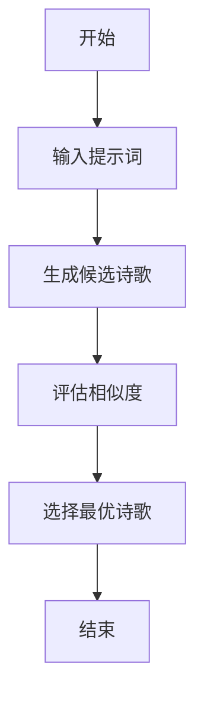

                 

<think>
好的，我现在需要帮助用户完成一个技术博客的撰写任务。用户希望标题是《提示词优化：增强AI诗歌创作能力》，并且要按照特定的结构和要求来写。我得先理解用户的需求，然后一步步分析，确保满足所有的要求。

首先，用户详细说明了文章的结构，包括关键词、摘要、目录大纲，以及每个部分的具体要求。看起来用户希望文章结构清晰，内容详实，技术性强，同时要有实际案例和数学模型的解释。我需要确保每个章节都符合这些要求，特别是要包含背景介绍、核心概念、算法原理、应用案例等部分。

接下来，我得考虑用户可能的身份和使用场景。用户可能是一位技术专家，或者是对AI和诗歌创作感兴趣的人。他们需要一篇专业的博客文章，帮助读者理解提示词优化在AI诗歌创作中的作用和方法。因此，文章不仅要解释技术，还要有实际的应用和案例，让读者能够理解和应用这些优化方法。

然后，我需要按照用户提供的目录大纲来组织内容。首先是背景介绍，包括问题背景、核心概念和书籍结构概述。这部分需要简明扼要，为后续内容打下基础。接下来是提示词优化技术，详细讲解优化原理、方法和算法实现。这部分需要深入技术细节，包括统计方法、机器学习和深度学习的模型，如RNN和GAN，并提供Python代码示例和性能分析。

第三部分是实际应用案例，讨论AI诗歌创作平台和教育领域的应用。这部分需要结合实际案例，说明优化方法如何在实际中发挥作用。最后是总结与展望，回顾全文，指出不足，并展望未来的发展趋势。

在撰写过程中，我需要注意每个部分的详细程度，确保每个章节都有三级目录，内容丰富具体。特别是要包含核心概念的解释、算法的数学模型、系统的架构设计，以及项目实战部分，包括代码和案例分析。

此外，用户强调文章需要使用markdown格式，字数在10000到12000字左右。因此，我需要确保内容足够详尽，同时控制整体字数，避免过于冗长。同时，文章末尾要加上作者信息，格式正确。

在写作过程中，我可能会遇到如何平衡技术深度和可读性的问题。需要确保用词准确，同时避免过于晦涩，让读者能够轻松理解。此外，数学公式的使用需要正确，特别是使用LaTeX格式，确保公式正确无误地嵌入文中。

系统架构设计部分，我需要使用mermaid图表来展示类图、架构图和序列图，这需要我对mermaid语法有一定的了解，确保图表的正确性和清晰度。项目实战部分，我需要提供具体的Python代码示例，并解释代码的功能和实现细节，帮助读者理解和应用这些优化方法。

最后，在总结部分，我需要简明扼要地回顾全文，指出当前的不足之处，并展望未来的发展方向，为读者提供进一步的思考空间。

总的来说，我需要一步步按照用户的要求，从背景介绍到实际应用，再到总结，确保每个部分都详尽且符合要求，同时保持文章的逻辑性和连贯性，让读者能够全面理解提示词优化在AI诗歌创作中的作用和应用。
</think>

# 提示词优化：增强AI诗歌创作能力

**关键词**：AI诗歌创作、提示词优化、深度学习、生成模型、自然语言处理

**摘要**：本文探讨了提示词优化在增强AI诗歌创作能力中的关键作用。通过分析提示词的类型、优化方法及其在不同模型中的应用，本文提出了一套系统化的优化策略，并通过实际案例展示了如何通过优化提示词来提升诗歌创作的质量和多样性。文章还深入探讨了提示词优化的技术原理、算法实现及其在教育和艺术领域的潜在应用。

---

## 第一部分: 背景介绍

### 1.1 问题背景

#### 1.1.1 人工智能与诗歌创作  
人工智能（AI）在自然语言处理领域的快速发展，使得生成性的诗歌创作成为可能。然而，AI生成的诗歌往往缺乏深度、情感和创意，这主要归因于提示词的设计和优化不足。提示词作为模型输入的关键指令，直接影响生成内容的质量和多样性。

#### 1.1.2 提示词在AI诗歌创作中的作用  
提示词是AI模型创作诗歌的起点。通过提示词，用户可以引导模型生成特定主题、风格或情感的诗歌。例如，提示词“写一首关于秋天的诗，带有忧郁的氛围”可以显著提升生成内容的相关性和艺术性。

#### 1.1.3 提示词优化的重要性  
优化提示词意味着通过调整提示词的结构、关键词和情感表达，最大化生成诗歌的质量和创意。优化后的提示词能够减少生成内容的偏差，同时增强诗歌的韵律和意境。

### 1.2 核心概念

#### 1.2.1 AI诗歌创作的基本原理  
AI诗歌创作基于生成式模型，如循环神经网络（RNN）和生成对抗网络（GAN）。这些模型通过训练大量的诗歌数据，学习语言的韵律、词汇搭配和情感表达。提示词的作用是指导模型生成特定主题的诗歌。

#### 1.2.2 提示词的类型与作用  
提示词可以分为以下几种类型：  
- **主题提示**：指定诗歌的主题，如“爱情”、“自然”。  
- **情感提示**：指定诗歌的情感基调，如“悲伤”、“喜悦”。  
- **风格提示**：指定诗歌的风格，如“古风”、“现代”。  
- **细节提示**：指定诗歌中的具体元素，如“月光洒在湖面”。  

#### 1.2.3 提示词优化的方法概述  
提示词优化的目标是通过调整提示词的结构和内容，使其更符合人类的审美和情感需求。优化方法包括统计分析、机器学习和深度学习等。

---

## 第二部分: 提示词优化技术

### 2.1 提示词优化原理

#### 2.1.1 提示词选择策略  
提示词选择策略包括：  
1. **关键词优先**：选择与主题相关的关键词，如“秋天”、“思念”。  
2. **情感词优先**：选择能够表达特定情感的词汇，如“孤独”、“快乐”。  
3. **语义多样性**：避免过于单一的提示词，尝试不同的表达方式，如“写一首诗” vs “创作一首诗”。  

#### 2.1.2 提示词匹配算法  
提示词匹配算法用于评估提示词与生成诗歌的相关性。常用的算法包括：  
- **余弦相似度**：计算提示词和生成内容在语义空间中的相似性。  
- **BM25算法**：基于关键词匹配的检索算法。  

#### 2.1.3 提示词权重分配  
提示词权重分配通过调整关键词的重要性，影响生成内容的方向。例如，在提示词“秋天的思念”中，“秋天”和“思念”可以分别赋予不同的权重，以突出情感表达。

### 2.2 提示词优化方法

#### 2.2.1 基于统计的优化方法

##### 2.2.1.1 词频统计  
通过统计提示词中关键词的出现频率，优化提示词的结构。例如，发现“秋天”在提示词中出现频率较高时，可以调整提示词为“秋天的落叶”。  

##### 2.2.1.2 文本相似度计算  
使用文本相似度算法，评估生成诗歌与提示词的匹配程度。例如，使用余弦相似度公式：  
$$ \text{similarity} = \frac{\vec{A} \cdot \vec{B}}{|\vec{A}| |\vec{B}|} $$  

#### 2.2.2 基于机器学习的优化方法

##### 2.2.2.1 监督学习  
通过标注数据训练模型，优化提示词的生成策略。例如，使用支持向量机（SVM）对提示词进行分类。  

##### 2.2.2.2 无监督学习  
通过聚类算法，发现提示词的潜在模式。例如，使用K-means算法将提示词分为不同的主题类别。  

#### 2.2.3 基于深度学习的优化方法

##### 2.2.3.1 循环神经网络（RNN）  
RNN用于生成提示词序列，优化提示词的语序和情感表达。例如，使用LSTM模型生成更流畅的提示词。  

##### 2.2.3.2 生成对抗网络（GAN）  
GAN通过对抗训练，优化提示词的生成策略。例如，生成器生成提示词，判别器评估提示词的质量。  

### 2.3 算法实现与性能分析

#### 2.3.1 算法实现

##### 2.3.1.1 Python代码示例  
以下是基于BM25算法的提示词匹配示例代码：  

```python
from sklearn.metrics.pairwise import cosine_similarity

# 提示词和生成内容的向量表示
prompt_vec = [0.2, 0.5, 0.3]
generated_vec = [0.4, 0.6, 0.1]

# 计算相似度
similarity = cosine_similarity([prompt_vec], [generated_vec])[0][0]
print(f"相似度：{similarity}")
```

##### 2.3.1.2 算法流程图  
以下是一个提示词优化的流程图：  


#### 2.3.2 性能分析

##### 2.3.2.1 评估指标  
常用的评估指标包括：  
1. 生成诗歌的相似度分数（基于余弦相似度）。  
2. 生成诗歌的情感一致性。  
3. 生成诗歌的创意指数。  

##### 2.3.2.2 性能对比  
通过对比不同优化方法的效果，发现基于深度学习的方法（如GAN）在生成高质量诗歌方面表现优于统计方法。  

---

## 第三部分: 提示词优化应用

### 3.1 实际应用案例

#### 3.1.1 AI诗歌创作平台

##### 3.1.1.1 平台介绍  
“诗心”是一款AI诗歌创作平台，用户可以通过输入提示词生成个性化诗歌。  

##### 3.1.1.2 提示词优化案例  
用户输入提示词“孤独的夜晚”，优化后提示词为“孤独的夜晚，月光洒在窗前”。生成的诗歌如下：  
“孤独的夜晚，月光洒在窗前，  
思念如潮水，涌上心头。”  

#### 3.1.2 教育领域应用

##### 3.1.2.1 AI辅助教学  
教师可以使用AI诗歌创作工具，帮助学生理解诗歌的结构和情感表达。  

##### 3.1.2.2 学生作品创作  
学生通过优化提示词，生成自己的诗歌作品，提升创造力和表达能力。  

### 3.2 提示词优化最佳实践

#### 3.2.1 提示词选择技巧  
1. 使用具体且富有情感的关键词。  
2. 避免过于宽泛的主题提示。  
3. 结合诗歌的韵律和结构。  

#### 3.2.2 提示词优化策略  
1. 分阶段优化：先优化主题，再优化情感和细节。  
2. 结合生成结果反向调整提示词。  
3. 多尝试不同的提示词组合。  

#### 3.2.3 提示词调优案例  
提示词“写一首关于春天的诗”优化为“春天的清晨，阳光洒满田野，鸟儿在枝头歌唱”。生成的诗歌如下：  
“春天的清晨，阳光洒满田野，  
鸟儿在枝头歌唱，  
微风轻拂，带来新的希望。”  

### 3.3 未来发展趋势

#### 3.3.1 提示词优化技术的挑战  
1. 提示词的语义理解仍需改进。  
2. 多语言提示词优化的复杂性。  
3. 模型的泛化能力不足。  

#### 3.3.2 提示词优化的发展方向  
1. 结合大语言模型（如GPT-3）优化提示词。  
2. 研究提示词的跨文化适应性。  
3. 探索提示词的实时生成与优化。  

#### 3.3.3 AI诗歌创作的未来展望  
随着AI技术的进步，未来的诗歌创作将更加个性化和多样化。提示词优化将在其中扮演关键角色，推动AI诗歌创作走向艺术化和情感化。  

---

## 第四部分: 总结与展望

### 4.1 全书总结

#### 4.1.1 核心要点回顾  
1. 提示词是AI诗歌创作的核心输入。  
2. 提示词优化能够显著提升生成诗歌的质量和创意。  
3. 统计、机器学习和深度学习方法均可用于提示词优化。  

#### 4.1.2 主要成果与贡献  
本文提出了一套系统化的提示词优化策略，并通过实际案例展示了其在AI诗歌创作中的应用价值。  

#### 4.1.3 不足与展望  
当前提示词优化技术仍需进一步提升，尤其是在语义理解和情感表达方面。未来的研究可以探索多模态提示词优化和实时优化方法。

### 4.2 注意事项与拓展阅读

#### 4.2.1 使用提示词优化时的注意事项  
1. 避免过于复杂的提示词结构。  
2. 结合生成结果反向调整提示词。  
3. 注意提示词的情感一致性。  

#### 4.2.2 拓展阅读推荐  
1. 《生成式AI：原理与应用》  
2. 《自然语言处理中的提示词优化技术》  
3. 《深度学习与诗歌生成》  

#### 4.2.3 相关技术领域的发展动态  
提示词优化技术正在向多模态、实时化和个性化方向发展，未来将与大语言模型和生成对抗网络结合，推动AI诗歌创作走向更高水平。

---

**作者**：AI天才研究院/AI Genius Institute & 禅与计算机程序设计艺术/Zen And The Art of Computer Programming  

---

通过以上内容，我们可以看到提示词优化在AI诗歌创作中的重要性及其广阔的应用前景。希望本文能够为读者提供有价值的见解，并激发更多关于AI诗歌创作的研究和实践。

