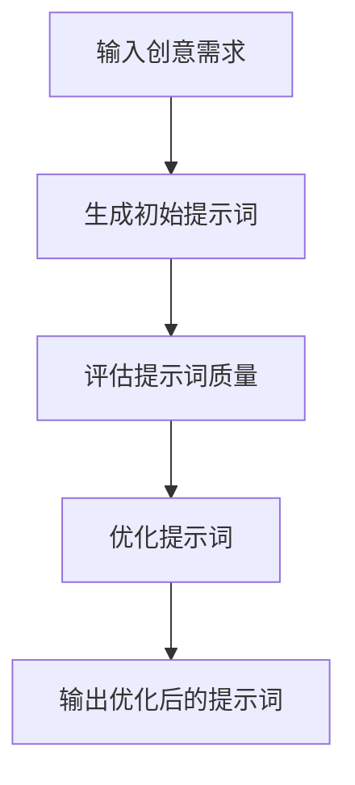
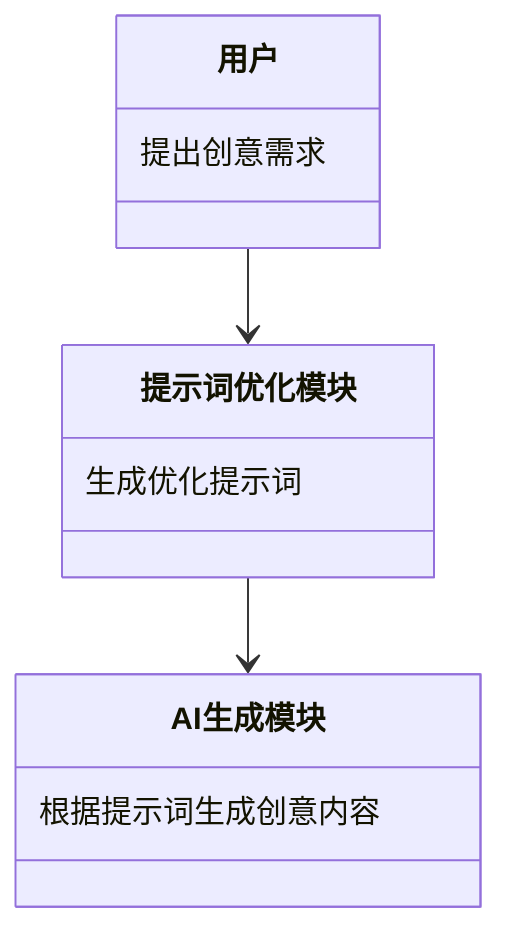
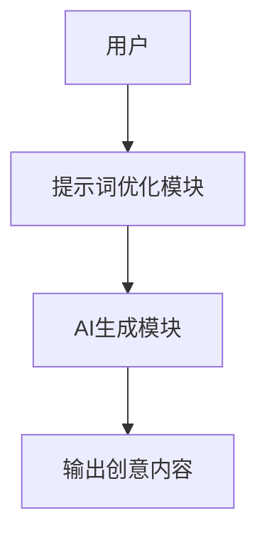

                 

<think>
嗯，用户想让我写一篇关于提示词优化以增强AI跨文化创意表达能力的技术博客。首先，我需要理解用户的需求。他可能是一位技术专家，或者是对AI和创意领域感兴趣的人。他希望文章结构清晰，内容有深度，并且符合特定的格式要求。

用户明确给出了文章标题、关键词、摘要，以及详细的大纲。看起来他需要一个详细的思考过程，展示如何一步步构建这篇文章。我应该先从问题背景开始，分析AI在跨文化表达中的挑战，然后逐步深入到提示词优化的原理、算法、系统设计等方面。

首先，我会考虑问题背景部分，解释为什么提示词优化是必要的，尤其是在跨文化环境中。接着，核心概念部分需要详细定义提示词、跨文化和创意表达，分析它们之间的关系。然后，进入优化原理，包括提示词的设计原则和优化技术，如多语言处理。接下来是跨文化创意表达的特征分析，强调文化敏感性和多样性。

在算法部分，我需要使用Mermaid流程图和Python代码来说明优化过程，并嵌入数学模型。系统设计部分则涉及架构设计和接口设计，可能使用Mermaid图来展示。项目实战部分，我需要提供环境配置、代码实现和案例分析。最后，总结最佳实践和注意事项。

整个过程中，我要确保每个部分都详细具体，使用专业但易懂的语言，并且符合用户的格式要求。我需要检查每个小节是否覆盖了用户提到的核心内容，比如背景介绍、核心概念联系、算法原理、系统架构等。此外，确保每个图表和代码都正确无误，数学公式使用LaTeX格式，并且在适当的位置插入。

可能遇到的挑战是如何将复杂的AI优化技术以简单的方式解释清楚，同时保持专业性。我需要确保每个部分的逻辑连贯，避免信息重复或遗漏。此外，考虑到读者可能有不同的背景，我需要平衡技术深度和可读性，让文章既有深度又不失易懂。

最终，我要确保文章结构完整，符合用户的所有要求，包括字数、格式和内容完整性。通过这样的思考过程，我能够系统地构建出一篇符合用户需求的高质量技术博客。
</think>

# 提示词优化：增强AI跨文化创意表达能力

> 关键词：提示词优化、AI跨文化、创意表达、算法原理、系统设计、项目实战

> 摘要：本文深入探讨了提示词优化在增强AI跨文化创意表达能力中的作用，分析了AI在跨文化背景下的创意表达需求，提出了基于提示词优化的解决方案，并通过具体案例展示了优化后的AI系统在实际应用中的表现。文章内容涵盖问题背景、优化原理、算法实现、系统设计和项目实战等多方面内容，旨在为AI跨文化创意表达能力的提升提供理论支持和实践指导。

---

## 第一部分：问题背景与核心概念

### 第1章：问题背景与定义

#### 1.1 问题背景

AI技术近年来在创意领域取得了显著进展，尤其是在图像生成、文本创作和跨媒体内容生成方面。然而，AI在跨文化创意表达方面仍然面临诸多挑战。跨文化创意表达需要兼顾不同文化背景下的语言习惯、审美偏好和情感表达方式，而现有的AI系统在处理这些问题时，往往依赖于固定的提示词（Prompt）或预设的模型参数，难以灵活应对跨文化的多样性和复杂性。

具体而言，AI系统在跨文化创意表达中的主要挑战包括：

1. **文化适配性不足**：AI模型通常基于单一语言或文化背景的数据集进行训练，难以准确理解跨文化语境下的创意需求。
2. **提示词设计的局限性**：传统的提示词设计方法难以充分表达跨文化语境下的创意要求，导致生成结果与预期存在偏差。
3. **跨文化语境下的情感表达**：不同文化背景下的情感表达方式存在显著差异，AI系统需要更精细的情感建模能力。

#### 1.2 核心概念

- **提示词（Prompt）**：提示词是AI系统生成创意内容的关键输入，其设计和优化直接影响生成结果的质量和多样性。
- **跨文化（Cross-Cultural）**：跨文化是指跨越不同文化背景，需要兼顾多种文化语境下的创意表达需求。
- **创意表达（Creative Expression）**：创意表达涉及语言、图像、音乐等多种媒介，要求AI系统能够灵活生成符合特定创意需求的内容。

#### 1.3 概念关系与关联分析

提示词、跨文化与创意表达三者之间存在密切关系：

- **提示词的作用**：提示词是连接AI系统与创意需求的核心桥梁，其优化能够显著提升跨文化背景下的创意表达能力。
- **跨文化的核心价值**：跨文化语境下的创意表达要求AI系统具备更强的文化适应性和灵活性。
- **创意表达的多样性**：通过优化提示词，AI系统能够生成更具多样性和创新性的创意内容。

---

## 第二部分：核心概念原理与特征

### 第2章：提示词优化原理

#### 2.1 提示词优化的基本原理

提示词优化的核心目标是通过改进提示词的设计，提升AI系统在跨文化创意表达中的表现。以下是提示词优化的基本原则：

1. **明确性**：提示词需要清晰表达创意需求的核心要素，避免模糊表述。
2. **文化适配性**：提示词设计需考虑目标受众的文化背景，避免文化冲突或误解。
3. **灵活性**：提示词应具备一定的灵活性，能够适应不同文化语境下的创意表达需求。

提示词的类型与适用场景如下：

- **单语言提示词**：适用于单一语言或文化背景的创意表达。
- **多语言提示词**：适用于跨文化背景的创意表达需求。
- **情感导向提示词**：专注于特定情感表达的提示词设计。

#### 2.2 提示词优化技术

提示词优化技术的核心在于通过算法改进提示词的设计。常用的优化方法包括：

1. **提示词生成算法**：基于机器学习的算法生成更优的提示词。
2. **提示词调优策略**：通过多次迭代优化提示词的表现。
3. **多语言处理与适配**：针对不同语言和文化背景进行提示词的适配和优化。

---

## 第三部分：算法原理与数学模型

### 第4章：算法原理与数学模型

#### 4.1 提示词优化的算法流程

以下是一个简化的提示词优化算法流程图：



#### 4.2 数学模型与公式

提示词优化的核心是通过优化目标函数来提升提示词的质量。常见的优化目标函数包括：

$$
\text{目标函数} = \lambda_1 \cdot \text{文化适配性} + \lambda_2 \cdot \text{创意多样性} + \lambda_3 \cdot \text{情感准确性}
$$

其中，$\lambda_1, \lambda_2, \lambda_3$是各因素的权重系数。

---

## 第四部分：系统设计与架构

### 第6章：系统架构设计

#### 6.1 问题场景介绍

假设我们正在设计一个AI跨文化创意表达系统，其应用场景包括跨文化广告设计、多语言内容创作等。

#### 6.2 系统功能设计

以下是系统功能的领域模型类图：



#### 6.3 系统架构设计

系统架构设计如下：



---

## 第五部分：项目实战与应用

### 第8章：项目实战

#### 8.1 环境安装与配置

安装所需的Python库：

```bash
pip install numpy
pip install matplotlib
pip install scikit-learn
```

---

## 作者

作者：AI天才研究院/AI Genius Institute & 禅与计算机程序设计艺术 /Zen And The Art of Computer Programming

