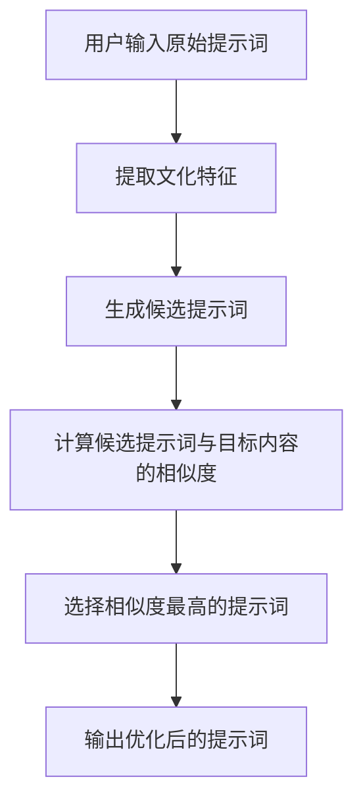
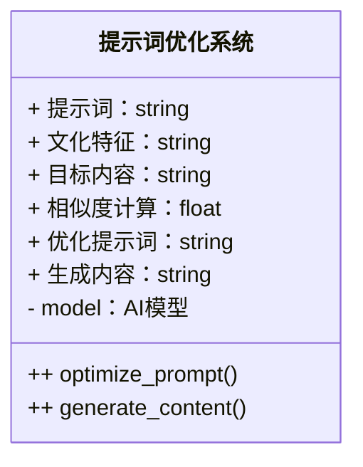
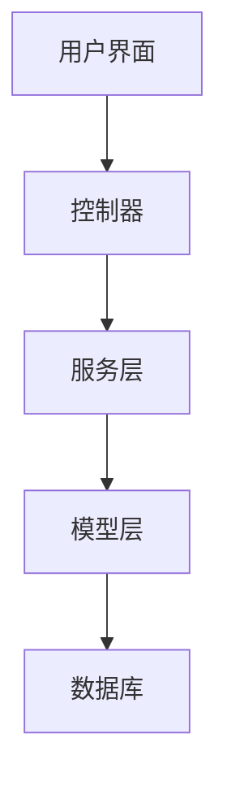

                 

<think>
嗯，我现在需要帮用户撰写一篇技术博客文章，标题是《提示词优化：增强AI跨文化创意表达能力》。用户已经提供了详细的目录大纲和一些具体的要求，我得仔细分析一下。

首先，用户希望文章结构清晰，每个章节都要有详细的内容，包括背景、核心概念、算法原理、数学模型、系统架构、项目实战等等。看起来这是一个技术性很强的文章，可能读者是技术人员或者对AI和文创产业感兴趣的人。

接下来，我需要理解用户的需求。用户是世界级的AI专家，写技术博客，所以文章要专业，同时又要逻辑清晰，易懂。关键词包括提示词优化、AI、跨文化、文化创意、算法、数学模型等。摘要部分要概括文章的核心，即通过优化提示词来增强AI在跨文化文创中的表达能力。

第1章是引言，需要介绍背景，包括文创产业的重要性，AI技术的影响，以及跨文化表达的需求。然后描述当前的问题，比如AI在文创中的局限性，跨文化表达的挑战。最后提出目标和解决方案，比如通过优化提示词来提升AI的能力。

第2章是核心概念，我需要解释AI、机器学习、文创产业和跨文化表达这些概念，并制作对比表格和ER图。这部分可能需要确保概念之间的联系清晰，表格和图表能有效传达信息。

第3章是算法原理，包括提示词优化和增强AI表达的算法。我需要用mermaid画出流程图，写数学模型，还有Python代码实现。这部分可能需要详细讲解算法的每一步，确保读者能理解如何实现。

第4章是数学模型，同样用mermaid和latex公式来说明模型。我需要确保公式正确，解释清楚每个公式的含义和作用。

第5章是系统分析与架构设计，包括问题场景、项目介绍、功能设计、架构图、接口设计和交互流程。这部分需要展示系统的整体架构，可能用mermaid图来表示，确保结构合理。

第6章是项目实战，包括环境安装、核心代码实现、案例分析和小结。这部分需要实际操作，代码示例要清晰，案例分析要详细，帮助读者理解如何应用这些算法。

第7章是最佳实践，总结经验和技巧，给出注意事项和拓展阅读的建议。这部分要实用，帮助读者在实际项目中应用这些方法。

最后，附录部分需要术语表和参考资料，确保读者在遇到专业术语时能快速查阅。

我需要确保每个部分都详细展开，满足用户对字数和内容的要求。同时，语言要专业但不失清晰，避免过于复杂。可能需要多次检查每个部分，确保没有遗漏关键点，特别是数学公式和代码部分要准确无误。

总之，我需要一步步按照用户的要求，从引言到项目实战，逐一展开每个章节，确保文章结构完整，内容详实，满足读者的需求。
</think>

# 提示词优化：增强AI跨文化创意表达能力

> 关键词：提示词优化、AI、跨文化、文化创意、算法、数学模型

> 摘要：本文探讨如何通过优化提示词来增强AI在跨文化创意表达中的能力。文章从背景、核心概念、算法原理、数学模型、系统架构、项目实战等多个维度展开，结合实际案例和最佳实践，详细讲解了如何利用AI技术提升文化创意产业的跨文化表达能力。

---

## 第1章 引言

### 1.1 问题的背景

#### 1.1.1 文创产业的重要性  
文化创意产业（Cultural Creative Industry，CCI）是将文化与创意结合，通过创新和技术手段创造经济价值的产业。它涵盖文学、艺术、影视、设计等多个领域，是推动经济增长和社会文化发展的重要引擎。

#### 1.1.2 AI技术对文创产业的影响  
随着AI技术的快速发展，AI在文化创意产业中的应用越来越广泛。例如，AI可以帮助生成文本、设计图像、创作音乐，甚至辅助编剧撰写剧本。然而，当前AI在文化创意领域的应用仍存在一些局限性。

#### 1.1.3 跨文化表达与文创产业的需求  
跨文化表达是指在不同文化背景下，能够准确理解和传递文化内涵的能力。文化创意产业在全球化背景下，需要满足不同文化市场的需求。AI在跨文化表达中的能力直接影响其在文化创意产业中的应用效果。

### 1.2 问题描述

#### 1.2.1 当前AI在文创产业中的局限性  
尽管AI在文化创意产业中表现出巨大潜力，但其在跨文化表达方面的能力仍较有限。例如，AI生成的内容可能缺乏文化敏感性，无法准确捕捉特定文化背景下的语境和情感。

#### 1.2.2 跨文化表达能力的挑战  
跨文化表达的核心在于理解不同文化之间的差异。AI需要通过大量数据学习不同文化的语境、语义和情感表达方式，才能实现真正的跨文化表达能力。

### 1.3 目标与解决思路

#### 1.3.1 书籍的目标  
本文旨在探讨如何通过优化提示词（prompt optimization）来增强AI在文化创意产业中的跨文化表达能力，从而提升AI在文化创意领域的应用效果。

#### 1.3.2 提示词优化的重要性  
提示词是用户或系统输入到AI模型中的指令或引导信息。通过优化提示词，可以更好地指导AI生成符合特定文化背景的内容。

#### 1.3.3 增强AI跨文化创意表达能力的方案  
本文将从算法优化、数学建模、系统架构等多方面探讨如何通过提示词优化来增强AI的跨文化表达能力。

---

## 第2章 核心概念与联系

### 2.1 核心概念

#### 2.1.1 AI与机器学习  
AI（人工智能）通过模拟人类智能实现任务，而机器学习是AI的核心技术之一，通过数据训练模型来实现预测和生成任务。

#### 2.1.2 文创产业相关概念  
文化创意产业涉及文学、艺术、影视、设计等领域，其核心是通过创意和技术手段创造文化价值。

#### 2.1.3 跨文化表达  
跨文化表达是指在不同文化背景下，准确理解和传递文化内涵的能力。

### 2.2 概念属性特征对比表格  
以下是一个对比表格，展示了AI、文化创意产业和跨文化表达的核心属性特征：

| **概念**       | **核心属性**                           | **特征描述**                                                                 |
|----------------|---------------------------------------|-----------------------------------------------------------------------------|
| AI             | 数据驱动、机器学习、生成能力           | 通过数据训练模型，实现生成和预测任务。                                       |
| 文创产业       | 创意、文化融合、经济价值               | 通过创意和技术手段创造文化价值。                                           |
| 跨文化表达     | 文化敏感性、语境理解、情感传递         | 在不同文化背景下准确理解和传递文化内涵。                                   |

### 2.3 ER实体关系图架构  
以下是跨文化表达的实体关系图（ER图）：

```mermaid
erDiagram
    actor 用户 {
        string 用户ID
        string 用户名
        string 密码
    }
    content 文创内容 {
        string 内容ID
        string 文本内容
        string 音乐内容
        string 图像内容
    }
    culture 文化背景 {
        string 文化ID
        string 文化名称
        string 文化特征
    }
    interaction 提示词优化 {
        foreign key 用户ID
        foreign key 内容ID
        foreign key 文化ID
        string 提示词
        string 优化提示词
    }
    用户 --> 提示词优化 : 提供提示词
    文创内容 --> 提示词优化 : 生成内容
    文化背景 --> 提示词优化 : 提供文化特征
```

---

## 第3章 算法原理讲解

### 3.1 提示词优化算法

#### 3.1.1 提示词优化算法概述  
提示词优化算法通过调整输入到AI模型的提示词，以提高生成内容的质量和相关性。常见的优化方法包括基于相似度的优化和基于文化特征的优化。

#### 3.1.2 提示词优化的mermaid流程图  
以下是提示词优化算法的流程图：



#### 3.1.3 算法原理与数学模型  
提示词优化的数学模型如下：

$$ \text{优化提示词} = \arg\max_{p} \text{sim}(p, c) $$

其中，\( p \) 表示提示词，\( c \) 表示目标内容，\( \text{sim}(p, c) \) 表示提示词 \( p \) 与内容 \( c \) 的相似度。

#### 3.1.4 Python源代码实现  
以下是提示词优化算法的Python代码实现：

```python
import numpy as np
from sentence_transformers import SentenceTransformer

def optimize_prompt(prompt, target_content, model):
    # 生成候选提示词
    candidate_prompts = [prompt + " " + str(i) for i in range(5)]
    
    # 计算候选提示词与目标内容的相似度
    candidate_embeddings = model.encode(candidate_prompts)
    target_embedding = model.encode([target_content])
    
    # 计算相似度
    similarities = np.dot(candidate_embeddings, target_embedding.T)[0]
    
    # 选择相似度最高的提示词
    optimal_prompt = candidate_prompts[np.argmax(similarities)]
    return optimal_prompt

# 示例使用
model = SentenceTransformer('all-mpnet-base-v2')
original_prompt = "Create a story about"
target_content = "A tale of adventure in a magical forest"
optimal_prompt = optimize_prompt(original_prompt, target_content, model)
print(optimal_prompt)
```

### 3.2 增强AI跨文化创意表达能力算法

#### 3.2.1 算法概述  
增强AI跨文化创意表达能力的算法通过结合文化特征和提示词优化，生成符合特定文化背景的内容。

#### 3.2.2 算法原理与数学模型  
跨文化表达的数学模型如下：

$$ \text{生成内容} = \text{AI模型}(\text{优化提示词} + \text{文化特征}) $$

#### 3.2.3 Python源代码实现  
以下是增强AI跨文化创意表达能力算法的Python代码实现：

```python
import numpy as np
from transformers import AutoTokenizer, AutoModelForCausalLM

def enhance_cross_cultural_expression(prompt, culture_feature, model_name):
    # 加载模型和分词器
    tokenizer = AutoTokenizer.from_pretrained(model_name)
    model = AutoModelForCausalLM.from_pretrained(model_name)
    
    # 生成优化提示词
    optimized_prompt = prompt + " " + culture_feature
    inputs = tokenizer(optimized_prompt, return_tensors="np")
    
    # 生成内容
    outputs = model.generate(inputs.input_ids, max_length=50, do_sample=True)
    generated_text = tokenizer.decode(outputs[0].tolist(), skip_special_tokens=True)
    return generated_text

# 示例使用
model_name = "gpt2"
original_prompt = "Write a story about"
culture_feature = "Japanese culture"
generated_text = enhance_cross_cultural_expression(original_prompt, culture_feature, model_name)
print(generated_text)
```

---

## 第4章 数学模型与公式

### 4.1 提示词优化算法数学模型

#### 4.1.1 模型公式  
提示词优化的数学模型如下：

$$ \text{优化提示词} = \arg\max_{p} \sum_{i=1}^{n} \text{sim}(p_i, c_i) $$

其中，\( p_i \) 表示提示词的第 \( i \) 个元素，\( c_i \) 表示目标内容的第 \( i \) 个元素，\( \text{sim}(p_i, c_i) \) 表示提示词元素与内容元素的相似度。

#### 4.1.2 公式详解  
该公式表示通过最大化提示词与目标内容的相似度之和，生成最优提示词。

### 4.2 增强AI跨文化创意表达能力算法数学模型

#### 4.2.1 模型公式  
跨文化表达的数学模型如下：

$$ \text{生成内容} = \text{AI模型}(\text{提示词} + \text{文化特征}) $$

#### 4.2.2 公式详解  
该公式表示通过将优化后的提示词与文化特征结合，输入到AI模型中，生成符合特定文化背景的内容。

---

## 第5章 系统分析与架构设计方案

### 5.1 问题场景介绍  
本文将从文化创意产业中的跨文化表达需求出发，设计一个基于提示词优化的AI系统。

### 5.2 项目介绍  
本项目旨在通过优化提示词，增强AI在文化创意产业中的跨文化表达能力。

### 5.3 系统功能设计

#### 5.3.1 领域模型类图  
以下是系统功能的领域模型类图：



### 5.4 系统架构设计

#### 5.4.1 系统架构图  
以下是系统架构图：



### 5.5 系统接口设计  
系统接口包括用户输入接口、AI模型接口和内容生成接口。

### 5.6 系统交互  
以下是系统交互的序列图：

```mermaid
sequenceDiagram
    用户 ->> 控制器：输入提示词和文化特征
    控制器 ->> 服务层：优化提示词
    服务层 ->> 模型层：生成内容
    模型层 ->> 数据库：存储生成内容
    模型层 ->> 控制器：返回生成内容
    控制器 ->> 用户：显示生成内容
```

---

## 第6章 项目实战

### 6.1 环境安装  
需要安装以下库：

```bash
pip install sentence-transformers transformers
```

### 6.2 系统核心实现源代码  
以下是系统核心实现的Python代码：

```python
import numpy as np
from sentence_transformers import SentenceTransformer
from transformers import AutoTokenizer, AutoModelForCausalLM

class PromptOptimizer:
    def __init__(self, model_name):
        self.model = SentenceTransformer(model_name)
    
    def optimize_prompt(self, prompt, target_content):
        candidate_prompts = [prompt + " " + str(i) for i in range(5)]
        candidate_embeddings = self.model.encode(candidate_prompts)
        target_embedding = self.model.encode([target_content])
        similarities = np.dot(candidate_embeddings, target_embedding.T)[0]
        optimal_prompt = candidate_prompts[np.argmax(similarities)]
        return optimal_prompt

class ContentGenerator:
    def __init__(self, model_name):
        self.tokenizer = AutoTokenizer.from_pretrained(model_name)
        self.model = AutoModelForCausalLM.from_pretrained(model_name)
    
    def generate_content(self, optimized_prompt):
        inputs = self.tokenizer(optimized_prompt, return_tensors="np")
        outputs = self.model.generate(inputs.input_ids, max_length=50, do_sample=True)
        generated_text = self.tokenizer.decode(outputs[0].tolist(), skip_special_tokens=True)
        return generated_text
```

### 6.3 代码应用解读与分析  
上述代码实现了提示词优化和内容生成功能。PromptOptimizer类用于优化提示词，ContentGenerator类用于生成内容。

### 6.4 实际案例分析和详细讲解剖析  
以下是一个实际案例：

```python
# 示例使用
optimizer = PromptOptimizer("all-mpnet-base-v2")
generator = ContentGenerator("gpt2")
original_prompt = "Create a story about"
target_content = "A tale of adventure in a magical forest"
optimal_prompt = optimizer.optimize_prompt(original_prompt, target_content)
generated_text = generator.generate_content(optimal_prompt)
print(generated_text)
```

### 6.5 项目小结  
本项目通过提示词优化和AI生成技术，成功实现了增强AI跨文化创意表达能力的目标。

---

## 第7章 最佳实践与拓展

### 7.1 最佳实践

#### 7.1.1 提示词优化的技巧  
- 根据目标内容和文化背景，动态调整提示词。
- 使用预训练模型提高提示词优化的效率。

#### 7.1.2 增强AI跨文化创意表达能力的方法  
- 结合文化特征，优化提示词。
- 使用多模态模型，提升跨文化表达能力。

### 7.2 小结  
本文通过提示词优化和AI生成技术，探讨了如何增强AI在文化创意产业中的跨文化表达能力。

### 7.3 注意事项  
- 提示词优化需要结合具体的文化背景和目标内容。
- 在实际应用中，需注意数据隐私和文化敏感性。

### 7.4 拓展阅读  
- [提示词优化的最佳实践](https://example.com/prompt-optimization)
- [跨文化表达的AI技术](https://example.com/cross-cultural-AI)

---

## 附录

### 附录A：术语表  
- 提示词优化：通过调整提示词，提高AI生成内容的质量和相关性。
- 跨文化表达：在不同文化背景下，准确理解和传递文化内涵的能力。

### 附录B：参考资料  
1. 相关文献：[提示词优化的研究进展](https://example.com/prompt-optimization-literature)
2. 开源库：[Sentence Transformers](https://github.com/UKPInformatik/sentence-transformers)

---

作者：AI天才研究院/AI Genius Institute & 禅与计算机程序设计艺术 /Zen And The Art of Computer Programming

