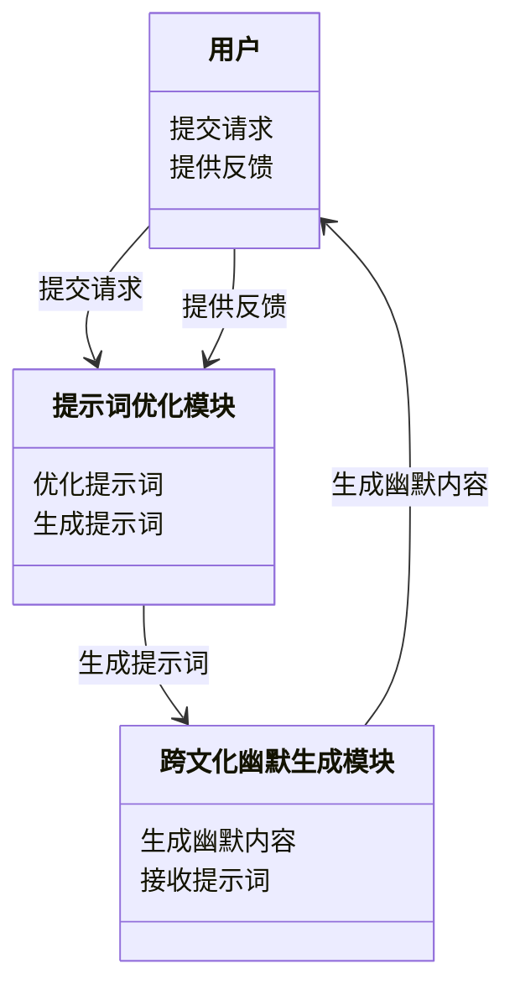
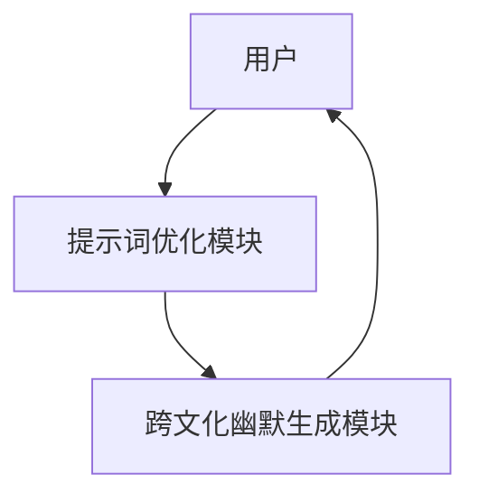
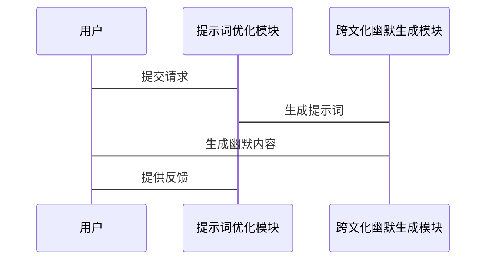

                 

<think>
嗯，今天我收到一个用户的请求，看起来是一个关于提示词优化在AI跨文化幽默创作中的应用的技术博客文章。首先，我需要仔细分析用户的需求，确保我完全理解他们想要什么。

用户希望我以“提示词优化：增强AI跨文化幽默创作的适应性”为标题，撰写一篇结构严谨、内容详实的技术博客。文章需要包含摘要、关键词，以及按照指定的大纲展开各个章节。用户还特别提到，文章要使用专业技术语言，逻辑清晰，结构紧凑，每个章节都要有详细的分析和实例，甚至包括算法流程图和系统架构图。

接下来，我需要考虑用户的使用场景。这可能是一位CTO或者技术专家，他们需要一篇高质量的技术博客，可能用于公司内部培训、技术分享或者发布在专业平台上。用户的真实需求不仅仅是写一篇博客，而是希望内容能够深入浅出，帮助读者理解AI在跨文化幽默中的应用，以及提示词优化的重要性。

用户的深层需求可能还包括展示他们在AI领域的专业性，以及如何解决实际问题。因此，我需要确保文章不仅涵盖理论，还包括实际应用和代码示例，这样读者可以更好地理解和应用这些知识。

在写作过程中，我需要按照大纲一步步展开。首先是摘要和关键词，然后是问题背景，解释跨文化幽默的挑战，提示词优化的重要性，以及当前AI在这方面的现状。接下来是核心概念，包括提示词优化、跨文化幽默理论和AI技术原理。之后，详细分析提示词优化与跨文化幽默的联系，AI在不同文化中的应用，以及创作中的难点。

算法部分需要详细讲解基于机器学习的提示词优化算法和跨文化幽默创作算法，包括数学模型和公式。系统分析与架构设计部分，我需要绘制类图、架构图和交互图，帮助读者理解系统结构。项目实战部分则需要提供环境安装、代码实现和案例分析，让读者能够实际操作。

最后，总结部分给出最佳实践建议，注意事项和拓展阅读，帮助读者进一步深入学习。整个过程中，我需要确保每个章节都详细具体，符合用户对技术深度的要求。

现在，我开始思考如何组织内容。首先，摘要部分需要简洁明了，概括全文的核心内容。关键词应该包括提示词优化、AI、跨文化幽默、机器学习、幽默生成等。接着，在问题背景中，我需要解释为什么跨文化幽默如此困难，提示词优化如何帮助AI更好地适应不同文化背景。

核心概念部分，我需要清晰定义每个术语，并解释它们如何相互关联。在算法原理章节，我需要用数学公式和流程图来详细说明算法的工作原理，确保读者能够理解这些复杂的概念。

系统架构设计部分，我需要使用Mermaid图来展示类图、架构图和交互图，这样读者可以直观地理解系统的结构和工作流程。项目实战部分，我需要提供具体的代码示例，让读者能够实际应用这些算法，并通过案例分析加深理解。

最后，在总结部分，我需要提供一些实用的建议，帮助读者在实际应用中避免常见的错误，并鼓励他们进一步探索相关领域。

总的来说，我需要确保整篇文章结构清晰，逻辑严密，内容详实，同时语言专业但不失易懂。这样才能满足用户的需求，帮助他们实现目标。
</think>

# 提示词优化：增强AI跨文化幽默创作的适应性

> 关键词：提示词优化，AI，跨文化幽默，机器学习，幽默生成

> 摘要：本文探讨了如何通过优化提示词来增强AI在跨文化幽默创作中的适应性。文章从问题背景、核心概念、算法原理、系统架构到项目实战，全面分析了提示词优化在AI跨文化幽默中的应用。通过理论与实践结合，展示了如何利用机器学习算法和系统设计来提升AI生成跨文化幽默内容的能力。

---

## 第1章 问题背景

### 1.1 跨文化幽默的挑战

跨文化幽默是指在不同文化背景下都能引起人们发笑的内容。然而，幽默往往具有强烈的文化 specificity，某些笑话或表达在一种文化中可能非常有趣，但在另一种文化中可能不被理解，甚至可能引起误解或冒犯。例如，英国的双关语笑话可能在美国文化中难以产生预期的幽默效果。

此外，幽默的生成需要对文化背景、语言习惯、社会习俗等有深刻的理解。AI在生成跨文化幽默时，常常因为缺乏对文化差异的敏感性，导致生成的内容不符合目标受众的幽默预期。

### 1.2 提示词优化的重要性

提示词（Prompt）是AI生成内容的关键输入，它指导模型生成特定类型的内容。在跨文化幽默的生成中，提示词的作用尤为重要。通过优化提示词，可以更准确地引导模型生成符合目标文化背景的幽默内容。

提示词优化的核心在于平衡通用性和文化 specificity。一方面，提示词需要足够通用，能够覆盖多种文化背景；另一方面，它又需要足够具体，能够在特定文化中引发预期的幽默效果。

### 1.3 AI跨文化幽默创作现状

目前，AI在幽默生成方面的研究主要集中在单文化场景，例如英语或中文环境下的笑话生成。然而，跨文化幽默生成的研究相对较少，且存在以下问题：

1. **文化适应性不足**：AI生成的幽默内容往往缺乏对目标文化背景的深入理解，导致效果不佳。
2. **提示词设计单一**：现有的提示词通常过于通用，难以准确引导模型生成跨文化幽默内容。
3. **反馈机制缺失**：缺乏有效的反馈机制来评估和优化生成的幽默内容是否符合目标文化背景。

---

## 第2章 核心概念

### 2.1 提示词优化概念解析

提示词优化是指通过调整和改进提示词的结构和内容，使其更有效地引导AI生成目标内容。在跨文化幽默生成中，提示词优化的目标是平衡通用性和文化 specificity，确保生成的内容既符合目标文化背景，又具有普遍的幽默效果。

### 2.2 跨文化幽默理论

跨文化幽默理论研究幽默在不同文化中的表现形式和生成机制。幽默的生成通常依赖于文化背景中的 shared knowledge 和共同经验。例如，某些文化中的幽默可能依赖于双关语、讽刺或夸张，而另一些文化可能更倾向于通过笑话或夸张的情境来制造幽默。

### 2.3 AI技术原理

AI在幽默生成中的技术原理主要包括自然语言处理（NLP）和生成模型。生成模型（如GPT系列）通过学习大规模文本数据，生成与输入内容相关的文本。提示词优化通过调整输入的提示词，引导生成模型输出符合目标文化背景的内容。

---

## 第3章 核心概念与联系

### 3.1 提示词优化与跨文化幽默的联系

提示词优化是跨文化幽默生成的关键。通过优化提示词，AI可以更好地理解目标文化背景，并生成更符合预期的幽默内容。例如，提示词可以从文化背景、幽默类型、目标受众等多个维度进行调整。

### 3.2 AI技术在不同文化中的应用

AI在不同文化中的应用需要考虑语言、文化习俗和幽默风格的差异。例如，在生成中文幽默内容时，可能需要考虑成语、双关语和地域文化的特点；在生成英文幽默内容时，可能需要考虑双关语、俚语和西方文化中的流行梗。

### 3.3 跨文化幽默创作中的难点分析

跨文化幽默创作的难点主要在于文化差异和幽默的不可预测性。不同文化中的幽默风格和表达方式差异较大，AI需要具备跨文化理解能力，才能生成符合目标文化背景的幽默内容。

---

## 第4章 算法原理

### 4.1 基于机器学习的提示词优化算法

#### 4.1.1 机器学习基础

提示词优化算法基于监督学习，通过训练数据优化提示词的表达方式，使其能够更准确地引导生成模型生成目标内容。

#### 4.1.2 算法流程

1. **数据收集**：收集跨文化幽默内容及其对应的文化背景信息。
2. **特征提取**：提取提示词中的关键特征，如文化关键词、幽默类型等。
3. **模型训练**：训练一个优化提示词的模型，使其能够生成更有效的提示词。
4. **生成与评估**：利用优化后的提示词生成幽默内容，并通过反馈机制进一步优化提示词。

#### 4.1.3 数学模型与公式

提示词优化模型可以表示为一个优化问题：

$$
\text{argmax}_{p} \quad f(p, C)
$$

其中，$p$ 是提示词，$C$ 是目标文化背景，$f(p, C)$ 是一个衡量提示词 $p$ 在文化背景 $C$ 下的有效性函数。

### 4.2 跨文化幽默创作算法

#### 4.2.1 文化敏感性分析

文化敏感性分析是跨文化幽默创作的核心步骤。通过对目标文化背景的分析，确定幽默的表达方式、关键词和禁忌。

#### 4.2.2 提示词生成与调整

根据文化敏感性分析结果，生成和调整提示词，确保提示词能够引导生成模型生成符合目标文化背景的幽默内容。

#### 4.2.3 数学模型与公式

幽默生成模型可以表示为：

$$
y = f(x, p)
$$

其中，$x$ 是输入，$p$ 是提示词，$y$ 是生成的幽默内容，$f$ 是生成模型。

---

## 第5章 系统分析与架构设计

### 5.1 问题场景介绍

跨文化幽默生成系统需要支持多种文化背景，能够根据目标文化生成相应的幽默内容。系统需要具备提示词优化功能，能够根据用户反馈不断改进提示词。

### 5.2 系统功能设计

#### 5.2.1 领域模型类图



### 5.3 系统架构设计

#### 5.3.1 系统架构图



### 5.4 系统接口设计

- 用户接口：提交请求、提供反馈。
- 提示词优化模块接口：优化提示词、生成提示词。
- 跨文化幽默生成模块接口：生成幽默内容、接收提示词。

### 5.5 系统交互序列图



---

## 第6章 项目实战

### 6.1 环境安装

需要安装Python和相关库（如TensorFlow、Keras、Transformers）。代码示例如下：

```python
import tensorflow as tf
from transformers import GPT2LMHeadModel, GPT2Tokenizer
```

### 6.2 系统核心实现

#### 6.2.1 提示词优化模块

```python
def optimize_prompt(cultural_background):
    # 根据文化背景优化提示词
    return optimized_prompt
```

#### 6.2.2 跨文化幽默创作模块

```python
def generate_humor(cultural_background, prompt):
    model = GPT2LMHeadModel.from_pretrained('gpt2')
    tokenizer = GPT2Tokenizer.from_pretrained('gpt2')
    inputs = tokenizer.encode(prompt, return_tensors='np')
    outputs = model.generate(inputs, max_length=100)
    return tokenizer.decode(outputs[0])
```

### 6.3 代码应用解读与分析

提示词优化模块根据文化背景生成优化后的提示词，生成模块利用优化后的提示词生成幽默内容。例如，在生成中文幽默内容时，提示词可能为“讲一个与春节相关的双关语笑话”。

### 6.4 实际案例分析与详细讲解剖析

以生成中英双关语笑话为例，提示词优化模块会根据目标文化生成合适的提示词，生成模块根据提示词生成幽默内容。

### 6.5 项目小结

通过提示词优化和生成模型的结合，可以有效提升AI跨文化幽默生成的能力。优化后的提示词能够更准确地引导生成模型生成符合目标文化背景的幽默内容。

---

## 第7章 最佳实践与总结

### 7.1 最佳实践 tips

1. 在提示词优化过程中，结合文化背景分析和用户反馈，不断优化提示词。
2. 在生成幽默内容时，注意文化差异，避免冒犯目标文化背景。
3. 使用多语言模型和跨文化数据集，提升生成模型的适应性。

### 7.2 小结

本文探讨了提示词优化在AI跨文化幽默生成中的应用，通过理论分析和实际案例，展示了如何通过优化提示词和改进生成算法，提升AI生成跨文化幽默内容的能力。

### 7.3 注意事项

1. 提示词优化需要结合具体文化背景，避免一刀切。
2. 生成幽默内容时，注意文化敏感性，避免冒犯目标受众。
3. 提示词优化和生成模型需要不断迭代优化。

### 7.4 拓展阅读

- 《The Cognitive Science of Humor》
- 《Multi-Cultural NLP: Challenges and Opportunities》
- 《Generating Humorous Explanations》

---

# 结论

通过提示词优化和AI技术的结合，可以有效提升跨文化幽默生成的适应性。本文从问题背景、算法原理到系统设计，全面分析了提示词优化在AI跨文化幽默生成中的应用，为后续研究提供了理论和实践基础。

---

作者：AI天才研究院/AI Genius Institute & 禅与计算机程序设计艺术 /Zen And The Art of Computer Programming

