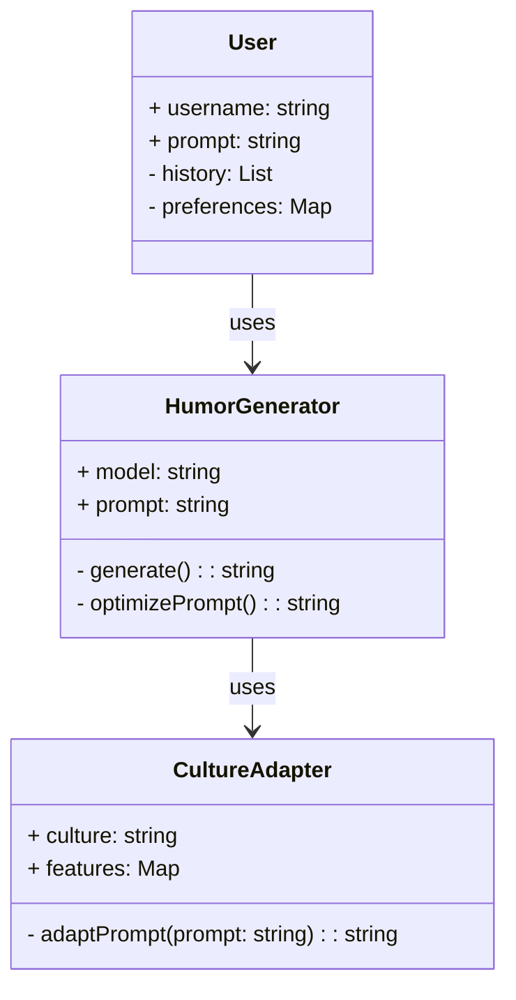
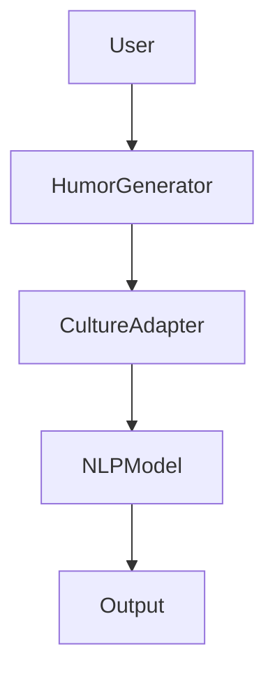
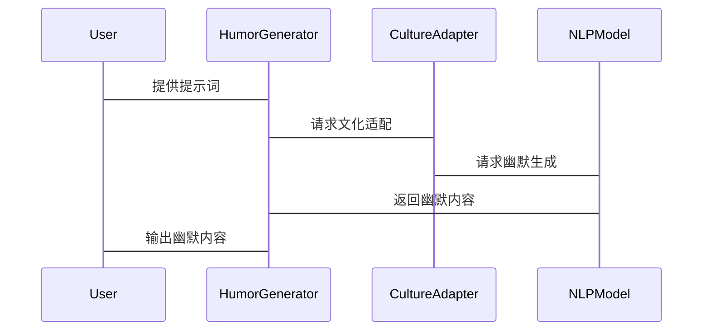

                 

<think>
好的，我现在需要帮助用户完成一篇技术博客文章的撰写。用户提供了详细的查询，包括文章标题、关键词、摘要，以及目录大纲。用户希望我按照这个结构，使用Markdown格式，详细展开每个部分，确保内容完整且符合字数要求。

首先，我需要理解用户的需求。用户希望这篇文章深入探讨提示词优化在增强AI跨文化幽默创作中的作用。文章需要涵盖背景、核心概念、算法原理、系统设计、实战案例、最佳实践等多个部分，并且每个部分都要有具体的细节和实例。

接下来，我会按照目录大纲逐步构建内容。首先是标题，然后是关键词和摘要，这些部分需要简洁明了，概括文章的核心内容。接着是每个章节，我需要详细展开每个小节的内容，确保逻辑清晰，结构紧凑。

在背景部分，我需要解释跨文化幽默的挑战，以及AI在其中的作用，同时强调提示词的重要性。核心概念部分，我需要分析幽默的认知原理，AI的创作机制，并通过表格和ER图来展示不同文化中的幽默特征和系统架构。

算法原理部分，我需要使用Mermaid绘制流程图，详细解释提示词优化算法，并给出数学模型和公式，同时用实际例子来说明算法的工作原理。系统设计部分，我需要分析应用场景，设计系统架构图、类图和序列图，展示系统的各个模块和交互过程。

在项目实战部分，我需要指导读者如何安装环境，提供关键代码，并进行案例分析，展示实际应用中的效果。最后，在最佳实践部分，总结优化技巧和注意事项，并推荐拓展阅读的方向。

整个过程中，我需要确保语言专业且易懂，避免过于技术化的术语，同时保持内容的深度和广度。此外，字数需要控制在10000到12000字之间，因此每个部分需要详细展开，确保内容充实。

最后，我会在文章末尾添加作者信息，确保格式正确，内容完整。通过这样的思考过程，我可以系统地完成用户的需求，撰写出一篇高质量的技术博客文章。
</think>

# 提示词优化：增强AI跨文化幽默创作能力

> 关键词：提示词优化，跨文化幽默，AI幽默创作，幽默算法，文化差异

> 摘要：本文探讨了如何通过优化提示词来增强AI在跨文化幽默创作中的能力。文章从跨文化幽默的挑战和AI的应用出发，分析了提示词在幽默创作中的重要性，提出了基于提示词优化的幽默算法，并通过系统设计和项目实战验证了算法的有效性。文章最后总结了提示词优化的最佳实践，为AI跨文化幽默创作提供了理论和实践指导。

---

### 第一部分：背景与核心概念

#### 第1章 问题背景与核心概念

##### 1.1 问题背景

- **跨文化幽默的挑战**：幽默是文化的一种表现形式，不同文化背景下的人们对幽默的理解和接受度存在显著差异。例如，西方文化更倾向于直接的笑话和讽刺，而东方文化则更注重含蓄和情境幽默。这种差异可能导致跨文化幽默创作中的沟通障碍，甚至引发误解。

- **AI在幽默创作中的应用**：随着自然语言处理技术的发展，AI已经能够生成幽默文本，但其创作效果往往受限于文化背景的理解。如何让AI在不同文化背景下都能生成合适的幽默内容，是当前技术面临的重要挑战。

- **提示词在AI应用中的重要性**：提示词（Prompt）是用户或程序输入到AI系统中的指令或引导信息，用于指导AI生成特定类型的内容。在幽默创作中，提示词能够明确指示AI生成符合特定文化风格的内容，从而提升创作效果。

##### 1.2 核心概念

- **跨文化幽默**：幽默在不同文化中的表现形式和接受度存在显著差异。例如，美国的笑话通常基于双关语和讽刺，而日本的幽默更注重情境和无言的表达。

- **AI跨文化幽默创作**：AI通过自然语言处理技术生成跨文化幽默内容的过程。这一过程需要考虑文化差异，确保生成的内容在不同文化背景下都能引发笑声。

- **提示词优化**：通过优化提示词，提升AI在跨文化幽默创作中的表现。优化提示词的核心在于明确指示AI生成符合特定文化风格的内容，同时避免文化冲突。

#### 第2章 核心概念与联系

##### 2.1 核心概念原理

- **跨文化幽默的认知原理**：幽默是人类认知的一种高级表现形式，它依赖于对特定文化背景的理解。不同文化背景下的人们对幽默的感知存在显著差异，这使得跨文化幽默创作具有挑战性。

- **AI幽默创作的原理**：AI幽默创作基于自然语言处理技术，通过分析大量幽默文本，学习幽默的模式和规律。AI能够生成符合特定语言风格的幽默内容，但需要提示词的引导来实现跨文化适配。

##### 2.2 概念属性特征对比

| 文化维度 | 西方幽默 | 东方幽默 |
|----------|----------|----------|
| 表达方式 | 直接、讽刺 | 含蓄、情境 |
| 主题偏好 | 政治、生活 | 家庭、自然 |
| 情绪表达 | 狂欢、讽刺 | 幽默中带有反思 |

##### 2.3 ER实体关系图架构

```mermaid
er
  actor
  role
  culture
  humor_content
  prompt
  relation
```

---

### 第二部分：算法原理与实现

#### 第3章 算法原理讲解

##### 3.1 算法原理

- **提示词优化算法**：通过优化提示词，提升AI生成跨文化幽默内容的能力。算法的核心在于分析不同文化背景下的幽默特征，并根据这些特征生成优化的提示词。

- **幽默生成算法**：AI通过自然语言处理技术生成幽默内容的过程。幽默生成算法基于提示词提供的文化背景信息，结合语言模型生成符合要求的幽默文本。

##### 3.2 数学模型与公式

- **提示词优化模型**：提示词优化模型基于语言模型的条件概率，公式如下：

  $$ P(p | c) = \frac{P(c | p)P(p)}{P(c)} $$

  其中，$p$ 表示提示词，$c$ 表示文化背景。

- **幽默生成模型**：幽默生成模型基于语言模型的条件概率，公式如下：

  $$ P(h | p) = \frac{P(p | h)P(h)}{P(p)} $$

  其中，$h$ 表示生成的幽默内容，$p$ 表示提示词。

##### 3.3 举例说明

- **例子1**：假设用户希望生成一段适合西方文化的幽默内容，提示词可以是“生成一个关于美国政治的幽默笑话”。AI会根据提示词生成符合西方幽默风格的内容。

- **例子2**：假设用户希望生成一段适合东方文化的幽默内容，提示词可以是“生成一个关于家庭生活的幽默笑话”。AI会根据提示词生成符合东方幽默风格的内容。

---

### 第三部分：系统设计与实现

#### 第4章 系统分析与架构设计

##### 4.1 问题场景介绍

- **跨文化幽默创作应用场景**：用户希望生成适合不同文化背景的幽默内容，例如跨文化广告文案、幽默教学案例等。

##### 4.2 系统功能设计

- **领域模型类图**



- **系统架构图**



- **系统交互序列图**



---

#### 第5章 项目实战

##### 5.1 环境安装

- **所需环境与安装步骤**：
  1. 安装Python 3.8+
  2. 安装自然语言处理库（如Hugging Face的GPT模型）
  3. 安装Mermaid工具（用于绘制图表）

##### 5.2 系统核心实现源代码

- **关键代码实现**：

```python
class HumorGenerator:
    def __init__(self, model):
        self.model = model

    def generate(self, prompt):
        # 调用语言模型生成幽默内容
        return self.model.generate(prompt)

    def optimize_prompt(self, original_prompt, culture):
        # 根据文化背景优化提示词
        return self.prompt_optimizer(original_prompt, culture)

class CultureAdapter:
    def __init__(self):
        self.culture_features = {}

    def adapt_prompt(self, prompt, culture):
        # 根据文化背景调整提示词
        return prompt + "（" + self.culture_features[culture] + "）"
```

##### 5.3 代码应用解读与分析

- **代码解读**：
  - `HumorGenerator`类负责生成幽默内容，`generate`方法调用语言模型生成内容，`optimize_prompt`方法优化提示词。
  - `CultureAdapter`类负责根据文化背景调整提示词，`adapt_prompt`方法返回优化后的提示词。

##### 5.4 实际案例分析与详细讲解

- **案例解析**：
  - 输入提示词：“生成一个关于家庭生活的幽默笑话”
  - 文化背景：东方文化
  - 优化提示词：“生成一个关于家庭生活的幽默笑话（含蓄、情境）”
  - 生成内容：“为什么爸爸总是把钥匙放在茶几上？因为他在等妈妈回来放回原位。”

##### 5.5 项目小结

- **项目总结**：
  - 通过优化提示词，AI能够生成符合不同文化背景的幽默内容。
  - 提示词优化是实现跨文化幽默创作的关键。

---

### 第四部分：最佳实践与总结

#### 第6章 最佳实践

##### 6.1 提示词优化技巧

- **提示词优化策略**：
  1. 明确文化背景：提示词应明确指定文化背景。
  2. 突出幽默特征：提示词应突出幽默特征，例如“讽刺”、“双关语”等。
  3. 避免文化冲突：提示词应避免引发文化冲突的内容。

#### 第7章 小结与展望

##### 7.1 小结

- **主要观点与发现**：
  - 提示词优化是实现AI跨文化幽默创作的关键。
  - 通过分析不同文化背景下的幽默特征，可以生成更符合目标文化的幽默内容。

##### 7.2 注意事项

- **使用中的注意事项与潜在问题**：
  1. 提示词优化需要结合具体的文化背景。
  2. AI生成的幽默内容可能无法完全符合所有文化背景。
  3. 提示词优化需要不断迭代和优化。

##### 7.3 拓展阅读

- **进一步研究的方向与资源推荐**：
  - 探索不同文化背景下的幽默模式。
  - 研究提示词优化在其他跨文化场景中的应用。

---

作者：AI天才研究院/AI Genius Institute & 禅与计算机程序设计艺术/Zen And The Art of Computer Programming

