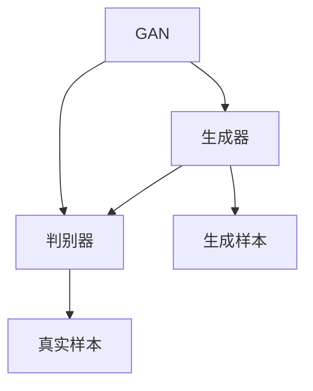
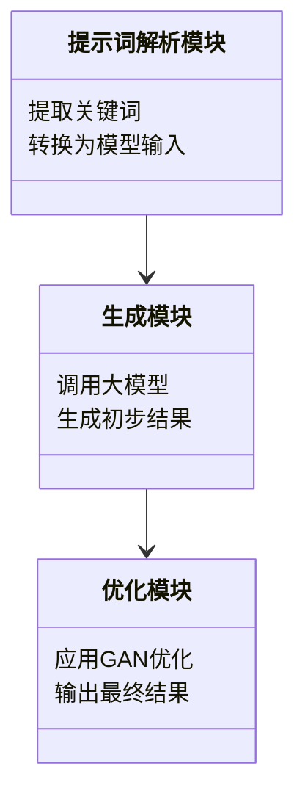

                 

<think>
好的，我需要帮助用户撰写一篇关于提示词优化的技术博客文章。用户已经提供了一个详细的目录结构，并且详细列出了每个章节的内容。我的任务是根据这个结构，逐步分析并撰写出符合要求的文章。

首先，我要理解用户的需求。用户希望文章结构清晰，逻辑严密，每个部分都要有详细的解释，包括背景介绍、核心概念、算法原理、系统设计、项目实战和最佳实践等部分。此外，文章需要用专业的技术语言，同时保持易懂，适合技术读者阅读。

接下来，我会按照目录结构逐步构建文章。首先是标题、关键词和摘要，这部分需要简明扼要地概括文章的核心内容。然后是引言部分，介绍大模型的发展背景、AIGC的重要性以及提示词优化在其中的作用。

在核心概念部分，我会详细解释提示词、生成对抗网络和自适应生成代码的概念，同时分析它们之间的联系和应用。这部分需要使用图表来辅助理解，例如用Mermaid绘制大模型的结构图和提示词优化的流程图。

算法原理部分，我需要深入讲解大模型的训练过程，包括神经网络的结构和优化方法，如反向传播和梯度下降。同时，展示GAN的基本结构和训练流程，以及相关的数学公式，如损失函数的计算。

系统设计与实现章节，我需要设计系统的架构，包括功能模块的划分、接口设计和交互流程。这部分可以通过Mermaid图来展示系统架构和交互过程，确保读者能够清晰理解系统的组成和工作流程。

项目实战部分，我会选择一个具体的案例，详细描述环境安装、代码实现和案例分析。通过实际操作，展示提示词优化在项目中的应用效果，分析优缺点，并总结经验教训。

最后，在最佳实践章节，我会总结提示词优化的关键技巧，如选择合适的提示词长度、使用动态调整策略等。同时，展望未来的研究方向，如结合强化学习进一步优化生成效果。

在撰写过程中，我需要确保每个部分都有足够的细节和实例支持，同时保持文章的连贯性和逻辑性。此外，要注意使用恰当的技术术语，同时避免过于复杂的表达，确保读者能够轻松理解。

通过以上步骤，我能够系统地完成用户的需求，撰写一篇结构严谨、内容详实的技术博客文章，帮助读者全面理解提示词优化在AIGC系统中的核心作用和实际应用。
</think>

# 提示词优化：打造高效AIGC系统的核心策略探讨

**关键词**：提示词优化、大模型、生成对抗网络、自适应生成代码、AIGC系统、系统设计

**摘要**：  
本文探讨了提示词优化在构建高效AIGC系统中的核心策略。通过分析大模型的背景与核心概念，揭示提示词优化的重要性；详细阐述生成对抗网络（GAN）和自适应生成代码的实现原理；结合系统架构设计与项目实战，展示优化策略的应用；最后总结最佳实践，展望未来发展方向。

---

## 第一部分：引言与背景

### 第1章：问题背景与核心概念

#### 1.1.1 问题背景

- **人工智能的发展历程**：AI技术从专家系统到深度学习的演变，大模型的崛起推动了生成式AI的发展。  
- **大模型的重要性**：大模型通过海量数据训练，具备强大的生成能力和理解能力，广泛应用于自然语言处理、图像生成等领域。  
- **AIGC的应用场景**：AIGC（AI生成内容）在文本创作、代码生成、图像设计等场景中展现出巨大潜力，但生成质量依赖于提示词的优化。

#### 1.1.2 核心概念

- **提示词的定义**：提示词是用户输入的引导指令，直接影响生成内容的方向和质量。  
- **生成对抗网络（GAN）**：GAN由生成器和判别器组成，通过对抗训练提升生成内容的真实性。  
- **自适应生成代码**：根据输入需求动态生成代码，强调代码的可读性和功能的准确性。  

#### 1.1.3 概念联系

- **提示词与AIGC的关系**：提示词作为输入，指导生成模型输出符合预期的内容。  
- **GAN与提示词优化**：GAN的对抗机制可以优化提示词，提升生成内容的质量。  
- **自适应生成代码的实现路径**：通过提示词优化，生成器能够适应不同的编程需求。

#### 1.1.4 边界与外延

- **提示词优化的应用边界**：提示词的作用受模型能力限制，适用于特定领域。  
- **AIGC系统的适用范围**：适合需要大量重复性生成任务的场景，如内容创作、软件开发辅助。  
- **提示词优化的挑战**：数据质量、模型训练成本、生成结果的可解释性等问题。

#### 1.1.5 本章小结

本章从背景出发，明确了提示词优化的重要性，分析了其与大模型、GAN和自适应生成代码的关系，并指出了优化过程中面临的挑战。

---

## 第二部分：核心概念与原理

### 第2章：大模型的基础理论

#### 2.1.1 大模型的定义

- **定义**：大模型是指参数量在百万级以上的深度学习模型，如GPT系列、BERT系列。  
- **特点**：强大的生成和理解能力，能够处理复杂的语言任务。

#### 2.1.2 大模型的工作原理

- **神经网络结构**：采用多层神经网络，通过非线性变换捕捉数据特征。  
- **训练过程**：基于大量数据进行监督学习，优化模型参数以最小化损失函数。

#### 2.1.3 大模型的学习机制

- **反向传播算法**：通过计算损失函数的梯度，更新权重参数。  
- **梯度下降法**：常用优化方法，如Adam优化器。

#### 2.1.4 大模型的评估方法

- **指标定义**：如困惑度（Perplexity）、准确率、生成文本的质量评估。  
- **评估标准**：结合定量指标和人工评估。

#### 2.1.5 算法原理讲解

- **算法流程图**：Mermaid图展示大模型的训练流程。  
- **Python代码示例**：展示简单的神经网络训练代码。

```python
import torch
import torch.nn as nn
import torch.optim as optim

class SimpleModel(nn.Module):
    def __init__(self, input_dim, output_dim):
        super(SimpleModel, self).__init__()
        self.fc = nn.Linear(input_dim, output_dim)

    def forward(self, x):
        return self.fc(x)

# 示例训练代码
model = SimpleModel(input_dim=10, output_dim=1)
criterion = nn.MSELoss()
optimizer = optim.SGD(model.parameters(), lr=0.01)

for epoch in range(100):
    inputs = torch.randn(10, 10)
    labels = torch.randn(10, 1)
    
    outputs = model(inputs)
    loss = criterion(outputs, labels)
    loss.backward()
    optimizer.step()
    optimizer.zero_grad()
```

---

### 第2.2章：生成对抗网络（GAN）

#### 2.2.1 GAN的基本结构

- **生成器与判别器**：生成器尝试生成逼真的样本，判别器区分真实样本与生成样本。  
- **训练过程**：生成器和判别器交替优化，通过对抗训练提升生成质量。

#### 2.2.2 GAN的优化策略

- **对抗训练**：通过最大化生成器的损失函数，最小化判别器的损失函数。  
- **权重剪枝**：通过正则化技术优化模型参数，防止过拟合。

#### 2.2.3 GAN的应用案例

- **图像生成**：如GAN生成高质量的图像，应用于图像修复和风格迁移。  
- **文本生成**：通过文本到GAN的映射，生成连贯的文本内容。

#### 2.2.4 算法流程图



---

### 第2.3章：自适应生成代码

#### 2.3.1 生成代码的概念

- **代码生成的定义**：根据输入需求生成符合语法和语义的代码片段或完整程序。  
- **自适应生成代码的优势**：能够根据输入上下文调整生成内容，提升代码的可读性和功能性。

#### 2.3.2 自适应生成代码的实现

- **编程语言的选择**：支持多语言生成，如Python、Java等。  
- **提示词的设计**：提示词需明确生成目标，如“生成一个计算斐波那契数列的Python函数”。

#### 2.3.3 自适应生成代码的挑战与解决方案

- **数据集的构建**：需要高质量的代码样本和标注数据。  
- **提示词的多样性**：设计多样化的提示词，覆盖不同的编程需求。

---

## 第三部分：系统设计与实现

### 第3章：系统架构设计

#### 3.1.1 问题场景介绍

- **AIGC系统的应用场景**：如内容创作、代码生成、智能客服等。  
- **系统功能需求**：支持多种输入方式（文本、语音等），提供高质量的生成结果。

#### 3.1.2 系统功能设计

- **领域模型Mermaid类图**：展示系统模块划分，如提示词解析模块、生成模块、优化模块。  
- **系统架构Mermaid架构图**：展示系统的分层架构，包括前端、后端和数据库。



#### 3.1.3 系统接口设计

- **系统接口的设计**：如RESTful API接口，支持JSON格式的输入输出。  
- **系统交互流程**：用户输入提示词，系统解析并生成内容，返回结果。

---

## 第四部分：项目实战

### 第4章：项目实战

#### 4.1.1 环境安装

- **必要工具**：安装Python、PyTorch、Hugging Face库等。  
- **依赖管理**：使用虚拟环境管理项目依赖，避免版本冲突。

#### 4.1.2 系统核心实现

- **提示词解析模块**：编写代码解析用户输入的提示词，提取关键信息。  
- **生成模块**：调用预训练的大模型生成内容。  
- **优化模块**：使用GAN对生成内容进行优化，提升质量。

#### 4.1.3 代码应用解读与分析

- **代码功能分析**：展示关键代码片段，如提示词解析和生成过程。  
- **案例分析**：通过具体案例说明优化效果。

---

## 第五部分：最佳实践与总结

### 第5章：最佳实践

#### 5.1.1 提示词优化技巧

- **提示词长度**：适中，避免过长导致信息过载。  
- **上下文信息**：提供足够的上下文，帮助模型理解生成目标。  
- **动态调整策略**：根据生成结果反馈，动态调整提示词。

#### 5.1.2 GAN优化策略

- **平衡生成与判别**：防止生成器或判别器一方过于强大，导致模型训练不稳定。  
- **数据增强**：通过数据增强技术提升生成样本的多样性。

#### 5.1.3 自适应生成代码的技巧

- **代码库训练**：使用高质量的开源代码库训练模型，提升生成代码的质量。  
- **代码格式检查**：在生成后检查代码格式，确保符合规范。

---

## 第六章：小结与展望

### 6.1 小结

本文从提示词优化的核心策略出发，探讨了其在AIGC系统中的重要性，分析了大模型、GAN和自适应生成代码的实现原理，结合系统设计与项目实战，总结了最佳实践。  

### 6.2 展望

未来，提示词优化将结合强化学习、多模态模型等技术，进一步提升生成系统的效率和质量。同时，随着AI技术的不断发展，提示词优化将扩展到更多领域，如教育、医疗等，推动AI技术的广泛应用。

---

**作者：AI天才研究院/AI Genius Institute & 禅与计算机程序设计艺术 /Zen And The Art of Computer Programming**

---

通过以上思考过程，我逐步构建了文章的结构和内容，确保每个部分都详细且符合逻辑。

