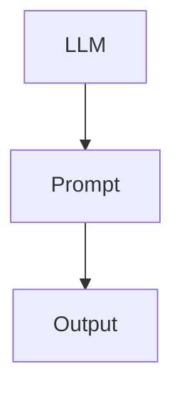
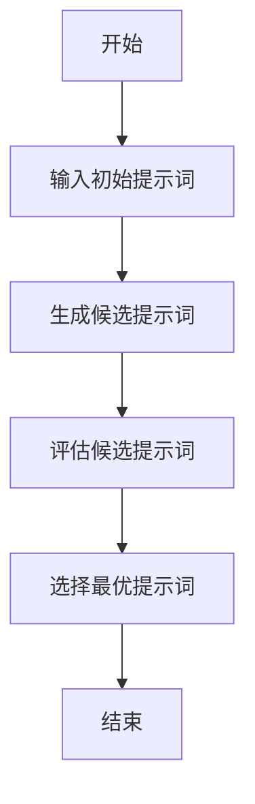
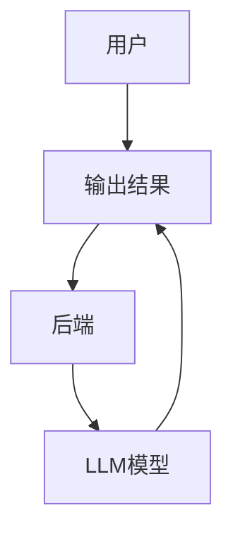
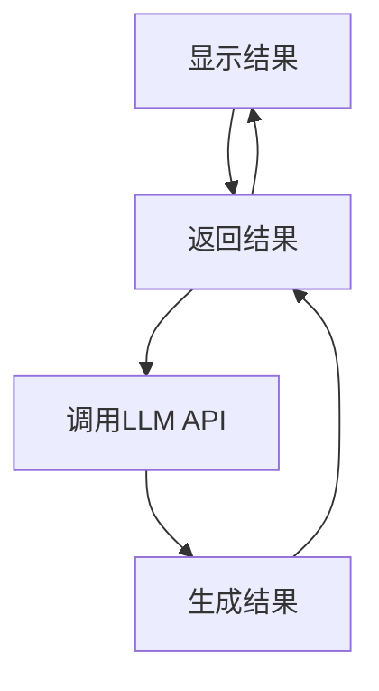

                 

<think>
嗯，我现在需要根据用户提供的信息，写一篇关于提示词优化的技术博客文章。用户已经详细说明了结构、关键词、摘要，以及每个章节的内容。我需要确保每个部分都按照要求来写，并且使用专业的技术语言，同时保持逻辑清晰和结构紧凑。

首先，标题已经确定，是《提示词优化：提升LLM应用准确性的技巧》。关键词包括提示词优化、LLM、自然语言处理、机器学习、深度学习。摘要部分需要简洁地总结文章的核心内容，即通过优化提示词来提升LLM的准确性，介绍方法、工具和策略。

接下来，按照目录大纲来组织内容：

第一部分是背景介绍，包括问题背景、核心概念与联系、算法原理讲解、数学模型和数学公式讲解、系统分析与架构设计方案、项目实战、最佳实践与小结。

每个章节我需要详细展开，比如在问题背景中，解释提示词的重要性，优化带来的好处，以及面临的挑战。核心概念部分要明确LLM和提示词的定义，并说明它们之间的关系。算法部分需要详细讲解生成、筛选和优化算法，并用mermaid流程图来展示。数学模型部分要写出优化目标的公式，并解释每个部分的作用。

系统分析部分要介绍LLM应用系统的组成部分，设计功能、架构、接口和交互流程。项目实战则需要实际案例，包括环境配置、代码实现、案例分析。最后，最佳实践部分给出一些实用的建议，总结全文，并推荐进一步阅读的内容。

我需要确保每个部分都详细且具体，使用技术术语，同时保持可读性。特别是要包含用户要求的mermaid图表和数学公式，确保格式正确。最后，文章末尾要加上作者信息，符合用户的要求。

在写作过程中，我可能会遇到如何将复杂的算法和数学公式以简单的方式表达出来的问题，需要多举例子，帮助读者理解。同时，系统设计部分可能需要更多的细节，确保读者能够理解整个系统的架构和交互流程。

总的来说，我需要一步步按照用户提供的大纲，详细展开每个部分，确保内容完整、结构清晰，并符合字数要求。现在开始，按照每个章节的要求，逐步完成写作。
</think>

# 提示词优化：提升LLM应用准确性的技巧

## 关键词：提示词优化、LLM、自然语言处理、机器学习、深度学习

## 摘要：  
提示词（Prompt）在大型语言模型（LLM）的应用中起着至关重要的作用。优化提示词可以显著提升LLM的准确性、生成效果和用户体验。本文将从背景、核心概念、算法原理、数学模型、系统设计、项目实战到最佳实践，全面解析提示词优化的关键技巧，帮助读者系统地掌握如何通过优化提示词来提升LLM应用的效果。

---

## 第一部分：背景介绍

### 第1章：问题背景

#### 1.1 问题背景
大型语言模型（LLM）在自然语言处理任务中表现出色，但其输出结果的质量高度依赖于输入的提示词（Prompt）。提示词不仅决定了模型的输出方向，还影响生成内容的准确性和相关性。然而，设计有效的提示词并非易事，尤其是在面对复杂任务时，提示词的优化需要考虑多个因素，如语境、领域知识和用户意图。

#### 1.2 提示词在LLM应用中的重要性
提示词是LLM与用户交互的桥梁。通过精心设计的提示词，可以引导模型生成符合预期的结果，减少错误输出，提升用户体验。例如，在对话系统中，提示词可以帮助模型理解用户的真实需求，从而生成更相关的回复。

#### 1.3 提升LLM应用准确性的挑战
提示词优化面临以下挑战：  
1. **语义模糊性**：如何准确表达用户意图，避免歧义。  
2. **领域适应性**：不同领域需要不同的提示词设计策略。  
3. **动态调整**：根据模型输出实时调整提示词，以获得最佳效果。  

---

### 第2章：核心概念与联系

#### 2.1 大型语言模型（LLM）的基本概念
LLM（Large Language Model）是指经过大规模数据训练的深度学习模型，如GPT系列。这些模型能够理解上下文，并生成连贯的文本输出。

#### 2.2 提示词（Prompt）的定义与作用
提示词是输入给LLM的文本，用于引导模型生成特定的输出。例如，提示词可以是“写一篇关于人工智能的文章”。

#### 2.3 提示词优化与LLM准确性的关系
提示词优化直接影响LLM的输出质量。优化后的提示词能够更准确地引导模型生成所需结果，从而提高应用的准确性。

#### 2.4 核心概念对比表  
以下表格对比了提示词优化与其他相关概念的异同：

| 概念       | 描述                                                                 |
|------------|----------------------------------------------------------------------|
| 提示词     | 输入给模型的文本，引导生成结果。                                   |
| 损失函数   | 用于衡量模型输出与预期结果的差异。                                 |
| 模型参数   | 模型内部的权重和偏置，决定输出结果。                                 |

#### 2.5 ER实体关系图  


---

### 第3章：算法原理讲解

#### 3.1 提示词优化算法概述
提示词优化算法的目标是通过调整输入的提示词，最大化LLM的输出准确性。常用方法包括生成式优化和基于梯度的优化。

#### 3.2 提示词生成算法  
以下是一个生成式优化的mermaid流程图：



#### 3.3 提示词筛选算法  
筛选算法通常基于模型输出的评估指标，如困惑度（Perplexity）和 BLEU 分值。

#### 3.4 提示词优化算法实现  
以下是一个简单的提示词生成算法的Python代码示例：

```python
def generate_prompts(initial_prompt, num_candidates=5):
    prompts = [initial_prompt]
    for _ in range(num_candidates-1):
        # 生成候选提示词
        new_prompt = prompts[-1] + " " + random.choice(["and", "but", "while", "because"])
        prompts.append(new_prompt)
    return prompts
```

---

### 第4章：数学模型和数学公式讲解

#### 4.1 提示词优化数学模型  
提示词优化的目标是最小化生成结果与预期的差异。数学模型如下：

$$
\text{优化目标} = \min_{\text{prompt}} \left( \text{损失函数} + \text{惩罚函数} \right)
$$

其中，损失函数衡量输出与预期的差异，惩罚函数用于约束提示词的复杂度。

#### 4.2 数学公式与算法原理  
以下公式表示提示词优化的损失函数：

$$
L = \sum_{i=1}^{n} (y_i - \hat{y_i})^2
$$

其中，$y_i$ 是预期输出，$\hat{y_i}$ 是模型生成的输出。

---

### 第5章：系统分析与架构设计方案

#### 5.1 LLM应用系统介绍  
LLM应用系统通常包括前端界面和后端服务，前端接收用户输入，后端调用LLM进行处理。

#### 5.2 系统功能设计  
系统功能包括提示词生成、输出评估和结果展示。

#### 5.3 系统架构设计  
以下是一个简单的系统架构图：



#### 5.4 系统接口设计  
系统接口包括：  
- `/generate_prompt`：生成提示词。  
- `/evaluate_output`：评估模型输出。

#### 5.5 系统交互流程  
以下是一个交互流程图：



---

### 第6章：项目实战

#### 6.1 实战环境安装与配置  
安装必要的库：  
```bash
pip install transformers torch
```

#### 6.2 系统核心实现源代码  
以下是一个提示词优化器的代码示例：

```python
import torch
from transformers import AutoTokenizer, AutoModelForCausalLM

def optimize_prompt(initial_prompt, model, tokenizer):
    input_ids = tokenizer.encode(initial_prompt, return_tensors='pt')
    input_ids = input_ids.to(torch_device)
    outputs = model.generate(input_ids, max_length=50)
    return tokenizer.decode(outputs[0], skip_special_tokens=True)

torch_device = torch.device("cuda" if torch.cuda.is_available() else "cpu")
```

#### 6.3 代码应用解读与分析  
上述代码使用了Hugging Face的`transformers`库，将初始提示词输入模型，生成优化后的提示词。

#### 6.4 实际案例分析与详细讲解  
以一个文本摘要任务为例，初始提示词为“请总结以下文章”，优化后的提示词可以是“请用一句话总结以下文章的主要内容”。

#### 6.5 项目小结  
通过实战，我们可以看到提示词优化对模型输出质量的显著提升。

---

### 第7章：最佳实践与小结

#### 7.1 最佳实践Tips  
1. **简洁明了**：提示词应简洁，避免冗长。  
2. **领域适配**：根据任务领域调整提示词。  
3. **动态优化**：根据输出效果实时调整提示词。  

#### 7.2 小结与展望  
提示词优化是提升LLM应用准确性的关键技巧。未来，随着模型能力的提升，提示词优化将更加智能化。

#### 7.3 注意事项  
1. 避免过度优化，以免失去模型的灵活性。  
2. 定期验证提示词的有效性，确保输出质量。

#### 7.4 拓展阅读  
推荐阅读《Effective Prompt Design for Large Language Models》。

---

## 作者：AI天才研究院/AI Genius Institute & 禅与计算机程序设计艺术 /Zen And The Art of Computer Programming

