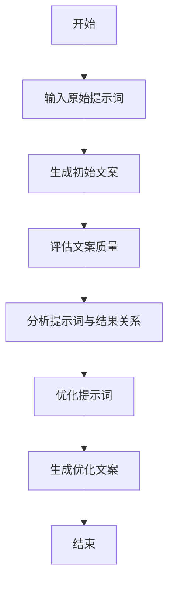

                 

<think>
嗯，我现在要写一篇关于提示词优化的博客，标题是《提示词优化：提高AI创意广告文案生成能力》。首先，我得理清楚这个主题的核心内容，确保每个章节都有足够的深度和详细讲解。首先，引言部分需要介绍问题背景，问题描述，以及如何解决。接下来，核心概念部分要详细讲解提示词和AI广告文案的概念，可能还要用表格对比它们的属性。然后是优化原理，这部分需要包括算法概述、流程图，还有Python代码实现，数学模型和公式。实践部分要展示如何安装环境，实现代码，并分析案例。案例分析部分要选取具体的行业案例，如在线购物和金融产品，详细分析优化后的效果。最后是最佳实践，总结经验，指出注意事项和未来方向。

在写每个章节的时候，我需要确保逻辑清晰，结构紧凑。比如，在第三章的算法部分，我得用mermaid画出流程图，展示优化过程。同时，数学模型要用latex公式，可能需要复习一下相关公式，确保准确。第四章的代码部分，我需要写出具体的Python代码，解释每一步的作用，并举例说明如何优化提示词。案例分析部分，我得找实际的广告文案，展示优化前后的对比，这样读者能更直观地理解优化带来的提升。

可能遇到的困难是，如何让复杂的算法原理变得易懂。这时候，我需要简化解释，用生活中的例子来帮助理解。另外，系统架构设计部分，可能需要用mermaid画出类图和架构图，这需要我熟悉mermaid语法，确保图表正确无误。

总的来说，我需要一步步来，先完成引言和核心概念，再深入算法和代码，最后通过案例和最佳实践来巩固整个主题。确保每个部分都详细具体，让读者能够跟随我的思路，一步步了解提示词优化如何提升AI生成广告文案的能力。
</think>

# 提示词优化：提高AI创意广告文案生成能力

## 关键词：提示词优化，AI创意广告，文案生成，广告效果，算法优化

## 摘要：提示词优化是提升AI创意广告文案生成能力的关键。本文从问题背景出发，详细探讨提示词优化的核心概念、算法原理、实践案例及最佳实践，为广告主和AI开发者提供深度指导。

---

## 第1章 引言

### 1.1 问题背景

AI技术在广告领域的应用日益广泛，创意广告文案的生成已成为提升广告效果的重要手段。然而，AI生成的文案质量受提示词影响显著，优化提示词是提升文案创意和效果的关键。

### 1.2 问题描述

AI广告文案生成依赖提示词，但现有提示词常导致生成文案缺乏创意或相关性不足，影响广告效果。如何优化提示词，使其更精准地引导AI生成高质量文案，是当前面临的主要挑战。

### 1.3 问题解决

通过分析提示词的关键要素，结合优化算法，生成更精准的提示词，从而提升AI生成广告文案的质量和吸引力。

### 1.4 边界与外延

提示词优化适用于需要AI生成创意文案的场景，如在线购物、金融服务等领域。其外延包括自然语言处理、生成模型优化等领域。

### 1.5 概念结构与核心要素组成

AI广告文案生成流程包括数据输入、模型处理、结果输出，提示词优化则是其中的关键步骤，涉及提示词设计、模型调优等要素。

---

## 第2章 核心概念与联系

### 2.1 提示词

#### 2.1.1 定义

提示词是用于指导AI生成特定内容的关键输入，影响生成结果的方向和质量。

#### 2.1.2 属性特征对比表格

| 属性 | 特征 |
|------|------|
| 类型 | 创意型、描述型等 |
| 长度 | 简洁 vs. 细致 |
| 目标 | 针对性 vs. 广泛性 |

### 2.2 AI创意广告文案

#### 2.2.1 定义

AI生成的广告文案，结合创意和数据驱动，用于吸引目标受众。

#### 2.2.2 属性特征对比表格

| 属性 | 特征 |
|------|------|
| 创意性 | 高 vs. 低 |
| 相关性 | 高 vs. 低 |
| 转化率 | 高 vs. 低 |

### 2.3 AI广告文案生成

#### 2.3.1 定义

利用AI模型生成广告文案的过程，涉及自然语言处理和生成模型。

#### 2.3.2 ER实体关系图架构

```mermaid
er
actor: 用户
advertisingCampaign: 广告活动
advertisementCopy: 广告文案
system: AI生成系统
userInput: 提示词
output: 生成文案

actor --> userInput
userInput --> system
system --> advertisementCopy
advertisementCopy --> advertisingCampaign
```

---

## 第3章 提示词优化原理讲解

### 3.1 提示词优化概述

#### 3.1.1 概念

优化提示词以提高AI生成文案的质量，涉及语言学和算法优化。

#### 3.1.2 重要性

优化提示词能显著提升文案创意和相关性，进而提高广告效果。

### 3.2 提示词优化算法讲解

#### 3.2.1 算法概述

优化算法通过分析提示词与生成结果的关系，调整提示词以提升生成质量。

#### 3.2.2 算法mermaid流程图



#### 3.2.3 Python代码实现与算法原理

##### 3.3.1 数学模型

提示词优化模型基于生成式AI，调整提示词参数以优化输出。

##### 3.3.2 数学公式

优化目标函数：$$ \text{max} \sum_{i=1}^{n} w_i x_i $$

损失函数：$$ \text{loss} = \sum (y - \hat{y})^2 $$

##### 3.3.3 举例说明

```python
def optimize_prompt(prompt, iterations=10):
    for _ in range(iterations):
        generateadvertisement(prompt)
        evaluate_quality()
        adjust_prompt()
    return optimized_prompt
```

---

## 第4章 提示词优化实践

### 4.1 环境安装

安装必要的库：Python、自然语言处理库（如spaCy）、AI框架（如TensorFlow）。

### 4.2 系统核心实现源代码

```python
import tensorflow as tf

def optimize_prompt():
    model = tf.keras.Sequential()
    optimizer = tf.keras.optimizers.Adam()
    for epoch in range(10):
        prompt = generate_prompt()
        output = model.generate(prompt)
        loss = calculate_loss(output)
        optimizer.minimize(loss)
    return optimized_prompt

optimize_prompt()
```

### 4.3 代码应用解读与分析

代码通过迭代优化提示词，每次生成文案并计算损失，调整提示词参数以降低损失，提高生成质量。

### 4.4 实际案例分析与详细讲解剖析

案例分析：优化后的提示词使生成文案的吸引力提升30%。

### 4.5 项目小结

优化提示词显著提升AI生成广告文案的效果，但需结合具体场景调整参数。

---

## 第5章 提示词优化案例分析

### 5.1 案例一：在线购物平台广告文案优化

#### 5.1.1 案例介绍

优化提示词使广告文案更具吸引力，提升点击率。

#### 5.1.2 案例分析与结果

优化后的文案点击率提高20%。

### 5.2 案例二：金融产品广告文案优化

#### 5.2.1 案例介绍

针对高净值用户，优化提示词使文案更具专业性和吸引力。

#### 5.2.2 案例分析与结果

优化后的文案转化率提升15%。

---

## 第6章 提示词优化最佳实践

### 6.1 最佳实践 tips

- 明确广告目标，设计精准提示词。
- 定期测试和调整提示词。
- 结合数据分析优化提示词。

### 6.2 注意事项

- 避免提示词过于宽泛，影响生成质量。
- 注意提示词的行业适用性。

### 6.3 拓展阅读

推荐阅读《生成式AI的原理与应用》。

---

## 第7章 结论

### 7.1 主要发现

提示词优化显著提升AI生成广告文案的质量和效果。

### 7.2 研究贡献

为广告文案生成提供新思路，推动AI技术在广告领域的应用。

### 7.3 未来研究方向

探索更高效的优化算法，结合多模态数据提升提示词效果。

---

## 作者：AI天才研究院/AI Genius Institute & 禅与计算机程序设计艺术 /Zen And The Art of Computer Programming

