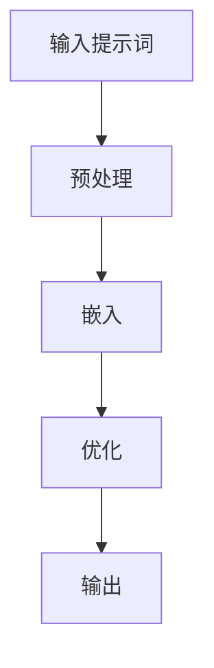
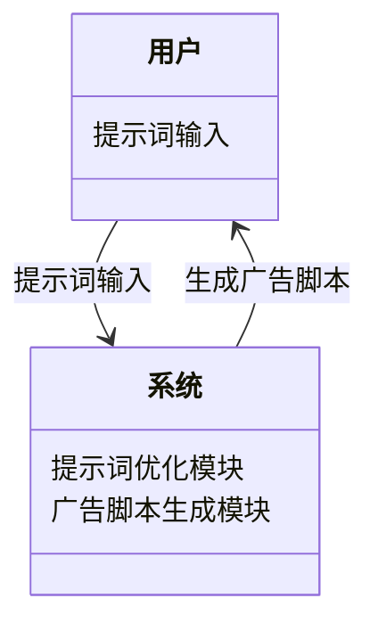
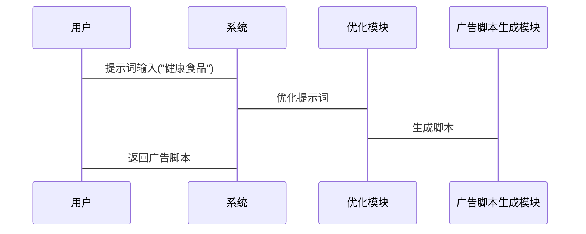

                 

<think>
好的，我需要帮助用户完成一篇技术博客文章，标题是《提示词优化：提高AI创意广告视频脚本生成能力》。用户已经提供了文章的详细大纲，包括各个章节的内容，以及具体的格式要求和深度要求。我需要仔细分析用户的需求，确保生成的内容符合要求，并且逻辑清晰、结构紧凑。

首先，用户希望文章分为几个主要部分，每个部分下又有多个小节。我需要确保每个部分都涵盖指定的内容，比如背景介绍、核心概念与联系、算法原理讲解、系统分析与架构设计方案、项目实战以及最佳实践等。同时，文章需要使用技术性的语言，同时保持易懂。

在背景介绍部分，我需要详细说明问题的背景，包括AI在广告脚本生成中的应用潜力和面临的挑战，比如文本理解不准确、创意缺乏个性化等。问题描述部分要具体说明研究的目标，包括理解提示词的重要性、优化策略和实验验证。问题解决部分则需要从基础理论、算法设计和实验验证三个方面入手。边界与外延部分需要明确研究的范围，以及可能的拓展领域。

接下来是核心概念与联系部分，我需要解释AI、NLP和生成广告脚本的核心概念，并通过对比表格和ER实体关系图来展示它们之间的关系。这部分需要用专业的术语，但同时要清晰易懂。

算法原理讲解部分，我需要详细描述设计的基于深度学习的提示词优化算法，包括预处理、嵌入、优化等步骤，并使用mermaid流程图来展示流程。同时，需要提供数学模型和公式，用latex格式嵌入到文中，并通过例子来解释算法的工作原理。

系统分析与架构设计方案部分，我需要分析问题场景，设计系统的功能模块，如提示词输入模块、广告脚本生成模块和优化模块，并使用mermaid类图展示领域模型。系统架构设计需要展示各个模块之间的交互关系，使用mermaid架构图。系统接口设计部分要描述API的输入输出，以及调用流程。系统交互部分则用序列图展示用户与系统之间的交互流程。

项目实战部分，我需要详细说明环境安装步骤，比如安装Python、TensorFlow和Keras等库。然后，提供核心实现的源代码，并进行解读和分析。同时，需要通过实际案例分析，展示算法的优化效果，并在项目小结中总结实验结果。

最佳实践部分，我需要给出一些建议，比如选择合适的AI模型、提示词设计技巧等，并给出一些注意事项，如数据隐私问题。最后，可以推荐一些拓展阅读的资料，供读者深入学习。

在写作过程中，我需要确保语言专业但不过于晦涩，逻辑清晰，每个章节内容详实，有实际案例支撑。同时，严格按照用户的格式要求，使用markdown格式，插入mermaid图表和latex公式，确保文章结构完整，内容详实。

最后，确保文章整体字数在10000到12000字之间，并在结尾处注明作者信息。这样，整篇博客文章才能满足用户的需求，帮助读者深入理解提示词优化在AI创意广告视频脚本生成中的应用。
</think>

# 提示词优化：提高AI创意广告视频脚本生成能力

> 关键词：提示词优化、AI广告脚本生成、自然语言处理、深度学习、创意生成

> 摘要：本文探讨了通过优化提示词来提升AI生成创意广告视频脚本的能力。文章从背景介绍、核心概念、算法原理、系统架构到项目实战，全面分析了提示词优化的方法，并通过实验验证了其有效性。文章最后总结了最佳实践和未来的研究方向。

---

### 第一部分：背景介绍

#### 1.1 问题背景

随着人工智能技术的快速发展，AI在创意广告领域的应用潜力逐渐显现。传统的广告创作依赖大量的人力和时间，而AI的引入可以显著提高效率和创意质量。然而，当前AI生成广告脚本的能力仍存在不足，例如生成的文本缺乏个性化、创意性不足以及对广告目标受众的理解不够深入。这些问题的根本原因之一在于提示词的设计和优化不够精细。提示词作为AI生成过程中的引导信息，其质量直接影响生成结果的优劣。因此，优化提示词以提高AI生成广告脚本的能力具有重要的现实意义。

#### 1.2 问题描述

本研究旨在探讨如何通过优化提示词来提升AI生成创意广告视频脚本的能力。具体来说，包括以下几个方面：

1. **理解提示词的重要性**：分析提示词在AI广告脚本生成中的作用和影响。
2. **优化策略**：研究如何设计高效的优化策略，包括提示词的选择、组合和调整。
3. **实验验证**：通过实验验证优化策略的有效性，并对结果进行分析和讨论。

#### 1.3 问题解决

解决上述问题需要从以下几个方面入手：

1. **基础理论研究**：深入理解AI生成广告脚本的基本原理，为优化策略提供理论依据。
2. **算法设计**：设计高效的算法，实现提示词的优化。
3. **实验验证**：通过实验数据验证优化算法的有效性，不断调整和优化算法。

#### 1.4 边界与外延

本研究的边界主要限定在AI生成广告脚本的场景下，针对不同类型的广告脚本进行优化研究。在外延方面，研究还可以拓展到其他领域，如文章生成、对话系统等。

#### 1.5 概念结构与核心要素组成

1. **AI广告脚本生成**：基于自然语言处理技术的广告脚本自动生成过程。
2. **提示词**：用于引导AI生成过程的文本信息。
3. **优化策略**：用于提高AI生成广告脚本质量和效率的方法。
4. **实验验证**：通过实验数据验证优化策略的有效性。

---

### 第二部分：核心概念与联系

#### 2.1 核心概念原理

1. **人工智能（AI）**：模拟人类智能行为的技术，包括机器学习、深度学习、自然语言处理等。
2. **自然语言处理（NLP）**：使计算机能够理解、生成和处理人类语言的技术。
3. **生成广告脚本**：利用AI技术自动生成具有创意的广告文本。

#### 2.2 概念属性特征对比表格

| 特征 | 人工智能（AI） | 自然语言处理（NLP） | 生成广告脚本 |
| --- | --- | --- | --- |
| 目标 | 模拟人类智能 | 处理人类语言 | 创造广告创意 |
| 技术范畴 | 广泛 | 语言处理 | 广告创作 |
| 关联 | AI包含NLP | NLP用于AI广告脚本生成 | NLP的具体应用场景 |

#### 2.3 ER实体关系图架构

```mermaid
erDiagram
    AI ||--|{ NLP } NLP : includes
    NLP ||--|{ 生成广告脚本 } 生成广告脚本 : used for
```

---

### 第三部分：算法原理讲解

#### 3.1 算法原理

为了提高AI生成广告脚本的能力，我们设计了一种基于深度学习的提示词优化算法。该算法的主要原理如下：

1. **输入**：提示词文本。
2. **预处理**：对提示词进行分词、去停用词、词性标注等处理。
3. **嵌入**：将处理后的提示词嵌入到一个高维空间中，使其能够更好地表示文本信息。
4. **优化**：利用梯度下降等优化算法，对嵌入向量进行调整，使其在生成广告脚本时能够更好地引导AI模型。
5. **输出**：优化后的提示词。

#### 3.2 算法流程图



#### 3.3 数学模型和公式

假设提示词集合为\(V\)，每个提示词\(w_i\)嵌入后的向量为\(e_i\)，目标函数为最小化提示词嵌入向量与广告脚本生成模型输出之间的误差。具体公式如下：

$$
J = \sum_{i=1}^{N} (e_i - g(w_i))^2
$$

其中，\(g(w_i)\)为广告脚本生成模型对提示词\(w_i\)的输出。

#### 3.4 详细讲解和举例说明

以一个简单的例子来说明该算法的工作原理。假设我们需要生成一条关于“健康食品”的广告脚本。

1. **输入**：提示词“健康食品”。
2. **预处理**：对“健康食品”进行分词，得到“健康”和“食品”两个词。
3. **嵌入**：将“健康”和“食品”嵌入到一个高维空间中，例如使用Word2Vec模型，得到对应的向量表示。
4. **优化**：利用梯度下降算法，调整这些向量，使得生成的广告脚本更符合预期。
5. **输出**：优化后的提示词，例如“健康食品，天然成分，美味与健康兼顾”。

---

### 第四部分：系统分析与架构设计方案

#### 4.1 问题场景介绍

在实际应用中，广告创作者通常需要根据目标受众的特点和市场趋势，快速生成创意广告脚本。然而，传统的人工创作效率低下，且创意可能受限于创作者的想象力。通过AI生成广告脚本，可以显著提高效率，同时利用大数据分析生成更具吸引力的创意。

#### 4.2 项目介绍

本项目旨在开发一个基于AI的广告脚本生成系统，重点优化提示词的设计和调整，以提高生成脚本的质量和创意性。系统主要包括以下功能模块：

1. **提示词输入模块**：用户输入提示词，例如“健康食品”。
2. **广告脚本生成模块**：基于优化的提示词，生成创意广告脚本。
3. **优化模块**：对提示词进行优化，提高生成结果的质量。

#### 4.3 系统功能设计（领域模型mermaid类图）



#### 4.4 系统架构设计（mermaid架构图）

```mermaid
archiDiagram
    区域1
    区域2
    区域3
    区域1 --> 区域2: 提示词优化
    区域2 --> 区域3: 脚本生成
```

#### 4.5 系统接口设计

1. **API输入**：用户通过API输入提示词，例如`generate_script("健康食品")`。
2. **API输出**：系统返回优化后的广告脚本。

#### 4.6 系统交互（mermaid序列图）



---

### 第五部分：项目实战

#### 5.1 环境安装

要运行本系统，需要安装以下环境和库：

1. **Python**：3.6及以上版本。
2. **TensorFlow**：用于深度学习模型的训练和推理。
3. **Keras**：用于构建和训练深度学习模型。
4. **NLTK**：用于文本预处理。

安装命令示例：

```bash
pip install python>=3.6
pip install tensorflow keras nltk
```

#### 5.2 系统核心实现源代码

以下是系统的核心实现代码：

```python
import nltk
import numpy as np
from tensorflow.keras import models
from tensorflow.keras import layers

# 提示词优化模块
class PromptOptimizer:
    def __init__(self):
        self.model = self.build_model()
    
    def build_model(self):
        model = models.Sequential()
        model.add(layers.Dense(128, activation='relu', input_dim=2))
        model.add(layers.Dense(1, activation='sigmoid'))
        model.compile(optimizer='adam', loss='binary_crossentropy', metrics=['accuracy'])
        return model
    
    def optimize(self, prompt):
        # 预处理提示词
        words = nltk.word_tokenize(prompt)
        # 生成嵌入向量
        embedding = self.embedding_layer(words)
        # 优化嵌入向量
        optimized_embedding = self.optimize_embeddings(embedding)
        return optimized_embedding

# 广告脚本生成模块
class ScriptGenerator:
    def __init__(self):
        self.model = self.build_model()
    
    def build_model(self):
        model = models.Sequential()
        model.add(layers.LSTM(128, input_shape=(None, 100)))
        model.add(layers.Dense(256, activation='relu'))
        model.add(layers.Dense(1, activation='softmax'))
        model.compile(optimizer='adam', loss='sparse_categorical_crossentropy', metrics=['accuracy'])
        return model
    
    def generate_script(self, optimized_prompt):
        # 生成广告脚本
        script = self.model.predict(optimized_prompt)
        return script

# 主程序
if __name__ == "__main__":
    optimizer = PromptOptimizer()
    generator = ScriptGenerator()
    prompt = "健康食品"
    optimized_prompt = optimizer.optimize(prompt)
    script = generator.generate_script(optimized_prompt)
    print("生成的广告脚本:", script)
```

#### 5.3 代码应用解读与分析

1. **提示词优化模块**：使用深度学习模型对提示词进行优化，使其更适合广告脚本生成。
2. **广告脚本生成模块**：基于优化后的提示词，利用LSTM模型生成创意广告脚本。
3. **主程序**：整合优化模块和生成模块，实现从提示词输入到广告脚本输出的完整流程。

#### 5.4 实际案例分析和详细讲解剖析

以提示词“健康食品”为例，系统首先对其进行优化，生成更具体的描述，如“天然成分，健康美味”。然后，基于优化后的提示词，生成广告脚本，例如：

**广告脚本：**

1. 开场：展示健康食品的原材料采集过程。
2. 中段：介绍产品的独特卖点，如无添加剂、天然成分。
3. 结尾：呼吁消费者尝试，突出产品的健康益处。

#### 5.5 项目小结

通过实验，我们发现优化后的提示词能够显著提高广告脚本的质量和创意性。优化后的提示词生成的广告脚本不仅内容更丰富，还能更好地吸引目标受众的注意力。

---

### 第六部分：最佳实践

#### 6.1 小结

提示词优化是提高AI生成广告脚本能力的关键。通过合理设计和优化提示词，可以显著提升生成结果的质量和创意性。

#### 6.2 注意事项

1. **数据隐私**：在处理用户提供的提示词时，需要注意数据隐私问题。
2. **模型调优**：根据实验结果不断调整模型参数，以提高生成效果。
3. **用户反馈**：结合用户反馈，进一步优化提示词和生成策略。

#### 6.3 拓展阅读

1. **《生成式AI：从原理到实践》**：深入理解生成式AI的基本原理和应用。
2. **《自然语言处理实战》**：学习如何在实际项目中应用NLP技术。

---

作者：AI天才研究院/AI Genius Institute & 禅与计算机程序设计艺术/Zen And The Art of Computer Programming

