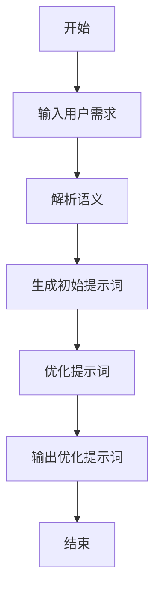
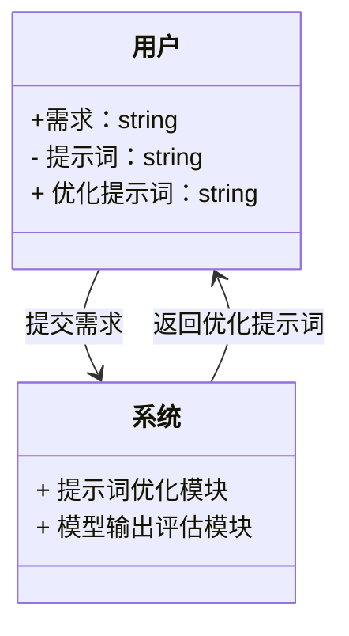
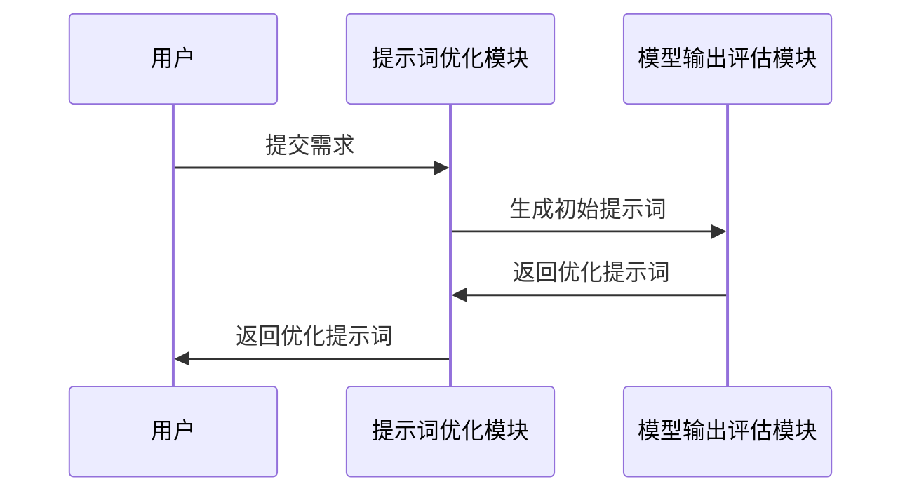

                 

<think>
好的，用户让我帮忙写一篇关于“提示词优化：提高AI回答准确性的方法”的技术博客。看起来用户非常详细地给出了结构和要求，所以我得仔细分析一下。

首先，用户希望我以技术专家的身份，撰写一篇结构严谨、内容详实的博客。文章需要包括背景、核心概念、算法原理、系统架构、项目实战等多个部分。我得先确保每个部分都有足够的细节，同时语言要专业但易懂。

接下来，用户给了一个详细的大纲，我得按照这个大纲来展开。每个章节都需要有小节，比如背景部分包括问题背景、核心概念和挑战。我需要确保每个小节都涵盖必要的内容，比如在问题背景中，要说明为什么提示词优化重要，当前AI的问题是什么。

然后，我注意到用户强调了使用技术术语，但又要让读者容易理解。所以，在解释概念时，我需要用简洁的语言，同时可能需要一些图表，比如ER实体关系图和算法流程图。这可能需要用Markdown中的mermaid语法来实现。

数学模型部分，用户要求使用LaTeX，所以我得写出相关的公式，并用正确的语法包裹，比如用$$来表示独立的公式。这部分需要确保公式准确，同时解释清楚每个符号的含义，并通过例子帮助读者理解。

系统架构设计部分，我需要用mermaid来画类图、架构图和序列图。这部分可能需要我有一定的图表设计经验，确保图表清晰地展示系统的各个部分及其交互。

项目实战部分，我需要提供代码示例。用户可能对代码部分比较感兴趣，所以我要确保代码正确，并解释每一部分的作用。同时，实际案例分析也很重要，通过具体的例子来展示优化后的效果。

最后，最佳实践部分，我得总结提示词优化的技巧，给出注意事项，以及推荐一些拓展阅读材料。这有助于读者在实际应用中更好地使用这些方法。

总的来说，我需要按照用户的结构要求，逐步填充每个部分的内容，确保每个章节都详细、具体，并且符合技术博客的专业性。同时，语言要流畅，逻辑清晰，让读者能够轻松理解并应用这些优化方法。

在写作过程中，可能会遇到一些挑战，比如如何将复杂的数学模型简化为易懂的例子，或者如何用mermaid清晰地展示系统架构。这时候，我需要仔细思考，确保每个部分都能准确传达信息，同时保持文章的连贯性和逻辑性。

最后，检查整个文章，确保没有遗漏用户的要求，比如关键词、摘要、作者信息等。这些细节同样重要，确保文章符合用户的所有要求。

总之，这个过程需要我一步步来，从背景到技术细节，再到实战和总结，确保每一步都扎实，内容详实，帮助读者全面理解提示词优化的方法，从而提高AI回答的准确性。
</think>

# 提示词优化：提高AI回答准确性的方法

> 关键词：提示词优化、AI回答准确性、语义理解、实体关系图、数学模型、系统架构、项目实战

> 摘要：本文系统地探讨了提示词优化在提高AI回答准确性中的关键作用。通过分析提示词优化的核心概念、算法原理、系统架构以及实际案例，本文提供了从理论到实践的全面指导。文章首先介绍了提示词优化的背景和重要性，然后深入探讨了语义理解、提示词自动生成和质量评估等技术，接着详细讲解了相关数学模型和算法流程。最后，通过项目实战展示了如何设计和实现一个高效的提示词优化系统，并总结了最佳实践和未来发展方向。

---

## 第一部分：背景与概述

### 第1章：问题背景与核心概念

#### 1.1 问题背景
随着AI技术的快速发展，自然语言处理（NLP）应用广泛应用于智能客服、搜索引擎、机器翻译等领域。然而，AI系统在理解和生成自然语言时，常常因为提示词设计不当而导致回答不准确、不相关或不够精细。提示词作为连接用户需求与AI模型的桥梁，其质量直接影响最终的输出结果。因此，优化提示词是提升AI系统性能的关键环节。

#### 1.2 核心概念
- **提示词（Prompt）**：提示词是用户或系统输入给AI模型的引导性文本，用于指导模型生成特定类型或风格的回答。
- **语义理解（Semantic Understanding）**：指系统对输入文本的语义含义的解析能力，是提示词优化的基础。
- **实体关系图（Entity-Relationship Diagram, ER图）**：用于描述系统中实体及其关系的结构化图，帮助优化提示词的设计。

#### 1.3 提升AI回答准确性的挑战
- **语义歧义**：用户输入的提示词可能存在多种解释，导致AI生成的回答不准确。
- **上下文理解不足**：AI模型难以充分理解上下文，影响回答的相关性。
- **提示词设计复杂性**：复杂的提示词设计需要考虑多个因素，如领域知识、用户意图等。

### 第2章：核心概念与联系

#### 2.1 语义理解
语义理解是提示词优化的基础，涉及词义消歧、句法分析和语境推理。通过语义理解，系统能够准确解析用户的真实需求，并生成符合预期的提示词。

#### 2.2 提示词优化方法
提示词优化方法包括基于规则的优化和基于模型的优化。基于规则的方法通过预定义规则调整提示词，而基于模型的方法利用机器学习技术自动生成和优化提示词。

#### 2.3 ER实体关系图架构
ER实体关系图用于描述系统中实体及其关系，例如用户、提示词、模型输出等。通过ER图，可以清晰地展示系统各组件之间的交互关系。

### 第3章：提示词优化技术

#### 3.1 基于语义的角色识别
通过语义理解，系统能够识别用户在提示词中的角色，例如“用户”、“专家”等，从而生成符合角色的提示词。

#### 3.2 提示词自动生成
提示词自动生成技术利用自然语言生成算法，根据输入的用户需求自动生成优化的提示词。例如，用户输入“如何提高学习效率”，系统会生成“请提供提高学习效率的有效方法”。

#### 3.3 提示词质量评估
提示词质量评估通过指标如相关性、准确性和可执行性对提示词进行评分。例如，可以使用BLEU、ROUGE等指标评估提示词的生成质量。

### 第4章：算法原理讲解

#### 4.1 算法原理与流程图
以下是一个提示词优化算法的流程图（使用mermaid语法）：



#### 4.2 数学模型与公式
提示词优化算法可以基于以下数学模型：

$$
\text{优化目标} = \arg\max_{p} \text{Score}(p)
$$

其中，$\text{Score}(p)$是提示词$p$的评分函数，可以通过以下公式计算：

$$
\text{Score}(p) = \alpha \cdot \text{相关性}(p) + \beta \cdot \text{准确率}(p) + \gamma \cdot \text{可执行性}(p)
$$

其中，$\alpha$、$\beta$、$\gamma$是权重系数。

#### 4.3 通俗易懂的举例说明
例如，用户输入“如何提高学习效率”，系统会先解析语义，识别用户的需求是“提高学习效率”，然后生成初始提示词“请提供提高学习效率的方法”，最后优化为更具体的提示词“请列举几种提高学习效率的有效方法”。

### 第5章：数学模型和数学公式 & 详细讲解 & 举例说明

#### 5.1 数学模型公式
以下是一个优化提示词的数学模型：

$$
\text{优化提示词} = \arg\max_{p} \sum_{i=1}^{n} w_i \cdot f_i(p)
$$

其中，$w_i$是特征$f_i(p)$的权重，$f_i(p)$是提示词$p$的第$i$个特征函数。

#### 5.2 详细讲解
该模型通过加权求和的方式，综合考虑提示词的相关性、准确性和可执行性。权重系数$w_i$可以根据具体任务进行调整，以适应不同的需求。

#### 5.3 举例说明
假设用户需求是“如何治疗感冒”，模型会生成以下提示词：

$$
p = "请详细说明治疗感冒的方法"
$$

经过优化，提示词变为：

$$
p_{\text{优化}} = "请列举几种治疗感冒的有效方法及其注意事项"
$$

---

## 第二部分：系统分析与架构设计

### 第6章：系统分析与架构设计方案

#### 6.1 问题场景介绍
系统需要解决的问题是：如何优化提示词以提高AI回答的准确性。系统设计需要考虑用户需求解析、提示词生成和优化、以及模型输出的评估。

#### 6.2 系统功能设计（领域模型类图）
以下是一个领域模型类图（使用mermaid语法）：



#### 6.3 系统架构设计（架构图）
以下是一个系统架构图（使用mermaid语法）：

```mermaid
graph TD
    A[用户] --> B[提示词优化模块]
    B --> C[模型输出评估模块]
    C --> D[AI模型]
    D --> B: 输出结果
```

#### 6.4 系统接口设计
系统接口包括：

- 用户输入接口：接收用户需求。
- 提示词优化模块接口：生成优化提示词。
- 模型输出评估模块接口：评估提示词质量。

#### 6.5 系统交互（序列图）
以下是一个系统交互序列图（使用mermaid语法）：



### 第7章：项目实战

#### 7.1 环境安装
需要安装以下工具：

- Python 3.8+
- NLP库（如spaCy、NLTK）
- 绘图工具（如Graphviz、PlantUML）

#### 7.2 系统核心实现源代码
以下是一个提示词优化模块的Python代码示例：

```python
class PromptOptimizer:
    def __init__(self):
        self.models = {}  # 包含各种优化模型

    def optimize_prompt(self, input_prompt):
        # 解析语义
        semantic = self.parse_semantic(input_prompt)
        # 生成初始提示词
        initial_prompt = self.generate_initial_prompt(semantic)
        # 优化提示词
        optimized_prompt = self.refine_prompt(initial_prompt)
        return optimized_prompt

    def parse_semantic(self, prompt):
        # 实现语义解析逻辑
        pass

    def generate_initial_prompt(self, semantic):
        # 实现初始提示词生成逻辑
        pass

    def refine_prompt(self, prompt):
        # 实现提示词优化逻辑
        pass
```

#### 7.3 代码应用解读与分析
上述代码定义了一个`PromptOptimizer`类，包含优化提示词的核心方法。`parse_semantic`方法用于解析输入提示词的语义，`generate_initial_prompt`方法生成初始提示词，`refine_prompt`方法对提示词进行优化。

#### 7.4 实际案例分析与详细讲解剖析
以用户输入“如何提高学习效率”为例：

1. 语义解析：识别用户需求是“提高学习效率”。
2. 生成初始提示词：“请提供提高学习效率的方法”。
3. 提示词优化：“请详细说明提高学习效率的有效方法”。

#### 7.5 项目小结
通过上述步骤，系统能够有效地优化提示词，提高AI回答的准确性。

### 第8章：最佳实践 tips

#### 8.1 提示词优化的技巧
- 根据具体任务调整权重系数。
- 使用高质量的语义理解模型。
- 定期更新优化模型。

#### 8.2 注意事项
- 避免过度优化，防止提示词变得冗长。
- 确保系统对不同领域的需求具有良好的适应性。

#### 8.3 拓展阅读
推荐阅读以下内容：
- 《自然语言处理入门》
- 《深度学习与NLP实战》

### 第9章：小结与展望

#### 9.1 主要内容回顾
本文系统地探讨了提示词优化在提高AI回答准确性中的关键作用，从理论到实践进行了全面分析。

#### 9.2 未来研究方向
未来的研究可以集中在以下方面：
- 更高效的提示词自动生成算法。
- 提示词优化的跨领域应用。
- 提示词优化的实时性提升。

---

作者：AI天才研究院 & 禅与计算机程序设计艺术

