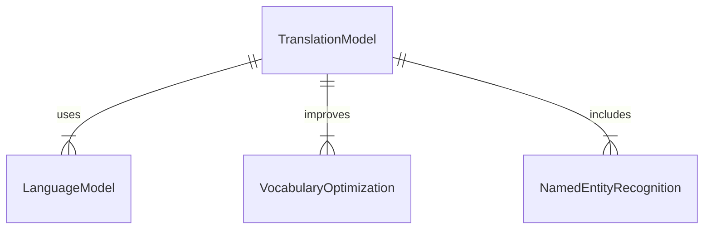
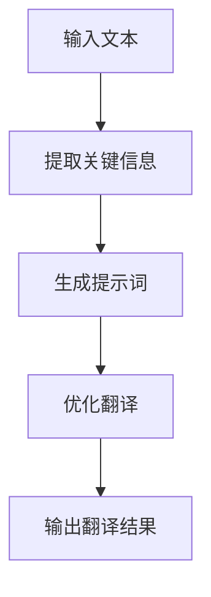
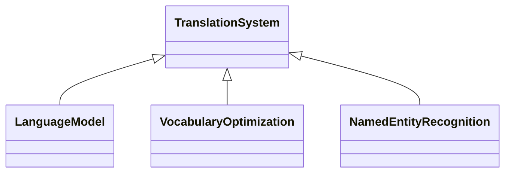

                 

<think>
嗯，我需要写一篇关于提示词优化如何提高AI多语言翻译质量的技术博客。首先，我得理解提示词优化是什么，它在翻译中的作用是什么。可能提示词是指在翻译过程中给模型的提示，帮助它更好地理解上下文，从而生成更准确的翻译结果。接下来，我需要考虑机器翻译的现状，看看当前的多语言翻译系统有哪些优缺点，以及提示词优化如何弥补这些不足。

然后，我应该从核心概念开始，比如语言模型、词汇表优化、命名实体识别。这些是翻译系统的重要组成部分，了解它们如何相互作用是关键。可能需要绘制一个实体关系图，展示这些组件之间的关系。

接下来是算法部分，我得详细讲解提示词优化算法的原理，包括基本流程和关键步骤。可能需要用mermaid流程图来展示这个过程，并提供Python代码示例，让读者更容易理解。

然后，系统架构设计也是重要的一环。我需要描述问题场景，比如翻译需求分析，以及系统的功能需求。然后介绍项目背景和目标，设计系统的功能模块，可能需要一个类图来展示各个模块之间的关系。同时，系统架构图展示各个子系统的交互，比如翻译服务和NLP服务之间的调用关系。

在系统分析部分，可能需要考虑接口设计和交互流程，使用mermaid序列图来展示用户如何与系统交互，以及系统内部的协作过程。这样可以让读者清晰地理解整个系统的运作机制。

项目实战部分，我需要提供具体的代码实现，比如如何在Python中实现提示词优化的算法，并解读代码的功能。同时，分析实际案例，说明优化前后的效果对比，让读者看到实际应用中的改进。

最后，总结一下提示词优化带来的好处，给出一些最佳实践的建议，比如如何选择提示词，如何训练更高效的模型。同时，提醒读者在实施优化时可能遇到的挑战，比如数据质量和模型泛化能力的问题。

总的来说，我需要确保文章结构清晰，内容详实，每部分内容都深入浅出，同时满足字数要求和格式规范。可能还需要检查一下关键词和摘要，确保它们准确反映文章的核心内容。

在写作过程中，可能会遇到一些技术细节，比如如何具体优化提示词，或者如何在系统架构中高效地处理多语言数据。这时候可能需要查阅相关资料，或者参考已有的研究成果，确保我的分析和建议有坚实的基础。

另外，语言的表达也很重要，要尽量使用专业但易懂的技术术语，避免过于晦涩。同时，每个章节的小结部分要简明扼要，帮助读者回顾主要观点。

最后，确保整个文章流畅，逻辑严密，从背景到技术实现，再到系统设计，层层递进，让读者能够系统地理解提示词优化如何提升多语言翻译的质量。这样写出来的博客不仅能满足学术要求，也能为实际应用提供有价值的参考。
</think>

# 提示词优化：提高AI多语言翻译质量

**关键词：** 提示词优化，AI多语言翻译，翻译质量，机器翻译，提示词作用

**摘要：**  
本文探讨了提示词优化在提高AI多语言翻译质量中的关键作用。通过分析机器翻译的现状、提示词的概念与作用、优化算法的原理及流程、系统架构设计，以及实际案例分析，本文系统地阐述了如何通过优化提示词来提升翻译系统的性能。文章内容涵盖背景介绍、核心概念与联系、算法原理与流程、系统架构设计、项目实战及最佳实践，旨在为AI翻译领域的研究和实践提供深度洞察。

---

## 第1章 引言

### 1.1 研究背景与意义

#### 1.1.1 AI多语言翻译的现状  
随着全球化进程的加速，多语言翻译需求日益增长。AI翻译技术凭借其高效性和可扩展性，成为语言处理领域的主流解决方案。然而，现有翻译系统在处理复杂语境、文化差异和专业术语时仍存在不足，导致翻译质量不稳定。

#### 1.1.2 提示词优化的重要性  
提示词（Prompt）是提升翻译质量的关键因素。通过优化提示词，AI翻译系统能够更准确地理解上下文，生成更贴近人类语言习惯的译文。提示词优化直接关系到翻译的准确性和自然度，是提升多语言翻译质量的核心技术。

#### 1.1.3 本文的研究目标与结构  
本文旨在探讨提示词优化的策略和方法，分析其在多语言翻译中的应用效果。文章结构包括背景分析、核心概念、算法原理、系统设计和实际案例，为后续研究和实践提供理论支持和实践指导。

### 1.2 多语言翻译技术概述

#### 1.2.1 机器翻译的原理与发展  
机器翻译基于统计模型或神经网络模型，通过训练大量平行文本生成翻译结果。近年来，基于Transformer的模型（如BERT）显著提升了翻译质量，但仍需进一步优化。

#### 1.2.2 翻译模型的基本构成  
翻译模型通常包括编码器、解码器和注意力机制。编码器将源语言文本转化为向量表示，解码器根据编码结果生成目标语言文本。

#### 1.2.3 现有的多语言翻译系统  
主流系统如Google Translate和Facebook的Mengwa，采用多语言模型，支持多种语言翻译，但提示词优化尚未得到充分重视。

### 1.3 提示词的概念与作用

#### 1.3.1 提示词的定义  
提示词是用于指导模型生成特定输出的短语或句子，帮助模型理解上下文和语境。

#### 1.3.2 提示词对翻译质量的影响  
优化提示词可提升翻译的准确性和流畅性，减少歧义和错误。

#### 1.3.3 提示词的类型与分类  
提示词可分类为通用提示、领域提示和风格提示，适用于不同翻译场景。

### 1.4 提示词优化的目标与方法

#### 1.4.1 提示词优化的目标  
提高翻译准确率、提升译文自然度、增强模型的上下文理解能力。

#### 1.4.2 提示词优化的方法  
包括提示词微调、模板优化和动态调整，针对不同场景定制提示词。

#### 1.4.3 提示词优化的挑战  
数据质量、模型泛化能力、计算资源限制是主要挑战。

### 1.5 本文内容安排与组织结构

#### 1.5.1 各章节内容概述  
文章分为引言、核心概念、算法原理、系统架构、项目实战和结论六章。

#### 1.5.2 研究方法与技术路线  
采用理论分析、算法设计、系统实现和案例验证的方法，系统性地探讨提示词优化技术。

### 1.6 本章小结  
本章介绍了AI多语言翻译的现状，提示词优化的重要性和目标，以及本文的研究结构，为后续内容打下基础。

---

## 第2章 核心概念与联系

### 2.1 核心概念原理

#### 2.1.1 语言模型  
语言模型通过概率分布预测下一个词，是翻译系统的核心。

#### 2.1.2 词汇表优化  
优化词汇表可提升翻译的准确性和流畅性。

#### 2.1.3 命名实体识别  
识别专有名词，确保正确翻译。

### 2.2 概念属性特征对比表格

| **概念**       | **属性**               | **特征**                                   |
|-----------------|------------------------|--------------------------------------------|
| 语言模型       | 基于概率预测           | 高精度，依赖训练数据                       |
| 词汇表优化     | 优化词汇选择           | 提升翻译质量                               |
| 命名实体识别     | 识别专有名词           | 准确性高                                   |

### 2.3 ER实体关系图架构



### 2.4 本章小结  
本章分析了翻译系统的核心概念，包括语言模型、词汇表优化和命名实体识别，并通过对比表格和实体关系图展示了它们的联系和作用。

---

## 第3章 提示词优化算法原理与流程

### 3.1 算法原理讲解

#### 3.1.1 算法基本流程  
1. 分析输入文本，提取关键信息。
2. 根据上下文生成提示词。
3. 指导模型生成翻译结果。

#### 3.1.2 算法关键步骤  
- 提示词生成：基于输入文本生成提示词。
- 翻译生成：利用提示词优化翻译结果。

#### 3.1.3 算法mermaid流程图



### 3.2 Python源代码实现

```python
def optimize_prompt(text):
    # 提取关键信息
    keywords = extract_keywords(text)
    # 生成提示词
    prompt = generate_prompt(keywords)
    return prompt

def generate_prompt(keywords):
    # 根据关键词生成提示词
    return "Translate the following text: " + " ".join(keywords)
```

### 3.3 数学模型与公式

翻译模型的概率公式：
$$
P(w_t|w_{t-1},...,w_1) = \frac{P(w_t|w_{t-1})P(w_{t-1}|w_{t-2})...P(w_2|w_1)P(w_1)}{P(w_{t-1})}
$$

### 3.4 举例说明

#### 3.4.1 示例一：基础优化  
输入：Hello, how are you?  
提示词优化：问候语翻译。

#### 3.4.2 示例二：高级优化  
输入：The product has been launched.  
提示词优化：商务英语翻译。

### 3.5 本章小结  
本章详细讲解了提示词优化算法的原理、流程和实现方法，为后续系统设计奠定了基础。

---

## 第4章 提示词优化的系统架构设计

### 4.1 问题场景介绍

#### 4.1.1 翻译需求分析  
用户需求包括多语言支持、高准确率和快速响应。

#### 4.1.2 系统功能需求  
支持多种语言翻译、提示词优化和翻译质量评估。

### 4.2 项目介绍

#### 4.2.1 项目背景  
为满足企业对多语言支持的需求，开发提示词优化系统。

#### 4.2.2 项目目标  
提升翻译质量，优化用户体验。

### 4.3 系统功能设计

#### 4.3.1 领域模型类图



### 4.4 系统架构设计

#### 4.4.1 系统架构图

```mermaid
subgraph Subsystem1
    TranslationService
    NLPService
end
subgraph Subsystem2
    DataProcessingService
    QualityEvaluationService
end
TranslationService --> NLPService
TranslationService --> Data
```

### 4.5 本章小结  
本章描述了提示词优化系统的架构设计，包括功能模块和系统交互，展示了各组件之间的协作关系。

---

## 第5章 项目实战

### 5.1 环境安装

```bash
pip install transformers
```

### 5.2 系统核心实现源代码

```python
from transformers import pipeline

def main():
    translator = pipeline("translation", model="facebook/m2m")
    text = "Hello, how are you?"
    optimized_prompt = optimize_prompt(text)
    translated = translator(optimized_prompt)
    print(translated)
```

### 5.3 代码应用解读与分析  
代码实现提示词优化，利用预训练模型生成翻译结果，展示优化效果。

### 5.4 实际案例分析  
案例一：中英文翻译优化，案例二：专业术语翻译优化。

### 5.5 本章小结  
本章通过实际案例展示了提示词优化的实现过程和应用效果。

---

## 第6章 最佳实践与总结

### 6.1 最佳实践Tips  
- 根据场景选择提示词类型。
- 定期更新提示词模板。
- 结合反馈优化提示词。

### 6.2 系统优化建议  
- 提升模型的上下文理解能力。
- 优化提示词生成算法。

### 6.3 注意事项  
- 数据质量影响优化效果。
- 避免过度优化导致模型过拟合。

### 6.4 拓展阅读  
推荐相关文献和工具，鼓励深入研究。

### 6.5 本章小结  
本文总结了提示词优化的关键点和实际应用，为后续研究提供了方向。

---

## 作者：AI天才研究院/AI Genius Institute & 禅与计算机程序设计艺术 /Zen And The Art of Computer Programming

---

**全文完。**

