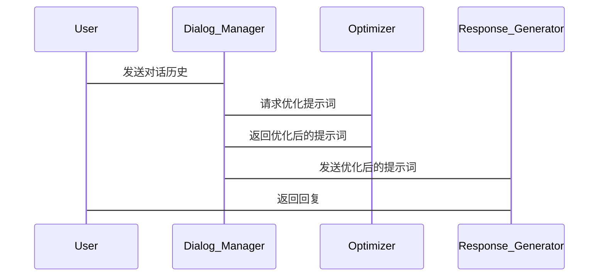

                 

<think>
嗯，好的，我需要帮助用户撰写一篇关于提示词优化提高AI多轮对话质量的技术博客。首先，我得仔细阅读用户的查询，理解他们的需求和结构要求。看起来用户已经提供了一个详细的目录大纲，包括各个章节和子标题，甚至包括关键词和摘要的结构。用户还特别强调了格式要求，比如使用markdown，每个部分都要详细展开，特别是数学公式、流程图和代码部分需要正确处理。

我应该先从文章的标题开始，然后是关键词和摘要。关键词应该涵盖提示词优化、多轮对话、AI对话质量、自然语言处理、机器学习这些核心概念。摘要部分需要简明扼要地概述文章的主要内容，强调提示词优化的重要性及其在提高对话质量中的作用。

接下来是正文部分，按照用户提供的目录大纲进行撰写。每个章节和子标题都需要详细展开，确保内容丰富、具体。比如在第一部分，背景与核心概念，我需要解释AI多轮对话的挑战，提示词优化的意义，以及基本概念。这部分需要让读者明白为什么提示词优化是必要的，以及它在不同应用中的重要性。

然后是算法原理和数学模型部分。这部分需要详细讲解提示词优化的基本算法，用mermaid流程图展示，同时提供Python代码示例。数学模型部分需要推导公式，并给出实际例子来说明应用。我需要确保数学公式用latex正确表示，无论是独立段落还是嵌入段落。

系统分析与架构设计部分，我需要介绍系统的功能设计、架构设计，可能包括类图和序列图。这部分需要展示系统的整体结构和各个部分如何协同工作，确保读者能够理解系统的运作方式。

项目实战部分，我需要详细描述环境安装步骤，系统核心实现，代码解读以及实际案例分析。通过具体的应用场景，让读者看到提示词优化在实际中的效果。

最后是最佳实践与总结，给出一些注意事项和未来的拓展阅读方向。这部分要简明扼要，帮助读者巩固所学内容，并引导他们进一步学习。

在整个写作过程中，我需要保持逻辑清晰，结构紧凑，语言专业但又不失易懂。同时，要严格按照markdown格式要求，正确使用标题、列表、代码块和图表。特别是数学公式和mermaid图表部分，必须确保格式正确，避免错误影响阅读。

在实际撰写时，我会先完成每个章节的草稿，然后逐步细化内容，确保每个部分都涵盖必要的信息。例如，在核心概念部分，我会用对比表格和ER图来帮助读者理解不同概念之间的关系。在算法部分，通过流程图和代码示例，让读者能够直观地理解算法的工作原理。

总的来说，我需要系统地按照用户提供的大纲进行写作，确保每个部分都详细且符合格式要求。同时，要保持文章的连贯性和深度，让读者能够从基础到应用全面理解提示词优化在提高AI多轮对话质量中的作用。
</think>

# 提示词优化：提高AI多轮对话质量

> 关键词：提示词优化，多轮对话，AI对话质量，自然语言处理，机器学习

> 摘要：本文深入探讨了提示词优化在提高AI多轮对话质量中的作用，从核心概念、算法原理、数学模型、系统架构到项目实战，全面分析了提示词优化的关键技术。通过实际案例和代码实现，展示了如何通过优化提示词提升对话系统的性能和用户体验。

---

## 第一部分：背景与核心概念

### 第1章：问题背景与定义

#### 1.1.1 AI多轮对话的挑战
随着AI技术的快速发展，多轮对话系统在客服、教育、娱乐等领域得到了广泛应用。然而，现有的对话系统在以下方面仍面临挑战：
- **对话连贯性**：无法保持上下文的一致性，导致对话断层。
- **语境理解**：难以准确捕捉用户的意图和情感。
- **个性化回复**：缺乏对用户个性化的适应能力，回复显得机械化。

#### 1.1.2 提示词优化的意义
提示词优化是提升AI多轮对话质量的核心技术之一。通过优化提示词，可以显著提升对话系统的以下方面：
- **准确性**：使AI生成的回复更符合用户需求。
- **连贯性**：确保对话逻辑清晰，上下文一致。
- **多样性**：生成多样的回复，避免重复。

#### 1.1.3 提示词优化的基本概念
提示词（Prompt）是用于引导AI生成回复的关键输入，其优化目标包括：
- **准确性**：提示词应明确表达用户意图。
- **多样性**：提示词应支持生成多种可能的回复。
- **语境适应性**：提示词应适应不同的对话上下文。

---

### 第2章：核心概念与联系

#### 2.1.1 多轮对话管理
多轮对话管理涉及以下关键点：
- **对话状态跟踪**：记录当前对话的上下文信息。
- **回复生成**：基于对话状态生成合适的回复。
- **用户意图识别**：准确理解用户的当前需求。

#### 2.1.2 提示词生成与优化
提示词生成与优化的关键步骤包括：
- **提示词设计**：根据对话场景设计合适的提示词。
- **动态调整**：根据对话进展动态优化提示词。
- **多样性控制**：确保生成回复的多样性。

#### 2.1.3 关键技术比较分析
以下是几种提示词优化技术的对比分析：

| 技术 | 优点 | 缺点 |
|------|------|------|
| 静态提示词 | 实现简单 | 无法适应动态对话 |
| 动态提示词 | 灵活性高 | 实现复杂 |
| 基于规则的提示词 | 可控性强 | 需手动维护规则 |

#### 2.1.4 ER实体关系图架构
以下是多轮对话系统的核心实体关系图：

```mermaid
er
  actor
  message
  dialog_state
  intent
  entity
  constraint
  rule_set
  prompt
  response
```

---

## 第二部分：算法原理与数学模型

### 第3章：算法原理讲解

#### 3.1.1 提示词优化的基本算法
提示词优化的基本算法包括：
1. **基于规则的优化**：根据预定义规则生成提示词。
2. **基于统计的优化**：通过统计分析优化提示词。
3. **基于模型的优化**：利用深度学习模型优化提示词。

#### 3.1.2 算法mermaid流程图展示
以下是一个提示词优化算法的流程图：

```mermaid
graph TD
    A[开始] -> B[输入对话历史]
    B -> C[提取对话状态]
    C -> D[生成提示词]
    D -> E[优化提示词]
    E -> F[输出优化后的提示词]
    F -> G[结束]
```

#### 3.1.3 Python源代码详解
以下是一个简单的提示词优化代码示例：

```python
def optimize_prompt(dialog_history):
    dialog_state = extract_dialog_state(dialog_history)
    prompt = generate_prompt(dialog_state)
    optimized_prompt = refine_prompt(prompt)
    return optimized_prompt

def extract_dialog_state(dialog_history):
    # 提取对话状态的逻辑
    pass

def generate_prompt(dialog_state):
    # 生成提示词的逻辑
    pass

def refine_prompt(prompt):
    # 优化提示词的逻辑
    pass
```

#### 3.1.4 算法原理的数学模型
提示词优化的数学模型可以表示为：

$$
\text{Optimized Prompt} = f(\text{Dialog State}, \text{Optimization Criteria})
$$

其中，$f$ 表示优化函数，$\text{Dialog State}$ 表示对话状态，$\text{Optimization Criteria}$ 表示优化准则。

#### 3.1.5 举例说明
例如，假设对话历史为“我需要预订一张去北京的机票”，对话状态为“预订机票”，生成的提示词为“帮我预订一张去北京的机票”，优化后的提示词为“请帮我预订一张明天的机票”。

---

### 第4章：数学模型与公式讲解

#### 4.1.1 数学模型概述
提示词优化的数学模型可以分为以下几个部分：
1. 对话状态表示：将对话历史转换为向量表示。
2. 提示词生成：基于对话状态生成提示词。
3. 提示词优化：通过优化算法改进提示词的质量。

#### 4.1.2 数学公式的推导
以下是一个简单的提示词优化公式：

$$
P_{\text{optimized}} = P_{\text{base}} + \Delta P
$$

其中，$P_{\text{base}}$ 表示基础提示词，$\Delta P$ 表示优化增量。

#### 4.1.3 实际应用举例
假设基础提示词为“请告诉我北京的天气”，优化增量为“当前的”，最终优化后的提示词为“请告诉我当前的北京的天气”。

---

## 第三部分：系统分析与架构设计

### 第5章：系统功能设计与架构

#### 5.1.1 问题场景介绍
系统设计的场景是一个多轮对话系统，用户与AI助手进行交互。

#### 5.1.2 系统功能设计
系统功能包括：
1. 对话状态跟踪
2. 提示词生成
3. 提示词优化
4. 回复生成

#### 5.1.3 系统架构设计
系统架构包括以下几个部分：
- **对话管理模块**：负责对话状态跟踪和提示词生成。
- **优化模块**：负责提示词优化。
- **回复生成模块**：负责生成最终回复。

#### 5.1.4 系统接口设计与交互
以下是系统交互的序列图：



---

## 第四部分：项目实战

### 第6章：环境安装与核心实现

#### 6.1.1 环境安装步骤
1. 安装Python
2. 安装相关库（如numpy、pandas、tensorflow等）
3. 安装对话系统框架（如Rasa）

#### 6.1.2 系统核心实现
以下是提示词优化的核心实现代码：

```python
import numpy as np

def optimize_prompt(dialog_history):
    dialog_state = extract_dialog_state(dialog_history)
    prompt = generate_prompt(dialog_state)
    optimized_prompt = refine_prompt(prompt)
    return optimized_prompt

def extract_dialog_state(dialog_history):
    # 示例：提取对话状态为当前对话的主题
    return dialog_history[-1]

def generate_prompt(dialog_state):
    # 示例：生成基础提示词
    return f"请回答关于{dialog_state}的问题。"

def refine_prompt(prompt):
    # 示例：优化提示词，使其更具体
    return f"请详细回答{prompt}。"
```

#### 6.1.3 代码应用解读与分析
上述代码通过提取对话状态、生成基础提示词并优化提示词，实现了提示词优化的功能。

---

### 第7章：实际案例分析

#### 7.1.1 案例背景
用户与AI助手的对话历史如下：
1. User: "我需要预订一张去北京的机票。"
2. AI: "请提供您的出发日期。"
3. User: "明天。"

#### 7.1.2 案例分析与讲解
1. 对话状态提取：当前对话主题为“预订机票”。
2. 提示词生成：生成提示词“请提供您的出发日期。”
3. 提示词优化：优化后的提示词为“请告诉我明天的机票信息。”

#### 7.1.3 项目小结
通过提示词优化，AI助手能够更准确地理解用户的意图，生成更合适的回复。

---

## 第五部分：最佳实践与总结

### 第8章：最佳实践与总结

#### 8.1.1 最佳实践
1. **动态优化**：根据对话进展动态优化提示词。
2. **多样性控制**：确保生成回复的多样性。
3. **模型迭代**：定期更新优化模型，提升性能。

#### 8.1.2 注意事项
- 避免过度优化，导致提示词失去语义。
- 确保提示词的安全性和合法性。

#### 8.1.3 拓展阅读
- 《深度学习自然语言处理实战》
- 《对话系统中的提示词优化技术》

---

作者：AI天才研究院/AI Genius Institute & 禅与计算机程序设计艺术 /Zen And The Art of Computer Programming

