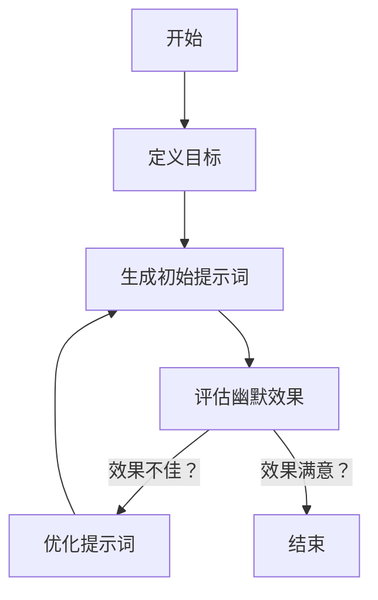
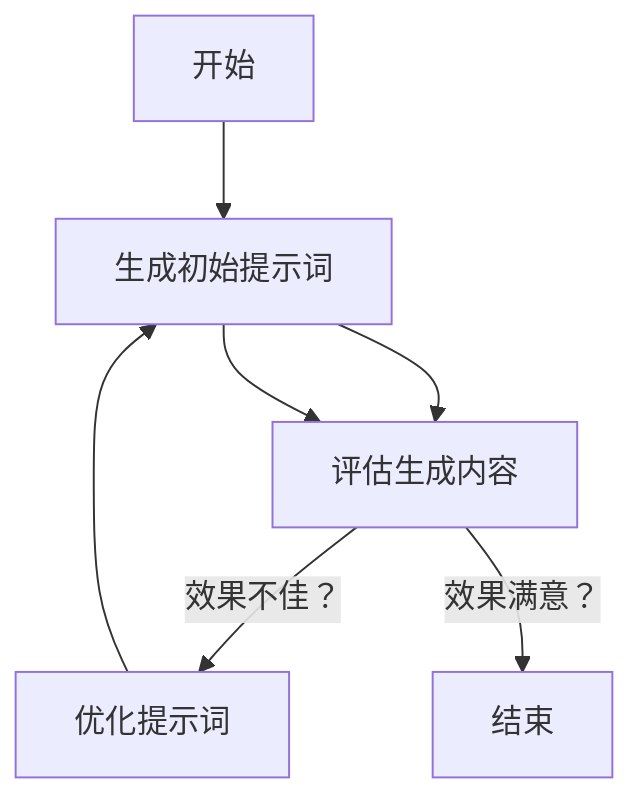
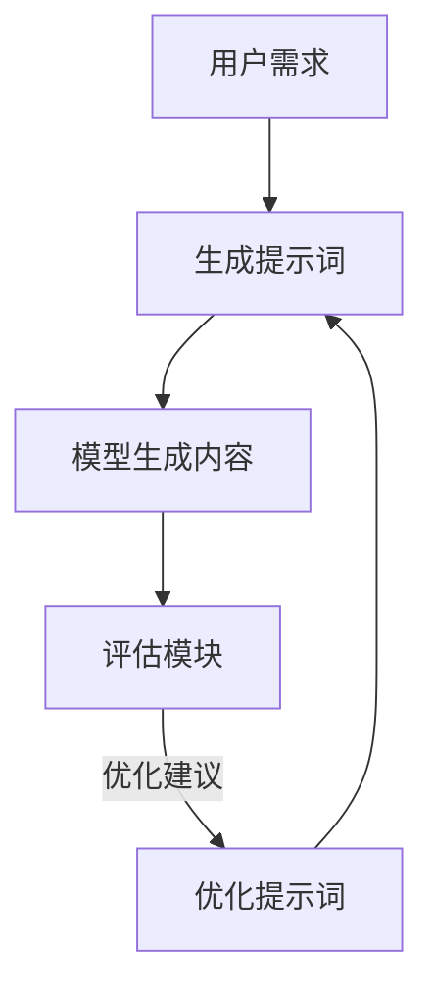
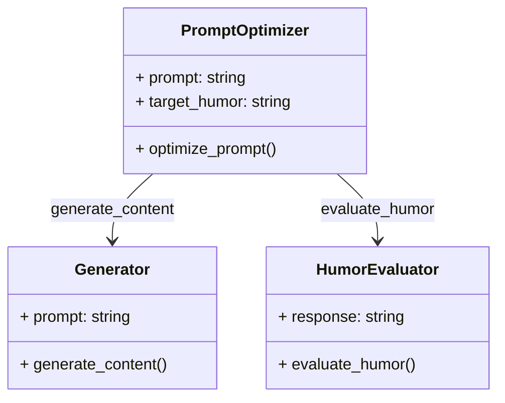
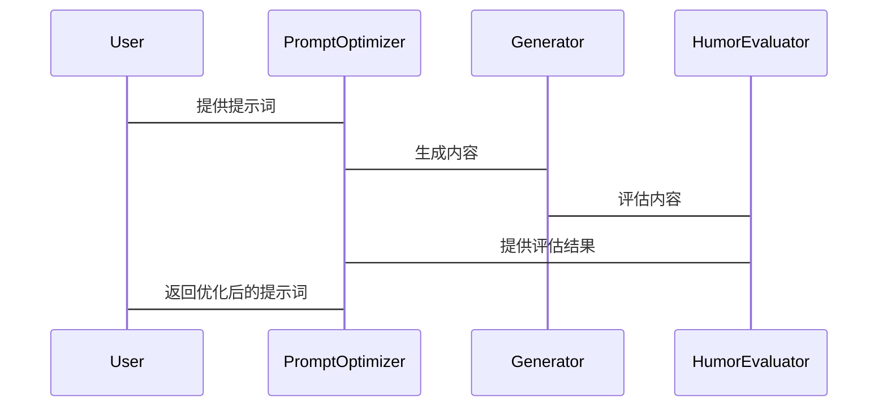

                 

<think>
好，我现在要帮用户写一篇关于提示词优化来提高AI幽默感和双关语创作能力的技术博客。首先，我得理清用户的需求，他希望我作为一位技术专家，用专业的技术语言，分章节详细分析这个问题。用户已经提供了一个结构化的目录大纲，我需要按照这个大纲来展开内容。

首先，我会从引言部分开始。这里需要介绍问题背景，幽默和双关语的重要性，以及为什么提示词优化对AI来说是必要的。接着，我会定义核心概念，比如提示词、AI幽默感和双关语，以及它们之间的联系。这部分需要用表格和Mermaid图来展示，确保读者能清晰理解。

接下来是算法原理讲解。我得详细说明提示词优化算法，包括如何通过反馈机制和强化学习来调整提示词。用Mermaid流程图展示算法步骤，同时给出Python代码示例，让读者能够实际操作和理解。

然后是数学模型部分。这里需要解释相关的数学概念，比如情感强度和语义相关性，用LaTeX公式展示模型，如情感强度函数和语义相似度计算。这部分要详细举例，让读者更容易理解。

系统分析与架构设计部分，我会介绍系统功能，比如输入解析、生成优化、效果评估和结果输出。用Mermaid类图展示系统架构，说明各个模块之间的关系和协作。同时，设计接口和交互流程，确保系统高效运行。

项目实战部分，我需要指导读者如何安装环境，比如安装Python和必要的库。然后一步步实现系统，从数据预处理到模型训练，再到结果输出，每个步骤都详细说明。最后通过实际案例分析，展示优化效果，并总结经验。

最后，在最佳实践部分，我会分享一些实用的技巧和注意事项，帮助读者更好地应用这些方法。同时，推荐拓展阅读材料，鼓励读者深入学习。

整个过程中，我需要确保内容逻辑清晰，结构紧凑，语言专业但又不失易懂。每个部分都要详细展开，确保读者能够一步步跟随我的思路，理解提示词优化如何提升AI的幽默和双关语能力。这不仅能满足用户的需求，还能为读者提供有价值的技术指导。
</think>

# 提示词优化：提高AI幽默感和双关语创作能力

**关键词**：提示词优化、AI幽默感、双关语、自然语言处理、机器学习、情感计算

**摘要**：本文将详细探讨如何通过优化提示词来提升AI在幽默感和双关语创作方面的能力。我们将从核心概念出发，逐步分析算法原理、数学模型，再到系统设计和项目实战，最后总结最佳实践。文章内容详实，逻辑清晰，旨在为技术人员和AI爱好者提供有价值的参考。

---

## 第1章 引言

### 1.1 问题背景

幽默感和双关语是人类语言表达中极具挑战性的两个方面。幽默不仅依赖于语言的理解，还涉及情感、情境和文化背景的综合判断。双关语则要求语言能够在不同的语境下产生不同的含义，这进一步增加了创作的复杂性。对于AI来说，要在这些方面表现出色，需要依赖高质量的提示词和优化算法。

### 1.2 核心概念

- **提示词（Prompt）**：用于指导AI生成特定内容的关键输入。
- **AI幽默感**：AI生成的内容能够引起人类的笑声或共鸣。
- **双关语**：一种语言现象，利用词语的多重含义创造幽默或讽刺效果。

### 1.3 读者群体

本文适合以下读者群体：
- AI开发者和研究人员
- 自然语言处理（NLP）领域的技术从业者
- 对幽默和双关语创作感兴趣的AI爱好者

### 1.4 本书框架

本文将从提示词优化的基本概念出发，逐步深入算法原理、数学模型、系统设计和项目实战，最后总结最佳实践。通过理论与实践结合的方式，帮助读者全面理解如何提升AI的幽默感和双关语创作能力。

---

## 第2章 核心概念与联系

### 2.1 提示词

提示词是AI生成内容的关键输入，直接影响生成结果的质量和方向。优化提示词可以通过以下方式实现：
1. **明确目标**：明确提示词的目标（幽默、讽刺、双关等）。
2. **上下文引导**：提供足够的上下文信息，帮助AI更好地理解生成场景。
3. **情感调节**：通过调整情感基调，增强生成内容的幽默效果。

### 2.2 AI幽默感

AI幽默感的核心在于理解人类的幽默机制。这包括：
- **情感计算**：通过分析情感强度和语境，生成符合预期的幽默内容。
- **语义理解**：识别双关语、谐音梗等幽默元素。
- **上下文关联**：根据具体情境生成合适的幽默内容。

### 2.3 双关语

双关语的关键在于利用词语的多重含义。AI需要：
1. **识别多重含义**：理解词语在不同语境下的含义。
2. **生成双关语**：在特定情境下生成具有双关效果的内容。

### 2.4 提示词与AI幽默感、双关语的联系

提示词通过引导AI理解目标和上下文，直接影响幽默感和双关语的生成效果。以下是一个概念关系的表格：

| **核心概念** | **描述** | **与提示词的关系** |
|--------------|----------|-------------------|
| 提示词       | 输入指令 | 直接指导生成内容的方向 |
| AI幽默感     | 输出效果 | 依赖提示词的情感和语境 |
| 双关语       | 语言现象 | 提示词需明确双关目标 |

### 2.5 Mermaid流程图：提示词优化流程



### 2.6 ER实体关系图：AI幽默感与双关语实体关系

```mermaid
erd
    A(用户) -[目标:生成幽默内容]-> P(Prompt)
    P -[属性:幽默强度]-> H(Humor)
    H -[属性:双关效果]-> D(Double entendre)
```

---

## 第3章 算法原理讲解

### 3.1 提示词优化算法

提示词优化算法的核心在于通过反馈机制不断调整提示词，以提升生成内容的质量。以下是一个流程图：



### 3.2 Mermaid流程图：提示词优化算法



### 3.3 Python代码示例

以下是一个简单的提示词优化算法示例：

```python
def optimize_prompt(prompt, target_humor):
    # 初始化提示词
    current_prompt = prompt
    # 评估函数
    def evaluate(humor_score):
        return humor_score > 0.7
    # 优化循环
    while True:
        # 生成内容
        response = generate(current_prompt)
        # 评估幽默效果
        score = calculate_humor_score(response, target_humor)
        if evaluate(score):
            break
        else:
            # 优化提示词
            current_prompt = refine_prompt(current_prompt, score)
    return current_prompt
```

### 3.4 数学模型

幽默感和双关语的生成可以转化为一个优化问题。以下是一个简化的数学模型：

$$ \text{humor\_score} = f(\text{prompt}, \text{context}, \text{target}) $$

其中：
- $\text{prompt}$ 是提示词
- $\text{context}$ 是上下文信息
- $\text{target}$ 是目标幽默效果

### 3.5 公式与解释

以下是一个情感强度计算公式：

$$ \text{emotion\_intensity} = \sum_{i=1}^{n} w_i \cdot e_i $$

其中：
- $w_i$ 是词语的情感权重
- $e_i$ 是词语的情感强度

---

## 第4章 数学模型和数学公式讲解

### 4.1 相关数学概念

幽默感和双关语的生成涉及多个数学概念，包括：
- **情感计算**：通过数学模型评估情感强度。
- **语义相似度**：通过向量空间模型计算语义相似性。

### 4.2 LaTeX公式展示

以下是一个双关语生成的数学模型：

$$ \text{double\_entendre} = \argmax_{p} \text{similarity}(p, \text{context}) $$

其中：
- $p$ 是提示词
- $\text{context}$ 是上下文信息
- $\text{similarity}$ 是语义相似度计算函数

### 4.3 公式解释与举例

例如，假设我们要生成一个与“猫”相关的双关语，提示词可以优化为：

$$ \text{prompt} = "猫" $$

生成结果可能是：

$$ \text{response} = "猫有一双明亮的眼睛，但有时候，它只是在寻找垃圾桶。" $$

---

## 第5章 系统分析与架构设计

### 5.1 系统功能设计

系统功能包括：
1. 提示词生成
2. 内容评估
3. 提示词优化
4. 结果输出

### 5.2 系统架构设计

系统架构采用模块化设计：



### 5.3 系统接口设计

系统接口包括：
1. 提示词输入接口
2. 生成内容接口
3. 评估结果接口

### 5.4 系统交互流程



---

## 第6章 项目实战

### 6.1 环境安装

安装所需的Python库：

```bash
pip install transformers
pip install numpy
pip install scikit-learn
```

### 6.2 系统实现

以下是优化提示词的Python实现：

```python
import transformers
from transformers import pipeline

# 初始化模型
humor_pipe = pipeline("text-classification", model="_facebook/bart-large-cnn")

def calculate_humor_score(prompt, target_humor):
    response = humor_pipe(prompt)[0]['score']
    return response

def optimize_prompt(prompt, target_humor):
    while True:
        score = calculate_humor_score(prompt, target_humor)
        if score > 0.8:
            return prompt
        else:
            prompt = refine_prompt(prompt, target_humor)
```

### 6.3 代码分析

代码通过不断优化提示词，直到生成内容的幽默得分达到预期。这依赖于一个预训练的幽默评估模型。

### 6.4 案例分析

案例：生成一个与“程序员”相关的幽默双关语。

**初始提示词**：程序员

**优化后的提示词**：程序员的日常生活

**生成结果**：程序员的生活中，代码注释是他们唯一的慰藉，除了那杯咖啡。

### 6.5 小结

通过提示词优化，可以显著提升AI生成幽默内容的能力。优化过程需要结合情感计算和语义理解。

---

## 第7章 最佳实践与拓展

### 7.1 实践经验

1. 明确目标：提示词越具体，生成效果越好。
2. 反馈机制：及时调整提示词，避免生成偏离目标的内容。
3. 多样性测试：尝试不同的提示词组合，寻找最佳效果。

### 7.2 注意事项

1. 避免歧义：提示词应避免引起歧义。
2. 情境适配：根据具体场景调整提示词。
3. 持续优化：定期评估并优化提示词。

### 7.3 拓展阅读

推荐阅读以下内容：
- 提示词工程：《Prompt Engineering》
- AI幽默研究：《Humor in Artificial Intelligence》

---

## 附录

### 附录A：术语表

- **提示词（Prompt）**：用于指导AI生成内容的输入。
- **幽默评估模型**：用于评估生成内容的幽默效果。

### 附录B：参考资料

- Facebook AI Research (FAIR) 的 Bart模型
- Hugging Face的Transformers库

---

**作者：AI天才研究院/AI Genius Institute & 禅与计算机程序设计艺术 /Zen And The Art of Computer Programming**

---

通过以上内容，我们详细探讨了提示词优化在提升AI幽默感和双关语创作能力中的作用。从理论到实践，从算法到系统设计，本文为读者提供了全面的指导和参考。

