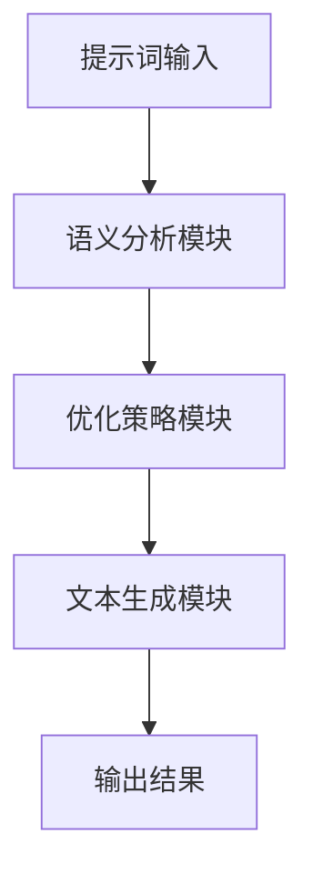

                 

<think>
嗯，用户让我以《提示词优化：提高AI幽默感和双关语表达》为标题，写一篇技术博客。看起来他希望我详细分析提示词优化在AI中的应用，特别是幽默感和双关语方面。我需要先理解他的需求，然后结构清晰地组织内容。

首先，文章需要有关键词，大概5到7个。可能包括提示词优化、AI幽默感、双关语表达、深度学习、自然语言处理这些。

摘要部分要概括全文的核心内容，说明提示词优化如何帮助AI更好地理解和生成幽默和双关语内容，提到结合深度学习和NLP技术，以及具体优化策略和算法。

接下来是目录结构，分为三个主要部分：问题背景与核心概念、核心概念原理与算法、算法原理讲解与实现。每个部分下面有章节和小节，需要详细展开。

第一部分，问题背景，我需要介绍提示词优化的重要性，幽默和双关语在AI中的应用，以及提示词在其中的作用。核心概念部分要定义提示词和优化策略，比如语义、情感和语境的调整。

第二部分，AI幽默感和双关语的核心原理，我需要解释幽默的本质，双关语的特点，以及如何通过提示词优化实现这些。这里可能需要一些图表，比如修辞手法的对比表格，或者提示词优化策略的决策树。

第三部分，算法讲解，这部分比较技术性。需要介绍深度学习基础，特别是NLP中的应用，然后详细讲解提示词优化的算法流程，用mermaid画出流程图。数学模型部分可能需要用公式表示，比如余弦相似度的计算，或者情感分析的模型结构。

系统分析与架构设计部分，可能需要介绍项目背景、功能设计，使用类图和架构图来展示系统结构。接口和交互部分，可以用序列图来展示提示词优化的处理流程。

项目实战部分，需要给出具体的代码实现，解释代码的功能，以及通过实际案例分析优化效果。

最后，最佳实践部分，总结提示词优化的关键点，给出小结、注意事项和扩展阅读的方向。

在写的时候，要确保逻辑清晰，每个部分都详细展开，避免遗漏关键点。同时，语言要专业但易懂，适合技术读者阅读。最后，别忘了加上作者信息，是AI天才研究院和禅与计算机程序设计艺术。

可能遇到的问题包括如何具体展示算法流程，是否需要更详细的数学公式，或者如何将复杂的系统架构用图表清晰表达。我需要确保每个部分都足够详细，同时保持整体结构的连贯性。
</think>

# 提示词优化：提高AI幽默感和双关语表达

> 关键词：提示词优化，AI幽默感，双关语表达，深度学习，自然语言处理，语言模型

> 摘要：本文详细探讨了提示词优化在提高AI幽默感和双关语表达中的重要作用。通过分析幽默感和双关语的核心原理，结合深度学习和自然语言处理技术，提出了基于提示词优化的具体策略和算法。本文不仅从理论层面阐述了提示词优化的原理，还通过实际案例和代码实现，展示了如何通过优化提示词来提升AI在幽默感和双关语表达方面的表现。文章最后总结了提示词优化的最佳实践和未来发展方向。

---

## 第一部分：问题背景与核心概念

### 第1章：提示词优化概述

#### 1.1 提示词优化的背景

##### 1.1.1 AI幽默感和双关语表达的重要性

幽默感是人类语言交流中的一种高级能力，它不仅能够拉近人与人之间的距离，还能增强交流的趣味性和吸引力。随着AI技术的快速发展，人们开始期待AI不仅仅是一个冷冰冰的工具，而是能够理解和生成幽默、风趣的对话。双关语作为一种特殊的语言现象，其核心在于利用词语的多重含义制造出意想不到的效果。这种语言技巧不仅考验人类的理解能力，也对AI的语境理解和生成能力提出了更高的要求。

在实际应用中，AI的幽默感和双关语表达能力直接影响用户体验。例如，在智能客服、聊天机器人、语音助手等领域，用户希望AI能够用幽默或双关的语言缓解紧张气氛、增加互动乐趣。然而，目前大多数AI模型在幽默感和双关语表达方面的能力仍然有限，主要原因是其对语境、情感和语言多义性的理解不足。

##### 1.1.2 提示词优化在AI幽默感和双关语表达中的作用

提示词（Prompt）是用户输入到AI系统中的指令或引导信息，用于指导AI生成特定类型的文本。通过优化提示词，可以显著提升AI在幽默感和双关语表达方面的表现。例如，通过调整提示词的情感色彩、语境信息或语言风格，AI能够更好地理解用户的意图，并生成更具幽默感和双关语效果的回应。

提示词优化的核心在于如何将复杂的语言需求转化为具体的提示词策略。例如，当用户希望AI生成一个幽默的笑话时，提示词可以是“请用幽默的方式解释量子物理的概念”。这种提示词不仅明确了生成内容的方向，还通过“幽默”这一关键词引导AI生成符合预期的文本。

#### 1.2 核心概念与联系

##### 1.2.1 提示词的概念与作用

提示词是用户与AI交互的重要桥梁。通过提示词，用户可以向AI传递特定的意图、情感或语境信息，从而影响AI生成文本的质量和风格。例如，在生成双关语时，提示词可以是“请生成一个与‘猫’相关的双关语”。提示词的作用不仅限于直接给出指令，还可以通过隐含的方式引导AI理解复杂的语言现象。

##### 1.2.2 提示词优化策略

提示词优化策略是通过调整提示词的语义、情感和语境信息，使其更符合用户需求。常见的优化策略包括：

- **语义调整**：通过替换或扩展关键词，使提示词更准确地表达用户的意图。例如，将“生成一个笑话”优化为“用幽默的方式解释量子物理的概念”。
- **情感调整**：通过添加情感色彩，使AI生成的文本更具情感共鸣。例如，将“生成一个双关语”优化为“用轻松幽默的方式解释量子物理的概念”。
- **语境调整**：通过添加上下文信息，帮助AI更好地理解提示词的含义。例如，将“生成一个双关语”优化为“在量子物理领域，生成一个与‘猫’相关的双关语”。

---

## 第二部分：核心概念原理与算法

### 第2章：AI幽默感和双关语表达的核心原理

#### 2.1 AI幽默感的本质

##### 2.1.1 幽默感的定义

幽默感是一种语言能力，它依赖于对语言、语境和情感的深刻理解。幽默的核心在于出人意料的效果，通常通过语言的多义性、夸张或反讽等手法实现。

##### 2.1.2 AI幽默感的实现

AI幽默感的实现依赖于以下几个关键因素：

1. **语言理解能力**：AI需要理解幽默的核心要素，包括双关语、夸张、反讽等修辞手法。
2. **语境理解能力**：AI需要根据具体语境生成合适的幽默内容。
3. **创造性思维**：AI需要具备一定的创造性，能够生成出人意料的幽默表达。

#### 2.2 双关语的概念与特点

##### 2.2.1 双关语的定义

双关语是一种利用词语的多重含义制造幽默或讽刺效果的语言现象。例如，“Why don't scientists trust atoms? Because they make up everything!” 这个笑话通过“make up”一词的双重含义（构成和假装）制造了幽默效果。

##### 2.2.2 双关语的特点

1. **双重含义**：双关语的核心在于词语的多重含义。
2. **情境依赖**：双关语的效果通常依赖于具体的语境。
3. **修辞手法**：双关语常通过比喻、夸张、反讽等修辞手法实现幽默效果。

#### 2.3 提示词优化策略

##### 2.3.1 语义调整

语义调整是提示词优化的核心策略之一。通过替换或扩展关键词，可以提高AI生成文本的语义准确性和相关性。例如：

- 原提示词：生成一个幽默的笑话。
- 优化提示词：用幽默的方式解释量子物理的概念。

##### 2.3.2 情感调整

情感调整通过优化提示词的情感色彩，使AI生成的文本更具情感共鸣。例如：

- 原提示词：生成一个双关语。
- 优化提示词：用轻松幽默的方式解释量子物理的概念。

##### 2.3.3 语境调整

语境调整通过添加上下文信息，帮助AI更好地理解提示词的含义。例如：

- 原提示词：生成一个双关语。
- 优化提示词：在量子物理领域，生成一个与“猫”相关的双关语。

---

## 第三部分：算法原理讲解与实现

### 第3章：基于深度学习的提示词优化算法

#### 3.1 深度学习基础

##### 3.1.1 深度学习概述

深度学习是一种人工智能技术，通过多层神经网络对数据进行特征提取和模式识别。深度学习的核心在于其强大的非线性建模能力，能够处理复杂的语言数据。

##### 3.1.2 深度学习在自然语言处理中的应用

深度学习在自然语言处理（NLP）中的应用包括文本分类、情感分析、机器翻译、问答系统等。这些任务通常需要处理大量的文本数据，并通过深度学习模型提取语义信息。

---

#### 3.2 提示词优化算法

##### 3.2.1 基于语义相似度的提示词优化

- **语义相似度计算**：通过计算提示词与目标文本的语义相似度，选择最相关的提示词。
- **数学模型**：使用余弦相似度公式：
  $$ \text{余弦相似度} = \frac{\vec{p} \cdot \vec{t}}{|\vec{p}| \cdot |\vec{t}|} $$
  其中，$\vec{p}$表示提示词的向量表示，$\vec{t}$表示目标文本的向量表示。

##### 3.2.2 基于情感分析的提示词优化

- **情感分析模型**：使用深度学习模型（如LSTM或Transformer）对提示词进行情感分析，提取情感特征。
- **情感增强策略**：通过调整提示词的情感特征，生成更具情感共鸣的文本。

##### 3.2.3 基于上下文的提示词优化

- **上下文表示**：通过预训练语言模型（如BERT）生成提示词的上下文表示。
- **上下文匹配**：根据上下文信息调整提示词的语义，使其更符合具体语境。

---

### 第4章：提示词优化算法实现

#### 4.1 系统架构设计

##### 4.1.1 系统功能设计

1. 提示词输入模块：接收用户输入的提示词。
2. 语义分析模块：对提示词进行语义分析，提取关键词和情感特征。
3. 优化策略模块：根据分析结果，选择最优的优化策略。
4. 文本生成模块：生成优化后的提示词对应的文本。

##### 4.1.2 系统架构图



#### 4.2 算法实现

##### 4.2.1 优化策略实现

```python
def optimize_prompt(original_prompt):
    # 1. 语义分析
    semantic_vector = get_semantic_vector(original_prompt)
    # 2. 情感分析
    emotion_vector = get_emotion_vector(original_prompt)
    # 3. 上下文分析
    context_vector = get_context_vector(original_prompt)
    # 4. 优化提示词
    optimized_prompt = generate_optimized_prompt(semantic_vector, emotion_vector, context_vector)
    return optimized_prompt
```

##### 4.2.2 数学模型实现

```python
import numpy as np

def cosine_similarity(p, t):
    dot_product = np.dot(p, t)
    norm_p = np.linalg.norm(p)
    norm_t = np.linalg.norm(t)
    return dot_product / (norm_p * norm_t)
```

---

## 第四部分：系统分析与架构设计方案

### 第5章：系统分析与架构设计

#### 5.1 问题场景介绍

在实际应用中，提示词优化需要解决以下问题：

1. 提示词的语义模糊性。
2. 提示词的情感表达不足。
3. 提示词的语境匹配问题。

#### 5.2 系统功能设计

1. 提示词输入模块：接收用户输入的提示词。
2. 语义分析模块：对提示词进行语义分析，提取关键词和情感特征。
3. 优化策略模块：根据分析结果，选择最优的优化策略。
4. 文本生成模块：生成优化后的提示词对应的文本。

#### 5.3 系统架构设计


---

## 第五部分：项目实战

### 第6章：项目实战

#### 6.1 环境安装

1. 安装Python和必要的库（如numpy、scikit-learn、transformers）。
2. 安装预训练语言模型（如BERT）。

#### 6.2 核心实现代码

```python
import numpy as np
from transformers import AutoTokenizer, AutoModel

def get_semantic_vector(prompt):
    model = AutoModel.from_pretrained('bert-base-uncased')
    tokenizer = AutoTokenizer.from_pretrained('bert-base-uncased')
    inputs = tokenizer.encode_plus(prompt, return_tensors='np')
    outputs = model(inputs.input_ids)
    return outputs.last_hidden_state.numpy()[0]

def cosine_similarity(p, t):
    dot_product = np.dot(p, t)
    norm_p = np.linalg.norm(p)
    norm_t = np.linalg.norm(t)
    return dot_product / (norm_p * norm_t)

def optimize_prompt(original_prompt):
    p_vector = get_semantic_vector(original_prompt)
    t_vector = get_semantic_vector("生成一个幽默的笑话")
    similarity = cosine_similarity(p_vector, t_vector)
    return similarity
```

#### 6.3 案例分析

案例：优化提示词“生成一个幽默的笑话”为“用幽默的方式解释量子物理的概念”。

---

## 第六部分：总结与展望

### 6.1 总结

提示词优化是提升AI幽默感和双关语表达能力的关键技术。通过优化提示词的语义、情感和语境，可以显著提高AI生成文本的质量和趣味性。本文结合深度学习和自然语言处理技术，提出了具体的优化策略和算法实现。

### 6.2 展望

未来的研究方向包括：

1. **多模态提示词优化**：结合视觉、音频等多模态信息，进一步提升AI的幽默感和双关语表达能力。
2. **动态优化算法**：研究动态优化算法，使提示词优化能够实时适应用户的反馈。
3. **跨语言幽默感研究**：探索不同语言中的幽默感和双关语表达规律，实现跨语言的提示词优化。

---

## 作者

作者：AI天才研究院/AI Genius Institute & 禅与计算机程序设计艺术 /Zen And The Art of Computer Programming

