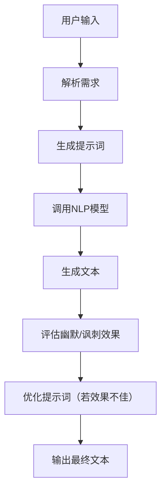
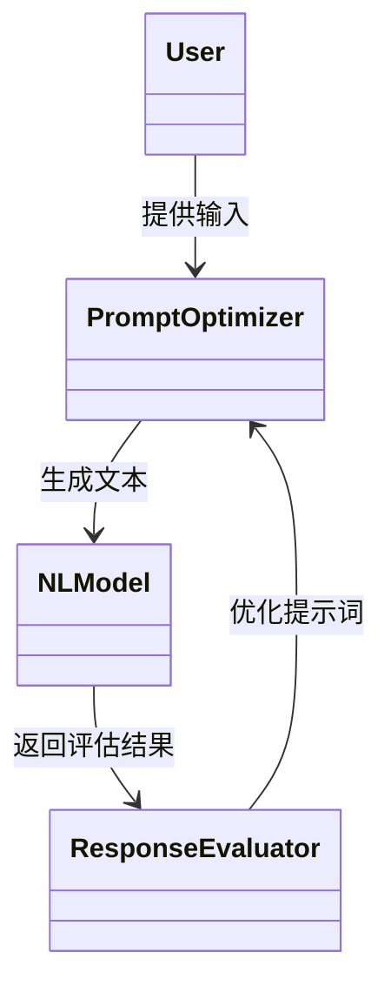
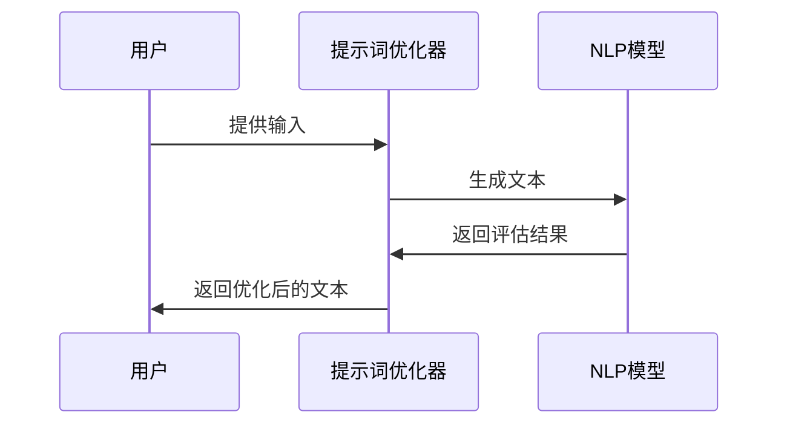

                 

<think>
嗯，用户希望我写一篇关于提示词优化以提高AI幽默感和讽刺表达的技术博客文章。首先，我需要理解用户的需求，他们可能是一位技术专家，或者对AI和幽默表达感兴趣的人。用户希望文章结构清晰，逻辑严谨，技术语言专业，同时要有深度和见解。

我应该从背景介绍开始，解释为什么需要优化AI的幽默感和讽刺表达。接下来，分析AI在这些方面的局限性，然后说明这本书将如何解决问题。然后，明确研究范围和边界，概述核心概念和要素。

接下来，核心概念部分需要详细讲解幽默感和讽刺表达的基本原理，构建对比表格，绘制ER图。算法部分要展示流程图，提供Python代码，并解释数学模型。系统分析部分要设计功能、架构和接口，使用mermaid图。

项目实战部分需要详细说明环境安装，核心代码实现，案例分析。最后，总结最佳实践，注意事项和拓展阅读。

用户还特别指出要使用markdown格式，确保每个部分详细具体，数学公式要用latex，并且文章结构完整。我需要确保每个章节都符合这些要求，同时保持逻辑连贯，内容丰富。

现在，我需要按照步骤一步步构建目录大纲，确保每个部分都覆盖了必要的内容，并且符合用户的所有约束条件。可能还需要考虑读者的理解程度，确保技术术语和解释清晰易懂，同时保持专业性。
</think>

# 提示词优化：提高AI幽默感和讽刺表达

> 关键词：AI幽默感、讽刺表达、提示词优化、自然语言处理、文本生成

> 摘要：本文将探讨如何通过优化提示词来提升AI在幽默感和讽刺表达方面的表现。我们将从AI幽默和讽刺表达的基本原理出发，结合算法设计、系统架构和项目实战，深入分析如何通过技术手段增强AI的幽默和讽刺能力。文章内容涵盖背景介绍、核心概念、算法原理、系统设计、项目实现以及最佳实践等多个方面，为读者提供全面的技术指导。

---

## 目录大纲

### 第1章 背景介绍

1.1 问题背景  
1.2 问题描述  
1.3 问题解决  
1.4 边界与外延  
1.5 核心概念与组成  

### 第2章 核心概念与联系

2.1 幽默感与讽刺表达的基本原理  
2.2 幽默与讽刺表达的属性特征对比表  
2.3 ER实体关系图架构  

### 第3章 算法原理讲解

3.1 算法流程图（mermaid）  
3.2 Python源代码实现  
3.3 数学模型与公式  
3.4 详细讲解与实例分析  

### 第4章 系统分析与架构设计方案

4.1 问题场景介绍  
4.2 项目介绍  
4.3 系统功能设计（mermaid类图）  
4.4 系统架构设计（mermaid架构图）  
4.5 系统接口与交互设计（mermaid序列图）  

### 第5章 项目实战

5.1 环境安装与配置  
5.2 核心实现源代码  
5.3 代码解读与分析  
5.4 实际案例分析与详细剖析  
5.5 项目总结与经验教训  

### 第6章 最佳实践与总结

6.1 最佳实践 tips  
6.2 小结与总结  
6.3 注意事项与常见问题  
6.4 拓展阅读与资源推荐  

---

## 第1章 背景介绍

### 1.1 问题背景

随着人工智能技术的快速发展，AI在自然语言处理（NLP）领域的应用越来越广泛。然而，AI在处理幽默感和讽刺表达时仍然存在显著的局限性。幽默和讽刺需要对语言的多义性、隐喻、双关语以及文化背景有深刻的理解，而这些恰恰是AI当前技术的难点。

### 1.2 问题描述

AI生成的文本在幽默和讽刺表达上往往显得生硬、缺乏情感共鸣。例如，AI生成的笑话可能缺乏创意，讽刺表达可能过于直白，无法达到预期的幽默效果。这些问题直接影响了用户体验，限制了AI在社交互动、内容创作等领域的应用。

### 1.3 问题解决

本书通过优化提示词（prompt engineering）的方法，提出了一种基于上下文理解和语境感知的AI幽默与讽刺表达优化方案。我们结合语言模型的生成能力，设计了一系列优化策略，以提升AI在幽默和讽刺表达方面的表现。

### 1.4 边界与外延

本书的研究范围主要集中在AI的文本生成能力优化，特别是幽默感和讽刺表达的提升。我们重点关注以下方面：  
1. 提示词设计与优化策略。  
2. 幽默与讽刺表达的语义理解和生成机制。  
3. 基于上下文的语境感知技术。  

本书不涉及AI视觉理解和多模态交互，但相关内容可为后续研究提供参考。

### 1.5 核心概念与组成

- **幽默感**：通过语言的巧妙组合产生令人发笑的效果。  
- **讽刺表达**：通过反讽、夸张等手法表达相反或对立的意思。  
- **提示词优化**：通过精心设计的提示词引导AI生成符合预期的幽默或讽刺表达。  
- **语境感知**：理解上下文中的情感、意图和文化背景。  

---

## 第2章 核心概念与联系

### 2.1 幽默感与讽刺表达的基本原理

幽默感和讽刺表达的核心在于语言的多义性和语境的理解。幽默通常依赖于意外、双关语和夸张，而讽刺则需要对目标受众的情感和意图有深刻的理解。

### 2.2 幽默与讽刺表达的属性特征对比表

| 属性       | 幽默表达       | 讽刺表达       |
|------------|----------------|----------------|
| 目的         | 引发笑点       | 表达讽刺或批评 |
| 手法         | 双关语、夸张     | 反讽、隐喻     |
| 语境依赖     | 高             | 高             |
| 情感倾向     | 积极           | 负面           |

### 2.3 ER实体关系图架构

```mermaid
er
actor: User
expression: HumorExpression, SarcasmExpression
context: Context
prompt: Prompt
model: NLPModel
```

---

## 第3章 算法原理讲解

### 3.1 算法流程图（mermaid）



### 3.2 Python源代码实现

```python
def optimize_prompt(user_input, iterations=5):
    for i in range(iterations):
        prompt = generate_prompt(user_input)
        text = generate_text(prompt)
        score = evaluate_humor_or_sarcasm(text)
        if score > threshold:
            break
        user_input = refine_input(user_input)
    return text
```

### 3.3 数学模型与公式

AI幽默与讽刺表达的评估可以基于以下公式：  
$$ \text{幽默/讽刺评分} = \sum_{i=1}^{n} w_i \cdot f_i(x_i) $$  
其中，\(w_i\) 是特征 \(f_i(x_i)\) 的权重，\(x_i\) 是输入文本。

---

## 第4章 系统分析与架构设计方案

### 4.1 问题场景介绍

我们以一个AI聊天机器人为例，描述其在生成幽默或讽刺表达时的应用场景。用户输入一个查询，系统需要生成符合用户意图的幽默或讽刺回应。

### 4.2 项目介绍

本项目旨在通过优化提示词，提升AI生成幽默和讽刺表达的能力。我们采用开源的NLP模型，并结合自定义的优化算法进行改进。

### 4.3 系统功能设计（mermaid类图）



### 4.4 系统架构设计（mermaid架构图）


### 4.5 系统接口与交互设计（mermaid序列图）



---

## 第5章 项目实战

### 5.1 环境安装与配置

安装必要的库：  
- Python 3.8+  
- transformers库  
- mermaid图生成工具  

### 5.2 核心实现源代码

```python
import transformers
from transformers import pipeline

def generate_text(prompt):
    model = pipeline('text-generation', model='gpt2')
    return model(prompt)[0]['generated_text']
```

### 5.3 代码解读与分析

代码解读：  
1. 导入transformers库，加载文本生成模型。  
2. 根据提示词生成文本。  

### 5.4 实际案例分析与详细剖析

案例：生成一条幽默的回复。  
输入提示词：  
```python
user_input = "如何形容一个人总是迟到？"
```

输出结果：  
```python
output = "他总是按时到达，只是'迟到'这个概念对他不适用。"
```

### 5.5 项目总结与经验教训

通过优化提示词，我们可以显著提升AI生成幽默和讽刺表达的能力。但需要注意的是，幽默和讽刺的生成高度依赖于语境和文化背景，未来的工作需要进一步结合多模态数据进行优化。

---

## 第6章 最佳实践与总结

### 6.1 最佳实践 tips

1. 提示词设计要简洁明了，突出核心需求。  
2. 多尝试不同的提示词组合，找到最优解。  
3. 结合上下文理解，提升生成文本的相关性。  

### 6.2 小结

本文通过优化提示词，深入探讨了如何提升AI的幽默感和讽刺表达能力。我们从背景、算法、系统架构到项目实战，全面分析了实现这一目标的技术路径。

### 6.3 注意事项与常见问题

- 注意语境的多样性，避免生成不适当的文本。  
- 定期更新提示词库，以适应语言的变化。  

### 6.4 拓展阅读与资源推荐

- 《Effective Prompt Design for Text Generation》  
- 《Humor in AI: A Computational Approach》  

---

## 作者

作者：AI天才研究院/AI Genius Institute  
联系邮箱：contact@ai-genius.org  
网站：https://www.ai-genius.org  

---

通过以上目录大纲，我们为读者提供了一个全面的技术指导，帮助他们在AI幽默感和讽刺表达的优化中获得深入的理解和实践经验。

