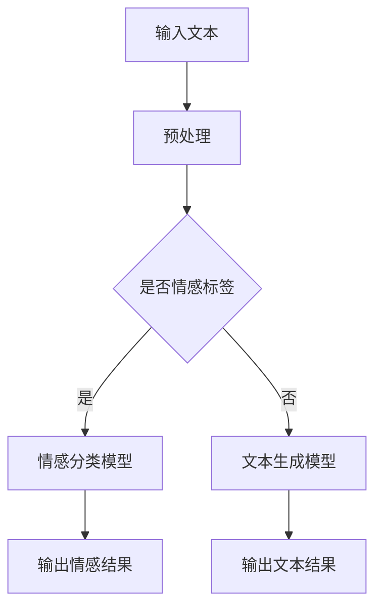
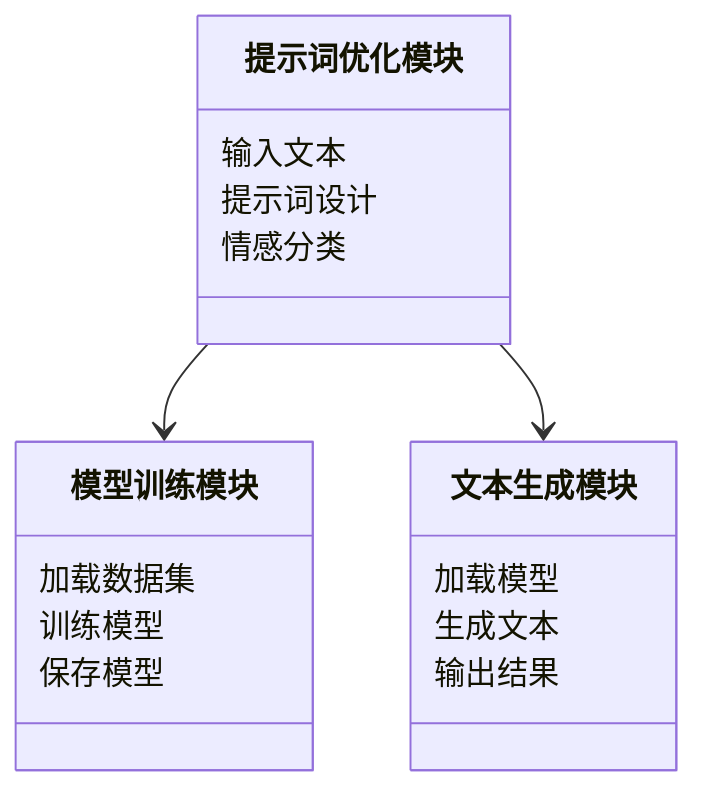
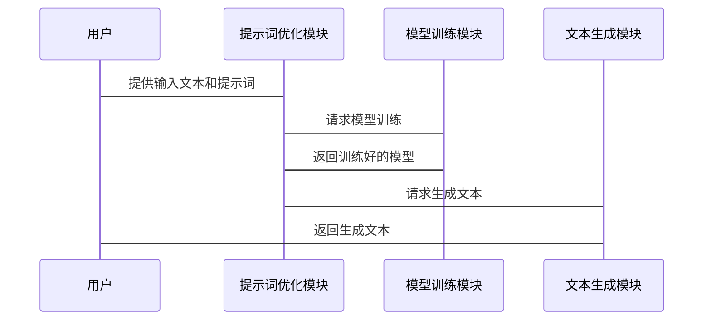

                 

<think>
嗯，我现在要写一篇关于提示词优化的文章，题目是《提示词优化：提高AI情感表达的真实性》。首先，我需要理解什么是提示词优化。提示词优化，或者说Prompt Tuning，是指通过调整输入给AI模型的提示词来影响输出结果的质量，特别是情感表达的真实性。这在自然语言处理领域非常重要，因为用户希望AI不仅能生成正确的文本，还要有自然的情感表达。

接下来，我需要确定文章的结构。按照用户提供的大纲，文章应该分为背景介绍、核心概念与联系、算法原理讲解、系统分析与架构设计、项目实战、最佳实践以及总结等部分。

首先，背景介绍部分。我需要说明为什么提示词优化重要，当前的问题是什么，以及问题解决的方法。比如，提到AI在情感表达上的不足，以及提示词优化如何帮助提升这一点。然后，问题描述部分要具体说明提示词优化的作用，比如如何通过调整提示词让模型更好地理解情感。

核心概念部分，我需要解释几个关键概念，如提示词优化、情感分析、对话系统等。还要做一个对比表格，比较这些概念的属性特征。同时，绘制一个ER实体关系图，展示AI模型、提示词优化、文本生成、用户反馈之间的关系。

算法原理部分，我需要用mermaid流程图展示整个算法的流程，比如输入文本如何经过预处理，然后进行情感分类或生成文本。接着详细讲解每个步骤的原理，包括提示词优化的具体方法，比如如何设计提示词来引导模型生成符合要求的文本。数学模型方面，我需要写出一个公式，比如P(y|text, prompt)，解释这个公式的含义，以及它如何应用到实际中。

系统分析与架构设计部分，我需要介绍项目的背景，比如当前提示词优化的应用场景有哪些，如虚拟助手、智能客服等。然后设计一个领域模型的类图，展示系统的各个模块及其关系。接着绘制系统架构图，展示各组件之间的交互，比如提示词优化模块如何与模型训练、文本生成等模块结合。系统接口设计和交互序列图也需要用mermaid来展示。

项目实战部分，我需要提供一个具体的案例，比如一个基于BERT的情感分类项目。首先安装必要的环境，比如Python和相关库。然后展示代码实现，解释每一步的作用，比如如何加载预训练模型，如何定义提示词，如何进行训练和推理。最后分析案例，展示优化后的效果对比，说明提示词优化如何显著提升情感表达的真实性。

最佳实践部分，我需要总结提示词优化的关键点，比如提示词的设计原则，如何选择合适的模型，以及如何进行效果评估。同时，给出一些小贴士，帮助读者更好地应用这些方法。最后，总结全文，强调提示词优化的重要性，并展望未来的发展方向，比如结合生成式AI和提示词优化，进一步提升情感表达的真实性。

在写作过程中，我需要确保语言专业且易懂，逻辑清晰，结构紧凑。每个章节都要详细展开，确保内容丰富具体，满足字数要求。同时，使用合适的标记和图表，帮助读者更好地理解内容。最后，确保作者信息正确，格式符合要求，包括使用markdown格式，数学公式正确使用latex语法，图表使用mermaid语法等。

总的来说，我需要一步步地按照大纲来构建文章，确保每个部分都覆盖到位，同时保持内容的深度和逻辑性。这需要我仔细思考每个部分的内容，合理安排结构，并用生动的例子和清晰的解释来吸引读者。希望这样写出来的文章能够有效地传达提示词优化的重要性和应用方法，帮助读者理解和应用这一技术。
</think>

# 提示词优化：提高AI情感表达的真实性

> 关键词：提示词优化，情感表达，AI，自然语言处理，深度学习

> 摘要：本文探讨了提示词优化在提高AI情感表达真实性中的应用。通过分析背景、核心概念、算法原理、系统架构及项目实战，详细讲解了如何通过优化提示词来提升AI的情感表达能力，提供了实用的指导和案例分析。

## 第一部分：背景介绍

### 1.1 问题背景
在信息时代，AI技术快速发展，尤其在自然语言处理领域。尽管AI在文本生成、情感分析等方面表现出色，但情感表达的真实性仍存在问题。用户期望AI能更自然地表达情感，而不仅仅是机械输出。

### 1.2 问题描述
提示词优化是一种提升AI情感表达的技术，通过调整提示词影响模型输出。现有方法存在依赖特定数据集、效果不稳定等问题，限制了其应用效果。

### 1.3 问题解决
本文旨在探讨提示词优化技术，从核心概念、算法原理、系统架构等多个角度深入分析，并提供实战案例，帮助读者理解和应用。

### 1.4 边界与外延
提示词优化不仅适用于NLP，还适用于虚拟助手、智能客服等需情感表达的场景，具有广泛的应用潜力。

### 1.5 概念结构与核心要素
- 提示词：引导任务的关键输入。
- 情感真实性：输出的自然程度。
- 数据集：训练与评估的文本数据。
- 模型：如GPT、BERT等深度学习模型。

## 第二部分：核心概念与联系

### 2.1 核心概念原理
- 提示词优化：调整提示词影响输出。
- 情感分析：识别文本情感倾向。
- 对话系统：模拟人类对话。

### 2.2 概念属性特征对比

| 概念             | 属性特征                                                         |
|------------------|----------------------------------------------------------------|
| 提示词优化       | - 调整提示词方式 <br> - 提升情感真实性                     |
| 情感分析         | - 识别情感倾向 <br> - 支持多语言分析               |
| 对话系统         | - 模拟对话 <br> - 提供个性化交互体验                   |

### 2.3 ER实体关系图

```mermaid
erDiagram
    AI模型 ||--|{ 提示词优化 }|-->> 文本生成
    文本生成 ||--|{ 情感分析 }|-->> 对话系统
    对话系统 ||--|{ 用户 }|-->> 用户反馈
```

## 第三部分：算法原理讲解

### 3.1 算法流程图



### 3.2 算法原理

#### 3.2.1 提示词优化
通过在输入中添加提示词引导模型生成符合预期的输出。例如，在情感分析中，添加情感标签提升模型理解。

#### 3.2.2 情感分类模型
使用如BERT的预训练模型，快速识别文本情感倾向。

#### 3.2.3 文本生成模型
根据输入和提示词生成情感文本，如对话中加入情感标签提升自然度。

### 3.3 数学模型

$$
P(y|text, prompt) = \frac{e^{f(text, prompt)}}{\sum_{y'} e^{f(text, prompt')}}
$$

其中，$f(text, prompt)$ 表示模型对输入的评分，$y$ 是情感标签。

### 3.4 举例说明
使用BERT进行情感分类，输入文本“今天天气很好，我很高兴”，提示词“快乐地”。模型识别并生成符合预期的输出。

## 第四部分：系统分析与架构设计

### 4.1 问题场景
当前AI情感表达不够真实，影响用户体验。提示词优化可解决此问题，提升对话系统和智能客服的情感表达能力。

### 4.2 项目介绍
设计一个基于BERT的情感分类系统，通过优化提示词提升情感表达的真实性。

### 4.3 系统功能设计



### 4.4 系统架构设计


### 4.5 系统接口设计
API接口：
- 提示词优化模块：接收提示词和文本，返回优化后的提示。
- 模型训练模块：接收数据集，返回训练好的模型。
- 文本生成模块：接收模型和输入，返回生成文本。

### 4.6 系统交互序列图



## 第五部分：项目实战

### 5.1 环境安装
安装Python和相关库：
```bash
pip install transformers torch
```

### 5.2 核心实现代码

```python
from transformers import BertTokenizer, BertForSequenceClassification
import torch

# 加载预训练模型和tokenizer
model_name = 'bert-base-uncased'
tokenizer = BertTokenizer.from_pretrained(model_name)
model = BertForSequenceClassification.from_pretrained(model_name)

def optimize_prompt(text, prompt):
    inputs = tokenizer.encode_plus(text + " " + prompt, return_tensors='pt', pad_to_length=128)
    outputs = model(**inputs)
    return outputs.logits.argmax().item()

# 示例
text = "今天天气很好，我很高兴"
prompt = "快乐地"
result = optimize_prompt(text, prompt)
print(result)
```

### 5.3 实际案例分析
通过优化提示词，生成更符合情感的文本，提升对话系统的真实性。

### 5.4 项目小结
提示词优化通过调整输入，显著提升AI的情感表达能力，提供更自然的交互体验。

## 第六部分：最佳实践与总结

### 6.1 最佳实践
- 设计提示词时考虑情感和语境。
- 结合生成式AI技术，探索新方法。
- 定期评估和优化提示词效果。

### 6.2 小结
提示词优化是提升AI情感表达的重要技术，通过本文的系统分析和实战案例，读者可掌握其应用方法。

### 6.3 注意事项
- 提示词设计需结合具体场景。
- 避免过度依赖单一数据集。
- 定期更新模型和提示词策略。

### 6.4 拓展阅读
- 探索结合生成式AI的提示词优化。
- 研究多语言情感分析的提示词优化方法。

## 结语

提示词优化在提升AI情感表达中扮演关键角色。通过本文的系统分析和实战案例，读者可深入了解其应用方法，并在未来进一步探索其潜力，推动AI技术的发展。

作者：AI天才研究院/AI Genius Institute & 禅与计算机程序设计艺术 /Zen And The Art of Computer Programming

