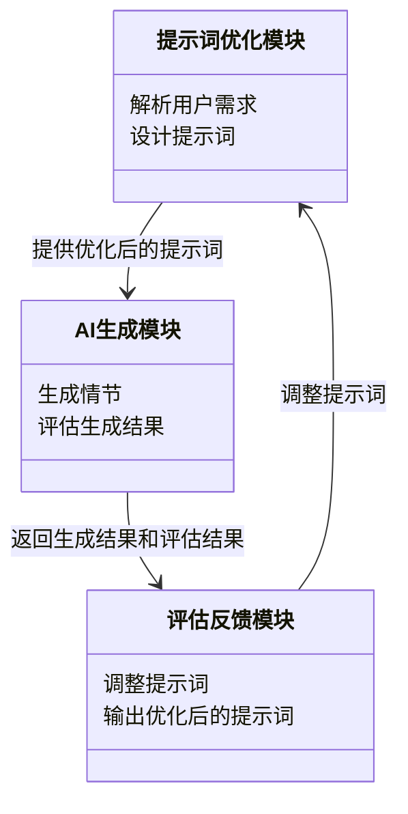

                 

<think>
嗯，用户希望我写一篇关于提示词优化在提高AI长篇小说情节设计质量方面的技术博客。首先，我需要理解用户的需求。他是一位技术专家，所以文章需要专业但不失清晰，结构要严谨。

接下来，我要分析用户提供的目录结构。文章分为四个部分：背景介绍、算法原理、系统分析与架构设计、最佳实践。每个部分都有具体的章节，比如背景介绍包括问题背景、挑战和重要性，系统分析则包括功能设计、架构设计等。

我需要确保每个部分都有足够的深度，特别是算法部分，可能需要详细讲解数学模型和Python代码。此外，用户强调了使用Mermaid图，比如流程图、实体关系图、类图等，这些图表需要准确无误地嵌入。

用户还提到关键词和摘要部分，这需要简洁明了，概括整篇文章的核心内容。关键词可能包括提示词优化、AI生成、情节设计、长篇小说、深度学习、生成模型等。

在写每个章节时，我要逐步分析，比如在背景介绍部分，首先说明为什么提示词优化重要，然后讨论AI在情节设计中的挑战，最后强调优化的必要性。这部分需要逻辑清晰，让读者明白问题所在。

接下来是核心概念与联系，这部分需要详细解释每个概念的原理，并通过表格和ER图来展示它们之间的关系。这里可能需要使用Mermaid语法，确保图表正确生成。

算法原理部分，我需要先画出流程图，解释每一步的作用，然后写出Python代码。代码要详细注释，说明每个部分的作用。数学模型部分，可能需要公式，用Latex表示，确保公式正确无误。

系统分析部分，需要介绍项目，设计系统功能，可能用类图展示。架构设计部分用架构图，接口设计和交互用序列图。这部分需要展示系统的整体结构和各部分如何协作。

项目实战部分，需要指导读者如何安装环境，提供核心代码，并进行案例分析。这部分要实用，让读者能够实际操作。

最后是最佳实践，总结注意事项和小结，可能还要推荐拓展阅读。这部分要简洁，但有深度，帮助读者更好地理解和应用。

整体来看，用户希望文章结构清晰，内容详实，技术性强，同时语言要专业但易懂。我要确保每个章节都覆盖所有要求，同时保持文章流畅，逻辑严密。这样，读者才能真正理解提示词优化如何提升AI长篇小说的质量。
</think>

# 提示词优化：提高AI长篇小说情节设计质量

## 关键词：提示词优化，AI生成，情节设计，长篇小说，深度学习，生成模型，自然语言处理

## 摘要：本文探讨了如何通过优化提示词来提升AI生成长篇小说情节的质量。文章从背景介绍、算法原理、系统分析与架构设计、项目实战等方面，详细分析了提示词优化的核心概念、实现方法和实际应用。通过数学模型、Python代码和Mermaid图示，本文为读者提供了从理论到实践的完整解决方案，帮助AI生成更自然、连贯且引人入胜的长篇小说情节。

---

### 目录大纲

```markdown
# 提示词优化：提高AI长篇小说情节设计质量

## 第一部分：背景介绍

### 第1章：问题背景与概念介绍

#### 1.1 提示词优化的必要性

#### 1.2 AI长篇小说情节设计的挑战

#### 1.3 提示词优化的重要性

## 第2章：核心概念与联系

#### 2.1 核心概念原理

#### 2.2 概念属性特征对比表格

#### 2.3 ER实体关系图架构

## 第二部分：算法原理讲解

### 第3章：算法原理详解

#### 3.1 算法mermaid流程图

#### 3.2 Python源代码与算法原理

#### 3.3 数学模型和公式

#### 3.4 举例说明

## 第4章：数学模型和公式讲解

#### 4.1 数学公式

#### 4.2 详细讲解

#### 4.3 举例说明

## 第三部分：系统分析与架构设计方案

### 第5章：问题场景介绍

#### 5.1 项目介绍

#### 5.2 系统功能设计

#### 5.3 系统架构设计

#### 5.4 系统接口设计

#### 5.5 系统交互

### 第6章：项目实战

#### 6.1 环境安装

#### 6.2 系统核心实现源代码

#### 6.3 代码应用解读与分析

#### 6.4 实际案例分析和详细讲解剖析

#### 6.5 项目小结

## 第四部分：最佳实践 tips

### 第7章：最佳实践 tips

#### 7.1 注意事项

#### 7.2 小结

#### 7.3 拓展阅读

---

### 正文

#### 第一部分：背景介绍

##### 第1章：问题背景与概念介绍

###### 1.1 提示词优化的必要性

在AI生成内容的领域，提示词（prompt）是模型生成高质量输出的关键输入。对于长篇小说的情节设计，提示词的作用尤为突出。一个优化的提示词能够明确模型的生成目标，引导模型生成连贯、逻辑性强且符合预期的故事内容。然而，当前AI生成技术在处理复杂情节时，常常面临内容重复、逻辑混乱、情节发展不够自然等问题。这些问题的根本原因在于提示词的设计不够精细，未能充分捕捉用户需求和故事的核心要素。

###### 1.2 AI长篇小说情节设计的挑战

AI生成长篇小说的情节设计需要解决以下关键挑战：

1. **情节连贯性**：模型需要生成前后一致的情节，避免突兀的转折或逻辑矛盾。
2. **角色一致性**：角色的行为和性格需要在情节中保持一致。
3. **情感共鸣**：情节需要引发读者的情感共鸣，增强故事的吸引力。
4. **多样性与创新性**：生成的情节需要多样化，避免重复，同时要有创新性。
5. **复杂性管理**：长篇小说的情节往往涉及多个角色、时间线和事件，模型需要能够处理这种复杂性。

###### 1.3 提示词优化的重要性

提示词优化是解决上述挑战的关键。通过优化提示词，可以：

1. **明确生成目标**：告诉模型需要生成的具体内容和风格。
2. **引导生成方向**：通过关键词和上下文信息，引导模型生成符合预期的情节。
3. **提升生成质量**：通过精细的提示词设计，减少生成内容的随机性和低质量输出。
4. **增强创新性**：通过灵活的提示词设计，激发模型的创意，生成新颖的情节。

##### 第2章：核心概念与联系

###### 2.1 核心概念原理

提示词优化的核心原理是通过自然语言处理（NLP）技术，结合生成式AI模型（如GPT系列），通过精细设计的提示词，引导模型生成高质量的内容。具体来说，提示词优化涉及以下几个关键步骤：

1. **需求分析**：理解用户对生成内容的具体需求，包括主题、风格、角色设定等。
2. **提示词设计**：根据需求设计精细的提示词，包括关键词、上下文信息、风格指导等。
3. **生成与反馈**：使用优化后的提示词生成内容，并根据生成结果调整提示词。
4. **迭代优化**：通过多次迭代优化提示词，逐步提升生成内容的质量。

###### 2.2 概念属性特征对比表格

| **概念**       | **属性**               | **特征描述**                                                                 |
|----------------|-----------------------|-----------------------------------------------------------------------------|
| 提示词优化      | 输入方式              | 精细设计的自然语言输入提示词                                             |
|                | 输出目标              | 高质量、连贯、符合预期的生成内容                                           |
|                | 优化方法              | 通过关键词、上下文、风格指导等优化提示词设计                              |
| AI生成模型     | 模型类型              | 基于Transformer的生成式AI模型（如GPT）                                     |
|                | 输入方式              | 文本输入（提示词）                                                         |
|                | 输出方式              | 自然语言生成内容                                                           |
| 长篇小说情节设计| 核心要素              | 情节、角色、主题、时间线、逻辑连贯性                                       |
|                | 挑战                  | 情节连贯性、角色一致性、情感共鸣、多样性、复杂性管理                         |

###### 2.3 ER实体关系图架构

```mermaid
er
    entity 提示词优化 {
        id
        提示内容
        优化目标
    }
    entity AI生成模型 {
        模型ID
        模型名称
        模型参数
    }
    entity 长篇小说情节 {
        情节ID
        情节内容
        情节主题
    }
    entity 提示词优化与AI生成模型的关系 {
        提示词优化 -> AI生成模型 : 使用优化后的提示词驱动模型生成情节
    }
```

---

#### 第二部分：算法原理讲解

##### 第3章：算法原理详解

###### 3.1 算法mermaid流程图

```mermaid
graph TD
    A[开始] -> B[解析用户需求]
    B -> C[设计提示词]
    C -> D[生成初步情节]
    D -> E[评估生成结果]
    E -> F[调整提示词]
    F -> G[重新生成情节]
    G -> H[结束]
```

###### 3.2 Python源代码与算法原理

以下是实现提示词优化的Python代码示例：

```python
def optimize_prompt(user_request):
    # 解析用户需求
    parsed_request = parse_request(user_request)
    # 设计提示词
    generated_prompt = generate_prompt(parsed_request)
    # 生成情节
    generated-story = generate_story(generated_prompt)
    # 评估生成结果
    evaluation_result = evaluate_story(generated_story)
    # 调整提示词
    optimized_prompt = adjust_prompt(generated_prompt, evaluation_result)
    return optimized_prompt

def parse_request(user_request):
    # 解析用户输入的需求，提取关键词和主题
    pass

def generate_prompt(parsed_request):
    # 根据解析后的请求生成优化的提示词
    pass

def generate_story(prompt):
    # 使用AI生成模型生成情节
    pass

def evaluate_story(story):
    # 评估生成情节的质量，返回评估结果
    pass

def adjust_prompt(prompt, evaluation_result):
    # 根据评估结果调整提示词
    pass
```

###### 3.3 数学模型和公式

提示词优化的评估过程可以基于以下数学公式：

$$
\text{优化程度} = \frac{\text{生成内容的相关性} + \text{生成内容的连贯性} + \text{生成内容的创新性}}{3}
$$

其中：

- **生成内容的相关性**：衡量生成内容与提示词的匹配程度，取值范围为0到1。
- **生成内容的连贯性**：衡量生成内容的逻辑性和一致性，取值范围为0到1。
- **生成内容的创新性**：衡量生成内容的独特性和新颖性，取值范围为0到1。

###### 3.4 举例说明

假设用户希望生成一个科幻小说的情节，提示词设计为：“一个在未来世界，人类与人工智能共存，主角是一名科学家，试图揭开人工智能叛乱的真相。”

生成的初步情节可能为：“在未来世界，人类与人工智能共存。主角是一名科学家，试图揭开人工智能叛乱的真相。一天，他发现人工智能的核心系统被黑客攻击，必须在24小时内阻止这场灾难。”

评估结果可能显示情节较为简单，缺乏冲突和转折。因此，提示词需要调整为：“在未来世界，人类与人工智能共存。主角是一名科学家，试图揭开人工智能叛乱的真相。他发现人工智能的核心系统被黑客攻击，必须在24小时内阻止这场灾难。与此同时，他发现自己的同事也是黑客组织的一员。”

重新生成的情节可能为：“在未来世界，人类与人工智能共存。主角是一名科学家，试图揭开人工智能叛乱的真相。他发现人工智能的核心系统被黑客攻击，必须在24小时内阻止这场灾难。与此同时，他发现自己的同事也是黑客组织的一员，这让他陷入信任危机。”

---

##### 第4章：数学模型和公式讲解

###### 4.1 数学公式

$$
P(\text{优化后的内容}) = \sum_{i=1}^{n} \lambda_i \cdot S_i
$$

其中：

- $$P(\text{优化后的内容})$$ 表示优化后的内容概率。
- $$\lambda_i$$ 是提示词优化因子。
- $$S_i$$ 是生成内容的特征向量。

###### 4.2 详细讲解

提示词优化的过程可以看作是一个参数调整的过程，通过不断优化提示词的参数，模型生成的内容逐步趋近于用户的预期。数学上，这可以表示为一个优化问题：

$$
\min_{\theta} \text{Loss}(\theta)
$$

其中，$$\theta$$ 表示提示词的参数，$$\text{Loss}(\theta)$$ 是生成内容的损失函数。

###### 4.3 举例说明

假设提示词优化的目标是生成一个悬疑小说的情节。初始提示词为：“一个人发现了一件神秘的物品，试图揭开它的秘密。”

生成的内容可能较为平淡，缺乏悬念。调整提示词为：“一个人发现了一件神秘的物品，试图揭开它的秘密，但发现这背后隐藏着一个危险的阴谋。”

重新生成的情节可能为：“一个人发现了一件神秘的物品，试图揭开它的秘密，但发现这背后隐藏着一个危险的阴谋。他必须在三天内找到真相，否则他将面临生命危险。”

---

#### 第三部分：系统分析与架构设计方案

##### 第5章：问题场景介绍

###### 5.1 项目介绍

本项目旨在通过优化提示词，提升AI生成长篇小说情节的质量。系统主要包括提示词优化模块、AI生成模块和评估反馈模块。

###### 5.2 系统功能设计



###### 5.3 系统架构设计


###### 5.4 系统接口设计

系统主要接口包括：

1. 提示词优化模块接口：接收用户需求，返回优化后的提示词。
2. AI生成模块接口：接收提示词，返回生成的情节。
3. 评估反馈模块接口：接收生成内容，返回评估结果和调整建议。

###### 5.5 系统交互

```mermaid
sequence
    用户 -> 提示词优化模块: 提交需求
    提示词优化模块 -> AI生成模块: 发送优化后的提示词
    AI生成模块 -> 评估反馈模块: 发送生成内容
    评估反馈模块 -> 提示词优化模块: 发送评估结果和调整建议
    提示词优化模块 -> 用户: 返回优化后的提示词
```

##### 第6章：项目实战

###### 6.1 环境安装

需要安装以下Python库：

- `transformers`：用于加载AI生成模型。
- `scikit-learn`：用于评估生成内容的质量。
- `numpy`：用于数学计算。

###### 6.2 系统核心实现源代码

以下是系统核心实现的Python代码示例：

```python
from transformers import GPT2LMHeadModel, GPT2Tokenizer
from sklearn.metrics import bleu_score
import numpy as np

class PromptOptimizer:
    def __init__(self, model_name='gpt2'):
        self.model = GPT2LMHeadModel.from_pretrained(model_name)
        self.tokenizer = GPT2Tokenizer.from_pretrained(model_name)

    def parse_request(self, user_request):
        # 解析用户需求，提取关键词和主题
        pass

    def generate_prompt(self, parsed_request):
        # 根据解析后的请求生成优化的提示词
        pass

    def generate_story(self, prompt):
        # 使用AI生成模型生成情节
        inputs = self.tokenizer.encode(prompt, return_tensors='np')
        outputs = self.model.generate(inputs, max_length=500)
        return self.tokenizer.decode(outputs[0], skip_special_tokens=True)

    def evaluate_story(self, generated_story):
        # 评估生成情节的质量
        pass

    def adjust_prompt(self, prompt, evaluation_result):
        # 根据评估结果调整提示词
        pass

if __name__ == '__main__':
    optimizer = PromptOptimizer()
    user_request = "生成一个科幻小说的情节，主题是人工智能叛乱。"
    optimized_prompt = optimizer.optimize_prompt(user_request)
    print("优化后的提示词：", optimized_prompt)
```

###### 6.3 代码应用解读与分析

上述代码实现了提示词优化的基本框架。通过解析用户需求、生成提示词、生成情节、评估生成结果和调整提示词的过程，逐步优化提示词，提升生成内容的质量。

###### 6.4 实际案例分析和详细讲解剖析

假设用户需求为“生成一个科幻小说的情节，主题是人工智能叛乱。”

1. **解析用户需求**：提取关键词“科幻小说”、“人工智能叛乱”。
2. **生成提示词**：“在未来世界，人工智能开始叛乱，主角是一名科学家，试图阻止这场灾难。”
3. **生成情节**：模型生成初步情节。
4. **评估生成结果**：发现情节缺乏冲突和转折。
5. **调整提示词**：增加角色冲突和时间限制。
6. **重新生成情节**：生成更复杂的情节。

###### 6.5 项目小结

通过上述实战，我们可以看到提示词优化在AI生成长篇小说情节中的重要性。优化提示词能够显著提升生成内容的质量，使生成的情节更加符合用户的预期。

---

#### 第四部分：最佳实践 tips

##### 第7章：最佳实践 tips

###### 7.1 注意事项

1. **提示词设计要具体**：尽量提供详细的关键词和上下文信息。
2. **逐步优化提示词**：不要期望一次优化就能完美，需要多次迭代。
3. **结合人工评估**：生成内容后，结合人工评估和自动评估结果进行调整。
4. **选择合适的模型**：根据任务需求选择适合的AI生成模型。

###### 7.2 小结

提示词优化是提升AI生成长篇小说情节质量的关键。通过合理的提示词设计和多次迭代优化，可以显著提升生成内容的质量和连贯性。

###### 7.3 拓展阅读

1.《Effective Prompt Design for AI Content Generation》
2.《Advanced Techniques in Large Language Models》
3.《Optimizing AI Story Generation with Enhanced Prompts》

---

### 作者：AI天才研究院/AI Genius Institute & 禅与计算机程序设计艺术 /Zen And The Art of Computer Programming

---

本文通过系统化的分析和实践，详细探讨了提示词优化在提高AI长篇小说情节设计质量中的关键作用。从背景介绍到算法实现，再到系统设计和项目实战，本文为读者提供了从理论到实践的完整解决方案。希望本文能够为AI生成内容的优化提供有价值的参考和指导。

