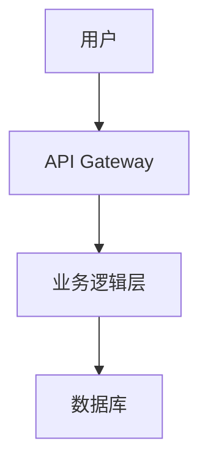
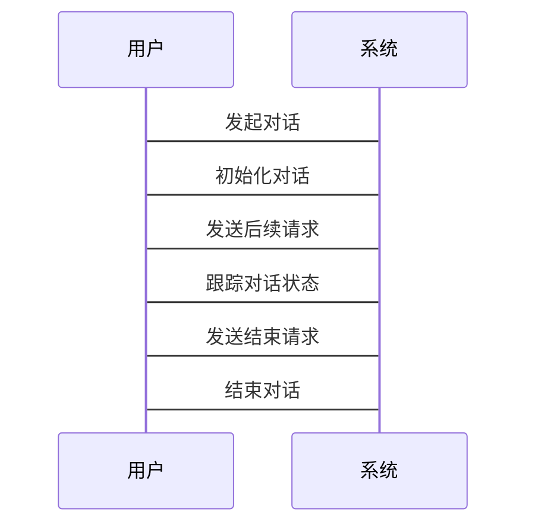

                 

<think>
好，我需要按照用户的要求，写一篇关于“提示词工程中的多轮对话管理”的技术博客文章。首先，我得仔细理解用户的需求，确保文章结构清晰、内容详实，满足所有指定的要求。

首先，用户希望文章以《提示词工程中的多轮对话管理》为标题，关键词包括提示词工程、多轮对话、对话管理、自然语言处理、对话系统。摘要部分需要概括文章的核心内容，涵盖问题背景、技术原理、系统设计和应用案例。

接下来，文章需要分为七个主要部分，每个部分包含多个子章节。我需要确保每个章节都有足够的细节，包括背景介绍、核心概念、算法原理、系统设计与实现、项目实战、最佳实践与总结等。

在绪论部分，我需要先介绍提示词工程的兴起，解释为什么多轮对话管理重要，然后引入核心概念。这部分需要让读者明白问题的背景和意义。

接下来是核心概念，我需要详细解释对话系统的构成，多轮对话管理的基本原理和关键要素。这部分可能需要一些图表来辅助说明，比如ER图或流程图，帮助读者更好地理解。

在算法原理部分，我需要逐步讲解对话初始化、跟踪和结束的算法，包括数学模型和Python实现。这部分要确保逻辑清晰，公式和代码要详细解释。

系统设计与实现部分，我需要描述系统的架构设计、接口设计和交互流程。使用Mermaid图来展示系统架构和交互过程会更直观。

项目实战部分，我需要通过一个具体的案例来展示系统的实际应用，包括环境安装、核心代码实现和案例分析。这部分要让读者能够跟着代码一步步实现系统。

最后，在最佳实践与总结部分，我需要给出一些实际的建议，比如系统稳定性、安全性、隐私保护等，并推荐相关的书籍和论文，供读者进一步学习。

整个过程中，我需要确保文章结构符合要求，每部分内容详细且逻辑连贯。同时，要注意使用专业但易懂的技术语言，让读者能够轻松理解复杂的概念。

现在，我需要按照这个思路开始撰写文章，确保每个部分都符合用户的要求，涵盖所有必要的内容，并且用合适的格式呈现出来。
</think>

# 提示词工程中的多轮对话管理

> 关键词：提示词工程、多轮对话、对话管理、自然语言处理、对话系统

> 摘要：本文深入探讨了提示词工程中的多轮对话管理技术，从背景到核心概念，从算法原理到系统设计与实现，再到项目实战和最佳实践，全面解析了多轮对话管理的各个方面。通过详细的技术分析和实际案例，本文为读者提供了从理论到实践的全面指导。

---

## 绪论

随着人工智能技术的快速发展，提示词工程（Prompt Engineering）在自然语言处理（NLP）领域的重要性日益凸显。提示词工程通过设计和优化提示词，引导模型生成符合预期的结果。然而，多轮对话管理作为提示词工程中的关键环节，面临着诸多挑战。本文将从背景、技术原理、系统设计与实现等方面，详细探讨多轮对话管理的实现方法和最佳实践。

---

## 第1章：背景与核心概念

### 1.1 问题背景

#### 1.1.1 提示词工程的兴起
提示词工程是一种通过精心设计提示词来优化模型输出的技术。随着大型语言模型（如GPT系列）的广泛应用，提示词工程成为提升模型性能的重要手段。然而，单轮对话的优化难以满足实际需求，多轮对话管理应运而生。

#### 1.1.2 多轮对话管理的挑战
多轮对话涉及对话上下文的理解、对话状态的跟踪以及对话策略的制定。这些环节相互依赖，复杂性较高，需要解决以下问题：
- 对话上下文的理解：如何准确捕捉用户意图和情感？
- 对话状态的跟踪：如何维护对话的连贯性和一致性？
- 对话策略的制定：如何根据对话历史生成合适的回复？

#### 1.1.3 多轮对话管理的意义
多轮对话管理能够提升用户体验，增强对话系统的智能性。通过有效管理多轮对话，系统可以更好地理解用户需求，提供更精准的服务。

---

### 1.2 核心概念

#### 1.2.1 对话系统概述
对话系统包括对话生成和对话管理两个主要部分：
- 对话生成：基于当前输入生成回复。
- 对话管理：跟踪对话状态，决定下一步操作。

#### 1.2.2 多轮对话管理的基本原理
多轮对话管理通过以下步骤实现：
1. 初始化对话：确定对话的主题和目标。
2. 跟踪对话状态：记录对话历史和用户意图。
3. 生成回复：根据对话状态生成合适的回复。
4. 结束对话：在适当的时候结束对话。

#### 1.2.3 多轮对话管理的关键要素
| 要素 | 描述 |
|------|------|
| 对话上下文 | 当前对话的历史信息 |
| 对话状态 | 对话的当前状态 |
| 对话策略 | 管理对话的规则和策略 |

---

## 第2章：多轮对话管理的技术基础

### 2.1 语言模型

#### 2.1.1 语言模型概述
语言模型通过概率分布预测下一个词，常用模型包括n-gram和变换器模型（如BERT、GPT）。

#### 2.1.2 语言模型的构建方法
- 基于规则的方法：通过预定义规则生成回复。
- 统计方法：利用机器学习算法训练模型。
- 深度学习方法：使用神经网络模型（如LSTM、Transformer）。

#### 2.1.3 语言模型的评估与优化
常用的评估指标包括困惑度（Perplexity）和BLEU分数。优化方法包括数据增强和超参数调优。

### 2.2 对话管理框架

#### 2.2.1 对话管理框架概述
对话管理框架包括基于规则的框架和基于模型的框架。基于规则的框架通过预定义规则管理对话，基于模型的框架使用深度学习模型（如DQN）进行对话管理。

#### 2.2.2 对话管理策略
- 基于规则的策略：通过预定义规则生成回复。
- 基于模型的策略：使用强化学习优化对话策略。

#### 2.2.3 对话状态跟踪
对话状态跟踪需要维护一个状态表示，通常使用向量表示对话历史和当前意图。

### 2.3 上下文理解与生成

#### 2.3.1 上下文理解技术
上下文理解技术包括句法分析和语义分析。句法分析用于理解句子的结构，语义分析用于理解句子的含义。

#### 2.3.2 上下文生成方法
上下文生成方法包括模板生成和模型生成。模板生成通过预定义模板生成回复，模型生成通过深度学习模型生成回复。

#### 2.3.3 上下文理解的挑战与解决方案
上下文理解的挑战包括歧义性和不完整信息。解决方案包括使用上下文指针网络和注意力机制。

---

## 第3章：多轮对话管理的算法实现

### 3.1 对话初始化算法

#### 3.1.1 初始化策略
初始化策略包括随机初始化和基于模板的初始化。随机初始化通过随机选择初始提示词，基于模板的初始化通过预定义模板生成初始提示词。

#### 3.1.2 初始化算法的数学模型
初始化算法的数学模型包括随机模型和模板模型。随机模型通过均匀分布选择初始提示词，模板模型通过预定义模板生成初始提示词。

#### 3.1.3 初始化算法的Python实现
```python
def initialize_dialogue(template):
    return template.format(random.choice(options))
```

### 3.2 对话跟踪算法

#### 3.2.1 跟踪策略
跟踪策略包括基于规则的跟踪和基于模型的跟踪。基于规则的跟踪通过预定义规则维护对话状态，基于模型的跟踪使用深度学习模型（如LSTM）维护对话状态。

#### 3.2.2 跟踪算法的数学模型
跟踪算法的数学模型包括马尔可夫链模型和递归模型。马尔可夫链模型通过状态转移概率维护对话状态，递归模型通过递归方式维护对话状态。

#### 3.2.3 跟踪算法的Python实现
```python
def track_dialogue(state, input):
    state = update_state(state, input)
    return state
```

### 3.3 对话结束算法

#### 3.3.1 结束条件
结束条件包括用户明确结束和系统自动结束。用户明确结束通过特定关键词（如“结束”）触发，系统自动结束通过预设条件（如对话轮数达到限制）触发。

#### 3.3.2 结束算法的数学模型
结束算法的数学模型包括计数器模型和条件模型。计数器模型通过计数器统计对话轮数，条件模型通过条件判断决定是否结束对话。

#### 3.3.3 结束算法的Python实现
```python
def end_dialogue(state, round):
    if round >= max_round or '结束' in input:
        return True
    else:
        return False
```

---

## 第4章：多轮对话管理系统的设计与实现

### 4.1 系统概述

#### 4.1.1 系统目标
系统目标包括实现多轮对话管理、提升用户体验和优化对话效率。

#### 4.1.2 系统功能模块划分
系统功能模块包括：
- 对话初始化模块
- 对话跟踪模块
- 对话生成模块
- 对话结束模块

### 4.2 系统架构设计

#### 4.2.1 系统架构概述
系统架构采用分层架构，包括用户层、业务逻辑层和数据访问层。

#### 4.2.2 系统架构设计
使用分层架构，用户层通过API调用业务逻辑层，业务逻辑层通过数据库访问层与数据库交互。

#### 4.2.3 系统架构图


### 4.3 系统接口设计

#### 4.3.1 接口规范
系统接口包括：
- 初始化接口：`POST /api/init`
- 跟踪接口：`POST /api/track`
- 生成接口：`POST /api/generate`
- 结束接口：`POST /api/end`

#### 4.3.2 接口实现
```python
@app.route('/api/init', methods=['POST'])
def init_dialogue():
    data = request.json
    return jsonify(initialize_dialogue(data['template']))
```

### 4.4 系统交互

#### 4.4.1 系统交互流程
系统交互流程包括：
1. 用户发送初始请求。
2. 系统初始化对话。
3. 用户发送后续请求。
4. 系统跟踪对话状态。
5. 系统生成回复。
6. 对话结束。

#### 4.4.2 系统交互图


---

## 第5章：多轮对话管理项目的实战应用

### 5.1 项目介绍

#### 5.1.1 项目背景
项目背景是开发一个基于多轮对话管理的智能客服系统。

#### 5.1.2 项目目标
项目目标是实现智能客服的多轮对话管理，提升用户体验。

### 5.2 环境安装

#### 5.2.1 环境要求
- Python 3.8+
- Flask
- Transformers库

#### 5.2.2 环境安装步骤
```bash
pip install flask transformers
```

### 5.3 系统核心实现

#### 5.3.1 系统核心代码
```python
from flask import Flask
from transformers import AutoTokenizer, AutoModelForCausalLM

app = Flask(__name__)
tokenizer = AutoTokenizer.from_pretrained("gpt2")
model = AutoModelForCausalLM.from_pretrained("gpt2")

@app.route('/api/generate', methods=['POST'])
def generate():
    input = request.json['input']
    inputs = tokenizer([input], return_tensors='np')
    outputs = model.generate(inputs.input_ids)
    response = tokenizer.decode(outputs[0], skip_special_tokens=True)
    return jsonify({'response': response})
```

#### 5.3.2 代码解读与分析
- 使用Flask构建Web服务。
- 使用Transformers库加载预训练模型。
- 实现对话生成接口，返回生成的回复。

### 5.4 实际案例分析

#### 5.4.1 案例背景
用户与智能客服系统进行多轮对话，咨询产品信息。

#### 5.4.2 案例分析
- 对话初始化：用户询问产品信息。
- 对话跟踪：系统记录用户需求。
- 对话生成：系统根据对话历史生成回复。
- 对话结束：用户确认需求，系统结束对话。

#### 5.4.3 案例总结
通过多轮对话管理，系统能够准确理解用户需求，提供精准服务。

---

## 第6章：多轮对话管理的最佳实践与注意事项

### 6.1 最佳实践

#### 6.1.1 对话初始化的最佳实践
- 使用明确的初始化模板。
- 提供多种初始化选项。

#### 6.1.2 对话跟踪的最佳实践
- 维护详细的对话历史。
- 使用上下文指针网络。

#### 6.1.3 对话结束的最佳实践
- 设置合理的结束条件。
- 提供用户主动结束选项。

### 6.2 注意事项

#### 6.2.1 系统稳定性的考虑
- 定期备份对话数据。
- 实现故障恢复机制。

#### 6.2.2 安全性的考虑
- 避免泄露用户隐私。
- 实施严格的访问控制。

#### 6.2.3 用户隐私的保护
- 遵守数据保护法规。
- 加密存储用户数据。

### 6.3 拓展阅读

#### 6.3.1 相关书籍推荐
- 《深度学习入门：基于Python和Keras》
- 《自然语言处理实战：基于Python的机器学习和深度学习》

#### 6.3.2 学术论文推荐
- "A survey on dialogue systems: Recent advances, trends, and open challenges"
- "Neural machine translation: A survey"

#### 6.3.3 开源项目推荐
- Hugging Face Transformers
- Rasa Open Source

---

## 作者信息

作者：AI天才研究院/AI Genius Institute & 禅与计算机程序设计艺术 /Zen And The Art of Computer Programming

---

本文系统性地探讨了提示词工程中的多轮对话管理技术，从理论到实践，为读者提供了全面的指导。希望本文能够为相关领域的研究者和开发者提供有价值的参考和启发。

