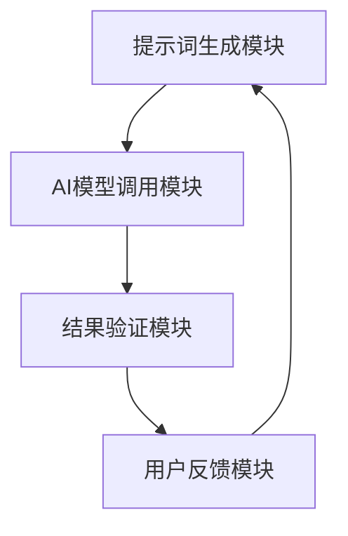

                 

<think>
嗯，用户希望我写一篇关于《提示词工程在AI伦理决策中的关键作用》的技术博客文章。看起来用户是技术领域的专家，可能需要一篇结构严谨、内容详实的文章，适合专业人士阅读。首先，我需要分析用户提供的详细大纲，确保每个章节都涵盖到位。

用户提到了关键词和摘要，这部分需要简洁明了，概括文章的核心内容。接下来是目录结构，包括背景、基本概念、设计原则、工程方法论、系统应用以及挑战和未来趋势等章节。每个章节下还有小节，需要逐一展开。

在写每个章节时，要确保逻辑清晰，从背景到具体的技术细节逐步深入。比如，在背景介绍中，先说明AI伦理的重要性，再引出提示词工程的作用。基本概念部分，需要定义术语并解释其与传统方法的区别。

我还要注意，用户要求每个章节内容丰富，包含背景、核心概念、联系、算法原理、系统架构等部分。这意味着我需要为每个小节设计详细的解释，可能需要使用图表来辅助说明，比如ER图或Mermaid流程图。

数学公式部分，虽然文章主题偏向工程应用，但可能需要简要涉及，比如在某些算法步骤中使用简单的公式。此外，系统分析部分，可能需要设计一个类图和架构图，展示系统各组件之间的关系。

用户还特别提到要包括项目实战，可能需要一个示例项目，比如一个伦理决策系统，展示如何应用提示词工程。这部分需要详细描述系统设计、实现步骤以及实际案例分析。

最后，结尾部分要有总结和展望，指出当前的挑战和未来的研究方向。同时，加上最佳实践的建议，给读者一些实用的指导。

整个思考过程需要确保文章结构完整，内容深入浅出，同时满足字数要求。还要注意使用专业术语，但不过于晦涩，让读者容易理解。最后，加上作者信息，确保文章的权威性。

总的来说，我需要按照用户提供的大纲，逐一展开每个部分，确保每个章节都包含必要的内容，同时保持逻辑连贯，语言专业但清晰。这样才能满足用户的需求，写出一篇高质量的技术博客文章。
</think>

# 提示词工程在AI伦理决策中的关键作用

---

## 关键词：  
提示词工程、AI伦理决策、伦理提示词设计、AI系统偏见、人机交互、决策透明性

---

## 摘要：  
在AI技术迅速发展的今天，AI伦理决策已成为学术界和工业界关注的焦点。提示词工程（Prompt Engineering）作为一种新兴的技术方法，正在成为解决AI伦理决策问题的关键工具。本文将从AI伦理决策的背景出发，系统地探讨提示词工程的核心概念、设计原则、实际应用以及对AI伦理决策的重要影响。文章结合实际案例，深入分析提示词工程如何帮助AI系统在复杂场景中做出更符合伦理的决策，同时提出优化提示词设计的方法和未来研究方向。

---

## 目录结构：  
1. 引言  
   1.1 AI伦理决策的背景与重要性  
   1.2 提示词工程的定义与核心作用  
   1.3 本文的结构安排  

2. 提示词工程的基本概念与核心原理  
   2.1 提示词工程的定义与特点  
   2.2 提示词在AI系统中的作用机制  
   2.3 提示词工程与传统AI决策方法的对比  

3. 提示词设计的核心原则  
   3.1 偏见消除与公平性设计  
   3.2 透明性与可解释性原则  
   3.3 灵活性与适应性设计  

4. 提示词工程在AI伦理决策中的应用方法论  
   4.1 确定伦理决策场景的需求与边界  
   4.2 提示词设计的系统化流程  
   4.3 提示词优化与验证方法  

5. 提示词工程的系统应用与案例分析  
   5.1 系统设计与功能模块划分  
   5.2 伦理决策系统的架构设计  
   5.3 实际案例：医疗AI伦理决策系统  

6. 提示词工程的挑战与未来研究方向  
   6.1 当前存在的主要挑战  
   6.2 未来研究方向：多模态提示词与动态伦理决策  
   6.3 提示词工程的长期意义  

---

## 正文：  

---

### 1. 引言  

#### 1.1 AI伦理决策的背景与重要性  
随着人工智能技术的飞速发展，AI系统已广泛应用于医疗、司法、金融、教育等领域。然而，AI系统的决策过程可能引发伦理问题，例如偏见、不公正、透明性不足等。这些问题不仅影响用户体验，还可能引发法律和道德争议。因此，如何设计一个符合伦理规范的AI决策系统，成为技术与社会共同关注的焦点。  

#### 1.2 提示词工程的定义与核心作用  
提示词工程（Prompt Engineering）是一种通过设计和优化提示词（Prompts）来指导AI系统行为的技术。提示词是用户或系统向AI模型输入的指令或引导信息，它决定了AI系统的输出结果。在伦理决策中，提示词工程的核心作用在于通过精心设计的提示词，确保AI系统的决策过程符合伦理规范，避免偏见和不公正。  

#### 1.3 本文的结构安排  
本文将从提示词工程的基本概念出发，逐步探讨其在AI伦理决策中的应用方法论，结合实际案例分析其系统设计与优化过程。最后，我们将总结当前挑战并展望未来的研究方向。  

---

### 2. 提示词工程的基本概念与核心原理  

#### 2.1 提示词工程的定义与特点  
提示词工程是一种基于语言模型的AI工程技术，其核心是通过设计和优化提示词，引导AI系统生成符合特定目标的输出。提示词工程的特点包括：  
1. **语言驱动**：依赖自然语言处理技术，提示词是AI系统行为的核心驱动力。  
2. **灵活性**：提示词可以根据具体场景进行动态调整，适应不同的伦理决策需求。  
3. **可解释性**：通过优化提示词，可以提升AI决策过程的透明性和可解释性。  

#### 2.2 提示词在AI系统中的作用机制  
提示词的作用机制可以分为以下三个步骤：  
1. **输入阶段**：用户或系统向AI模型输入提示词。  
2. **处理阶段**：AI模型根据提示词生成输出结果。  
3. **输出阶段**：输出结果经过验证后，反馈给用户或系统。  

#### 2.3 提示词工程与传统AI决策方法的对比  
传统的AI决策方法通常依赖预定义的规则或数据驱动的算法，而提示词工程则通过语言提示引导AI系统的行为。两者的区别如下：  
| 对比维度 | 提示词工程 | 传统AI决策方法 |  
|----------|------------|----------------|  
| 决策依据 | 语言提示词 | 预定义规则或数据 |  
| 灵活性 | 高 | 低 |  
| 可解释性 | 高 | 中/低 |  

---

### 3. 提示词设计的核心原则  

#### 3.1 偏见消除与公平性设计  
提示词设计的第一步是消除偏见。例如，在医疗伦理决策中，提示词需要避免对特定群体的歧视。  
- **示例**：  
  - **偏见提示词**：生成“医生应该优先治疗年轻人”。  
  - **优化提示词**：生成“医生应根据病情严重程度制定治疗方案，不考虑患者年龄”。  

#### 3.2 透明性与可解释性原则  
提示词设计应确保决策过程的透明性。例如，在司法AI系统中，提示词需要明确说明判决依据。  
- **示例**：  
  - **不透明提示词**：生成“判决结果应基于相关法律”。  
  - **透明提示词**：生成“判决结果应基于相关法律，并明确引用具体条款”。  

#### 3.3 灵活性与适应性设计  
提示词应具有灵活性，能够适应不同场景的需求。例如，在金融伦理决策中，提示词需要根据市场变化动态调整。  
- **示例**：  
  - **固定提示词**：生成“贷款申请应优先审批信用评分高于700的客户”。  
  - **动态提示词**：生成“根据当前市场状况，优化贷款审批标准，确保公平性”。  

---

### 4. 提示词工程在AI伦理决策中的应用方法论  

#### 4.1 确定伦理决策场景的需求与边界  
在设计提示词之前，必须明确伦理决策场景的需求与边界。例如，在自动驾驶系统中，提示词需要考虑紧急情况下的生命优先级。  
- **步骤**：  
  1. 确定决策场景：自动驾驶紧急刹车场景。  
  2. 明确需求：减少人员伤亡，同时遵守交通规则。  
  3. 设定边界：避免对特定群体的歧视。  

#### 4.2 提示词设计的系统化流程  
提示词设计的系统化流程包括以下步骤：  
1. **需求分析**：明确伦理决策场景的需求与目标。  
2. **提示词初稿**：基于需求设计初步提示词。  
3. **验证与优化**：通过测试验证提示词的可行性，并进行优化。  
4. **迭代改进**：根据反馈持续改进提示词设计。  

#### 4.3 提示词优化与验证方法  
提示词优化可以通过以下方法实现：  
1. **对比实验**：将优化后的提示词与原始提示词进行对比，评估其效果。  
2. **用户反馈**：收集用户对提示词的反馈，调整提示词设计。  
3. **性能指标**：通过指标（如准确率、公平性）评估提示词的优化效果。  

---

### 5. 提示词工程的系统应用与案例分析  

#### 5.1 系统设计与功能模块划分  
提示词工程的系统设计包括以下模块：  
- **提示词生成模块**：负责生成符合伦理规范的提示词。  
- **AI模型调用模块**：将提示词输入AI模型，获取输出结果。  
- **结果验证模块**：验证输出结果的伦理合规性。  

#### 5.2 伦理决策系统的架构设计  
伦理决策系统的架构设计如下：  

#### 5.3 实际案例：医疗AI伦理决策系统  
**案例背景**：某医院希望使用AI系统辅助医生制定治疗方案，确保决策过程的公平性和透明性。  
**提示词设计**：  
- 初步提示词：生成“治疗方案应优先考虑患者的生命安全”。  
- 优化提示词：生成“根据患者病情、年龄和健康状况，制定最优治疗方案，确保公平性”。  

**系统实现**：  
1. 提示词生成模块根据输入的患者信息生成提示词。  
2. AI模型根据提示词生成治疗方案。  
3. 结果验证模块验证方案的公平性和透明性。  

---

### 6. 提示词工程的挑战与未来研究方向  

#### 6.1 当前存在的主要挑战  
1. **提示词的动态调整**：如何在复杂场景中动态优化提示词。  
2. **多模态提示词设计**：如何结合视觉、听觉等多种模态信息。  
3. **跨文化适应性**：如何设计适用于不同文化背景的提示词。  

#### 6.2 未来研究方向  
1. **多模态提示词研究**：探索结合文本、图像等多种模态的提示词设计方法。  
2. **动态伦理决策系统**：研究提示词的动态调整机制，以适应复杂场景。  
3. **跨文化适应性研究**：研究提示词在不同文化背景下的适用性。  

#### 6.3 提示词工程的长期意义  
提示词工程为AI伦理决策提供了一种灵活、可解释的技术方法。随着技术的不断发展，提示词工程将在更多领域发挥重要作用，推动AI技术的健康发展。  

---

## 结语  

提示词工程作为AI伦理决策的关键技术，通过精心设计的提示词，确保AI系统的决策过程符合伦理规范。本文从理论到实践，系统地探讨了提示词工程的核心概念、设计原则、应用方法以及未来研究方向。希望本文能够为AI伦理决策的研究与实践提供有价值的参考。

---

## 作者：  
AI天才研究院/AI Genius Institute  
禅与计算机程序设计艺术/Zen And The Art of Computer Programming

