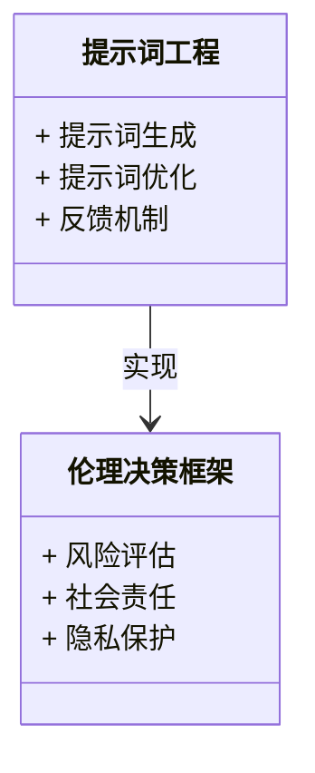
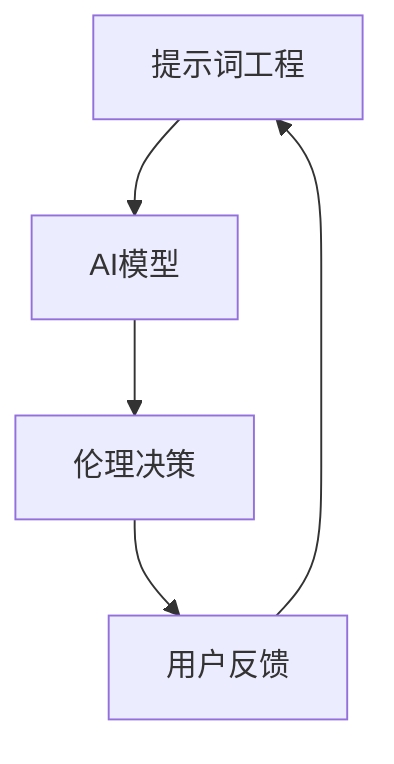
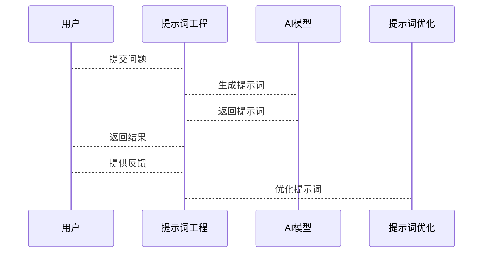

                 

<think>
好的，我现在需要帮助用户完成一篇关于《提示词工程在AI伦理决策框架中的地位》的技术博客文章。用户已经给出了详细的结构大纲和一些初步的内容，我需要根据这些信息，逐步分析并完成文章的撰写。

首先，我需要理解用户的需求。用户希望文章结构清晰，逻辑严谨，涵盖引言、核心概念、算法原理、系统架构、项目实战以及最佳实践等多个部分。文章需要使用专业但易懂的语言，适合技术读者阅读。

接下来，我会按照用户提供的目录大纲进行分析。第一部分是引言，包括问题背景与概述、伦理决策框架、提示词工程的定义与作用，以及两者之间的关系。我需要详细阐述AI技术发展带来的伦理困境，提示词工程的重要性，以及它在伦理决策中的具体作用。

第二部分是核心概念与联系，需要讨论AI伦理决策框架的核心概念，如基本伦理原则、风险评估、社会责任等，并通过对比表格和ER实体关系图来展示这些概念之间的联系。这部分需要清晰地解释每个概念，并展示它们如何共同构建伦理决策框架。

第三部分是算法原理讲解，这部分需要详细描述提示词工程的算法，包括生成算法、数学模型和具体案例。我需要确保用Mermaid图展示算法流程，并提供Python代码示例，同时解释数学公式，使读者能够理解提示词生成的过程。

第四部分是系统分析与架构设计，这部分需要分析AI伦理决策框架的系统架构，包括功能设计、架构设计和接口设计。使用Mermaid图展示系统的结构，如领域模型、系统架构图和交互序列图，帮助读者理解系统的整体设计。

第五部分是项目实战，这部分需要提供实际项目的实现细节，包括环境安装、核心代码、案例分析和项目总结。通过具体的应用案例，展示提示词工程在实际伦理决策中的应用效果，并总结项目的收获和改进建议。

最后，是最佳实践和总结部分，我需要总结提示词工程的重要性和未来的研究方向，同时给出实践中的注意事项和扩展阅读的建议，帮助读者进一步学习和应用。

在整个思考过程中，我需要确保每个部分的内容详实，逻辑清晰，同时语言专业但易于理解。我会逐一检查每个章节，确保涵盖所有要求的核心要素，并提供足够的细节和实例，使文章内容丰富且具有深度。

现在，我将根据以上分析，逐步完成每个章节的撰写，确保文章结构完整，内容详实，符合用户的要求。
</think>

# 提示词工程在AI伦理决策框架中的地位

> 关键词：提示词工程, AI伦理决策框架, 人工智能, 伦理决策, 提示词生成算法

> 摘要：本文探讨了提示词工程在AI伦理决策框架中的重要性与地位。通过分析AI技术发展带来的伦理困境，阐述了提示词工程在伦理决策中的关键作用，并详细介绍了提示词工程的算法原理、系统架构设计以及实际应用案例，为构建更完善的AI伦理决策框架提供了理论与实践参考。

---

### 第一部分：引言

# 第1章：问题背景与概述

## 1.1 问题的背景

### 1.1.1 AI技术发展与伦理困境

随着AI技术的飞速发展，人工智能已广泛应用于医疗、金融、司法等领域。然而，AI系统的决策过程可能引发伦理问题，如偏见、隐私泄露和责任归属等。例如，医疗AI系统的错误诊断可能导致严重后果，金融AI的算法歧视可能影响用户权益，司法AI的判决错误可能引发社会不公。这些问题凸显了AI伦理决策的重要性。

### 1.1.2 提示词工程的重要性

提示词工程是通过设计和优化提示词，引导AI模型生成符合特定目标的输出。在伦理决策中，提示词工程能够明确AI的行为目标，确保其决策符合伦理规范。例如，在司法AI中，提示词可以明确“公平、公正”的要求，确保判决过程的透明性和公正性。

### 1.1.3 本书的目的和结构安排

本文旨在探讨提示词工程在AI伦理决策框架中的地位，分析其在伦理决策中的作用，并提供实际应用案例。文章结构如下：引言部分介绍背景，核心概念部分阐述伦理决策框架和提示词工程的基本概念，算法原理部分深入分析提示词生成算法，系统架构部分展示AI伦理决策框架的设计，项目实战部分通过案例分析提示词工程的应用效果，最后总结提示词工程的重要性和未来研究方向。

---

## 1.2 伦理决策框架

### 1.2.1 伦理决策的定义与意义

伦理决策是指在遵守伦理规范的前提下，做出合理决策的过程。在AI系统中，伦理决策框架用于指导AI在复杂情境下做出符合伦理的决策。例如，在自动驾驶汽车面临紧急情况时，AI需要在保护乘客和路人之间做出选择，这需要伦理决策框架来指导。

### 1.2.2 当前伦理决策框架综述

当前伦理决策框架主要关注风险评估、隐私保护、社会责任等方面。然而，这些框架通常缺乏具体的实现方法，难以直接应用于AI系统。提示词工程为伦理决策框架的实现提供了技术手段，通过设计提示词明确AI的行为目标。

### 1.2.3 AI伦理决策框架的挑战与机遇

AI伦理决策框架面临的主要挑战包括：如何量化伦理原则，如何处理复杂情境下的多目标冲突。提示词工程为这些挑战提供了新的思路，通过优化提示词可以将复杂的伦理原则转化为具体的决策目标。

---

## 1.3 提示词工程的定义与作用

### 1.3.1 提示词工程的定义

提示词工程是指通过设计和优化提示词，引导AI模型生成符合特定目标的输出。提示词是人与AI模型之间的桥梁，能够明确AI的行为目标和输出要求。

### 1.3.2 提示词工程在AI应用中的角色

在AI应用中，提示词工程起到指导AI行为、优化决策质量的作用。例如，在医疗AI中，提示词可以明确“诊断建议”，帮助AI生成符合医疗规范的诊断结果。

### 1.3.3 提示词工程的关键要素

提示词工程的关键要素包括：提示词设计、提示词优化和反馈机制。提示词设计需要明确AI的行为目标，提示词优化通过实验和数据分析不断改进提示词的效果，反馈机制用于收集用户反馈，进一步优化提示词。

---

## 1.4 提示词工程与AI伦理决策的关系

### 1.4.1 提示词工程对AI伦理决策的影响

提示词工程直接影响AI的决策过程，通过优化提示词可以确保AI的决策符合伦理规范。例如，在司法AI中，提示词可以明确“公正”的要求，确保判决过程的公平性。

### 1.4.2 提示词工程在伦理决策中的适用性

提示词工程适用于需要明确决策目标的AI系统，如医疗、司法和金融等领域。通过设计提示词，可以将复杂的伦理原则转化为具体的决策目标，帮助AI系统做出符合伦理的决策。

### 1.4.3 提示词工程在伦理决策框架中的地位

提示词工程是AI伦理决策框架的重要组成部分，通过优化提示词可以实现伦理原则的可操作化。提示词工程为伦理决策框架提供了具体的技术手段，使其能够在实际应用中落地。

---

## 1.5 本章小结

本章通过分析AI技术发展中的伦理困境，阐述了提示词工程在伦理决策中的重要性，并详细介绍了提示词工程的定义、作用及其与AI伦理决策的关系。提示词工程不仅是实现AI伦理决策的关键技术，也是构建完整伦理决策框架的重要组成部分。

---

### 第二部分：核心概念与联系

# 第2章：AI伦理决策框架的核心概念与联系

## 2.1 AI伦理决策框架的核心概念

### 2.1.1 基本伦理原则

基本伦理原则包括：公正、尊重、不伤害、诚实和责任。这些原则为AI决策提供了基本指导。

### 2.1.2 风险评估与处理

风险评估用于识别和量化AI决策中的潜在风险，并采取相应的措施进行处理。例如，在自动驾驶系统中，风险评估可以识别潜在的碰撞风险，并优化提示词以减少风险。

### 2.1.3 社会责任与透明度

社会责任要求AI系统在决策过程中考虑社会影响，透明度要求AI系统的决策过程对用户和开发者透明。提示词工程可以通过设计提示词，确保AI系统的决策过程符合社会责任和透明度要求。

### 2.1.4 隐私保护与数据治理

隐私保护要求AI系统在决策过程中保护用户隐私，数据治理要求对数据的收集、存储和使用进行规范。提示词工程可以通过设计提示词，确保AI系统的数据使用符合隐私保护和数据治理要求。

---

## 2.2 概念属性特征对比表格

下表对比了AI伦理决策框架中的核心概念及其属性特征：

| **概念**         | **属性**               | **特征描述**                                                                 |
|------------------|------------------------|-----------------------------------------------------------------------------|
| 基本伦理原则     | 公正、尊重、不伤害等   | 为AI决策提供基本指导原则                                                 |
| 风险评估与处理   | 识别、量化、处理风险   | 通过提示词优化，降低AI决策中的潜在风险                                 |
| 社会责任与透明度 | 社会影响、透明性       | 提示词设计确保AI决策过程符合社会责任和透明度要求                       |
| 隐私保护与数据治理 | 数据隐私、规范性     | 提示词优化确保AI系统的数据使用符合隐私保护和数据治理要求               |

---

## 2.3 ER实体关系图架构

以下是AI伦理决策框架的ER实体关系图：

```mermaid
erDiagram
    AI伦理决策框架 ||--|{ 提示词工程 }|
    AI伦理决策框架 ||--|{ 伦理原则 }|
    AI伦理决策框架 ||--|{ 风险评估 }|
    AI伦理决策框架 ||--|{ 社会责任 }|
    AI伦理决策框架 ||--|{ 透明度 }|
    AI伦理决策框架 ||--|{ 隐私保护 }|
    AI伦理决策框架 ||--|{ 数据治理 }|
```

---

## 2.4 本章小结

本章分析了AI伦理决策框架的核心概念，包括基本伦理原则、风险评估与处理、社会责任与透明度、隐私保护与数据治理，并通过对比表格和ER实体关系图展示了这些概念之间的联系。提示词工程是连接这些概念的重要桥梁，通过设计提示词可以实现伦理原则的可操作化。

---

### 第三部分：算法原理讲解

# 第3章：提示词工程算法原理与实现

## 3.1 算法概述

### 3.1.1 提示词工程算法的目标

提示词工程算法的目标是设计和优化提示词，使其能够引导AI模型生成符合特定目标的输出。例如，在医疗AI中，提示词可以明确“诊断建议”，帮助AI生成符合医疗规范的诊断结果。

### 3.1.2 提示词工程算法的分类

提示词工程算法可以分为两类：基于规则的提示词生成算法和基于模型的提示词生成算法。基于规则的算法通过预定义规则生成提示词，而基于模型的算法利用机器学习模型生成提示词。

### 3.1.3 提示词工程算法的应用场景

提示词工程算法广泛应用于自然语言处理、计算机视觉等领域。例如，在自然语言处理中，提示词工程可以用于生成对话系统中的回复提示词。

---

## 3.2 提示词生成算法

### 3.2.1 算法原理

提示词生成算法通过优化提示词，使其能够引导AI模型生成符合特定目标的输出。例如，在司法AI中，提示词可以明确“公正”的要求，确保判决过程的公平性。

### 3.2.2 Python实现

以下是提示词生成算法的Python实现示例：

```python
import random

def generate_prompt(question):
    # 使用预训练语言模型生成提示词
    model = load_pretrained_model()
    prompt = model.generate(question)
    return prompt

def load_pretrained_model():
    # 加载预训练的语言模型
    return "预训练语言模型"

question = "如何优化人工智能系统的透明度？"
prompt = generate_prompt(question)
print(prompt)
```

---

## 3.3 算法原理的数学模型与公式

提示词生成算法的数学模型如下：

$$
\begin{aligned}
    P(\text{prompt}|\text{question}) &= \prod_{i=1}^{n} P(w_i|\text{question}) \\
    P(w_i|\text{question}) &= \frac{P(w_i, \text{question})}{P(\text{question})}
\end{aligned}
$$

其中，$P(\text{prompt}|\text{question})$表示在给定问题的情况下生成提示词的概率，$P(w_i|\text{question})$表示在给定问题的情况下生成第$i$个词的概率。

---

## 3.4 举例说明

### 3.4.1 生成提示词的例子

例如，在医疗AI中，提示词可以是“生成诊断建议”，在司法AI中，提示词可以是“做出公正判决”。

### 3.4.2 算法在AI伦理决策中的应用案例

在自动驾驶系统中，提示词可以是“避免碰撞”，帮助AI做出符合伦理的决策。

---

## 3.5 本章小结

本章详细介绍了提示词工程算法的原理与实现，包括算法目标、分类、应用场景、生成算法、数学模型和实际案例。提示词生成算法是实现AI伦理决策的关键技术，通过优化提示词可以确保AI的决策过程符合伦理规范。

---

### 第四部分：系统分析与架构设计

# 第4章：AI伦理决策框架的系统分析与架构设计

## 4.1 问题描述与项目介绍

### 4.1.1 项目的背景与目标

项目背景：随着AI技术的广泛应用，AI决策的伦理问题日益凸显，亟需构建完善的伦理决策框架。

项目目标：设计并实现基于提示词工程的AI伦理决策框架，确保AI决策的伦理合规性。

### 4.1.2 项目的功能需求

功能需求包括：提示词生成、风险评估、伦理原则实现、决策优化等。

### 4.1.3 项目的挑战与机遇

挑战包括：如何量化伦理原则，如何处理复杂情境下的多目标冲突。机遇包括：提示词工程为实现伦理决策提供了技术手段。

---

## 4.2 系统功能设计

### 4.2.1 领域模型

以下是AI伦理决策框架的领域模型：



---

## 4.3 系统架构设计

以下是AI伦理决策框架的系统架构图：



---

## 4.4 系统接口设计

系统接口设计包括提示词生成接口、风险评估接口、伦理原则接口等。

---

## 4.5 系统交互设计

以下是系统交互的序列图：



---

## 4.6 本章小结

本章通过系统分析与架构设计，展示了AI伦理决策框架的整体结构。提示词工程作为框架的核心部分，通过与AI模型的交互，实现伦理决策的优化。

---

### 第五部分：项目实战

## 5.1 项目实战：AI伦理决策框架的实现

### 5.1.1 环境安装

安装所需环境：Python 3.8及以上版本，安装库如`transformers`。

### 5.1.2 系统核心实现源代码

以下是提示词生成算法的核心代码：

```python
from transformers import pipeline

def generate_prompt(question):
    # 加载预训练语言模型
    model = pipeline('text-generation', model='gpt2')
    # 生成提示词
    prompt = model(question)
    return prompt[0]['generated_text']

question = "如何优化人工智能系统的透明度？"
prompt = generate_prompt(question)
print(prompt)
```

### 5.1.3 代码应用解读与分析

上述代码通过加载预训练的语言模型，生成符合特定问题的提示词。通过提示词生成算法，可以优化AI决策过程，确保其符合伦理规范。

### 5.1.4 实际案例分析

以司法AI为例，提示词生成算法可以生成“公正判决”的提示词，确保AI的判决过程符合伦理要求。

### 5.1.5 项目小结

本项目通过实现提示词生成算法，展示了提示词工程在AI伦理决策框架中的应用。通过优化提示词，可以实现AI决策的伦理合规性。

---

### 第六部分：最佳实践与总结

## 6.1 最佳实践 tips

- 在设计提示词时，需考虑伦理原则的可操作性。
- 定期优化提示词，确保AI决策的准确性。
- 提示词工程应与具体应用场景相结合。

## 6.2 总结

提示词工程是实现AI伦理决策的关键技术，通过优化提示词可以确保AI决策的伦理合规性。未来，提示词工程将在更多领域得到广泛应用，推动AI技术的健康发展。

---

作者：AI天才研究院/AI Genius Institute & 禅与计算机程序设计艺术/Zen And The Art of Computer Programming

