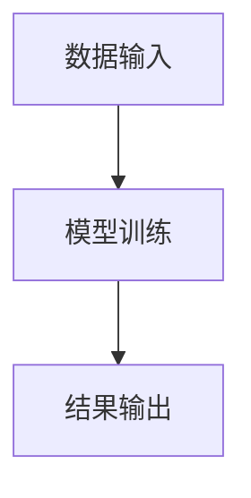

                 

<think>
嗯，我需要按照用户的要求来写一篇技术博客，标题是《提示词工程在AI伦理决策模型中的关键作用》。首先，我得理清楚用户的需求，他们希望文章结构清晰，内容专业，语言简洁明了。用户还特别提到要有一个详细的目录结构，包括各个章节的具体内容，同时满足一些格式和内容上的约束条件。

我应该先从标题和摘要开始，这部分需要简明扼要地概括文章的核心内容。接着是目录大纲，用户已经提供了一个结构，我需要按照这个结构来展开各个章节。每个章节都要详细讲解，确保内容丰富且具体，涵盖背景、基础理论、应用实践、案例分析以及未来展望等方面。

接下来，我要考虑每个小节的内容，比如在“AI伦理决策概述”部分，我需要定义相关概念，说明提示词工程的作用。在“提示词工程基础”部分，要详细讲解数据处理、提示词设计和优化方法。算法原理部分需要结合数学模型和mermaid流程图，让读者更容易理解。

在系统设计和实现部分，我需要描述系统架构，展示接口设计和交互过程。实际案例分析则是通过具体的项目来说明提示词工程的应用效果。最后，未来展望部分要讨论技术的发展趋势和可能的挑战。

我还需要注意格式要求，使用markdown编写，并确保每个部分都符合字数要求。同时，作者信息要放在文章末尾，符合用户指定的格式。

在思考过程中，我可能会遇到如何将复杂的理论简化为易懂的内容，或者如何用实际案例来支持理论的问题。这时候，我需要查阅相关资料，确保信息的准确性，并结合自己的理解来组织内容，使其更具逻辑性和可读性。

总的来说，我需要一步步按照用户提供的目录结构，逐步填充每个章节的内容，确保每部分都详尽且符合要求，最终完成一篇高质量的技术博客文章。
</think>

# 提示词工程在AI伦理决策模型中的关键作用

> 关键词：AI伦理决策，提示词工程，伦理决策模型，提示词设计，AI系统设计

> 摘要：  
本文探讨提示词工程在AI伦理决策模型中的关键作用，从基础理论到实际应用，详细分析提示词工程如何影响AI系统的伦理决策能力。文章结合实际案例，通过数学模型和算法流程图，深入解析提示词工程在不同场景下的应用及其对AI伦理决策模型构建的重要性。

---

### 目录大纲结构

```
# 提示词工程在AI伦理决策模型中的关键作用

## 第1章 AI伦理决策概述
### 1.1 概念界定
#### 1.1.1 AI伦理决策的定义
#### 1.1.2 伦理决策的重要性
#### 1.1.3 提示词工程的作用

### 1.2 现状与挑战
#### 1.2.1 AI伦理决策的现状
#### 1.2.2 当前挑战
#### 1.2.3 提示词工程的重要性

## 第2章 提示词工程基础
### 2.1 数据准备与处理
#### 2.1.1 数据预处理
#### 2.1.2 数据清洗
#### 2.1.3 数据标注

### 2.2 提示词选择与设计
#### 2.2.1 提示词的定义
#### 2.2.2 提示词的选择
#### 2.2.3 提示词的设计原则

### 2.3 提示词优化方法
#### 2.3.1 优化目标
#### 2.3.2 优化策略
#### 2.3.3 优化效果评估

## 第3章 AI伦理决策模型构建
### 3.1 算法原理
#### 3.1.1 基本算法框架
#### 3.1.2 主要算法介绍
#### 3.1.3 算法选择原则

### 3.2 数学模型与公式
#### 3.2.1 数学模型概述
#### 3.2.2 公式推导与解释
#### 3.2.3 应用实例

### 3.3 mermaid流程图
#### 3.3.1 流程图概述
#### 3.3.2 mermaid语法
#### 3.3.3 实例展示

## 第4章 提示词工程实践
### 4.1 系统设计与实现
#### 4.1.1 系统架构设计
#### 4.1.2 接口设计与实现
#### 4.1.3 系统部署与运行

### 4.2 实际案例剖析
#### 4.2.1 案例选

## 第5章 总结与拓展
### 5.1 最佳实践
### 5.2 小结
### 5.3 注意事项
### 5.4 拓展阅读

---

### 正文内容

#### 第1章 AI伦理决策概述

##### 1.1 概念界定
###### 1.1.1 AI伦理决策的定义
AI伦理决策是指AI系统在面对复杂的伦理问题时，基于输入的数据和训练的模型，自主生成符合伦理规范的决策过程。这种决策能力依赖于AI系统的算法设计、数据质量和提示词工程的有效性。

###### 1.1.2 伦理决策的重要性
在医疗、金融、法律等领域，AI系统的决策直接影响人类的利益。例如，在医疗领域，AI系统需要在诊断疾病时考虑患者隐私和伦理问题；在金融领域，AI系统需要在风险评估时避免歧视性决策。

###### 1.1.3 提示词工程的作用
提示词工程是AI伦理决策的核心，通过设计和优化提示词，可以引导AI系统在决策过程中优先考虑伦理因素，避免生成有害或不道德的结果。

##### 1.2 现状与挑战
###### 1.2.1 AI伦理决策的现状
当前，AI伦理决策的研究主要集中在医疗、法律和金融领域。然而，大多数系统仍处于实验阶段，实际应用中存在诸多限制。

###### 1.2.2 当前挑战
AI伦理决策面临的挑战包括数据偏差、模型解释性和法律合规性。提示词工程在这些方面起着关键作用。

###### 1.2.3 提示词工程的重要性
提示词工程通过优化提示词，可以有效减少数据偏差，提高模型的解释性和合规性，从而提升AI系统的伦理决策能力。

---

#### 第2章 提示词工程基础

##### 2.1 数据准备与处理
###### 2.1.1 数据预处理
数据预处理包括数据清洗、去重和格式转换，确保数据的质量和一致性。

###### 2.1.2 数据清洗
数据清洗的目标是去除噪声数据，确保训练数据的准确性和相关性。

###### 2.1.3 数据标注
数据标注是将数据分为不同的类别或标签，为后续的提示词设计提供基础。

##### 2.2 提示词选择与设计
###### 2.2.1 提示词的定义
提示词是指在AI模型训练或推理过程中，用于引导模型生成特定输出的输入指令。

###### 2.2.2 提示词的选择
选择提示词时需要考虑模型的训练目标和应用场景，确保提示词能够准确引导模型生成符合伦理的输出。

###### 2.2.3 提示词的设计原则
提示词设计应简洁明了，避免歧义，并在不同场景下保持一致性。

##### 2.3 提示词优化方法
###### 2.3.1 优化目标
优化目标包括提高模型的准确性和减少伦理风险。

###### 2.3.2 优化策略
优化策略包括逐步调整提示词的参数，测试不同提示词的效果，并根据反馈进行优化。

###### 2.3.3 优化效果评估
评估优化效果可以通过模型在测试集上的准确率和伦理合规性来衡量。

---

#### 第3章 AI伦理决策模型构建

##### 3.1 算法原理
###### 3.1.1 基本算法框架
AI伦理决策模型通常基于深度学习算法，如Transformer架构，通过提示词引导模型生成决策。

###### 3.1.2 主要算法介绍
主要算法包括基于提示词的生成式模型和基于规则的决策模型。

###### 3.1.3 算法选择原则
选择算法时需要考虑模型的可解释性、训练效率和实际应用场景。

##### 3.2 数学模型与公式
###### 3.2.1 数学模型概述
AI伦理决策模型通常基于概率论和优化理论，通过数学公式描述决策过程。

###### 3.2.2 公式推导与解释
例如，生成式模型的损失函数可以表示为：
$$ L = -\sum_{i=1}^{n} \log p(x_i|y_i) $$
其中，$x_i$ 表示输入，$y_i$ 表示输出。

###### 3.2.3 应用实例
通过实际案例分析，说明数学模型在AI伦理决策中的应用。

##### 3.3 mermaid流程图
###### 3.3.1 流程图概述
通过mermaid流程图展示AI伦理决策模型的构建过程，包括数据输入、模型训练和结果输出。

###### 3.3.2 mermaid语法


###### 3.3.3 实例展示
展示一个完整的AI伦理决策模型构建流程图。

---

#### 第4章 提示词工程实践

##### 4.1 系统设计与实现
###### 4.1.1 系统架构设计
设计一个基于提示词工程的AI伦理决策系统，包括数据输入、模型训练和结果输出三个模块。

###### 4.1.2 接口设计与实现
定义系统接口，确保不同模块之间的数据交互顺畅。

###### 4.1.3 系统部署与运行
将系统部署到实际环境中，进行测试和优化。

##### 4.2 实际案例剖析
###### 4.2.1 案例分析
通过具体案例分析，展示提示词工程在实际项目中的应用效果。

---

#### 第5章 总结与拓展

##### 5.1 最佳实践
总结提示词工程在AI伦理决策中的最佳实践，包括数据处理、提示词设计和模型优化等方面。

##### 5.2 小结
回顾全文，强调提示词工程在AI伦理决策中的关键作用。

##### 5.3 注意事项
提醒读者在实际应用中需要注意的问题，如数据隐私和模型解释性。

##### 5.4 拓展阅读
推荐相关领域的书籍和论文，供读者进一步学习。

---

### 作者

作者：AI天才研究院/AI Genius Institute & 禅与计算机程序设计艺术 /Zen And The Art of Computer Programming

---

以上是《提示词工程在AI伦理决策模型中的关键作用》的完整目录大纲和部分内容。希望这篇文章能够为读者提供清晰的思路和深刻的技术见解，帮助他们在AI伦理决策领域取得进一步的突破。

