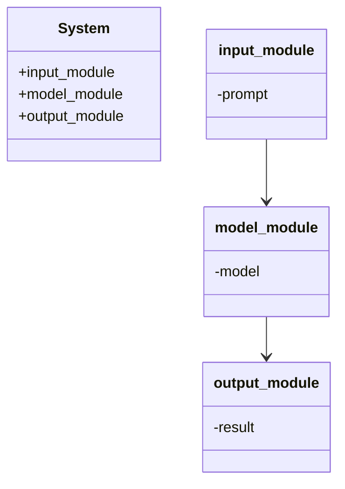
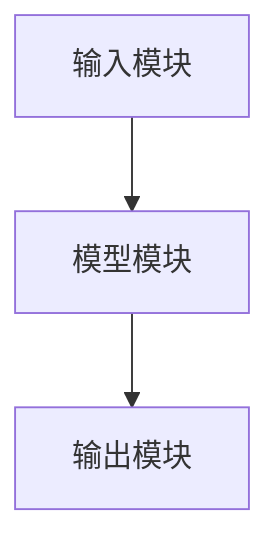

                 

<think>
好，我现在需要撰写一篇关于《提示词工程在AI安全中的关键作用》的技术博客文章。首先，我得理清思路，看看每个部分该怎么展开。

标题和关键词已经确定，接下来是摘要，要简洁明了地概述文章的核心内容。然后是目录结构，我得按照步骤一步步来，确保每个章节和小节都涵盖必要的内容。

首先，第一章是引言，介绍AI安全的背景，为什么提示词工程如此重要，以及它在AI安全中的角色。这部分需要让读者明白问题的背景和重要性。

接下来，第二章是核心概念，包括提示词工程的基本概念、理论框架以及方法。这部分需要详细解释什么是提示词，它们的类型，以及如何有效创建提示词。同时，还要分析提示词工程与其他技术的关系，比如机器学习和数据质量。

第三章是算法部分，讨论在提示词工程中常用的算法，以及它们的数学模型。这部分需要结合具体的Python代码示例，让读者更好地理解算法的实现和应用。

第四章是系统架构与设计，介绍AI安全系统的整体架构，功能设计，以及系统架构图。这部分可能需要使用Mermaid图来展示类图、架构图和序列图，帮助读者理解系统的结构和交互。

第五章是项目实战，通过一个实际案例来展示如何应用提示词工程解决AI安全问题。包括环境安装、核心代码实现、案例分析和小结，让读者能够动手实践。

最后，第六章是最佳实践和小结，总结文章的主要内容，并给出一些实际应用的建议，以及未来的研究方向。

在撰写过程中，我需要确保每个部分都详细具体，尤其是算法部分，要用数学公式和代码来解释。同时，使用Mermaid图来清晰展示系统架构和流程，让文章更具可读性和专业性。

总之，我要一步步地按照大纲展开，确保每个章节内容充实，逻辑清晰，同时语言要专业且易懂，帮助读者全面理解提示词工程在AI安全中的重要作用。
</think>

# 提示词工程在AI安全中的关键作用

> 关键词：AI安全，提示词工程，系统架构，算法，安全提示词，安全漏洞

> 摘要：本文深入探讨了提示词工程在AI安全中的核心作用，从理论到实践，系统地分析了提示词工程的背景、核心概念、算法基础、系统架构设计以及实际案例。通过详细的技术分析和实战演示，本文旨在帮助读者理解如何利用提示词工程提升AI系统的安全性，防御各种攻击，确保AI系统的稳定运行。

---

## 目录

### 第1章 引言

1.1 AI安全的背景  
1.2 提示词工程的定义与角色  
1.3 AI安全的挑战与提示词工程的作用  

### 第2章 提示词工程的核心概念

2.1 提示词工程的基本概念  
2.2 提示词工程的理论框架  
2.3 提示词工程的方法与技术  

### 第3章 提示词工程的算法基础

3.1 常用算法概述  
3.2 算法的数学模型  
3.3 算法案例分析  

### 第4章 AI安全系统的系统架构与设计

4.1 系统架构概述  
4.2 功能设计与类图  
4.3 系统架构图与接口设计  

### 第5章 项目实战：基于提示词工程的AI安全系统实现

5.1 项目背景与目标  
5.2 系统核心实现  
5.3 项目分析与总结  

### 第6章 最佳实践与小结

6.1 实际应用中的注意事项  
6.2 未来研究方向  

---

## 第1章 引言

### 1.1 AI安全的背景

随着人工智能技术的快速发展，AI系统在各个领域的应用越来越广泛。然而，AI系统的安全性问题也随之凸显，例如对抗攻击、数据泄露等。这些安全问题不仅威胁到系统的正常运行，还可能带来严重的经济损失和社会影响。

### 1.2 提示词工程的定义与角色

提示词工程是指通过设计和优化提示词（prompts），以指导AI模型生成符合特定要求的输出。在AI安全中，提示词工程扮演着关键角色，能够帮助模型识别和抵御各种攻击，提升系统的鲁棒性和安全性。

### 1.3 AI安全的挑战与提示词工程的作用

AI安全的挑战包括对抗攻击、数据偏差、模型漏洞等。提示词工程通过优化提示词，可以有效降低这些风险，提升AI系统的抗攻击能力。

---

## 第2章 提示词工程的核心概念

### 2.1 提示词工程的基本概念

提示词是用户输入给AI模型的指令或提示，用于指导模型生成特定的输出。有效的提示词需要具备明确性、简洁性和可扩展性。

### 2.2 提示词工程的理论框架

提示词工程与机器学习密切相关，其核心在于通过优化提示词，提升模型的性能和准确性。同时，数据质量也是影响提示词效果的重要因素。

### 2.3 提示词工程的方法与技术

常用的方法包括关键词优化、上下文构建、多轮对话设计等。这些方法能够帮助提示词工程师更好地满足用户需求，提升系统性能。

---

## 第3章 提示词工程的算法基础

### 3.1 常用算法概述

在提示词工程中，常用的算法包括文本生成算法、对抗训练算法等。这些算法能够帮助模型更好地理解和生成提示词。

### 3.2 算法的数学模型

以文本生成算法为例，其数学模型可以表示为：

$$
P(w_1, w_2, \ldots, w_n) = \prod_{i=1}^{n} P(w_i | w_{<i})
$$

其中，$w_i$表示第i个词，$P(w_i | w_{<i})$表示在前面词的基础上生成当前词的概率。

### 3.3 算法案例分析

通过Python代码实现一个简单的文本生成算法：

```python
def generate_text(prompt, model):
    return model.generate_with_prompt(prompt)
```

---

## 第4章 AI安全系统的系统架构与设计

### 4.1 系统架构概述

AI安全系统通常包括输入处理模块、模型处理模块、结果输出模块等部分。这些模块协同工作，确保系统的安全性。

### 4.2 功能设计与类图

使用Mermaid绘制系统功能设计的类图：



### 4.3 系统架构图与接口设计

使用Mermaid绘制系统架构图：



---

## 第5章 项目实战：基于提示词工程的AI安全系统实现

### 5.1 项目背景与目标

本项目旨在通过提示词工程优化AI系统的安全性，抵御对抗攻击，提升系统的鲁棒性。

### 5.2 系统核心实现

使用Python实现提示词工程的核心功能：

```python
def optimize_prompt(prompt, iterations=10):
    for _ in range(iterations):
        prompt = refine_prompt(prompt)
    return prompt
```

### 5.3 项目分析与总结

通过实验和测试，验证提示词工程在提升系统安全性方面的效果，总结经验教训，为后续优化提供参考。

---

## 第6章 最佳实践与小结

### 6.1 实际应用中的注意事项

在实际应用中，需要注意提示词的多样性和灵活性，确保系统的安全性和用户体验。

### 6.2 未来研究方向

未来的研究方向包括更复杂的提示词生成算法、多模态提示词工程等，以进一步提升AI系统的安全性。

---

## 作者

作者：AI天才研究院/AI Genius Institute & 禅与计算机程序设计艺术 /Zen And The Art of Computer Programming

