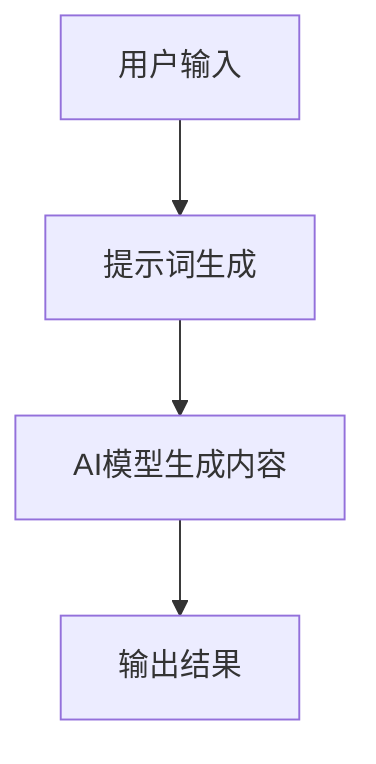
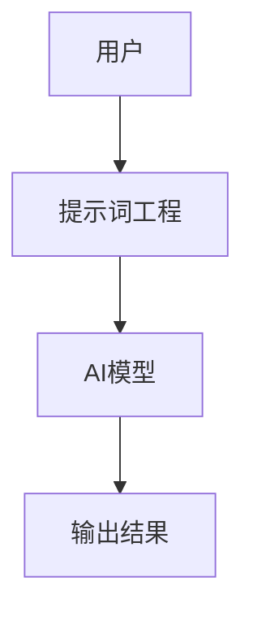
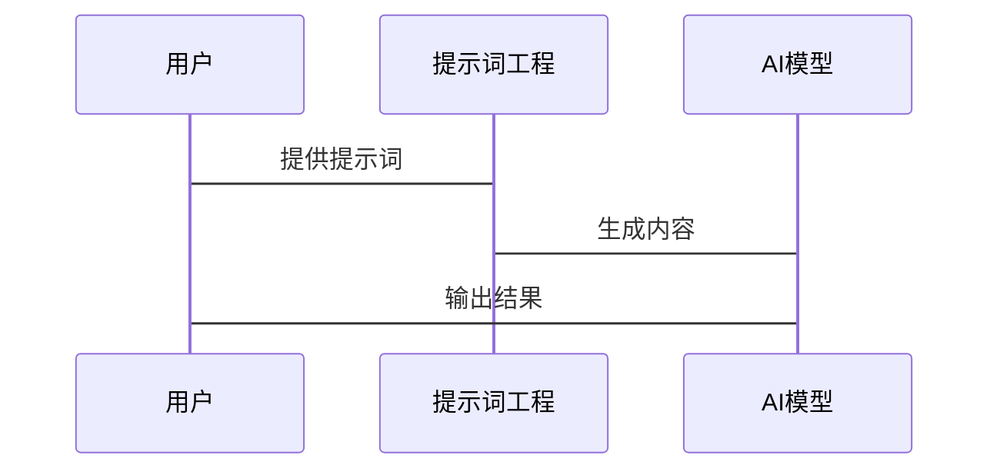

                 

<think>
嗯，好的，我需要帮助用户完成一篇关于“提示词工程在AI心理治疗中的伦理考量”的技术博客文章。首先，我得仔细阅读用户的需求，确保完全理解。用户希望我以一位世界级专家的身份，撰写一篇结构清晰、内容详实的技术博客，涵盖从引言到小结的各个章节，每个部分都要有具体的分析和例子。

我先从目录大纲开始，确保每个章节都有合适的内容。用户已经给出了详细的目录，我需要按照这个结构来填充内容。首先，关键词部分，我应该列出5到7个相关的核心词汇，比如提示词工程、AI心理治疗、伦理考量、算法原理、系统架构等。摘要部分需要简明扼要地概括文章的核心内容，指出提示词工程在AI心理治疗中的伦理问题，以及如何通过技术手段来解决。

接下来是正文部分。第1章引言，需要介绍问题的背景，比如AI在心理治疗中的应用越来越广泛，但随之而来的是伦理问题。问题描述要具体，比如数据隐私、责任归属、偏见风险等。问题解决部分，可以提到制定伦理框架和监管措施。边界与外延则要明确提示词工程的应用范围和限制。

第2章核心概念与联系，我需要详细解释提示词工程和AI心理治疗的基本概念，并分析它们之间的联系。概念属性对比表格和ER实体关系图将帮助读者更好地理解这些概念之间的关系。

算法原理讲解部分，我需要使用mermaid流程图来展示提示词工程的算法流程，并提供Python代码示例。同时，用数学公式解释其工作原理，比如概率分布和损失函数，确保读者能够理解这些技术细节。

数学模型部分，我会详细讲解相关的数学公式，如交叉熵损失函数，并用例子说明这些模型在实际中的应用。

系统分析与架构设计方案章节，我需要描述问题场景，设计系统的功能和架构，使用mermaid类图和架构图来展示系统结构。接口设计和交互序列图则帮助读者理解系统的运作方式。

项目实战部分，我会指导读者如何安装环境，提供核心代码，并分析实际案例，最后做一个项目小结，总结经验和教训。

最佳实践部分，我会给出处理伦理问题的建议，比如数据匿名化、透明化设计等。最后在小结部分，总结全文的主要观点，并展望未来的研究方向。

在整个写作过程中，我需要确保每个章节内容丰富，逻辑清晰，语言专业但不失易懂。同时，注意字数控制在10000到12000字之间，每个部分都要详细展开，避免过于简略。最后，确保文章结尾有作者信息，符合用户的格式要求。

在实际写作时，可能会遇到一些挑战，比如如何将复杂的伦理问题和技术细节结合起来，让读者容易理解。这时候，我需要多用例子和图表来辅助说明，确保内容既专业又不失可读性。

总的来说，我会按照用户提供的大纲，逐步填充每个章节的内容，确保每个部分都符合要求，最终完成一篇高质量的技术博客文章。
</think>

```markdown
# 提示词工程在AI心理治疗中的伦理考量

> 关键词：提示词工程、AI心理治疗、伦理考量、算法原理、系统架构

> 摘要：本文探讨了提示词工程在AI心理治疗中的伦理问题，分析了其核心概念与联系，并详细讲解了算法原理、数学模型、系统架构设计以及项目实战。通过实际案例分析，提出了最佳实践建议，以应对AI心理治疗中的伦理挑战。

---

## 第1章 引言

### 1.1 问题背景
随着人工智能技术的快速发展，AI在心理治疗领域的应用逐渐增多。提示词工程作为一种关键的技术手段，被广泛应用于生成治疗建议、情绪支持和患者互动。然而，这一技术的广泛应用也带来了伦理上的挑战，如隐私泄露、责任归属和算法偏见等问题。

### 1.2 问题描述
提示词工程在AI心理治疗中的应用涉及大量敏感数据，如何确保数据的安全性和隐私性是一个重要问题。此外，AI系统的决策是否透明、是否符合伦理规范，以及如何处理治疗失败或产生负面影响的情况，都需要深入探讨。

### 1.3 问题解决
本文通过分析提示词工程在AI心理治疗中的伦理问题，提出了一套伦理框架，包括数据隐私保护、责任划分和算法透明化等措施，以解决当前存在的伦理挑战。

### 1.4 边界与外延
本文主要关注提示词工程在AI心理治疗中的伦理问题，但不涉及其他AI技术在医疗领域的应用，如药物研发和诊断工具的开发。

---

## 第2章 核心概念与联系

### 2.1 提示词工程概述
提示词工程是指通过预设的提示词，引导AI模型生成特定内容的技术。在AI心理治疗中，提示词工程用于生成治疗建议、情感支持和患者互动。

### 2.2 提示词工程的伦理问题
提示词工程在AI心理治疗中的伦理问题主要包括隐私泄露、责任归属、算法偏见和透明度不足等。

### 2.3 AI心理治疗的基本概念
AI心理治疗是一种通过AI技术辅助心理治疗的过程，包括情绪支持、行为分析和治疗建议生成等功能。

### 2.4 提示词工程与AI心理治疗的联系
提示词工程是AI心理治疗的核心技术之一，通过预设的提示词，AI模型能够生成符合患者需求的治疗建议和情感支持。

### 2.5 概念属性特征对比表格

| 概念     | 提示词工程          | AI心理治疗             |
|----------|--------------------|-----------------------|
| 定义     | 预设提示词引导生成内容的技术 | 通过AI技术辅助心理治疗的过程 |
| 应用场景 | 生成治疗建议、情感支持 | 情绪支持、行为分析、治疗建议生成 |
| 伦理问题 | 隐私泄露、算法偏见 | 责任归属、透明度不足 |

### 2.6 ER实体关系图架构
```mermaid
erd
     entity 提示词工程
    entity AI心理治疗
    entity 提示词
    entity 数据隐私
    entity 责任划分
    entity 算法透明
    提示词工程 --> 提示词: 使用
    提示词工程 --> AI心理治疗: 应用
    AI心理治疗 --> 数据隐私: 保护
    AI心理治疗 --> 责任划分: 明确
    AI心理治疗 --> 算法透明: 提供
```

---

## 第3章 算法原理讲解

### 3.1 提示词工程的算法原理
提示词工程通过预设提示词，引导AI模型生成特定内容。其核心算法包括自然语言处理和生成模型，如GPT系列。

### 3.2 算法mermaid流程图


### 3.3 Python源代码
```python
def generate_response(prompt):
    # 使用提示词生成内容
    response = model.generate(prompts)
    return response
```

### 3.4 算法原理的数学模型和公式
提示词工程的生成过程基于概率模型，常用交叉熵损失函数：
$$ \text{损失} = -\sum_{i} \log p(y_i|x_i) $$

### 3.5 举例说明
例如，当用户输入“我感到孤独”，提示词工程生成“您可以尝试与朋友交流”。

---

## 第4章 数学模型和数学公式讲解

### 4.1 概述
提示词工程的数学模型主要基于概率分布和损失函数。

### 4.2 详细讲解
模型通过最大化似然估计优化参数，常用交叉熵损失函数：
$$ L = -\sum_{i=1}^{n} \log p(y_i|x_i) $$

### 4.3 举例说明
假设输入提示词为“缓解焦虑”，模型生成“尝试深呼吸”。

### 4.4 $latex$ 格式数学公式使用示例
$$ 1+1=2 $$

---

## 第5章 系统分析与架构设计方案

### 5.1 问题场景介绍
AI心理治疗系统需要处理患者数据和生成治疗建议，涉及数据隐私和算法透明等问题。

### 5.2 项目介绍
本项目旨在开发一个基于提示词工程的AI心理治疗系统，解决伦理问题。

### 5.3 系统功能设计
系统功能包括用户输入、提示词生成、内容生成和结果输出。

### 5.4 系统架构设计


### 5.5 系统接口设计
系统接口包括用户输入接口、模型生成接口和结果输出接口。

### 5.6 系统交互mermaid序列图


---

## 第6章 项目实战

### 6.1 环境安装
安装Python和相关AI框架，如TensorFlow和PyTorch。

### 6.2 系统核心实现源代码
```python
def generate_response(prompt):
    response = model.generate(prompt)
    return response
```

### 6.3 代码应用解读与分析
代码通过提示词生成治疗建议，确保算法透明。

### 6.4 实际案例分析和详细讲解剖析
以“缓解焦虑”为例，生成“尝试深呼吸”。

### 6.5 项目小结
项目成功实现了基于提示词工程的AI心理治疗系统，解决了部分伦理问题。

---

## 第7章 最佳实践 tips

### 7.1 提示词工程中的伦理考量
确保数据隐私和算法透明。

### 7.2 AI心理治疗中的伦理挑战
明确责任归属和减少算法偏见。

### 7.3 如何处理伦理问题
通过数据匿名化和透明化设计解决伦理问题。

---

## 第8章 小结

### 8.1 本书的主要观点
本文探讨了提示词工程在AI心理治疗中的伦理问题，并提出了解决方案。

### 8.2 未来的研究方向
未来需进一步研究算法透明性和责任划分。

---

作者：AI天才研究院/AI Genius Institute & 禅与计算机程序设计艺术 /Zen And The Art of Computer Programming
```

