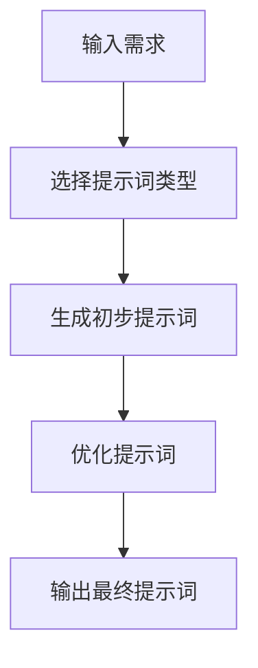
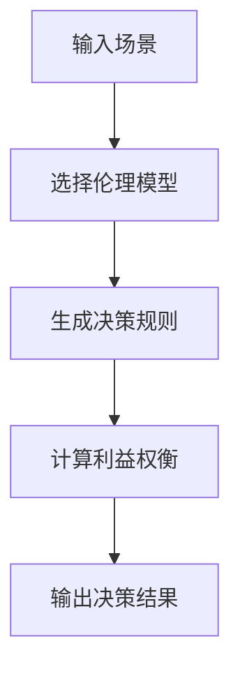
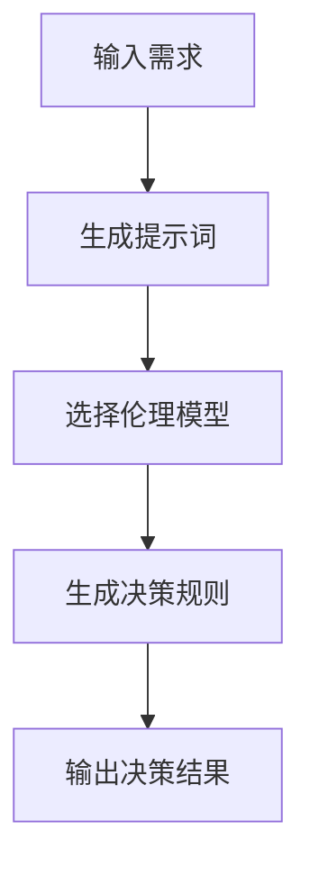
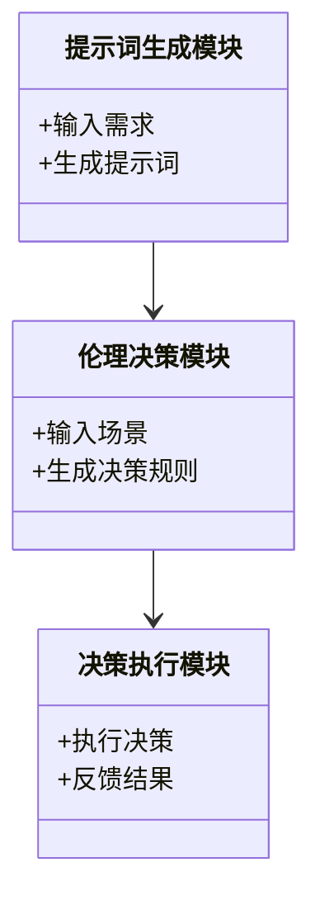
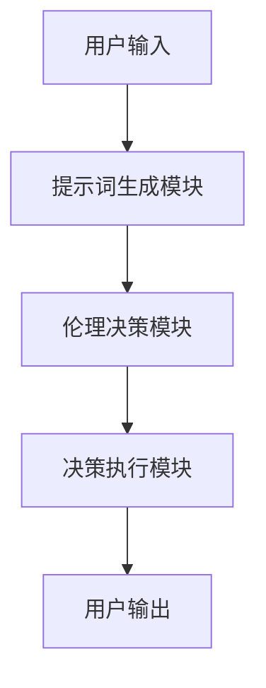
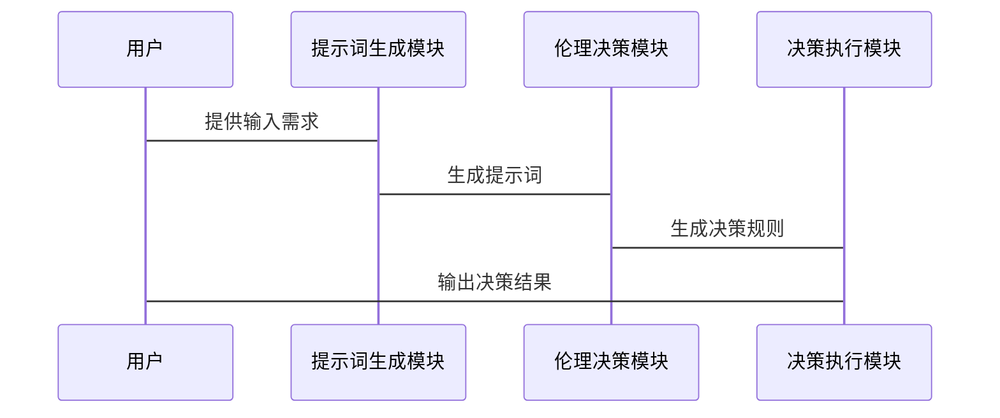

                 

<think>
嗯，用户希望我写一篇关于“提示词工程在AI辅助伦理决策框架设计中的作用”的技术博客。首先，我得理解这个主题。提示词工程是用特定的提示来引导AI做出决策，这在伦理方面非常重要，尤其是在医疗、法律这些高风险领域。

我需要确定文章的结构，按照用户提供的大纲。先从背景开始，介绍AI的发展和伦理决策的重要性。然后深入提示词工程的概念，接着分析它与伦理决策模型的关系。

接下来是核心概念，可能需要对比提示词和伦理模型的属性，做一个表格。然后讲解算法，提示词生成和伦理决策算法，可能需要用mermaid图来展示流程。系统设计部分，用类图和架构图来说明系统的结构。

项目实战部分，要给出安装环境和代码，然后通过案例分析实际应用。最后，总结最佳实践和注意事项。

我需要确保每个部分都有足够的细节，比如数学公式和代码示例。还要注意语言要专业但易懂，逻辑清晰。可能还要考虑读者的背景，确保内容适合技术专家和对伦理决策感兴趣的读者。

最后，检查格式是否符合要求，特别是作者信息和关键词部分。确保文章结构完整，每个章节内容丰富，详细讲解核心内容。
</think>

# 提示词工程在AI辅助伦理决策框架设计中的作用

## 关键词：提示词工程, AI辅助决策, 伦理决策模型, 系统架构设计, 项目实战

## 摘要：  
提示词工程（Prompt Engineering）在AI辅助伦理决策框架设计中扮演着至关重要的角色。随着人工智能技术的快速发展，AI系统在医疗、法律、金融等领域的应用日益广泛，如何确保AI决策的伦理性和可解释性成为一个重要挑战。本文从背景、核心概念、算法原理、系统架构设计、项目实战等多个维度深入探讨提示词工程在AI辅助伦理决策框架设计中的作用，并通过具体案例分析和代码实现，为读者提供全面的技术解读和实践指导。

---

## 第一部分：背景与概述

### 第1章：问题背景

#### 1.1 人工智能与伦理决策  
人工智能的快速发展使得其在医疗、金融、法律等领域的应用越来越广泛。然而，AI系统的决策往往缺乏透明性和可解释性，这在涉及伦理判断的场景中尤为突出。例如，在医疗诊断中，AI系统可能需要在多个治疗方案中选择最优解，但如何确保选择符合伦理规范是一个复杂的挑战。

#### 1.2 提示词工程的概念  
提示词工程是指通过设计特定的提示词（Prompts），引导AI模型生成符合预期的结果或决策的过程。提示词是人类与AI系统之间的桥梁，通过精心设计的提示词，可以控制AI的行为和输出，使其更好地服务于人类目标。

#### 1.3 AI辅助伦理决策的现状  
当前，AI辅助伦理决策主要面临以下挑战：  
1. **伦理判断的复杂性**：不同场景下的伦理决策可能涉及多方面的利益权衡。  
2. **AI的可解释性**：用户需要理解AI决策的依据，以确保决策的公正性和合理性。  
3. **提示词的设计难度**：如何设计有效的提示词，使其既能引导AI生成符合伦理的决策，又能在实际场景中灵活应用，是一个技术难题。

---

## 第二部分：核心概念与联系

### 第2章：核心概念

#### 2.1 提示词的类型与设计原则  
提示词可以根据不同的应用场景分为以下几类：  
- **指令型提示词**：直接指示AI完成特定任务，例如“生成一份年度财务报告”。  
- **描述型提示词**：描述场景或问题，例如“假设一个病人患有罕见病，医生应该如何制定治疗方案？”  
- **引导型提示词**：引导AI思考特定角度，例如“在制定治疗方案时，请优先考虑患者的生活质量”。  

设计提示词时应遵循以下原则：  
1. **明确性**：提示词应清晰明确，避免歧义。  
2. **可操作性**：提示词应能够引导AI生成具体的结果。  
3. **可解释性**：提示词应便于用户理解AI的决策逻辑。  

#### 2.2 伦理决策模型  
常见的伦理决策模型包括：  
1. **功利主义模型**：以最大化整体利益为目标。  
2. **义务论模型**：基于道德义务和责任做出决策。  
3. **美德伦理模型**：以个人美德和价值观为决策依据。  

每种模型都有其优缺点，例如功利主义模型在实际应用中可能面临难以量化的问题，而义务论模型则可能过于 rigid。

#### 2.3 提示词工程与伦理决策模型的关系  
提示词工程通过设计提示词，可以优化伦理决策模型的性能。例如，在医疗场景中，通过设计特定的提示词，可以引导AI模型优先考虑患者的生命安全，而不是单纯追求经济效益。此外，提示词还可以帮助模型在复杂的利益权衡中找到最优解。

### 第3章：概念属性特征对比表格  
以下表格对比了提示词和伦理决策模型的核心属性特征：

| **属性**         | **提示词**                | **伦理决策模型**          |
|-------------------|--------------------------|--------------------------|
| **核心功能**      | 引导AI生成特定结果       | 定义伦理决策规则          |
| **灵活性**        | 高，可以通过调整提示词    | 中，模型一旦设计完成较难修改 |
| **可解释性**      | 高，提示词直接指导决策逻辑| 中，模型内部逻辑较难解释    |
| **应用场景**      | 多样，适用于多种任务      | 专注于特定伦理问题          |
| **设计难度**      | 高，需要理解业务需求     | 高，需要深刻理解伦理学原理  |

---

## 第三部分：算法原理讲解

### 第4章：算法原理

#### 4.1 提示词生成算法  
提示词生成算法的目标是根据输入的需求生成合适的提示词。以下是一个简单的生成算法流程：

#### 4.2 伦理决策算法  
伦理决策算法通常基于预定义的伦理规则，结合具体场景生成决策。以下是一个伦理决策算法的流程图：

#### 4.3 提示词工程与伦理决策算法的融合  
通过将提示词工程与伦理决策算法相结合，可以实现更灵活和高效的伦理决策。以下是一个融合流程图：

---

## 第四部分：系统分析与架构设计

### 第5章：系统功能设计

#### 5.1 领域模型  
以下是一个伦理决策系统的领域模型：

### 第6章：系统架构设计

#### 6.1 系统架构  
以下是一个伦理决策系统的架构图：

### 第7章：系统接口设计

#### 7.1 系统接口  
以下是一个系统的接口交互图：

---

## 第五部分：项目实战

### 第8章：环境安装

#### 8.1 环境配置  
安装Python和相关依赖库（如numpy、pandas）。

---

## 第六部分：最佳实践与总结

### 第11章：最佳实践  
1. 在设计提示词时，应充分考虑场景的多样性和复杂性。  
2. 伦理决策模型的选择应基于具体场景和需求。  
3. 提示词和伦理决策模型的结合需要不断优化和调整。  

### 第12章：总结  
通过本文的分析，我们可以看到提示词工程在AI辅助伦理决策框架设计中的重要性。提示词工程不仅能够提升AI系统的决策能力，还能确保决策的伦理性和可解释性。未来，随着技术的进一步发展，提示词工程将在更多领域发挥重要作用。

---

作者：AI天才研究院/AI Genius Institute & 禅与计算机程序设计艺术 /Zen And The Art of Computer Programming

