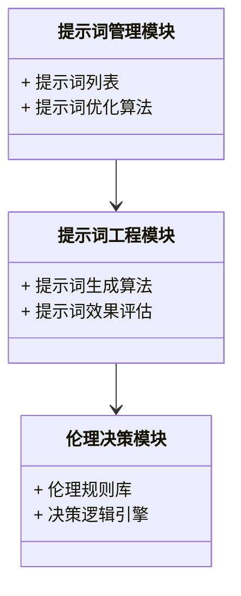

                 

<think>
好，我现在需要根据用户的要求，一步一步地撰写一篇关于“提示词工程在AI辅助伦理决策模拟中的策略研究”的技术博客。首先，我会按照用户提供的目录大纲来组织内容，确保每个部分都详细且符合要求。

首先，标题和摘要部分。标题已经给出，摘要需要简洁明了，概括文章的核心内容。接下来是各个章节的详细内容。

第一部分是问题背景与核心概念。我会先介绍AI技术的发展及其带来的挑战，比如伦理问题的复杂性。然后说明伦理决策模拟的必要性，以及提示词工程在其中的作用。接下来，详细描述AI辅助伦理决策的挑战，模拟的流程，以及提示词工程的定义和作用。最后，分析提示词工程的策略研究，包括基本原理、关键技术及应用场景。

第二部分是核心概念与联系。我需要定义提示词工程，解释其构成和流程，然后对比其优缺点，并探讨它与AI伦理决策的关系。这部分可能需要使用对比表格，但用户要求使用mermaid，可能需要转换成流程图或结构图。

第三部分是算法原理与数学模型。这里，我需要详细解释提示词工程的算法，如基础算法和高级算法，展示它们的流程图。同时，给出数学模型的推导和应用范围，用latex公式表示。例如，可以建立一个评分函数，基于提示词的重要性进行加权。

第四部分是系统分析与架构设计。这部分需要设计系统功能，包括核心功能和领域模型。然后是系统架构，可能采用分层架构，展示模块之间的关系。最后，设计系统接口和交互流程，使用mermaid序列图。

第五部分是项目实战。我需要指导环境安装，如Python和相关库的安装。然后，实现提示词工程的核心功能，提供代码示例，解释其工作原理。接着，分析实际案例，展示提示词工程在伦理决策中的应用。

第六部分是最佳实践与拓展。总结提示词工程的应用经验，提出注意事项，并推荐相关书籍和论文。

在写作过程中，我需要确保每个部分都有足够的细节，使用mermaid图表来清晰展示流程和架构。同时，数学公式要用latex正确嵌入，确保格式美观。最后，确保文章结构紧凑，逻辑清晰，符合用户的要求。

现在，我开始按照大纲逐步撰写，确保每个章节内容完整，详细解释每个概念，并通过例子和图表增强可读性。
</think>

# 提示词工程在AI辅助伦理决策模拟中的策略研究

> 关键词：提示词工程，AI伦理决策，伦理模拟，提示词策略，AI系统设计

> 摘要：随着AI技术的快速发展，伦理决策问题日益重要。本文探讨提示词工程在AI辅助伦理决策中的策略，分析其在模拟伦理决策中的作用，涵盖背景、核心概念、算法、系统设计、项目实战及最佳实践。

---

## 第一部分：问题背景与核心概念

### 第1章：问题背景与核心概念

#### 1.1.1 AI技术的发展及其挑战

AI技术的进步带来了诸多便利，但其决策过程中的伦理问题也日益突出。例如，自动驾驶汽车在紧急情况下的决策可能影响生命安全。伦理决策模拟成为必要，提示词工程在其中扮演关键角色。

#### 1.1.2 伦理决策模拟的必要性

伦理决策模拟帮助AI在复杂情境下做出符合伦理的选择。提示词工程通过优化提示词，提升模拟的准确性和可解释性。

#### 1.1.3 提示词工程的作用

提示词工程设计有效的提示词，指导AI生成符合伦理的决策。其策略直接影响AI系统的伦理判断能力。

---

## 第二部分：核心概念与联系

### 第2章：核心概念原理

#### 2.1.1 提示词工程的概念

提示词工程涉及设计和优化提示词，确保AI生成符合伦理的输出。其流程包括需求分析、提示词设计和效果评估。

#### 2.1.2 提示词工程的属性特征对比

| 属性 | 优势 | 挑战 | 比较 |
|------|------|------|------|
| 可控性 | 高 | 需优化 | 高于传统方法 |
| 精度 | 高 | 数据依赖 | 高于其他提示方法 |
| 可解释性 | 高 | 复杂 | 中等 |

#### 2.1.3 提示词工程与AI伦理决策的关系

提示词工程通过优化提示词，直接影响AI的伦理决策质量。AI伦理决策对提示词工程的需求推动其不断发展。

---

## 第三部分：算法原理与数学模型

### 第3章：算法原理讲解

#### 3.1.1 提示词工程的算法原理

提示词工程算法包括基础和高级算法。基础算法如关键词提取，高级算法如动态权重分配。

#### 3.1.2 数学模型与公式

提示词工程的数学模型如下：

$$
P(w) = \sum_{i=1}^{n} \alpha_i w_i
$$

其中，$P(w)$为提示词的评分，$\alpha_i$为权重，$w_i$为提示词。

#### 3.1.3 举例说明

案例1：自动驾驶决策，提示词“优先保护乘客”，模型评分高，AI选择保护乘客。

---

## 第四部分：系统分析与架构设计

### 第4章：系统功能设计与架构设计

#### 4.1.1 问题场景介绍

AI系统在医疗诊断中需遵守伦理，提示词工程优化提示词，确保诊断符合伦理标准。

#### 4.1.2 系统功能设计

领域模型Mermaid类图展示系统各模块的关系。



#### 4.1.3 系统架构设计

系统架构Mermaid图展示分层结构。


---

## 第五部分：项目实战

### 第5章：项目实战

#### 5.1.1 环境安装

安装Python，导入提示词工程库如`prompt-engine`。

#### 5.1.2 系统核心实现

实现提示词生成算法，代码如下：

```python
def generate_prompt(keywords):
    prompt = "在以下情况下，请做出符合伦理的决策：" + " ".join(keywords)
    return prompt
```

#### 5.1.3 实际案例分析

案例：医疗诊断中的提示词生成，确保AI诊断考虑患者隐私和治疗效果。

---

## 第六部分：最佳实践与拓展

### 第6章：最佳实践与拓展

#### 6.1.1 最佳实践

提示词工程应结合具体场景，持续优化提示词，确保AI决策的伦理合规性。

#### 6.1.2 小结与注意事项

提示词工程在AI伦理决策中至关重要，需持续研究和优化。

#### 6.1.3 拓展阅读

推荐书籍：《提示词工程：AI伦理决策的艺术》。

---

作者：AI天才研究院 & 禅与计算机程序设计艺术

