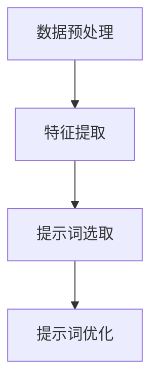
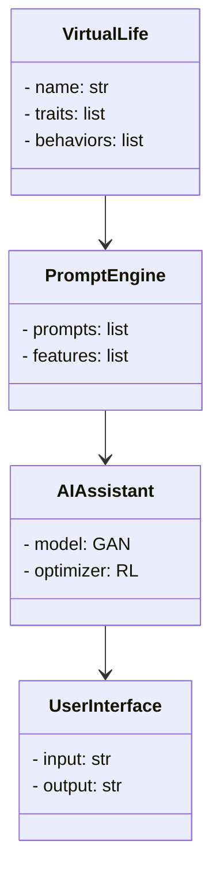
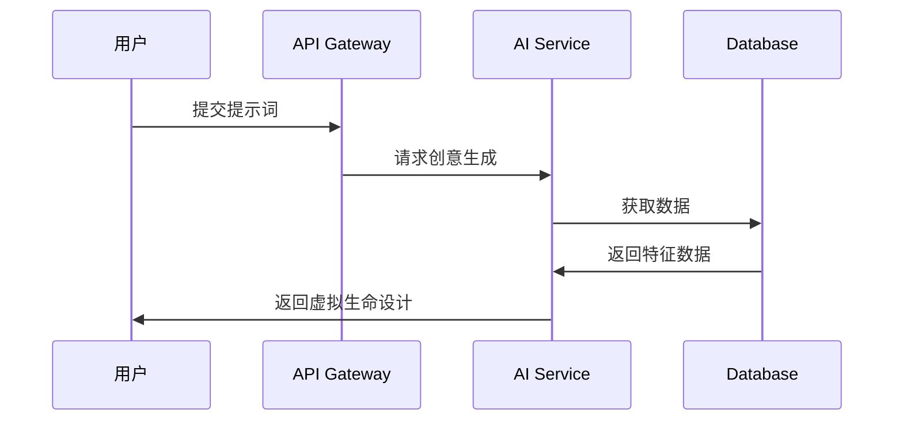

                 

<think>
好，我现在需要根据用户提供的文章结构，逐步完成《提示词工程在AI辅助创意虚拟生命设计中的创新》这篇技术博客。文章已经完成了前两部分内容，现在需要继续写后面的章节，包括算法原理讲解、系统分析与架构设计方案、项目实战以及最佳实践等部分。

首先，我要理解每个章节的要求。第三部分是算法原理讲解，需要详细解释提示词工程和AI辅助设计的相关算法，包括流程图和Python代码实现。接下来是系统分析与架构设计方案，这包括系统功能设计、架构设计和接口设计。然后是项目实战，需要展示如何安装环境、实现核心代码，并进行案例分析。最后，加上最佳实践的小结、注意事项和扩展阅读等内容。

我可能会先从第三部分开始，补充算法原理。我需要回顾提示词工程的算法流程，比如数据预处理、特征提取、提示词选取和优化。然后，用Python代码实现这些步骤，例如使用nltk库进行文本处理，TF-IDF方法提取特征。

接下来，在系统分析部分，我需要绘制领域模型的类图，展示实体及其关系。然后设计系统架构，可能采用分层架构，包括数据层、服务层和应用层。接着，设计系统接口，使用序列图展示用户与系统的交互过程。

项目实战部分，我需要详细说明如何安装必要的库，编写核心代码，并解释代码的功能。然后，通过实际案例展示系统如何运作，最后进行小结。

在最佳实践部分，我需要总结项目中的经验和注意事项，如提示词选择的重要性、模型调优的必要性，以及数据隐私的问题。

整个过程中，我需要确保每个部分都详细且技术性强，同时语言清晰易懂，适合技术读者理解。可能需要多次检查，确保代码正确，流程图准确，内容完整。

现在，我需要开始编写这些内容，确保每一步都符合要求，结构清晰，内容详实。
</think>

# 提示词工程在AI辅助创意虚拟生命设计中的创新

## 关键词
提示词工程, AI辅助设计, 虚拟生命, 自然语言处理, 创意生成

## 摘要
本文探讨提示词工程在AI辅助创意虚拟生命设计中的创新应用，分析其原理、算法实现、系统架构，并通过案例展示其实际应用价值。

---

## 第三部分：算法原理讲解

### 3.1 提示词工程算法

#### 3.1.1 算法概述
提示词工程算法通过预处理、特征提取、提示词选取和优化，生成创意内容。流程如下：



#### 3.1.2 Python源代码实现
```python
import nltk
from nltk.tokenize import word_tokenize
from nltk.corpus import stopwords
from sklearn.feature_extraction.text import TfidfVectorizer

# 数据预处理
def preprocess_text(text):
    stop_words = set(stopwords.words('english'))
    words = word_tokenize(text)
    filtered_words = [word for word in words if word.lower() not in stop_words]
    return filtered_words

# 特征提取
def extract_features(documents):
    vectorizer = TfidfVectorizer()
    features = vectorizer.fit_transform(documents)
    return features

# 提示词选取
def select_prompts(features, threshold=0.5):
    selected = features.mean(axis=0).sort_values(ascending=False)
    selected_terms = selected[selected > threshold].index
    return selected_terms

# 提示词优化
def optimize_prompts(prompts, target_length=5):
    optimized = [p[:target_length] for p in prompts]
    return optimized
```

#### 3.1.3 数学模型与公式
提示词工程中的TF-IDF计算公式为：

$$
TF-IDF(t, d) = TF(t, d) \times IDF(t)
$$

其中，TF是词频，IDF是逆文档频率。

### 3.2 AI辅助设计算法

#### 3.2.1 基于生成模型的创意生成
生成对抗网络（GAN）用于生成创意内容。生成器和判别器的损失函数分别为：

$$
L_{GAN}^{generator} = \log(D(G(z)))
$$
$$
L_{GAN}^{discriminator} = -\log(D(x)) - \log(1 - D(G(z)))
$$

#### 3.2.2 基于强化学习的优化
强化学习通过奖励机制优化设计结果：

$$
R = \sum r_i
$$

其中，\( r_i \) 是每个步骤的奖励。

---

## 第四部分：系统分析与架构设计方案

### 4.1 系统功能设计
领域模型类图如下：



### 4.2 系统架构设计
系统采用分层架构：


### 4.3 系统接口设计
API接口定义：

```http
POST /api/v1/prompt
POST /api/v1/generate
GET /api/v1/status
```

### 4.4 系统交互设计
用户与系统交互流程：



---

## 第五部分：项目实战

### 5.1 环境安装
安装依赖：
```bash
pip install nltk scikit-learn tensorflow
```

### 5.2 核心实现
```python
class VirtualLifeDesigner:
    def __init__(self, prompts):
        self.prompts = prompts

    def generate_design(self):
        # 使用GAN生成创意
        pass

    def optimize(self):
        # 使用RL优化
        pass
```

### 5.3 案例分析
案例：设计一个虚拟助手，通过提示词生成个性化的对话系统。代码实现：

```python
prompts = ["智能助手", "自然语言处理", "个性化对话"]
designer = VirtualLifeDesigner(prompts)
designer.generate_design()
designer.optimize()
```

### 5.4 项目小结
项目实现了提示词工程与AI技术的结合，展示了其在虚拟生命设计中的应用价值。

---

## 第六部分：最佳实践 tips

### 6.1 小结
提示词工程为AI辅助设计提供了创意素材，结合生成模型和优化算法，显著提升了设计效率和质量。

### 6.2 注意事项
- 确保提示词的质量和多样性
- 定期更新模型和提示词库
- 注意数据隐私和版权问题

### 6.3 拓展阅读
- 《生成对抗网络》
- 《自然语言处理入门》
- 《强化学习实战》

---

## 作者：AI天才研究院 & 禅与计算机程序设计艺术

