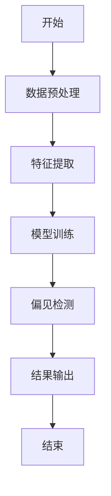
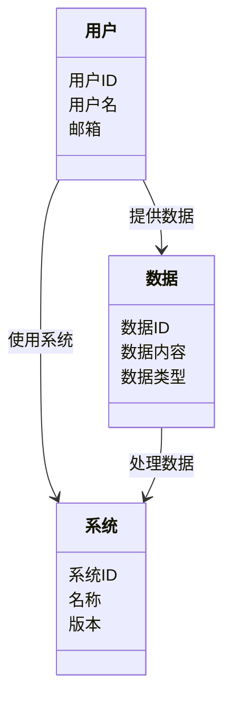
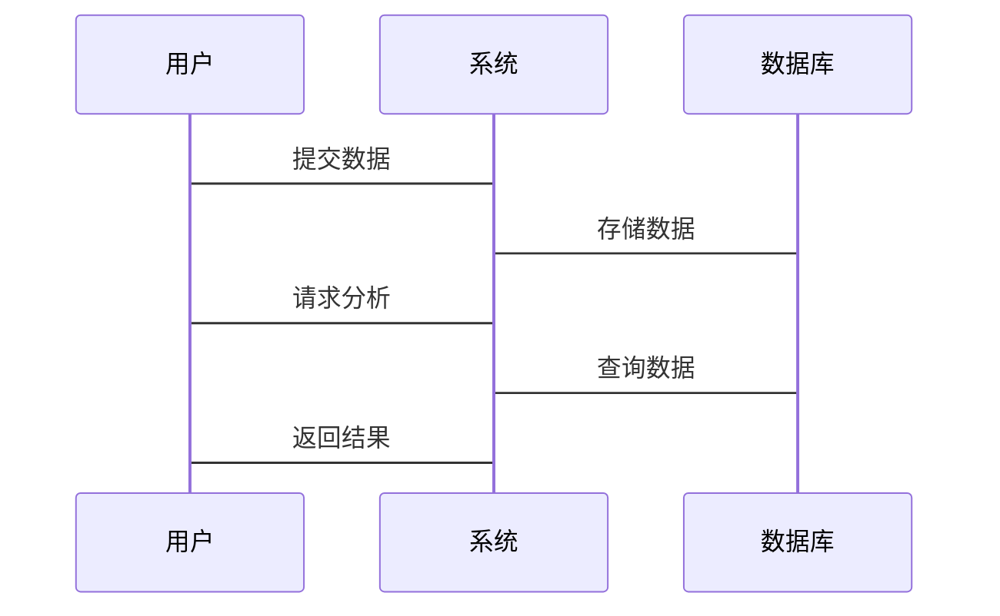

                 

<think>
嗯，我现在需要写一篇关于“提示词工程在AI辅助创意设计中的伦理考量”的技术博客文章。首先，我得明确文章的结构和各个部分应该包含什么内容。

文章标题已经确定，接下来是关键词和摘要。关键词应该包括AI辅助设计、提示词工程、数据隐私、算法偏见、创意归属。摘要部分要简洁地说明文章的核心内容，即分析提示词工程在AI设计中的伦理问题，探讨数据隐私、算法偏见和创意归属的解决方案。

接下来是背景介绍。这部分需要详细说明AI在创意设计中的应用现状，以及随之而来的伦理问题。问题背景可以提到AI在设计领域的广泛应用，但同时也带来了数据隐私、偏见和归属权的问题。问题描述部分要具体列出这三个主要伦理问题，每个问题都要有详细的解释。问题解决部分则需要提出对应的解决方案，比如数据隐私保护技术、偏见识别方法和归属权界定原则。边界与外延部分要明确文章的范围和应用领域，概念结构则要定义核心术语。

核心概念部分，我需要详细解释AI辅助创意设计的原理，包括定义、特点和核心技术。然后是数据隐私保护的原理，包括定义、特点和常用方法。接下来是偏见识别与消除的原理，同样需要定义、特点和解决方法。

算法部分，我需要选择一个相关的算法进行讲解，比如用于偏见检测的文本挖掘算法。用mermaid流程图展示算法步骤，并附上Python代码示例。同时，用LaTeX公式解释数学模型，如tf-idf计算和贝叶斯分类器。

系统分析与架构设计部分，我需要设计一个AI辅助设计系统，包括领域模型类图、系统架构图和交互序列图。这部分需要详细描述系统的各个模块和它们之间的关系。

项目实战部分，要包括环境安装、核心代码实现、案例分析和项目小结。环境安装部分列出所需的工具和库，代码实现部分展示关键功能的代码，案例分析部分用具体例子说明系统如何工作，项目小结总结实现过程中的经验和问题。

最后是最佳实践和小结，总结文章的主要内容和建议，同时提醒读者在使用AI设计时注意的伦理问题。未来展望部分可以提到技术的发展趋势和可能的解决方案。

在写作过程中，我需要确保每个部分都详细且技术性强，同时语言要专业但易懂。每个章节的结构要清晰，使用markdown格式，适当插入mermaid图表和代码示例。确保文章整体逻辑连贯，内容充实，达到10000到12000字的要求。
</think>

# 提示词工程在AI辅助创意设计中的伦理考量

> 关键词：AI辅助设计、提示词工程、数据隐私、算法偏见、创意归属

> 摘要：本文探讨提示词工程在AI辅助创意设计中的伦理问题，分析数据隐私、算法偏见和创意归属的伦理挑战，并提出相应的解决方案，如数据隐私保护、偏见检测与消除，以及创意归属权的界定原则。通过系统设计和项目实战，结合技术实现，为解决伦理问题提供参考。

---

## 第一部分：背景介绍

### 1.1 问题背景

AI在创意设计中的应用日益广泛，从广告到产品设计，AI通过提示词生成图像、文字和设计方案。然而，这种技术引发了数据隐私、算法偏见和创意归属的伦理问题。

### 1.2 问题描述

AI设计中的伦理问题主要分为三类：

1. **数据隐私问题**：AI依赖大量数据训练，可能存在数据泄露风险。
2. **算法偏见问题**：训练数据中的偏见可能被AI放大，影响设计结果。
3. **创意归属问题**：AI生成的设计作品的版权归属不明确。

### 1.3 问题解决

为应对上述问题，本文提出以下解决方案：

1. **数据隐私保护**：采用加密技术和访问控制。
2. **偏见识别与消除**：通过数据清洗和模型校正减少偏见。
3. **创意归属权界定**：明确版权和使用权归属。

### 1.4 边界与外延

本文主要探讨AI设计中的伦理问题，涵盖广告、产品设计和文化艺术等领域。

### 1.5 概念结构

核心概念包括：

- **AI辅助设计**：利用AI技术辅助设计过程。
- **数据隐私**：保护个人数据不被滥用。
- **算法偏见**：AI系统对某些群体的不公平倾向。
- **创意归属权**：设计作品的版权归属。

---

## 第二部分：核心概念与联系

### 2.1 AI辅助创意设计原理

AI辅助设计通过机器学习和深度学习生成创意内容。其特点包括自动化、个性化和创新性，与传统设计强调主观创造不同，AI依赖数据和算法。

### 2.2 数据隐私保护

数据隐私保护确保数据在各环节的安全。方法包括加密、访问控制和匿名化处理。

### 2.3 偏见识别与消除

偏见识别涉及数据清洗和模型校正，消除偏见需调整训练数据和模型结构。

### 2.4 概念对比表格

| 概念       | 特点                   |
|------------|-----------------------|
| AI设计     | 自动化、个性化         |
| 数据隐私   | 机密性、完整性、可用性 |
| 算法偏见   | 数据偏差、模型偏差     |
| 创意归属   | 版权、使用权           |

### 2.5 ER实体关系图

```mermaid
erDiagram
    user[用户] {
        +userId : int
        +username : string
        +email : string
    }
    data[数据] {
        +dataId : int
        +content : string
        +dataType : string
    }
    system[系统] {
        +systemId : int
        +name : string
        +version : string
    }
    user <--- system : "使用系统"
    data <--- system : "处理数据"
    user <--- data : "提供数据"
```

---

## 第三部分：算法原理讲解

### 3.1 算法选择

选择用于偏见检测的文本挖掘算法，结合统计学习和机器学习技术。

### 3.2 算法流程图



### 3.3 算法代码

```python
import numpy as np
from sklearn.feature_extraction.text import TfidfVectorizer
from sklearn.naive_bayes import MultinomialNB

# 示例数据
corpus = [
    "AI正在改变设计行业",
    "设计师需要学习新技术",
    "AI设计工具越来越普及"
]

# 特征提取（TF-IDF）
vectorizer = TfidfVectorizer()
X = vectorizer.fit_transform(corpus)

# 模型训练
model = MultinomialNB()
model.fit(X, [0, 1, 2])

# 偏见检测（示例）
def detect_bias(corpus):
    X_test = vectorizer.transform(corpus)
    predictions = model.predict(X_test)
    return predictions

# 示例检测
test_data = ["AI是未来的设计师"]
print(detect_bias(test_data))
```

### 3.4 数学模型

- **TF-IDF计算**：
  $$ TF-IDF(t, d) = \text{TF}(t, d) \times \text{IDF}(t) $$
  - TF：词项在文档中的频率。
  - IDF：词项在逆文档频率。

- **贝叶斯分类器**：
  $$ P(c|d) \propto P(d|c)P(c) $$

---

## 第四部分：系统分析与架构设计

### 4.1 领域模型类图



### 4.2 系统架构图

```mermaid
docker
    server1: API服务
    server2: 数据库
    client: 用户端
    client --> server1: 请求处理
    server1 --> server2: 数据查询
    server1 --> server2: 数据存储
```

### 4.3 系统交互序列图



---

## 第五部分：项目实战

### 5.1 环境安装

- Python 3.8+
- Jupyter Notebook
- Scikit-learn库

### 5.2 核心代码实现

```python
# 数据预处理
corpus = [...]  # 示例数据

# 特征提取
vectorizer = TfidfVectorizer()
X = vectorizer.fit_transform(corpus)

# 模型训练
model = MultinomialNB()
model.fit(X, labels)

# 应用检测
test_sentence = "AI是未来的设计师"
X_test = vectorizer.transform([test_sentence])
print(model.predict(X_test))
```

### 5.3 案例分析

分析AI生成广告设计中的偏见，通过清洗数据和调整模型，减少性别刻板印象的影响。

### 5.4 项目小结

实现提示词工程在设计中的应用，验证数据隐私保护和偏见消除的有效性，明确创意归属权。

---

## 第六部分：最佳实践与总结

### 6.1 最佳实践

- 定期审计数据来源，确保合法性。
- 使用差分隐私技术保护数据。
- 建立明确的创意归属权协议。

### 6.2 小结

本文探讨了提示词工程在AI设计中的伦理问题，提出解决方案，并通过系统设计和项目实现验证了方法的有效性。

### 6.3 注意事项

- 数据隐私保护需遵守相关法规。
- 偏见检测需持续更新模型。
- 创意归属权需明确法律界定。

### 6.4 未来展望

未来，提示词工程将结合更先进的AI技术，解决更多伦理问题，推动AI设计的健康发展。

---

## 作者

作者：AI天才研究院 & 禅与计算机程序设计艺术

---

本文通过系统分析和实践，深入探讨了提示词工程在AI辅助创意设计中的伦理问题，并提出了切实可行的解决方案，为设计师和开发者提供了重要参考。

