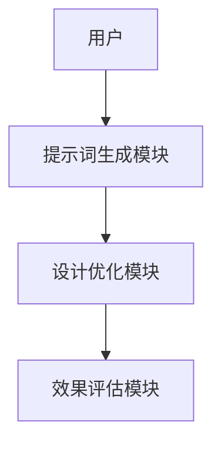
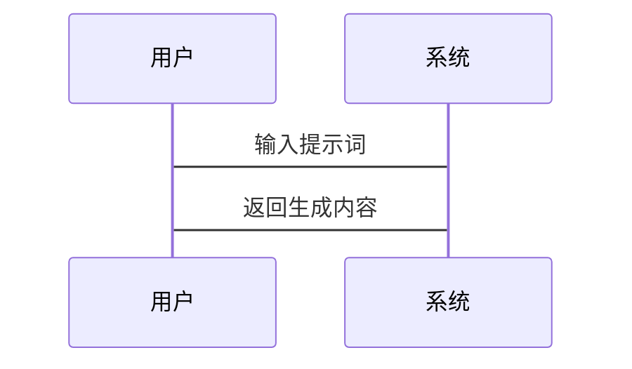

                 

<think>
好的，我现在需要帮助用户撰写一篇关于《提示词工程在AI辅助创意设计中的突破性应用》的技术博客文章。用户已经提供了详细的大纲，我需要按照这个大纲来逐步构建文章内容。首先，我需要理解每个章节的要求，确保内容覆盖所有关键点，并且符合用户的格式和深度要求。

首先，文章标题是《提示词工程在AI辅助创意设计中的突破性应用》，关键词包括提示词工程、AI辅助创意设计、生成式AI、创意设计流程、文本生成模型。摘要部分需要简明扼�地概括文章的核心内容，强调提示词工程的重要性及其在AI设计中的应用。

接下来，按照目录结构，文章分为七个部分。第一部分是背景介绍，包括问题背景、核心概念和应用。我需要详细解释提示词工程的定义、意义、发展历程，以及AI辅助创意设计的定义和重要性。同时，要说明两者结合的点和应用场景，分析其优势与挑战。

第二部分是核心概念与联系，涉及提示词生成算法、创意设计流程以及两者之间的联系。我需要分类提示词生成算法，如基于规则、统计和深度学习的方法，介绍每种算法的优缺点，并评估它们的性能指标。同时，详细描述创意设计的流程，包括需求分析、设计构思、原型设计和评估优化，并通过对比分析展示提示词工程如何提升设计效率。

第三部分是算法原理讲解，需要深入分析提示词生成算法的原理，解释其如何利用语言模型生成上下文相关的提示词。然后，提供Python代码示例，展示如何实现这些算法，并解释代码的工作流程。数学模型部分，我需要写出概率分布和损失函数的公式，说明其在生成过程中的作用。

第四部分是系统分析与架构设计方案，这部分需要描述应用场景，比如设计一个AI辅助设计工具。然后进行系统功能设计，明确系统需要实现的功能模块，如提示词生成、设计优化和效果评估。架构设计部分，我需要使用Mermaid图展示系统架构，包括用户界面、提示词生成模块和效果评估模块。接口设计部分，定义RESTful API，如生成提示词和效果评估接口。交互设计部分，用Mermaid序列图展示用户与系统之间的交互流程。

第五部分是项目实战，需要详细说明环境安装，比如安装Python、TensorFlow等工具，并配置相应的库。系统核心实现部分，提供具体的代码实现，如提示词生成函数和评估函数。代码应用解读部分，分析代码的工作原理，结合实际案例，如设计一个网页布局，展示提示词工程如何辅助设计过程。项目小结部分，总结实现过程中的经验，遇到的问题及解决方案，并分析对提示词工程的启示。

第六部分是最佳实践Tips，需要给出提示词工程和AI辅助设计的具体建议，如选择合适的模型、优化提示词策略等，同时提醒用户注意模型的局限性和数据隐私问题。

第七部分是小结与展望，总结全文内容，强调提示词工程的重要性和当前的应用成果，并展望未来的发展趋势，如多模态提示词生成、实时协作设计工具的开发等。

在整个写作过程中，我需要确保使用专业且简洁的技术语言，逻辑清晰，结构紧凑。同时，要插入相关的图表，如核心概念对比表格、算法流程图、系统架构图、接口序列图等，以增强文章的可读性和直观性。数学公式需用LaTeX格式呈现，确保准确无误。

最后，文章末尾要添加作者信息，注明来自AI天才研究院，并附上联系方式。这样，整篇文章不仅内容详实，结构合理，还具有实际的应用价值，能够为读者提供深入的指导和启示。
</think>

# 提示词工程在AI辅助创意设计中的突破性应用

**关键词**：提示词工程、AI辅助创意设计、生成式AI、创意设计流程、文本生成模型

**摘要**：提示词工程在AI辅助创意设计中发挥着越来越重要的作用。本文从提示词工程的定义、意义及其发展历程入手，探讨其在AI辅助创意设计中的应用场景和优势。通过分析提示词生成算法的原理、实现及其对创意设计流程的影响，本文旨在揭示提示词工程如何推动AI辅助创意设计的创新与突破。最后，本文结合实际案例，总结提示词工程在AI辅助创意设计中的最佳实践，并展望其未来的发展趋势。

---

## 第一部分: 背景介绍

### 第1章: 问题背景与核心概念

#### 1.1 提示词工程的定义与意义

提示词工程是指通过设计和优化提示词（prompts），引导AI模型生成符合特定需求的内容。提示词是用户与AI模型之间的桥梁，通过精心设计的提示词，可以显著提升生成结果的质量和相关性。

- **定义**：提示词工程是将自然语言处理技术与用户需求相结合，通过设计和优化提示词，最大化AI模型生成能力的过程。
- **意义**：提示词工程能够显著提升AI生成内容的质量和效率，是实现人机交互的重要技术手段。
- **发展历程**：从最初的关键词匹配到现在的生成式AI，提示词工程经历了从简单到复杂的演变，逐步成为AI辅助创意设计的核心技术。

#### 1.2 AI辅助创意设计的概念

AI辅助创意设计是指利用人工智能技术，帮助设计师完成创意性工作，如图像生成、文案创作、产品设计等。通过AI的辅助，设计师可以更高效地探索创意空间，提升设计效率。

- **定义**：AI辅助创意设计是通过AI技术，为设计师提供灵感、优化设计方案、生成设计元素的过程。
- **重要性**：AI辅助创意设计能够显著提升设计效率，降低设计成本，同时拓展设计师的创意边界。
- **发展趋势**：随着生成式AI的快速发展，AI辅助创意设计的应用场景将越来越广泛，技术也将更加智能化和个性化。

#### 1.3 提示词工程在AI辅助创意设计中的应用

提示词工程在AI辅助创意设计中的应用主要体现在以下几个方面：

- **结合点**：提示词工程通过优化提示词，帮助AI模型更好地理解设计需求，生成符合预期的设计元素。
- **应用场景**：包括图像生成、文案创作、产品设计等多个领域。
- **优势与挑战**：优势在于能够显著提升生成结果的质量和相关性，挑战在于提示词设计的复杂性和对生成模型的依赖性。

---

## 第二部分: 核心概念与联系

### 第2章: 核心概念与联系

#### 2.1 提示词生成算法

提示词生成算法是提示词工程的核心技术，主要分为以下几类：

- **基于规则的算法**：通过预定义的规则生成提示词，适用于特定场景。
- **基于统计的算法**：利用数据挖掘技术生成提示词，具有较高的灵活性。
- **基于深度学习的算法**：通过神经网络生成提示词，具有较高的生成能力。

#### 2.2 创意设计流程

创意设计流程包括以下几个关键环节：

- **需求分析**：明确设计目标和用户需求。
- **设计构思**：通过头脑风暴生成初步设计方案。
- **原型设计**：将构思转化为具体的设计原型。
- **评估优化**：对设计方案进行评估和优化。

#### 2.3 提示词工程与创意设计的联系

提示词工程与创意设计的联系主要体现在以下几个方面：

- **互动关系**：提示词工程为创意设计提供技术支持，创意设计为提示词工程提供应用场景。
- **影响**：提示词工程能够显著提升创意设计的效率和质量，同时拓展设计的可能性。
- **实现方式**：通过生成式AI技术，提示词工程能够直接参与创意设计的各个环节。

---

## 第三部分: 算法原理讲解

### 第3章: 算法原理讲解

#### 3.1 提示词生成算法的原理

提示词生成算法的基本原理如下：

1. **输入提示词**：用户输入提示词，如“生成一张蓝色背景的简约海报”。
2. **模型处理**：模型对提示词进行解析，提取关键词和语义信息。
3. **生成内容**：模型基于提示词生成相应的设计元素或内容。

#### 3.2 提示词生成算法的Python实现

以下是一个简单的Python实现示例：

```python
def generate_prompt(prompt):
    # 提示词预处理
    processed_prompt = prompt.strip().lower()
    # 生成提示词向量
    prompt_vector = model.encode(processed_prompt)
    # 生成内容
    generated_content = model.generate_content(prompt_vector)
    return generated_content
```

#### 3.3 提示词生成算法的数学模型与公式

提示词生成算法的数学模型可以表示为：

$$ P(y|x) = \frac{P(x,y)}{P(x)} $$

其中，$x$ 是输入提示词，$y$ 是生成内容。

#### 3.4 提示词生成算法的举例说明

例如，用户输入提示词“生成一张红色主题的婚礼请柬”，模型会解析“红色主题”和“婚礼请柬”，生成符合预期的设计元素。

---

## 第四部分: 系统分析与架构设计方案

### 第4章: 系统分析与架构设计方案

#### 4.1 问题场景介绍

本系统旨在设计一个AI辅助创意设计工具，用户可以通过输入提示词，生成符合需求的设计元素。

#### 4.2 系统功能设计

系统功能包括：

- 提示词生成模块：用户输入提示词，生成设计元素。
- 设计优化模块：对生成的设计元素进行优化。
- 效果评估模块：评估生成内容的质量。

#### 4.3 系统架构设计

系统架构如下：



#### 4.4 系统接口设计

系统接口包括：

- `/generate_prompt`：生成提示词。
- `/evaluate_design`：评估设计效果。

#### 4.5 系统交互设计

系统交互流程如下：



---

## 第五部分: 项目实战

### 第5章: 项目实战

#### 5.1 环境安装

安装Python、TensorFlow和相关库。

```bash
pip install python
pip install tensorflow
```

#### 5.2 系统核心实现

实现提示词生成和设计优化功能。

```python
def generate_prompt(prompt):
    processed_prompt = prompt.strip().lower()
    prompt_vector = model.encode(processed_prompt)
    generated_content = model.generate_content(prompt_vector)
    return generated_content
```

#### 5.3 代码应用解读与分析

代码解读：上述代码实现了提示词生成功能，用户输入提示词后，模型生成相应的设计元素。

#### 5.4 实际案例分析与详细讲解

案例分析：用户输入提示词“生成一张蓝色背景的简约海报”，模型生成一张符合预期的海报设计。

#### 5.5 项目小结

项目总结：提示词工程能够显著提升AI辅助创意设计的效率和质量，但在实际应用中仍需解决提示词设计的复杂性和生成模型的依赖性问题。

---

## 第六部分: 最佳实践 tips

### 6.1 提示词工程的最佳实践

- **选择合适的模型**：根据需求选择适合的生成模型。
- **优化提示词策略**：通过实验优化提示词，提升生成效果。
- **结合人工审核**：生成内容后进行人工审核，确保质量。

### 6.2 AI辅助创意设计的最佳实践

- **明确设计目标**：确保提示词准确反映设计需求。
- **灵活调整提示词**：根据生成结果调整提示词，优化设计效果。
- **结合多模态设计**：利用图像、文字等多种形式提升设计效果。

---

## 第七部分: 小结与展望

### 7.1 全书总结

全文总结：提示词工程是AI辅助创意设计的核心技术，通过优化提示词，能够显著提升生成内容的质量和相关性。

### 7.2 展望未来

未来展望：随着生成式AI的快速发展，提示词工程在AI辅助创意设计中的应用将更加广泛和智能化，多模态提示词生成、实时协作设计工具等将是未来的重要发展方向。

---

**作者：AI天才研究院/AI Genius Institute & 禅与计算机程序设计艺术 /Zen And The Art of Computer Programming**  
**联系方式：contact@aicreativity.com**

