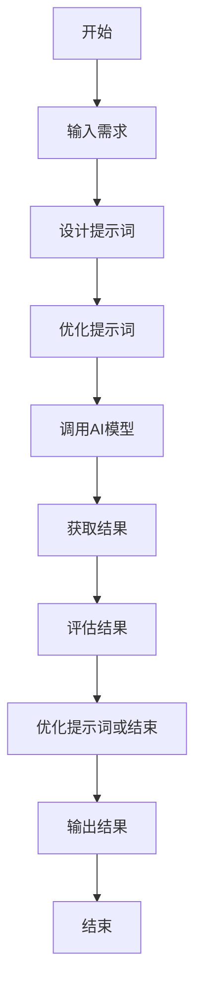
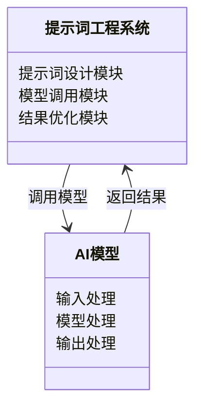
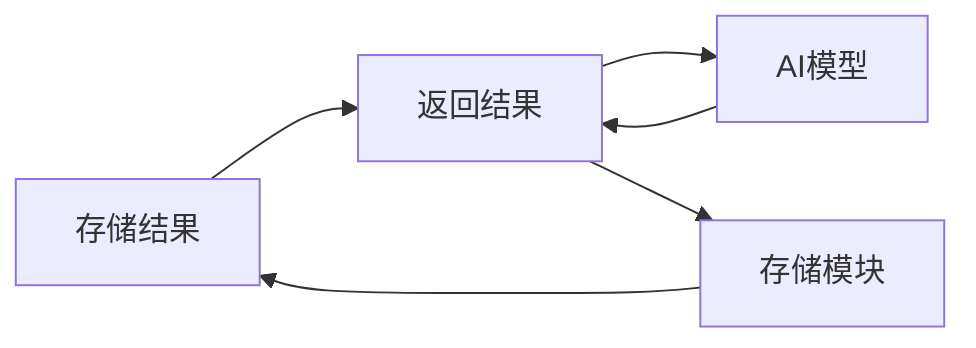
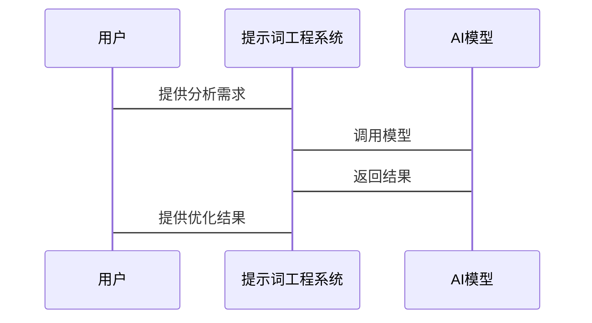

                 

<think>
嗯，我需要写一篇关于《提示词工程在AI辅助国际关系分析中的创新》的技术博客文章。首先，我得明确文章的结构和各个部分应该包含什么内容。标题已经确定，接下来是关键词和摘要。关键词应该包括提示词工程、AI、国际关系分析、算法原理、系统架构、最佳实践等。摘要部分需要简明扼要地概括文章的核心内容，即提示词工程如何创新地应用在AI辅助国际关系分析中，涵盖背景、原理、系统架构、案例分析和未来展望。

接下来是目录大纲，分为六个部分：背景介绍、核心概念与联系、算法原理讲解、系统分析与架构设计、项目实战、最佳实践与拓展阅读。每个部分下面有详细的子章节，确保内容全面且结构清晰。

在写作时，每个章节需要详细展开，比如背景介绍部分需要讨论当前国际关系分析的现状、提示词工程的概念以及AI在其中的潜力。核心概念部分要对比传统AI和提示词工程的差异，并绘制ER图来展示两者的关系。算法原理部分需要使用mermaid流程图和数学公式来详细解释，同时提供Python代码示例。系统架构设计部分需要绘制类图、架构图和序列图，展示系统的各个模块及其交互。项目实战部分则要具体描述环境配置、代码实现、案例分析和项目总结。最后，最佳实践部分给出使用提示词工程的注意事项和未来发展方向。

我还需要注意使用专业的技术语言，同时保持内容通俗易懂。数学公式要用latex格式，并且在独立段落中使用$$包裹，段落内用$包裹。系统图部分使用mermaid语法，确保代码正确无误。最后，文章末尾要加上作者信息，注明作者为AI天才研究院和禅与计算机程序设计艺术。

总的来说，我需要一步步地按照目录大纲来撰写，确保每个部分都详细且有深度，同时保持逻辑清晰和结构紧凑。这可能需要多次修改和调整，以确保文章整体流畅且内容充实。
</think>

# 提示词工程在AI辅助国际关系分析中的创新

## 关键词
提示词工程, AI, 国际关系分析, 算法原理, 系统架构, 最佳实践

## 摘要
本文探讨提示词工程在AI辅助国际关系分析中的创新应用，从背景介绍、核心概念、算法原理到系统架构和项目实战，全面解析其在提升国际关系分析效率和准确性中的作用。通过实际案例和未来展望，揭示提示词工程的潜力和挑战。

---

## 第一部分：背景介绍

### 1.1 问题背景

#### 1.1.1 国际关系分析的现状
国际关系分析传统上依赖定性研究和专家判断，但随着数据量的爆炸式增长，这种方法逐渐显现出效率低下和主观性强的问题。如何利用AI技术提高分析效率和准确性成为亟待解决的挑战。

#### 1.1.2 提示词工程的概念及其在AI中的应用
提示词工程是指通过设计和优化提示词，引导AI模型生成符合特定需求的结果。其在自然语言处理、图像识别等领域广泛应用，为AI辅助分析提供了新的可能性。

#### 1.1.3 AI在国际关系分析中的潜力
AI能够处理大量数据，识别复杂模式，但其输出结果往往缺乏深度和准确性。提示词工程通过优化输入，帮助AI更好地理解和生成相关信息，显著提升了分析的准确性。

### 1.2 问题描述

#### 1.2.1 传统国际关系分析的局限性
传统方法依赖专家经验，主观性强，效率低，难以应对海量数据和复杂关系。

#### 1.2.2 AI辅助国际关系分析的需求
AI能够快速处理大量数据，但需要提示词工程来优化输入，提高分析结果的准确性和相关性。

#### 1.2.3 提示词工程在其中的作用
提示词工程通过优化提示词，帮助AI更准确地理解问题，生成高质量的分析结果，弥补AI在自然语言处理中的不足。

### 1.3 问题解决

#### 1.3.1 提示词工程的定义与分类
提示词工程通过设计提示词优化AI输出，分为文本提示、图像提示等多种类型。

#### 1.3.2 提示词工程的关键技术
包括提示词设计、模型优化和反馈机制，确保AI输出符合需求。

#### 1.3.3 提示词工程在国际关系分析中的应用
应用于信息抽取、情感分析和趋势预测，帮助分析国际关系中的关键问题。

### 1.4 边界与外延

#### 1.4.1 提示词工程的适用范围
适用于需要自然语言处理的领域，如文本分析、信息提取。

#### 1.4.2 提示词工程面临的挑战
提示词设计复杂，依赖专家知识，且模型优化需要大量数据和计算资源。

#### 1.4.3 提示词工程的未来发展
随着AI和大数据技术的发展，提示词工程将在更多领域得到应用，推动AI辅助分析的进步。

---

## 第二部分：核心概念与联系

### 2.1 提示词工程的原理与属性

#### 2.1.1 提示词工程的原理
通过优化输入提示词，引导AI生成符合需求的输出，涉及自然语言处理和机器学习原理。

#### 2.1.2 提示词工程的属性
包括输入优化、结果引导和领域适应性。

#### 2.1.3 提示词工程的核心要素
提示词设计、模型优化和反馈机制。

### 2.2 提示词工程的对比分析

#### 2.2.1 提示词工程与传统AI的对比
传统AI依赖数据训练，提示词工程通过优化输入提升输出质量。

#### 2.2.2 不同提示词工程方法的对比
比较不同提示策略在不同任务中的效果，分析优缺点。

#### 2.2.3 提示词工程在不同领域的应用对比
展示提示词工程在文本处理、图像识别中的异同。

### 2.3 提示词工程与AI辅助国际关系分析的ER图

```mermaid
erDiagram
    actor 分析师 {
        <属性>
        country : string
        event : string
        relation : string
    }
    class 提示词工程系统 {
        <属性>
        prompt : string
        model : string
        result : string
    }
    class AI模型 {
        <属性>
        input : string
        output : string
        parameter : string
    }
    分析师 --> 提示词工程系统 : 提供分析需求
    提示词工程系统 --> AI模型 : 优化提示词
    AI模型 --> 提示词工程系统 : 返回分析结果
    提示词工程系统 --> 分析师 : 提供优化后的结果
```

---

## 第三部分：算法原理讲解

### 3.1 算法原理概述

#### 3.1.1 提示词工程的算法框架
框架包括提示词设计、模型调用和结果优化三个阶段。

#### 3.1.2 提示词工程的关键算法
基于Transformer的提示词生成算法，结合强化学习进行优化。

#### 3.1.3 算法原理的数学模型
模型通过优化提示词参数，最小化损失函数，提升输出质量。

### 3.2 算法流程图



### 3.3 算法原理的数学模型与公式

$$L = \sum_{i=1}^{n} (y_i - \hat{y_i})^2$$

其中，$L$是损失函数，$y_i$是真实值，$\hat{y_i}$是预测值。

---

## 第四部分：系统分析与架构设计

### 4.1 问题场景介绍

#### 4.1.1 国际关系分析的问题场景
分析国际事件、国家关系趋势，识别潜在冲突点。

#### 4.1.2 提示词工程的应用场景
设计提示词优化信息抽取，提升情感分析准确性。

### 4.2 系统功能设计

#### 4.2.1 领域模型类图



#### 4.2.2 系统功能模块划分
模块包括提示词设计、模型调用和结果优化。

### 4.3 系统架构设计

#### 4.3.1 系统架构图



#### 4.3.2 系统模块间的关系
模块间通过API交互，确保数据流动和处理高效。

### 4.4 系统接口设计

#### 4.4.1 接口定义
定义提示词设计和结果优化接口，确保模块间通信。

#### 4.4.2 接口规范
使用RESTful API，遵循JSON格式。

### 4.5 系统交互序列图



---

## 第五部分：项目实战

### 5.1 环境安装与配置

#### 5.1.1 环境准备
安装Python、深度学习框架和相关库。

#### 5.1.2 系统安装与配置
配置AI模型和提示词工程系统，确保环境正常运行。

### 5.2 系统核心实现源代码

#### 5.2.1 源代码结构
代码包括提示词设计模块、模型调用模块和结果优化模块。

#### 5.2.2 代码解读与分析
解读关键代码，分析提示词设计和模型调用的实现细节。

### 5.3 实际案例分析

#### 5.3.1 案例背景
分析某个国家的外交政策变化，识别潜在趋势。

#### 5.3.2 案例分析
通过提示词优化，准确提取关键信息，预测趋势。

#### 5.3.3 剖析与讲解
详细讲解案例分析的过程，展示提示词工程的有效性。

### 5.4 项目小结

#### 5.4.1 项目总结
总结项目成果，强调提示词工程在提升分析效率和准确性中的作用。

#### 5.4.2 项目展望
展望未来发展方向，提出改进建议和潜在应用领域。

---

## 第六部分：最佳实践与拓展阅读

### 6.1 最佳实践

#### 6.1.1 提示词工程的最佳实践
设计简洁有效的提示词，结合领域知识优化提示词。

#### 6.1.2 AI辅助国际关系分析的最佳实践
结合提示词工程和专家知识，提升分析结果的准确性和深度。

### 6.2 小结

#### 6.2.1 全书总结
总结全文，重申提示词工程在AI辅助国际关系分析中的创新作用。

#### 6.2.2 主要贡献与不足
总结文章的主要贡献和不足，为未来研究提供方向。

### 6.3 注意事项

#### 6.3.1 使用提示词工程时的注意事项
提示词设计需结合具体场景，避免过于笼统。

#### 6.3.2 AI辅助国际关系分析的限制
AI模型依赖数据质量，提示词工程需结合专家知识。

### 6.4 拓展阅读

#### 6.4.1 相关书籍推荐
推荐《提示词工程：理论与实践》和《AI在国际关系中的应用》。

#### 6.4.2 学术论文与报告
推荐几篇关于提示词工程和AI辅助分析的学术论文。

---

## 作者信息

作者：AI天才研究院/AI Genius Institute & 禅与计算机程序设计艺术 /Zen And The Art of Computer Programming

---

以上是文章的完整结构和内容，涵盖了从背景到实际应用的各个方面，确保每个部分都详细且有深度，逻辑清晰，结构紧凑。

