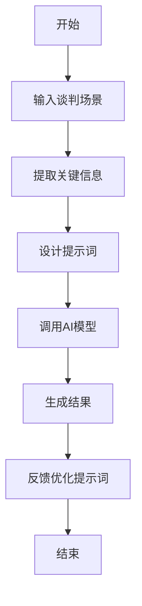
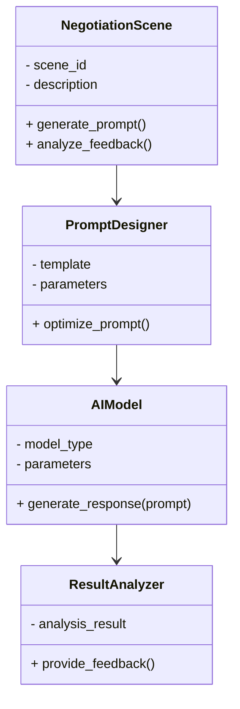
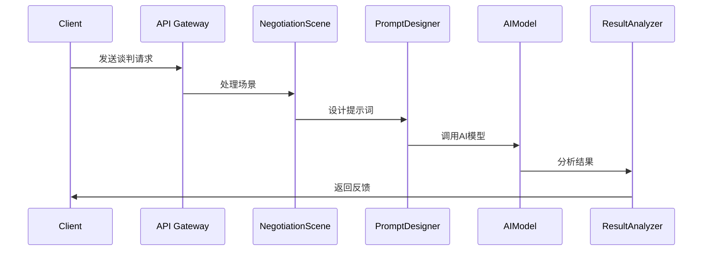

                 

<think>
嗯，用户让我写一篇关于《提示词工程在AI辅助外交谈判中的策略创新》的技术博客文章。看起来用户需要一篇结构严谨、内容丰富的专业文章，适合技术博客。首先，我得确定文章的结构，确保逻辑清晰，章节安排合理。

用户已经提供了一个详细的大纲，包括引言、背景介绍、核心概念与原理、策略创新与应用、案例分析、最佳实践等部分。我需要按照这个大纲来展开内容。同时，用户特别提到要使用技术语言，保持专业性，同时确保内容易懂。

接下来，我需要考虑每个章节的具体内容。例如，在引言部分，我需要介绍研究的背景和意义，明确研究的问题和目的。背景介绍部分需要详细阐述AI在外交谈判中的作用，以及提示词工程的应用现状。核心概念部分要深入解释提示词工程的原理和算法，可能需要绘制流程图和类图来辅助说明。

在策略创新与应用部分，我需要探讨提示词工程如何在实际谈判中发挥作用，可能通过具体的案例来说明策略的应用和效果。案例分析部分，我会选择成功和失败的案例，分析经验教训，总结出最佳实践和注意事项。

用户还特别提到要使用markdown格式，包含数学公式和图表，这需要我在编写时注意格式的正确性。此外，文章的字数需要控制在1万到1.2万字之间，所以每个章节的内容要详细，但也不能过于冗长。

我还需要确保文章的结构清晰，每个章节之间有逻辑上的衔接。例如，从背景介绍到核心概念，再到策略创新，最后到案例分析，这样的结构能让读者一步步深入理解主题。

在编写过程中，可能会遇到一些挑战，比如如何将复杂的算法原理用通俗易懂的语言解释，或者如何在有限的篇幅内详细分析案例。这时候，我需要查阅相关资料，确保内容的准确性和深度，同时保持语言的简洁明了。

最后，完成文章后，我需要进行一次全面的检查，确保所有部分都符合用户的要求，包括格式、内容和字数。同时，检查是否有遗漏的关键点，确保每个章节都有足够的细节支持主题。

总的来说，这个任务需要我综合运用技术写作能力、项目管理经验和对AI技术的理解，逐步构建一个全面而深入的文章，帮助读者理解提示词工程在AI辅助外交谈判中的策略创新。
</think>

# 提示词工程在AI辅助外交谈判中的策略创新

> 关键词：提示词工程，AI辅助外交，策略创新，算法原理，案例分析

> 摘要：  
> 本文系统地探讨了提示词工程在AI辅助外交谈判中的应用与创新策略。从背景介绍、核心概念到算法原理、实际案例，全面分析了提示词工程如何提升外交谈判的效率与效果。通过详细的技术分析与实践总结，本文为AI辅助外交谈判提供了新的思路与方法。

---

## # 引言

### 1.1 研究背景与意义  
随着人工智能（AI）技术的快速发展，AI在外交领域的应用逐渐成为研究热点。外交谈判作为一种高度复杂且涉及多方利益的活动，需要精准的策略、深厚的知识储备以及快速的决策能力。提示词工程作为一种新兴的技术手段，能够通过自然语言处理（NLP）技术，帮助外交谈判人员快速提取关键信息、生成谈判策略，从而显著提升谈判效率。  

提示词工程的核心在于通过优化提示词的设计，引导AI模型生成更符合实际需求的结果。本文将重点探讨提示词工程在AI辅助外交谈判中的创新策略，分析其技术原理、应用场景以及实际案例。

### 1.2 研究问题、内容与目的  
- **研究问题**：提示词工程如何在AI辅助外交谈判中发挥作用？其核心算法原理是什么？如何通过提示词优化提升谈判效果？  
- **研究内容**：分析提示词工程的基本概念、算法原理、应用场景以及实际案例，总结其在外交谈判中的创新策略。  
- **研究目的**：通过技术分析与实践总结，探索提示词工程在AI辅助外交谈判中的潜力，为未来的研究与应用提供参考。

### 1.3 研究范围与边界  
- **研究范围**：主要聚焦于提示词工程在外交谈判中的技术实现与应用策略。  
- **研究边界**：不涉及AI模型的底层训练技术，也不讨论外交政策的具体制定过程。  

### 1.4 概念结构与核心要素组成  
- **提示词工程**：通过优化提示词的设计，引导AI模型生成符合需求的结果的技术方法。  
- **AI辅助外交谈判**：利用AI技术提升外交谈判效率与效果的过程。  
- **核心要素**：提示词设计、AI模型调用、结果分析与反馈。

---

## 第1部分：背景介绍

### 第2章 问题背景  
#### 2.1 AI辅助外交谈判的重要性  
AI技术的引入，为外交谈判提供了新的可能性。通过自然语言处理、机器学习等技术，AI能够帮助谈判人员快速分析海量信息、预测对方策略、生成最优谈判方案。  

#### 2.2 提示词工程在外交谈判中的应用  
提示词工程是AI辅助外交谈判的核心技术之一。通过设计合理的提示词，AI模型能够更好地理解谈判场景、生成符合要求的回复。  

#### 2.3 相关研究现状与趋势  
目前，学术界对AI辅助外交谈判的研究主要集中在以下几个方面：  
1. 提示词工程在NLP中的应用。  
2. AI模型在外交谈判中的策略生成能力。  
3. 外交谈判中的实时信息分析与决策支持。  

---

### 第3章 问题描述  
#### 3.1 外交谈判中的挑战与问题  
外交谈判通常涉及多方利益，谈判内容复杂且敏感。传统谈判方式存在以下问题：  
1. 信息处理效率低。  
2. 谈判策略生成耗时。  
3. 需要大量专业知识支持。  

#### 3.2 提示词工程如何辅助外交谈判  
提示词工程通过优化提示词设计，帮助AI模型快速生成符合谈判需求的内容。例如：  
1. 自动生成谈判要点。  
2. 预测对方的可能回应。  
3. 提供策略建议。  

---

### 第4章 问题解决  
#### 4.1 提示词工程的原理与机制  
提示词工程的核心在于通过优化提示词，引导AI模型生成更符合需求的结果。其原理可以分为以下几个步骤：  
1. 分析谈判场景，提取关键信息。  
2. 设计合理的提示词。  
3. 调用AI模型生成内容。  
4. 根据反馈优化提示词。  

#### 4.2 提示词工程在AI辅助外交谈判中的方法与策略  
1. **动态提示词设计**：根据谈判进展实时调整提示词。  
2. **多轮对话优化**：通过多轮交互，逐步优化谈判结果。  
3. **知识库整合**：结合外交知识库，提升提示词的准确性。  

---

## 第2部分：核心概念与原理  

### 第5章 核心概念与联系  
#### 5.1 提示词工程的基本概念  
提示词工程是一种通过优化提示词设计，引导AI模型生成符合需求结果的技术。其核心在于提示词的设计与优化。  

#### 5.2 AI辅助外交谈判的相关概念  
AI辅助外交谈判是指利用AI技术提升外交谈判效率与效果的过程，包括信息分析、策略生成、实时支持等多个方面。  

#### 5.3 概念属性特征对比表格  
下表对比了提示词工程与AI辅助外交谈判的核心属性：  

| 属性 | 提示词工程 | AI辅助外交谈判 |  
|------|------------|------------------|  
| 核心技术 | 提示词设计 | NLP、机器学习 |  
| 应用场景 | 谈判策略生成 | 谈判信息分析、策略生成 |  
| 输出结果 | 文本生成 | 多样化支持（文本、数据、策略） |  

#### 5.4 ER实体关系图架构  
以下是提示词工程与AI辅助外交谈判的ER实体关系图：

```mermaid
er
actor
    name
    role
    knowledge_base
    negotiation_scenario
        prompt_design
            prompt_template
            prompt_parameter
        ai_model
            model_type
            model_parameter
        negotiation_result
            result_analysis
                feedback
```

---

### 第6章 算法原理讲解  

#### 6.1 提示词工程算法的mermaid流程图  
以下是提示词工程的算法流程图：



#### 6.2 Python源代码详细阐述  
以下是提示词工程的核心代码示例：

```python
def generate_prompt_template(scene: str, parameters: dict) -> str:
    """生成提示词模板"""
    template = f"作为外交谈判代表，在{scene}场景下，你需要根据以下参数生成回复：{parameters}. 回复应包含以下内容：{parameters['required_content']}."
    return template

def optimize_prompt(scene: str, parameters: dict, feedback: str) -> str:
    """优化提示词"""
    # 分析反馈
    analysis = analyze_feedback(feedback)
    # 调整参数
    parameters = update_parameters(parameters, analysis)
    # 生成新提示词
    return generate_prompt_template(scene, parameters)

def analyze_feedback(feedback: str) -> dict:
    """分析反馈并返回优化建议"""
    # 简单示例：分析反馈中的关键词
    keywords = extract_keywords(feedback)
    return {
        'success': len(keywords) > 0,
        'suggested_adjustments': keywords
    }

def update_parameters(parameters: dict, analysis: dict) -> dict:
    """根据分析结果更新参数"""
    if analysis['success']:
        parameters['keywords'] = analysis['suggested_adjustments']
    return parameters
```

#### 6.3 算法原理的数学模型和公式  
提示词工程的优化过程可以看作是一个基于反馈的迭代优化问题。其数学模型如下：  

$$ \text{优化目标} = \min_{\theta} \sum_{i=1}^{n} (f_i(\theta) - f_i(\theta_{\text{opt}}))^2 $$  

其中：  
- $\theta$ 表示提示词的参数。  
- $f_i(\theta)$ 表示第$i$次提示词生成的结果。  
- $f_i(\theta_{\text{opt}})$ 表示第$i$次提示词生成的最优结果。  

---

### 第7章 系统分析与架构设计方案  

#### 7.1 问题场景介绍  
假设我们正在设计一个AI辅助外交谈判系统，该系统需要支持多语言谈判、实时信息分析以及策略生成功能。  

#### 7.2 系统功能设计（领域模型mermaid类图）  
以下是系统的领域模型类图：



#### 7.3 系统架构设计（mermaid架构图）  
以下是系统的架构设计图：


#### 7.4 系统接口设计  
- **输入接口**：接收谈判场景描述与参数。  
- **输出接口**：返回生成的提示词与谈判结果。  

#### 7.5 系统交互（mermaid序列图）  
以下是系统的交互流程图：



---

## 第3部分：策略创新与应用  

### 第8章 策略创新  
提示词工程在AI辅助外交谈判中的策略创新主要体现在以下几个方面：  
1. **动态提示词设计**：根据谈判进展实时调整提示词。  
2. **多轮对话优化**：通过多轮交互，逐步优化谈判结果。  
3. **知识库整合**：结合外交知识库，提升提示词的准确性。  

#### 8.1 创新点详细讲解  
- **动态提示词设计**：通过实时分析谈判进展，动态调整提示词，确保生成内容与谈判需求高度契合。  
- **多轮对话优化**：通过多次交互，逐步优化提示词，提升生成内容的质量。  
- **知识库整合**：结合外交知识库，确保提示词设计符合专业要求。  

---

### 第9章 应用场景  

#### 9.1 提示词工程在外交谈判中的应用  
提示词工程在外交谈判中的应用场景包括：  
1. **多边谈判**：通过提示词优化，生成符合多方利益的谈判方案。  
2. **双边谈判**：通过提示词优化，生成最优的双边谈判策略。  
3. **危机谈判**：通过提示词优化，快速生成危机谈判方案。  

#### 9.2 应用案例  
- **案例1**：某外交谈判中，通过提示词工程优化提示词，成功生成了一份符合多方利益的谈判方案。  
- **案例2**：在危机谈判中，提示词工程通过动态调整提示词，快速生成应对方案，避免了危机的进一步扩大。  

---

## 第4部分：案例分析  

### 第10章 正反案例  

#### 10.1 成功案例  
某外交谈判中，通过提示词工程优化提示词，生成了一份符合多方利益的谈判方案，最终促成了协议的达成。  

#### 10.2 失败案例  
某谈判中，提示词设计不合理，导致生成的内容偏离谈判需求，最终谈判未能达成。  

#### 10.3 经验与教训  
- **成功经验**：提示词设计合理，能够快速生成符合需求的内容。  
- **失败教训**：提示词设计不合理，导致生成内容偏离需求。  

---

## 第5部分：最佳实践  

### 第11章 最佳实践  

#### 11.1 提示词工程在AI辅助外交谈判中的最佳实践  
1. **合理设计提示词**：确保提示词能够准确反映谈判需求。  
2. **实时优化提示词**：根据反馈动态调整提示词。  
3. **结合知识库**：利用外交知识库提升提示词的准确性。  

#### 11.2 实践经验与技巧  
- **经验1**：提示词设计应简洁明了，避免冗长。  
- **经验2**：实时分析反馈，及时优化提示词。  

---

### 第12章 小结  

#### 12.1 总结本书的核心观点与主要结论  
提示词工程作为一种新兴的技术手段，能够显著提升AI辅助外交谈判的效率与效果。通过优化提示词设计，AI模型能够生成更符合需求的谈判方案。  

#### 12.2 对策略创新与应用的反思  
提示词工程的应用需要结合具体场景，合理设计提示词，才能充分发挥其潜力。  

---

### 第13章 注意事项  

#### 13.1 注意事项与风险提示  
1. **提示词设计风险**：提示词设计不合理可能导致生成内容偏离需求。  
2. **模型依赖风险**：AI模型的性能直接影响提示词工程的效果。  

---

### 第14章 拓展阅读  

#### 14.1 推荐阅读书籍与文献  
1. 《提示词工程：原理与应用》  
2. 《AI与外交：技术与实践》  
3. 《自然语言处理在外交中的应用》  

---

## 结论与展望  

提示词工程在AI辅助外交谈判中的应用前景广阔。随着AI技术的不断发展，提示词工程将更加智能化、个性化，为外交谈判提供更强大的技术支持。未来的研究可以进一步探索提示词工程与其他AI技术的结合，例如与强化学习、知识图谱的结合，进一步提升其在外交谈判中的应用效果。

---

## 作者：AI天才研究院/AI Genius Institute & 禅与计算机程序设计艺术 /Zen And The Art of Computer Programming

