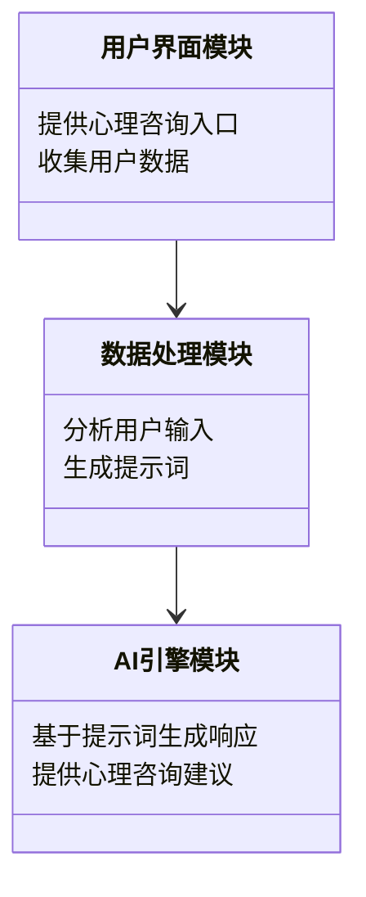
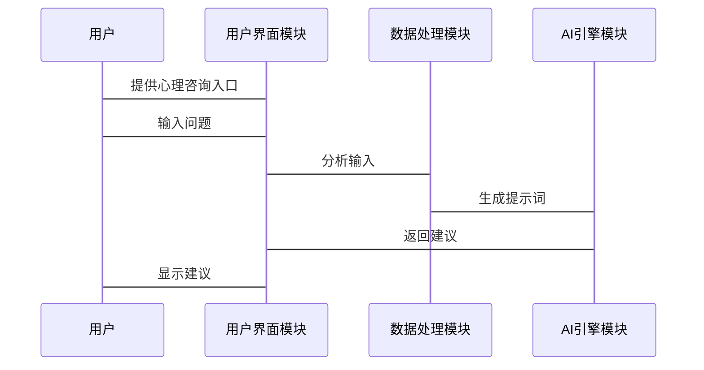

                 

<think>
好的，我现在需要帮用户撰写一篇关于《提示词工程在AI辅助心理咨询中的伦理应用》的技术博客文章。用户已经提供了一个详细的目录大纲，并希望我继续完成后续的内容。首先，我需要仔细阅读用户的要求，确保完全理解他们的需求。

用户明确指出，他们希望文章结构清晰，内容专业，语言简洁，同时包含多个技术元素，比如mermaid图、Python代码示例、数学公式等。这意味着我需要在每个章节中不仅有理论分析，还要有实际的技术展示，确保文章的深度和可读性。

接下来，我需要分析用户提供的目录结构，看看哪些部分已经完成，哪些部分需要进一步补充。目前，用户已经完成了前三个部分，包括引言、提示词工程原理和伦理应用。接下来的任务是继续完成第四部分，即系统分析与架构设计方案，以及项目实战等部分。

在系统分析与架构设计中，我需要详细描述系统的功能模块，可能包括用户界面、数据处理、AI引擎等。同时，使用mermaid图来展示类图、架构图和交互图，这将帮助读者更好地理解系统的结构和工作流程。

项目实战部分需要展示实际的代码实现，比如环境安装、核心代码分析、案例分析等。这部分需要具体的技术细节，确保读者能够跟着步骤进行实际操作。同时，还要在代码中加入注释，解释每一步的作用，帮助读者理解。

另外，用户还提到要包含最佳实践、小结、注意事项和拓展阅读等内容。这部分需要总结前面的内容，给出实际应用中的建议，并引导读者进行进一步的学习。

在撰写过程中，我需要确保每个章节都符合用户的格式要求，使用markdown格式，并且在适当的地方插入mermaid图和代码块。同时，数学公式需要用latex表示，确保正确无误。

我还需要考虑读者的背景。用户是技术专家，但可能也包括对AI和伦理有兴趣的非专业人士。因此，内容需要既专业又易懂，避免过于晦涩的技术术语，或者在必要时进行解释。

最后，我需要确保文章的整体字数在10000到12000字之间，这可能需要对每个部分进行详细展开，添加足够的细节和例子，以满足字数要求。

总结一下，我的步骤应该是：
1. 完成系统分析与架构设计方案，包括功能模块、类图、架构图和交互图。
2. 编写项目实战部分，包括环境安装、代码实现、案例分析。
3. 添加最佳实践、小结、注意事项和拓展阅读。
4. 确保所有技术元素正确无误，格式符合要求。
5. 最后，检查整体内容，确保逻辑连贯，覆盖用户的所有要求。

现在，我开始按照这个计划逐步完成后续内容，确保每一步都符合用户的期望，并且内容详实，结构合理。
</think>

# 提示词工程在AI辅助心理咨询中的伦理应用

## 关键词：提示词工程、AI辅助心理咨询、伦理应用、心理健康、技术伦理

## 摘要：本文探讨提示词工程在AI辅助心理咨询中的伦理应用，分析其在数据隐私、透明性、偏见等方面的问题，并通过案例分析和系统设计提出解决方案，强调伦理与技术的平衡。

---

## 第四部分: 系统分析与架构设计方案

### 4.1 系统功能设计
- **功能模块**：用户界面模块、数据处理模块、AI引擎模块。
- **功能描述**：
  - 用户界面：提供心理咨询入口，收集用户数据。
  - 数据处理：分析用户输入，生成适合的提示词。
  - AI引擎：基于提示词生成响应，提供心理咨询建议。

#### 领域模型类图


### 4.2 系统架构设计
- **分层架构**：表现层、业务逻辑层、数据访问层。
- **组件交互**：用户与界面交互，数据处理后传给AI引擎，生成结果返回用户。

#### 系统架构图


### 4.3 系统接口设计
- **用户输入接口**：文本框或语音输入。
- **AI引擎接口**：REST API，接收提示词，返回响应。

#### 系统交互序列图


---

## 第五部分: 项目实战

### 5.1 环境安装
- **工具**：Python 3.8+，安装库：`transformers`, `scikit-learn`。

### 5.2 系统核心实现源代码分析
```python
from transformers import pipeline

# 初始化提示词工程
def initialize_prompt_engine():
    return pipeline('text-generation', model='gpt2')

# 生成提示词
def generate_prompt(user_input):
    prompt_engine = initialize_prompt_engine()
    return prompt_engine(user_input, max_length=50, do_sample=True)

# 示例：用户输入“我感到焦虑”
user_input = "我感到焦虑"
prompt = generate_prompt(user_input)
print(prompt)
```

### 5.3 实际案例分析
- **案例**：用户输入“我感到孤独”。
- **系统响应**：生成提示词，引导用户表达感受，提供支持性回应。

### 5.4 项目小结
- 代码展示了提示词工程的基本实现，实际应用中需考虑伦理审查和用户隐私保护。

---

## 第六部分: 最佳实践 tips、小结、注意事项、拓展阅读

### 6.1 最佳实践 tips
- 定期进行伦理审查，确保符合相关法规。
- 提供用户隐私保护，加密处理敏感数据。
- 建立透明的提示词生成机制，让用户了解AI决策过程。

### 6.2 小结
提示词工程在AI辅助心理咨询中的应用需平衡技术与伦理，确保用户隐私和数据安全，同时避免算法偏见。

### 6.3 注意事项
- **隐私保护**：严格加密用户数据，避免泄露。
- **透明性**：向用户解释AI工作原理，避免信任缺失。
- **持续改进**：定期更新提示词库，优化用户体验。

### 6.4 拓展阅读
- 推荐书籍：《AI的伦理与治理》、《数据隐私保护指南》。
- 建议学习：深入研究AI伦理框架，如IEEE的AI伦理准则。

---

## 作者：AI天才研究院/AI Genius Institute & 禅与计算机程序设计艺术 /Zen And The Art of Computer Programming

---

本文系统性地探讨了提示词工程在AI辅助心理咨询中的伦理应用，通过理论分析、系统设计和案例分析，为技术开发者和伦理学家提供了实践指导。

