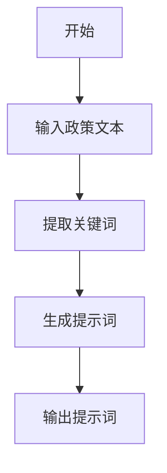
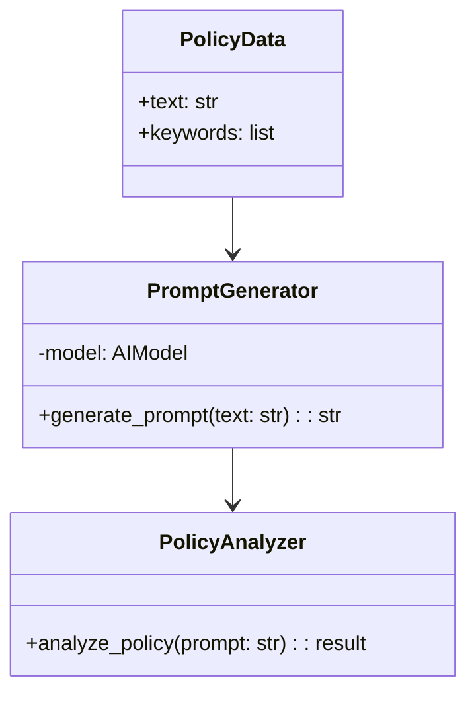
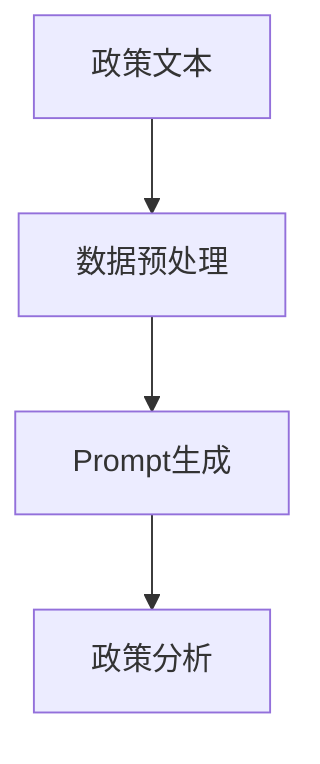

                 

<think>
嗯，用户希望我以“提示词工程在AI辅助政策制定中的策略研究”为标题，撰写一篇技术博客文章。首先，我需要理解提示词工程是什么，以及它如何与AI辅助政策制定相关联。

提示词工程，听起来像是通过设计和优化提示词来提高AI模型的性能和效果。这在政策制定中可能非常有用，因为政策制定需要精准的信息和决策，而AI可以帮助处理大量数据和复杂情况。

接下来，我需要考虑文章的结构。用户已经提供了一个大纲，分为几个部分：背景与概述、核心概念与原理、算法原理与实践、系统架构与实现、实战与应用、最佳实践与总结。每个部分下面还有子章节，内容非常详细。

关键词部分，我需要列出5-7个相关词汇，比如提示词工程、AI辅助政策制定、自然语言处理、政策模拟与评估、机器学习等。

摘要部分，我需要简明扼要地总结文章的核心内容，说明提示词工程在政策制定中的重要性，以及文章将探讨的策略和应用。

接下来，进入正文部分。首先是问题背景与概念介绍，我需要解释什么是提示词工程，它在AI辅助政策制定中的作用，以及当前的现状和挑战。这部分需要让读者理解问题的重要性。

然后是核心概念解析，详细解释提示词工程的核心要素，如数据收集、提示词生成算法、优化与评估。同时，还要介绍AI辅助政策制定的基本原理，包括政策分析模型和模拟评估。

在算法原理部分，我需要详细讲解提示词生成和优化的算法，使用mermaid流程图来展示流程，并提供Python代码和数学模型。这部分需要确保读者能够理解算法的工作原理，以及如何实现。

系统架构设计部分，我需要绘制领域模型类图和系统架构图，展示系统的各个模块及其交互。接口设计和系统交互序列图也很重要，帮助读者理解系统的整体结构。

实战案例部分，通过实际案例展示提示词工程的应用，包括环境安装、系统实现、案例分析等。这部分需要具体且有实际操作性，让读者能够跟着步骤实施。

最后是最佳实践与总结，总结文章内容，提供实用建议，并展望未来的研究方向。

在写作过程中，我需要确保每个章节内容丰富，详细讲解，同时使用专业的技术语言，但保持条理清晰，逻辑严密。还要注意使用适当的图表和代码示例，帮助读者更好地理解。

另外，字数要求在10000到12000字左右，这意味着每个部分都需要详细展开，不能过于简略。同时，结尾要加上作者信息，注明所属机构和专业领域。

总的来说，我需要系统性地梳理提示词工程在政策制定中的应用，结合技术细节和实际案例，为读者提供有价值的信息和深入的分析。这将帮助政策制定者更好地利用AI技术，提高决策的效率和准确性。
</think>

# 提示词工程在AI辅助政策制定中的策略研究

> **关键词**：提示词工程，AI辅助政策制定，自然语言处理，政策模拟与评估，机器学习

> **摘要**：  
本文旨在探讨提示词工程在AI辅助政策制定中的应用策略。通过分析提示词工程的基本概念、核心算法、系统架构及实际案例，本文深入探讨了提示词工程如何提升政策制定的效率和准确性。文章从问题背景、核心概念、算法原理、系统设计到实战案例，层层展开，结合理论与实践，为AI辅助政策制定提供了系统性解决方案。  

---

## 正文

### 第一部分：背景与概述

#### 第1章：问题背景与概念介绍

##### 1.1 提示词工程概述
###### 1.1.1 提示词工程的基本概念  
提示词工程（Prompt Engineering）是通过设计和优化提示词（prompts），使AI模型能够更好地理解和生成符合特定需求的文本。提示词是用户输入给AI模型的指令或引导信息，直接影响模型的输出结果。  

提示词工程的核心目标是通过优化提示词，最大化AI模型的性能，使其在特定任务中表现更佳。例如，在政策制定中，提示词工程可以通过设计适当的提示词，帮助AI模型生成更准确的政策建议或模拟政策效果。  

###### 1.1.2 提示词工程在AI辅助政策制定中的重要性  
在政策制定过程中，决策者需要处理大量复杂的信息，包括经济、社会、法律等多个领域的数据。AI辅助政策制定可以通过自然语言处理（NLP）、机器学习等技术，帮助政策制定者快速分析数据、模拟政策效果并提出建议。而提示词工程在其中起到了关键作用，它决定了AI模型如何理解和处理这些信息。  

提示词工程的优势在于：  
1. **提升效率**：通过优化提示词，AI模型可以更快地生成符合需求的政策建议。  
2. **提高准确性**：提示词设计得当，可以减少模型输出的偏差，确保政策建议的科学性。  
3. **灵活性**：提示词可以根据具体需求动态调整，适应不同的政策场景。  

##### 1.2 AI辅助政策制定的现状与挑战
###### 1.2.1 AI辅助政策制定的现状  
当前，AI技术已经在政策制定中得到广泛应用。例如，AI可以帮助分析政策文本、预测政策实施效果、辅助生成政策建议等。然而，这些应用的性能和效果在很大程度上依赖于提示词的设计。  

###### 1.2.2 面临的挑战与问题  
尽管提示词工程在AI辅助政策制定中具有重要价值，但其应用仍面临以下挑战：  
1. **提示词设计复杂**：提示词需要兼顾专业性和可理解性，设计难度较高。  
2. **数据质量**：政策制定涉及大量复杂数据，数据质量和完整性直接影响模型性能。  
3. **伦理与准确性**：AI模型可能因为训练数据的偏差而产生错误的政策建议，如何确保模型的中立性和准确性是一个重要问题。  

---

### 第二部分：核心概念与原理

#### 第2章：核心概念解析

##### 2.1 提示词工程的核心要素
###### 2.1.1 数据收集与预处理  
提示词工程的第一步是数据收集与预处理。政策制定涉及大量文本数据，如政策文件、新闻报道、学术论文等。这些数据需要经过清洗、标注和归一化处理，以便后续分析。  

###### 2.1.2 提示词生成算法  
提示词生成算法是提示词工程的核心。常见的提示词生成方法包括：  
1. **模板法**：通过固定模板生成提示词。例如，“请分析以下经济政策的效果：……”  
2. **关键词提取法**：从政策文本中提取关键词，生成提示词。  
3. **基于模型的生成法**：利用语言模型生成提示词。  

###### 2.1.3 提示词优化与评估  
提示词优化的目标是提高AI模型的输出质量。优化方法包括：  
1. **参数调整**：例如，调整提示词的长度、复杂度等参数。  
2. **反馈迭代**：根据模型输出的效果，不断优化提示词。  
3. **评估指标**：通过准确率、相关性等指标评估提示词的效果。  

##### 2.2 AI辅助政策制定的基本原理
###### 2.2.1 政策分析模型  
AI辅助政策制定的核心是政策分析模型。常见的模型包括：  
1. **文本分析模型**：用于分析政策文本的关键点。  
2. **预测模型**：用于预测政策实施后的效果。  
3. **生成模型**：用于生成政策建议。  

###### 2.2.2 政策模拟与评估  
政策模拟是通过AI模型模拟政策实施后的效果，评估其可行性和潜在影响。例如，可以模拟政策对企业利润、就业率、经济增长等指标的影响。  

###### 2.2.3 政策制定中的AI应用案例  
案例：某政府使用AI模型分析区域经济政策，提示词工程帮助模型生成更准确的政策建议。  

---

### 第三部分：算法原理与实践

#### 第3章：算法原理讲解

##### 3.1 提示词生成算法详解
###### 3.1.1 算法流程图  


###### 3.1.2 Python代码实现  
```python
def generate_prompt(text):
    # 提取关键词
    keywords = extract_keywords(text)
    # 生成提示词
    prompt = f"请分析以下政策的效果：{keywords}"
    return prompt
```

###### 3.1.3 数学模型与公式  
提示词生成的数学模型可以表示为：  
$$ prompt = f(text) $$  
其中，$f$ 是提示词生成函数。  

##### 3.2 提示词优化算法分析
###### 3.2.1 优化目标  
最大化提示词的效果，最小化提示词的偏差。  

###### 3.2.2 优化策略  
1. **参数调整**：例如，调整提示词的长度和复杂度。  
2. **反馈迭代**：根据模型输出的效果，优化提示词。  

###### 3.2.3 实际案例解析  
案例：通过调整提示词的长度，提高模型生成政策建议的准确性。  

---

### 第四部分：系统架构与实现

#### 第4章：系统架构设计

##### 4.1 问题场景介绍
###### 4.1.1 政策制定的典型场景  
政策制定涉及多个领域，例如经济、环境、社会等。  

##### 4.2 系统架构设计
###### 4.2.1 领域模型类图  


###### 4.2.2 系统架构mermaid图  


---

### 第五部分：实战与应用

#### 第6章：实战案例分析

##### 6.1 案例一：政策模拟与分析
###### 6.1.1 案例背景  
模拟某经济政策的实施效果。  

###### 6.1.2 实施步骤  
1. 收集政策文本。  
2. 提取关键词，生成提示词。  
3. 模拟政策效果，分析结果。  

##### 6.2 案例二：政策制定辅助
###### 6.2.1 案例背景  
辅助制定区域经济发展政策。  

###### 6.2.2 实施步骤  
1. 数据预处理。  
2. 设计提示词。  
3. 生成政策建议。  

---

### 第六部分：最佳实践与总结

#### 第7章：最佳实践与总结

##### 7.1 最佳实践
###### 7.1.1 提示词工程的关键步骤  
1. 数据预处理。  
2. 提示词设计与优化。  
3. 模型调优与验证。  

##### 7.2 小结与展望
###### 7.2.1 书中内容的总结  
提示词工程在AI辅助政策制定中具有重要意义，通过优化提示词，可以显著提升政策制定的效率和准确性。  

###### 7.2.2 未来研究方向与挑战  
1. 提示词的动态优化。  
2. 多模态提示词设计。  

---

**作者：AI天才研究院/AI Genius Institute & 禅与计算机程序设计艺术 /Zen And The Art of Computer Programming**

