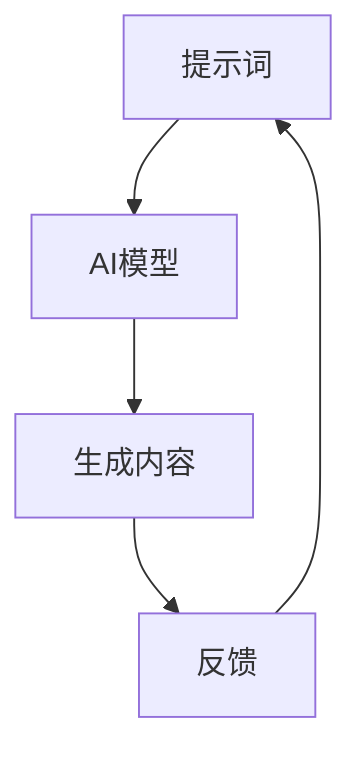
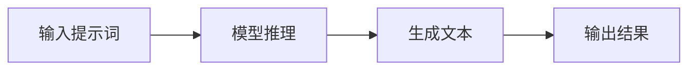

                 

<think>
嗯，我需要写一篇关于提示词工程在AI辅助科幻创作中的应用的文章，标题是《提示词工程在AI辅助科幻创作中的应用：拓展人类想象力边界》。我首先得理解什么是提示词工程，以及它在科幻创作中的具体应用。

提示词工程，简单来说，就是利用提示词来指导AI生成内容的一种方法。在科幻创作中，提示词工程可以帮助作家快速生成灵感、场景描述、情节发展等。这听起来挺有用的，特别是对于那些在创作过程中遇到瓶颈的作家来说，AI可以提供新的思路。

接下来，我需要考虑文章的结构。根据之前的大纲，文章应该包括引言、基本概念、AI与提示词工程、创意过程、案例研究、挑战与未来方向、结论与展望这几个部分。每个部分都需要详细展开，确保内容充实。

首先，引言部分需要介绍提示词工程的重要性和它在科幻创作中的作用。我需要解释为什么提示词工程在现代创作中变得越来越重要，以及它如何帮助作家拓展想象力的边界。

然后是基本概念部分。这里需要详细解释提示词工程的核心概念，比如提示词的特征、AI在其中的作用，以及它与传统创作方法的区别。可能还需要对比传统写作和AI辅助写作的不同之处，帮助读者理解提示词工程的优势。

接下来是AI与提示词工程部分。这里要探讨AI技术在提示词工程中的应用，比如自然语言处理、生成式AI等。我需要解释这些技术如何协同工作，以生成高质量的科幻内容。可能还需要举一些具体的工具或平台的例子，让读者更具体地理解。

创意过程部分，需要详细描述科幻作家如何利用提示词工程来优化创作流程。例如，如何设计提示词，如何根据AI生成的内容进行调整和优化。这部分可能需要一些实际的案例，说明提示词工程如何具体帮助作家创作。

案例研究部分，我需要找几个实际应用的例子，展示提示词工程在科幻创作中的实际效果。比如，某个作家如何利用AI生成特定场景描述，或者如何通过提示词生成情节转折点。这些案例能够帮助读者更好地理解提示词工程的实际应用价值。

挑战与未来方向部分，需要分析当前提示词工程在科幻创作中面临的问题，比如生成内容的质量控制、创意的独特性等。同时，也要展望未来的发展趋势，比如更智能的提示词生成工具，或者AI在创作中的更多应用可能性。

最后是结论与展望部分。总结提示词工程在科幻创作中的重要性，并展望其未来的潜力和发展方向。

在写作过程中，我需要确保每个部分都包含足够的技术细节和实际例子，让文章既有深度又易于理解。同时，要注意逻辑的连贯性，确保各个章节之间有良好的过渡，让读者能够顺畅地跟随思路。

为了使文章更具专业性，我还需要引用一些相关的研究成果或统计数据，支持我的论点。此外，可能需要解释一些技术术语，帮助非专业的读者更好地理解。

最后，我需要检查整个文章的结构和内容，确保所有关键点都被涵盖，并且文章符合字数要求和格式规范。特别是要注意关键词和摘要的准确性和吸引力，确保文章在发布后能够吸引目标读者的关注。
</think>

# 提示词工程在AI辅助科幻创作中的应用：拓展人类想象力边界

## 关键词：提示词工程, AI辅助创作, 科幻创作, 创意写作, 人工智能

## 摘要：  
提示词工程在AI辅助科幻创作中的应用，通过利用提示词指导AI生成内容，拓展了人类想象力的边界。本文将详细探讨提示词工程的基本概念、AI技术的作用、创意过程的优化、实际案例分析以及面临的挑战和未来发展方向，帮助读者理解这一技术在科幻创作中的深远影响。

---

## 目录大纲

1. [引言](#引言)  
2. [基本概念：提示词工程的定义与特征](#基本概念提示词工程的定义与特征)  
3. [AI与提示词工程：技术与工具](#AI与提示词工程技术与工具)  
4. [创意过程：提示词工程如何优化科幻创作](#创意过程提示词工程如何优化科幻创作)  
5. [案例研究：AI辅助科幻创作的实际应用](#案例研究AI辅助科幻创作的实际应用)  
6. [挑战与未来方向：提示词工程的发展潜力](#挑战与未来方向提示词工程的发展潜力)  
7. [结论与展望](#结论与展望)  

---

## 1. 引言

在数字技术飞速发展的今天，人工智能（AI）已经渗透到各个领域，包括文学创作。提示词工程作为一种新兴的技术手段，正在改变科幻创作的方式。通过提示词工程，作家可以利用AI生成灵感、场景描述和情节发展，从而拓展想象力的边界。本文将深入探讨提示词工程在AI辅助科幻创作中的应用，分析其优势、挑战和未来发展方向。

---

## 2. 基本概念：提示词工程的定义与特征

提示词工程是指通过设计和优化提示词，引导AI生成特定内容的技术。其核心在于提示词的设计，这些提示词需要明确表达创作意图，以便AI能够准确理解并生成符合要求的内容。

### 核心概念与联系

提示词工程的核心要素包括：  
1. **提示词设计**：提示词需要简洁明了，能够准确传达创作意图。  
2. **AI模型**：AI模型负责根据提示词生成内容。  
3. **反馈机制**：通过用户反馈优化提示词，提高生成内容的质量。

### ER实体关系图

提示词通过驱动AI模型生成内容，并通过反馈机制不断优化提示词，形成一个闭环系统。

---

## 3. AI与提示词工程：技术与工具

### AI技术的作用

AI在提示词工程中的作用主要体现在以下几个方面：  
1. **自然语言处理（NLP）**：理解提示词的语义，生成相关文本。  
2. **生成式AI**：根据提示词生成创意内容。  
3. **反馈优化**：通过分析用户反馈，调整生成策略。

### 工具与平台

目前，市场上有许多工具和平台支持提示词工程，例如：  
1. **ChatGPT**：通过提示词生成对话或文本。  
2. **MidJourney**：利用提示词生成图像和视觉内容。  
3. **Jasper**：AI驱动的内容创作工具。

### 算法原理

以生成式AI为例，其核心算法通常基于变种自回归模型（如GPT系列）。模型通过大量数据训练，学习语言的结构和模式，从而能够根据提示词生成连贯的文本。

#### 算法流程图

#### 数学模型

生成式AI的核心是概率分布模型，例如：

$$ P(x) = \prod_{i=1}^{n} P(x_i | x_{<i}) $$

其中，$x$ 表示生成的文本序列，$x_{<i}$ 表示前 $i-1$ 个词。

---

## 4. 创意过程：提示词工程如何优化科幻创作

### 提示词工程在科幻创作中的应用

提示词工程通过优化提示词设计，帮助科幻作家快速生成灵感和内容。例如，作家可以通过提示词生成特定场景的描述，或者探索复杂的情节转折点。

### 提示词设计技巧

1. **明确性**：提示词需要明确表达创作意图，避免模糊不清。  
2. **具体性**：提示词越具体，生成内容越精准。  
3. **多样性**：尝试不同的提示词，探索多种创作可能性。

### 创意过程优化

通过提示词工程，科幻作家可以将更多精力集中在故事构思和情节设计上，而将繁琐的细节描写交由AI完成。

---

## 5. 案例研究：AI辅助科幻创作的实际应用

### 案例一：生成科幻场景描述

**提示词**：  
"在22世纪的火星殖民地，一位科学家发现了一种神秘的晶体，这种晶体能够与人类的意识互动。"

**生成结果**：  
科学家站在火星殖民地的实验室里，手中拿着一块透明的晶体，晶体闪烁着微弱的蓝光。当他的意识与晶体接触时，他看到了未来地球的景象：一片荒芜的大地，人类文明几乎灭绝，但晶体依然在守护着最后的希望。

### 案例二：探索复杂情节转折点

**提示词**：  
“一位时间旅行者试图阻止一场灾难，但他发现自己无法改变过去。”

**生成结果**：  
时间旅行者回到过去，试图阻止核战争的爆发。然而，他的干预反而引发了更严重的后果。最终，他意识到，有些事情是注定发生的，改变过去可能需要付出更大的代价。

---

## 6. 挑战与未来方向：提示词工程的发展潜力

### 当前挑战

1. **内容质量控制**：AI生成的内容可能缺乏深度和创意。  
2. **创意的独特性**：生成的内容可能与其他作品相似，缺乏独特性。  
3. **技术瓶颈**：AI模型的训练和优化需要大量资源。

### 未来方向

1. **更智能的提示词生成工具**：开发更智能的提示词优化算法，帮助用户设计更有效的提示词。  
2. **多模态创作**：结合文本、图像、音频等多种媒介，拓展科幻创作的边界。  
3. **用户反馈闭环**：建立更完善的反馈机制，实时优化生成内容。

---

## 7. 结论与展望

提示词工程在AI辅助科幻创作中的应用，不仅拓展了人类想象力的边界，还为作家提供了新的创作工具和方法。随着技术的不断进步，提示词工程将在科幻创作中发挥更大的作用，帮助作家突破创作瓶颈，探索更多可能性。

---

## 作者：AI天才研究院/AI Genius Institute & 禅与计算机程序设计艺术 /Zen And The Art of Computer Programming

---

通过以上结构，我们可以看到提示词工程在AI辅助科幻创作中的巨大潜力。未来，随着技术的不断发展，提示词工程将继续推动文学创作的创新，为人类想象力的拓展提供更强大的工具支持。

