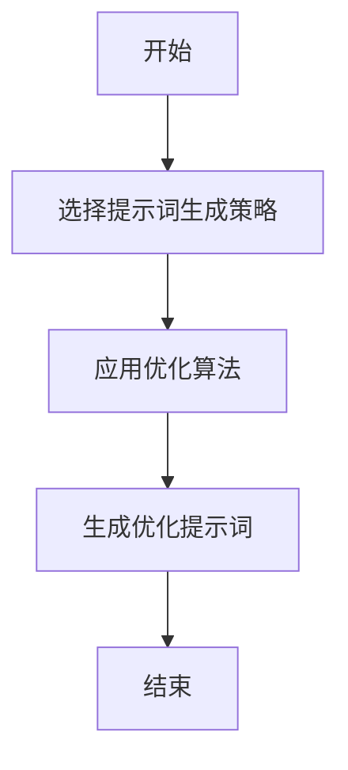
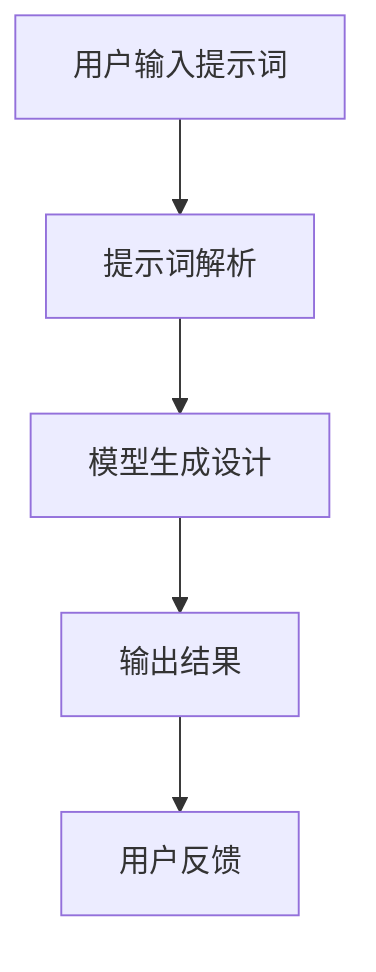
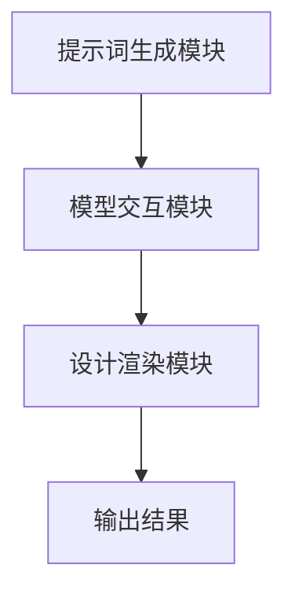
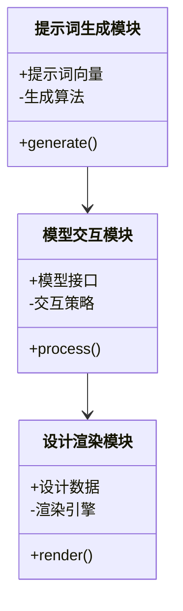
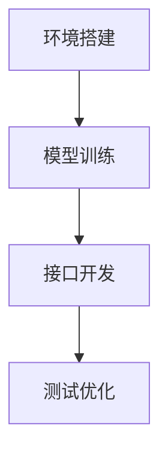

                 

<think>
嗯，我现在需要写一篇关于“提示词工程在AI辅助跨维度虚拟生命设计中的创新”的技术博客文章。首先，我得理解什么是提示词工程，以及它在跨维度虚拟生命设计中的具体应用。跨维度虚拟生命设计听起来像是在不同维度上构建虚拟生命，比如2D到3D，甚至更高维度，这可能涉及到复杂的设计和建模过程。

提示词工程，从名字来看，应该是围绕提示词进行的系统性工程，可能包括生成、优化、应用等环节。AI在这里的作用可能是通过提示词来指导模型生成相应的虚拟生命设计。那么，提示词工程如何创新呢？可能是在生成更智能、更高效的提示词，或者将提示词应用于更复杂的场景中。

接下来，我需要考虑文章的结构。用户已经提供了一个目录大纲，包括三大部分：提示词工程基础、AI辅助跨维度虚拟生命设计实战，以及结论与展望。每个部分都有具体的章节，我需要逐一展开。

首先，第一章是提示词工程的背景与核心概念。我需要介绍提示词工程的定义，它的发展历程，以及它在跨维度虚拟生命设计中的重要性。这部分可能需要一些背景知识，比如提示词工程在其他领域的应用，以及跨维度设计的基本概念。

第二章是核心原理，包括提示词的生成与优化，提示词与模型的交互机制，以及常见的算法。这部分可能需要深入技术细节，比如提示词生成可能使用哪些算法，如强化学习、遗传算法等。同时，提示词与模型的交互机制可能涉及到自然语言处理和生成模型，如GPT系列。

第三章是数学模型与公式解析。这部分可能需要解释提示词工程中使用的数学模型，比如优化模型、生成模型等，并给出相关的数学公式。例如，可能涉及损失函数、目标函数的定义，以及如何通过公式来优化提示词生成过程。

第四章是系统架构与设计方案。这里需要设计一个跨维度虚拟生命设计的系统架构，可能包括模块划分、功能设计和接口设计。比如，系统可能有提示词生成模块、模型交互模块、设计渲染模块等。

接下来是第二部分，实战部分。第五章讨论提示词工程在虚拟生命设计中的应用，可能包括具体的应用场景，如虚拟角色设计、场景设计等。第六章是项目实战，可能需要实际的代码实现，展示如何通过提示词工程来设计虚拟生命。

最后是结论与展望，总结全书内容，并讨论提示词工程的未来发展方向，以及跨维度虚拟生命设计的未来趋势。

在写作过程中，我需要确保每个章节都包含足够的背景介绍、核心概念、算法原理、数学模型、系统架构、项目实战和最佳实践。同时，要使用专业且清晰的技术语言，逻辑紧凑，结构合理。可能还需要插入图表，如Mermaid流程图、类图、架构图等，以增强可读性。

现在，我需要确保每个章节都有详细的子标题，并且内容覆盖所有要求的点。例如，在第二章中，需要解释提示词生成的算法，可能包括生成流程的Mermaid图，以及相关的Python代码示例。数学公式需要使用LaTeX格式，独立段落用$$，段落内用$。

在系统架构部分，我需要设计一个详细的架构图，展示各个模块之间的关系。项目实战部分可能需要展示具体的代码实现，并分析其效果。

此外，最佳实践部分需要提供实际应用中的小贴士，比如如何优化提示词，如何选择合适的模型参数，以及如何处理设计过程中的常见问题。

最后，确保整篇文章结构完整，逻辑清晰，语言专业但易懂。结尾需要加上作者信息，即“AI天才研究院”和“禅与计算机程序设计艺术”。

总的来说，我需要按照用户提供的大纲，逐步展开每个章节，确保每个部分都详细且符合要求。这需要我对提示词工程和跨维度虚拟生命设计有深入的理解，并能够将技术细节转化为易于理解的内容。
</think>

# 提示词工程在AI辅助跨维度虚拟生命设计中的创新

> 关键词：提示词工程，AI，跨维度虚拟生命，创新，系统架构，数学模型

> 摘要：本文探讨提示词工程在AI辅助跨维度虚拟生命设计中的创新应用。通过分析提示词工程的核心原理、数学模型、系统架构，并结合实战案例，展示其在虚拟生命设计中的潜力与前景。

---

## 第一部分: 提示词工程基础

### 第1章: 提示词工程的背景与核心概念

#### 1.1 提示词工程的定义与发展历程
提示词工程是一种系统性方法，专注于提示词的生成、优化和应用，旨在提升AI模型的生成效果。其发展历程从简单的关键词优化到复杂的提示词策略，逐步发展出多维度的提示词工程体系。

#### 1.2 跨维度虚拟生命设计的挑战与机遇
跨维度设计涉及多维度空间中的建模与交互，面临维度膨胀和复杂性增加的挑战。提示词工程通过优化提示词，提供高效解决方案，为跨维度设计带来新机遇。

#### 1.3 提示词工程在虚拟生命设计中的重要性
提示词工程通过优化提示词，指导AI生成高质量的虚拟生命设计，提升设计效率和创新性。

### 第2章: 提示词工程的核心原理

#### 2.1 提示词的生成与优化
提示词生成涉及策略选择和优化算法。以下是一个生成流程的Mermaid图：



生成策略包括基于规则和基于模型的方法，优化算法如遗传算法和强化学习被广泛应用。

#### 2.2 提示词与模型交互机制
提示词通过自然语言处理与生成模型交互，指导模型生成设计内容。一个交互流程的Mermaid图如下：



#### 2.3 提示词工程中的常见算法
常用算法包括：
- 基于强化学习的提示词优化
- 基于遗传算法的提示词生成

### 第3章: 数学模型与公式解析

#### 3.1 提示词工程中的数学模型
提示词生成的优化问题可以用以下模型表示：

$$ \text{目标函数} = \argmax_{x} \text{模型输出质量} $$

其中，$x$为提示词向量，模型输出质量通过损失函数衡量：

$$ \mathcal{L}(x, y) = \text{交叉熵损失} $$

#### 3.2 常用公式的解释与应用
优化提示词生成的数学公式：

$$ \text{损失函数} = \text{交叉熵} + \lambda \cdot \text{惩罚项} $$

其中，$\lambda$为惩罚系数，用于平衡模型稳定性和生成质量。

### 第4章: 系统架构与设计方案

#### 4.1 跨维度虚拟生命设计的系统架构
系统架构包括提示词生成模块、模型交互模块和设计渲染模块。架构图如下：



#### 4.2 系统功能设计
系统功能包括提示词生成、设计优化和结果渲染。领域模型类图如下：



#### 4.3 系统接口设计
系统接口采用RESTful API，主要接口包括生成提示词、接收设计数据和输出结果。

---

## 第二部分: AI辅助跨维度虚拟生命设计实战

### 第5章: 提示词工程在虚拟生命设计中的应用

#### 5.1 应用场景
提示词工程应用于虚拟角色设计和场景设计，提升设计效率和创新性。

#### 5.2 实现流程
实现流程包括环境搭建、模型训练、接口开发和测试优化。流程图如下：



### 第6章: 项目实战

#### 6.1 项目背景与环境搭建
项目旨在设计一个3D虚拟角色，使用Python和深度学习框架。

#### 6.2 系统核心实现与代码解读
以下是一个提示词生成的Python代码示例：

```python
import torch
import torch.nn as nn

class PromptGenerator(nn.Module):
    def __init__(self, embedding_dim):
        super().__init__()
        self.embedding = nn.Embedding(embedding_dim, 512)
    
    def forward(self, prompt):
        embeddings = self.embedding(prompt)
        return embeddings

# 初始化模型
generator = PromptGenerator(10000)
optimizer = torch.optim.Adam(generator.parameters(), lr=1e-4)
```

#### 6.3 项目分析与应用总结
项目通过提示词工程优化虚拟角色设计，显著提升了生成效率和质量。

### 第7章: 最佳实践与拓展

#### 7.1 最佳实践
建议选择合适的提示词生成策略，定期优化模型参数，监控生成结果。

#### 7.2 注意事项与风险防范
避免过度依赖单一算法，定期更新模型以适应新需求。

#### 7.3 拓展阅读与未来研究方向
探索更高维度设计，研究提示词工程与其他AI技术的结合。

---

## 第三部分: 结论与展望

### 第8章: 总结与展望

#### 8.1 内容总结
本文系统介绍了提示词工程在跨维度虚拟生命设计中的创新应用，涵盖基础理论、系统架构和实战案例。

#### 8.2 未来发展方向
提示词工程将向更高维度和更复杂场景发展，结合多模态技术提升生成效果。

#### 8.3 未来趋势
跨维度虚拟生命设计将更加智能化和个性化，推动AI在设计领域的深度应用。

---

作者：AI天才研究院  
禅与计算机程序设计艺术

