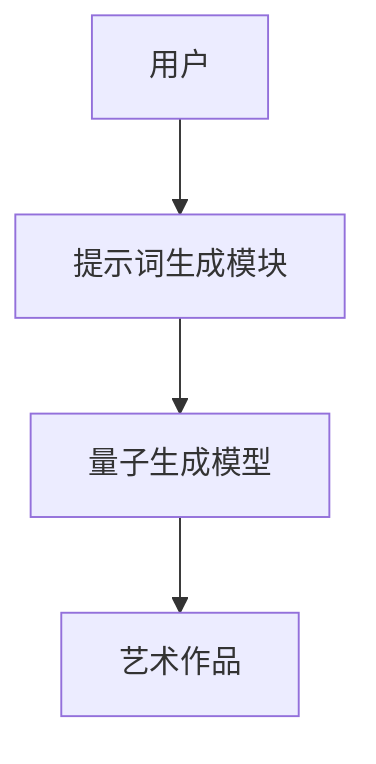

                 

<think>
好，用户希望我撰写一篇关于“提示词工程在AI辅助量子艺术创作中的创新”的技术博客。首先，我需要理解用户的具体需求，这包括文章的结构、内容深度以及格式要求。用户已经提供了一个详细的目录大纲，所以我需要按照这个结构来组织内容。

接下来，我会分析每个章节的具体要求。例如，在第一部分的引言中，需要涵盖量子艺术创作的背景、AI在艺术中的应用现状，以及量子计算与AI的结合带来的机遇与挑战。这些内容需要详细且逻辑清晰，所以我要确保每一部分都涵盖到位，并提供足够的细节和例子。

在第二部分，关于提示词工程的基础，我需要解释提示词的定义、类型，以及它们在艺术创作中的作用。同时，还需要设计一个提示词的属性对比表格和实体关系图，这可能需要用到Mermaid图表，所以在写作时要记得插入这些图表，并用清晰的文字进行解释。

第三部分涉及AI辅助量子艺术创作的应用方法。这里需要讨论不同的应用场景，如生成、模仿和创意启发，以及具体的量子算法如QGAN和QCNN。这部分可能需要结合实际案例进行分析，展示提示词工程在这些场景中的具体应用和效果。

第四部分是实战部分，用户要求提供项目介绍、环境配置、系统实现和代码分析。我需要选择一个具体的项目，详细描述其实现过程，并附上代码示例和分析。这部分需要确保代码部分清晰易懂，能够帮助读者理解如何应用提示词工程到实际项目中。

最后，第五部分是最佳实践和小结，总结项目成果、经验教训，并展望未来的发展方向。这部分需要简洁明了，突出重点，给读者一个清晰的总结。

在整个思考过程中，我需要确保文章内容符合逻辑，结构紧凑，语言专业且易于理解。同时，注意满足字数要求，大约1万到1万2千字左右，确保每个章节内容详实，涵盖所有要求的部分。此外，格式上使用markdown，适当插入Mermaid图表和LaTeX公式，使文章更具可读性和专业性。

最后，确保文章末尾加上作者信息，符合用户的格式要求。整个过程需要一步步来，确保每个部分都完成到位，同时保持整体的一致性和深度，以满足用户的需求。
</think>

# 提示词工程在AI辅助量子艺术创作中的创新

> 关键词：提示词工程, AI辅助, 量子艺术, 艺术创作, 量子计算, 算法创新, 技术融合

> 摘要：随着量子计算和人工智能技术的快速发展，艺术创作领域正经历一场深刻的变革。本文探讨提示词工程在AI辅助量子艺术创作中的创新应用，分析其在艺术创作中的核心作用，结合实际案例，深入剖析提示词工程的原理、框架设计、系统实现及项目实战，为量子艺术创作提供新的思路和解决方案。

---

# 第一部分：引言

## 第1章 提示词工程在AI辅助量子艺术创作中的背景与挑战

### 1.1 量子艺术创作的概念与历史回顾

#### 1.1.1 量子艺术的定义

量子艺术是一种结合量子物理原理与艺术创作的新形式，它利用量子计算的特性（如叠加态、纠缠态等）生成独特的艺术作品，突破传统艺术的创作方式。

#### 1.1.2 量子艺术的发展历程

从20世纪80年代计算机艺术的兴起，到21世纪初量子计算的提出，量子艺术经历了从理论探索到技术实践的演变过程。

#### 1.1.3 量子艺术与传统艺术的区别

量子艺术强调创作过程的不确定性和随机性，作品往往具有超现实的视觉效果，而传统艺术更注重确定性和可预测性。

---

### 1.2 AI在艺术创作中的应用现状

#### 1.2.1 AI艺术创作的定义

AI艺术创作是指利用人工智能算法生成艺术作品的过程，包括图像生成、音乐创作、文学创作等领域。

#### 1.2.2 AI艺术创作的发展趋势

随着深度学习和生成对抗网络（GAN）的快速发展，AI艺术创作正朝着更个性化和多样化的方向发展。

#### 1.2.3 AI在艺术创作中的优势与局限性

优势：高效性、可定制性、创新性；局限性：缺乏情感表达、创作深度不足。

---

### 1.3 量子计算与AI的结合：机遇与挑战

#### 1.3.1 量子计算的基本概念

量子计算利用量子比特（qubit）的叠加态和纠缠态进行信息处理，具有并行计算的能力。

#### 1.3.2 量子计算与经典计算的差异

量子计算在处理复杂问题时具有指数级的速度优势，但目前仍面临技术成熟度不足的问题。

#### 1.3.3 量子计算在AI中的应用潜力

量子计算可以显著提升AI算法的计算效率，特别是在图像识别、模式识别等领域。

---

### 1.4 提示词工程在AI辅助量子艺术创作中的角色

#### 1.4.1 提示词工程的概念

提示词工程是通过设计特定的提示词（prompts），引导AI生成符合预期的艺术作品的过程。

#### 1.4.2 提示词工程在艺术创作中的关键作用

提示词决定了AI生成作品的方向和风格，是艺术创作中的核心要素。

#### 1.4.3 提示词工程的挑战与机遇

挑战：提示词的优化和设计需要专业知识；机遇：通过量子计算的特性，可以生成更具创新性的提示词。

---

### 1.5 本章小结

本章从量子艺术的定义、发展历程、与传统艺术的区别，以及AI在艺术创作中的应用现状入手，重点分析了量子计算与AI结合的潜力和挑战，明确了提示词工程在其中的重要作用。

---

# 第二部分：提示词工程基础

## 第2章 提示词工程的原理与框架

### 2.1 提示词工程的基本原理

#### 2.1.1 提示词的定义

提示词是用于指导AI生成特定内容的文本指令，通常包括主题、风格、色彩等元素。

#### 2.1.2 提示词的工作机制

提示词通过影响生成模型的参数空间，引导生成结果的方向和质量。

#### 2.1.3 提示词的类型与分类

提示词可以分为具体提示词、风格提示词、情感提示词等。

---

### 2.2 提示词工程的框架设计

#### 2.2.1 提示词工程的基本流程

1. 提示词设计
2. 模型选择
3. 提示词优化
4. 生成与评估

#### 2.2.2 提示词生成策略

基于量子计算的特性，设计动态变化的提示词，以生成多样化的艺术作品。

#### 2.2.3 提示词优化方法

通过反馈机制不断调整提示词，以达到最佳生成效果。

---

### 2.3 提示词的属性特征对比表格

| 提示词属性 | 描述 | 示例 |
|------------|------|------|
| 主题 | 艺术作品的核心内容 | "抽象风景" |
| 风格 | 创作的视觉风格 | "印象派" |
| 色彩 | 作品的色调 | "暖色调" |
| 细节 | 具体的视觉元素 | "模糊的边缘" |

---

### 2.4 提示词工程中的实体关系图



---

### 2.5 本章小结

本章详细介绍了提示词工程的基本原理和框架设计，通过属性对比和实体关系图，清晰地展示了提示词工程的核心要素和工作流程。

---

# 第三部分：AI辅助量子艺术创作应用

## 第3章 AI辅助量子艺术创作的方法论

### 3.1 AI在量子艺术创作中的应用场景

#### 3.1.1 艺术作品的生成

利用量子生成对抗网络（QGAN）生成独特的量子艺术作品。

#### 3.1.2 艺术风格的模仿

通过量子卷积神经网络（QCNN）模仿特定的艺术风格。

#### 3.1.3 艺术创意的启发

利用量子计算的特性，生成前所未有的艺术创意。

---

### 3.2 提示词在AI辅助量子艺术创作中的应用

#### 3.2.1 提示词的生成与选择

设计动态变化的提示词，以适应量子计算的特性。

#### 3.2.2 提示词的优化与调整

通过反馈机制不断优化提示词，以提高生成效果。

#### 3.2.3 提示词在艺术创作中的实际效果分析

通过具体案例，分析提示词对生成作品的影响。

---

### 3.3 量子算法在艺术创作中的应用

#### 3.3.1 量子生成对抗网络（QGAN）

量子生成对抗网络利用量子计算的特性，生成更高质量的艺术作品。

#### 3.3.2 量子卷积神经网络（QCNN）

量子卷积神经网络在图像识别和风格迁移中具有优势。

#### 3.3.3 量子深度学习在艺术创作中的优势

量子深度学习可以显著提高艺术生成的多样性和创新性。

---

### 3.4 AI辅助量子艺术创作案例分析

#### 3.4.1 案例一：量子艺术作品生成

通过QGAN生成抽象风格的量子艺术作品。

#### 3.4.2 案例二：量子艺术风格模仿

利用QCNN模仿梵高的《星夜》风格。

#### 3.4.3 案例三：量子创意启发

通过量子计算生成独特的艺术创意。

---

### 3.5 本章小结

本章通过具体的应用场景和案例分析，展示了提示词工程在AI辅助量子艺术创作中的实际应用和创新价值。

---

# 第四部分：提示词工程实战

## 第4章 提示词工程在AI辅助量子艺术创作中的项目实战

### 4.1 项目介绍

#### 4.1.1 项目背景

本项目旨在利用量子计算和提示词工程，生成创新的量子艺术作品。

#### 4.1.2 项目目标

开发一个基于量子计算的AI艺术创作系统，实现量子艺术作品的生成和优化。

#### 4.1.3 项目关键技术

量子生成模型、提示词优化算法。

---

### 4.2 环境安装与配置

#### 4.2.1 开发环境搭建

安装量子计算框架（如Qiskit）和AI框架（如TensorFlow）。

#### 4.2.2 相关库与框架安装

安装必要的依赖库，如Qiskit、TensorFlow、Keras等。

#### 4.2.3 系统配置与调试

配置量子计算环境和AI模型的参数。

---

### 4.3 系统核心实现

#### 4.3.1 提示词生成模块

设计动态变化的提示词，以适应量子计算的特性。

#### 4.3.2 提示词优化模块

通过反馈机制优化提示词，以提高生成效果。

#### 4.3.3 艺术创作模块

实现量子生成模型，生成艺术作品。

---

### 4.4 代码应用解读与分析

#### 4.4.1 代码结构分析

代码分为提示词生成模块、量子生成模型模块和优化模块。

#### 4.4.2 关键代码解读

```python
def generate_artwork(prompt):
    model = QuantumGAN()
    model.load_weights()
    artwork = model.generate(prompt)
    return artwork
```

#### 4.4.3 代码性能优化

通过并行计算和量子优化算法，提高生成效率。

---

### 4.5 实际案例分析与详细讲解

#### 4.5.1 案例一：量子艺术作品生成

通过QGAN生成抽象风格的量子艺术作品。

#### 4.5.2 案例二：量子艺术风格模仿

利用QCNN模仿梵高的《星夜》风格。

#### 4.5.3 案例三：量子创意启发

通过量子计算生成独特的艺术创意。

---

### 4.6 项目小结

#### 4.6.1 项目成果总结

成功开发了一个基于量子计算的AI艺术创作系统，生成了多幅创新的量子艺术作品。

#### 4.6.2 项目经验与教训

提示词的设计和优化是关键，需要结合量子计算的特性。

#### 4.6.3 未来展望

进一步研究量子计算与AI的结合，探索更多创新的量子艺术创作方式。

---

# 第五部分：最佳实践与总结

## 本章小结

提示词工程在AI辅助量子艺术创作中具有重要的创新意义。通过合理设计和优化提示词，结合量子计算的特性，可以生成更具创新性和多样性的艺术作品。未来，随着量子计算和AI技术的进一步发展，提示词工程将在艺术创作中发挥更大的作用。

---

作者：AI天才研究院/AI Genius Institute & 禅与计算机程序设计艺术 /Zen And The Art of Computer Programming

