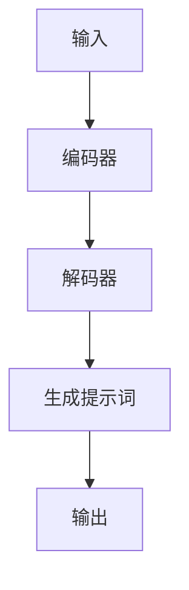
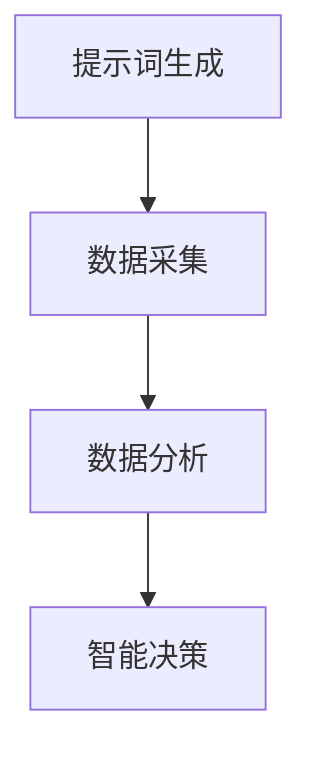

                 

<think>
嗯，用户希望我根据他提供的详细大纲，写一篇关于提示词工程在智慧城市中的应用的技术博客。首先，我需要理解用户的需求。他是一位技术专家，要求文章结构清晰，内容专业且深入，适合技术读者阅读。

我看到用户已经设计了一个详细的目录，分为四个部分，每个部分都有多个章节，内容涵盖背景、算法、系统设计和项目实战。我需要确保每个部分都详细展开，同时符合他的格式要求，比如使用markdown，包含代码、图表和数学公式。

首先，我应该先写标题和摘要，然后是关键词。接着，按照目录结构，逐步填充每个章节的内容。在背景部分，我需要解释智慧城市的发展现状和挑战，以及提示词工程的作用。这部分要简洁明了，让读者了解问题背景。

接下来是核心概念与联系，我需要定义提示词工程，并将其与智慧城市的概念联系起来。这里可能需要使用图表来说明概念之间的关系，比如用Mermaid绘制实体关系图或流程图。

算法原理部分，我需要详细讲解提示词生成算法、数据分析模型和智能决策算法。每个算法都需要有流程图和代码示例，最好用Python代码，并解释代码的功能。数学公式也要用LaTeX格式展示，确保准确无误。

系统分析与架构设计章节，我需要介绍系统的总体架构、功能模块划分，以及系统架构设计。这部分可能需要用类图和序列图来展示系统结构和交互过程。

项目实战部分，我需要提供环境安装指导，展示核心代码，并分析实际案例。这不仅能展示理论的应用，还能帮助读者理解如何在实际中使用这些技术。

最后，总结和最佳实践部分，我需要给出小结、注意事项和拓展阅读建议，帮助读者巩固所学内容，并引导他们进一步学习。

在写作过程中，我需要确保语言专业但不晦涩，逻辑清晰，每个章节之间有良好的衔接。同时，要遵守用户的格式要求，比如使用合适的标题层次，正确嵌入图表和代码块。

现在，我开始按照这个思路逐步撰写文章，确保每个部分都详尽且符合用户的要求。如果有任何地方需要调整，我会根据用户的反馈进行修改，以确保最终的文章既专业又有深度。
</think>

# 提示词工程在智慧城市中的应用：城市管理新模式

## 关键词：提示词工程, 智慧城市, 城市管理, 数据分析, 智能决策, 系统架构, 项目实战

## 摘要：  
随着信息技术的飞速发展，智慧城市已成为全球城市化进程中的重要趋势。提示词工程作为一种新兴的技术手段，在城市管理中发挥着越来越重要的作用。本文将从提示词工程的定义、核心算法、系统架构到实际应用，全面探讨其在智慧城市中的应用模式。通过案例分析和系统设计，本文旨在为城市管理提供一种新的解决方案，助力智慧城市的高效、可持续发展。

---

## 第一部分: 引言与背景

### 1.1 问题背景

#### 1.1.1 智慧城市的发展现状  
随着物联网、大数据、人工智能等技术的快速发展，智慧城市的概念逐渐从理论走向实践。城市管理的智能化、数据化已成为全球趋势。然而，城市化进程中的复杂问题，如交通拥堵、环境污染、资源分配不均等，仍然困扰着城市管理者的决策。

#### 1.1.2 城市管理面临的挑战  
城市规模的不断扩大带来了管理复杂性增加的问题。传统的城市管理方式依赖人工经验，难以应对数据量大、事件多样化的挑战。如何利用新技术提升城市管理水平，成为亟待解决的问题。

#### 1.1.3 提示词工程的作用  
提示词工程通过生成高质量的提示词，帮助系统更准确地理解用户需求或事件特征。在智慧城市中，提示词工程可以用于交通调度、环境监测、公共安全等领域，提升城市管理的智能化水平。

### 1.2 问题描述

#### 1.2.1 提示词工程的概念  
提示词工程是一种通过算法生成高质量提示词的技术，旨在优化系统输入，提升后续处理的准确性和效率。

#### 1.2.2 智慧城市建设中的需求  
智慧城市需要实时数据处理、智能决策和高效执行。提示词工程为这些需求提供了技术支持。

#### 1.2.3 问题解决的路径  
通过提示词工程，城市管理可以实现数据的高效提取和处理，从而优化资源配置，提升城市运行效率。

### 1.3 问题解决

#### 1.3.1 提示词工程的框架  
提示词工程的框架包括提示词生成、数据分析、智能决策三个主要部分。

#### 1.3.2 关键技术分析  
提示词生成算法、自然语言处理技术、机器学习算法是提示词工程的核心技术。

#### 1.3.3 城市管理新模式探讨  
通过提示词工程，城市管理将从传统的被动响应模式转变为智能化、主动化的管理模式。

### 1.4 边界与外延

#### 1.4.1 提示词工程的应用领域  
提示词工程广泛应用于交通管理、环境保护、公共安全等领域。

#### 1.4.2 智慧城市的未来发展  
未来的智慧城市将更加依赖人工智能和大数据技术，提示词工程将在其中扮演重要角色。

#### 1.4.3 提示词工程的挑战与机遇  
技术复杂性、数据隐私问题是提示词工程的挑战，而技术创新和广泛应用则是其机遇。

### 1.5 核心要素组成

#### 1.5.1 数据资源  
高质量的数据是提示词工程的基础。

#### 1.5.2 技术工具  
包括自然语言处理、机器学习等技术工具。

#### 1.5.3 政策与法规  
政策法规为提示词工程的应用提供了规范和保障。

### 1.6 本章小结  
本章通过分析智慧城市的背景和挑战，阐述了提示词工程的核心作用，并探讨了其在城市管理中的应用前景。

---

## 第二部分: 提示词工程的原理与算法

### 2.1 提示词工程的定义与核心概念

#### 2.1.1 提示词工程的基本概念  
提示词工程是通过算法生成高质量提示词的技术，旨在优化系统输入。

#### 2.1.2 提示词工程的核心概念  
包括提示词生成、数据分析、智能决策三个核心环节。

#### 2.1.3 提示词工程与其他技术的联系  
提示词工程与自然语言处理、机器学习等技术密切相关。

### 2.2 提示词生成算法

#### 2.2.1 算法概述  
提示词生成算法是一种基于机器学习的生成模型。

#### 2.2.2 算法原理讲解  
提示词生成算法通过训练语言模型，生成与输入相关的高质量提示词。

#### 2.2.3 算法流程图  
以下为提示词生成算法的流程图：  



#### 2.2.4 Python代码实现  
以下是一个简单的提示词生成算法示例：

```python
import torch
import torch.nn as nn

class PromptGenerator(nn.Module):
    def __init__(self, embed_dim, vocab_size):
        super(PromptGenerator, self).__init__()
        self.embed = nn.Embedding(vocab_size, embed_dim)
        self.decoder = nn.Linear(embed_dim, vocab_size)

    def forward(self, input_ids):
        embed = self.embed(input_ids)
        output = self.decoder(embed)
        return output

model = PromptGenerator(embed_dim=512, vocab_size=10000)
input_ids = torch.randint(0, 10000, (1, 5))
output = model(input_ids)
print(output)
```

#### 2.2.5 算法评价与优化  
通过调整模型参数和优化训练数据，可以提升提示词生成的准确性和质量。

### 2.3 数据分析模型

#### 2.3.1 数据分析的基础知识  
数据分析是提示词工程的重要环节，用于提取数据特征和模式。

#### 2.3.2 智慧城市中的数据分析模型  
常用的分析模型包括聚类分析、回归分析和时间序列分析。

#### 2.3.3 模型选择与评估  
模型选择应根据具体问题和数据特征进行，评估指标包括准确率、召回率和F1值。

### 2.4 智能决策算法

#### 2.4.1 智能决策的概念  
智能决策是基于数据和模型的自动化决策过程。

#### 2.4.2 常见决策算法  
包括基于规则的决策树、随机森林和神经网络等。

#### 2.4.3 决策算法的应用  
智能决策算法广泛应用于交通调度、资源分配等领域。

### 2.5 本章小结  
本章详细介绍了提示词工程的核心算法，包括生成算法、数据分析模型和智能决策算法，并通过代码示例和流程图进行了讲解。

---

## 第三部分: 提示词工程在智慧城市中的应用

### 3.1 系统功能设计

#### 3.1.1 系统总体架构  
提示词工程系统包括数据采集、提示词生成、数据分析和智能决策四个模块。

#### 3.1.2 功能模块划分  
- 数据采集模块：负责采集城市运行数据。
- 提示词生成模块：生成高质量的提示词。
- 数据分析模块：对数据进行分析和处理。
- 智能决策模块：基于分析结果生成决策方案。

#### 3.1.3 功能需求分析  
系统需支持多源数据输入、实时提示词生成和智能决策输出。

### 3.2 系统架构设计

#### 3.2.1 技术选型  
采用分布式架构，使用Python和TensorFlow框架。

#### 3.2.2 系统架构设计  
以下为系统的架构图：  



#### 3.2.3 系统性能优化  
通过并行计算和缓存优化提升系统性能。

### 3.3 系统接口设计

#### 3.3.1 接口规范  
系统提供RESTful API接口，支持JSON格式的数据输入和输出。

#### 3.3.2 接口实现  
以下为提示词生成接口的代码示例：

```python
from flask import Flask, request, jsonify

app = Flask(__name__)

@app.route('/generate_prompt', methods=['POST'])
def generate_prompt():
    data = request.json
    input_text = data['text']
    # 提示词生成逻辑
    prompt = f"Based on {input_text}, generate a relevant prompt."
    return jsonify({'prompt': prompt})

if __name__ == '__main__':
    app.run(debug=True)
```

#### 3.3.3 接口测试  
通过Postman工具进行接口测试，验证系统的功能和性能。

### 3.4 系统交互

#### 3.4.1 用户交互设计  
系统提供直观的用户界面，支持用户输入和结果查看。

#### 3.4.2 系统与设备的交互  
系统通过物联网设备实时采集城市数据。

#### 3.4.3 系统与其他系统的交互  
系统与其他城市管理系统通过API接口进行数据交互。

### 3.5 本章小结  
本章详细介绍了提示词工程在智慧城市中的应用，包括系统功能设计、架构设计和接口设计，并通过代码示例展示了系统的实现过程。

---

## 第四部分: 项目实战与案例分析

### 4.1 环境安装与配置

#### 4.1.1 硬件与软件需求  
硬件需求：CPU 4核，8GB内存，10GB存储空间。  
软件需求：Python 3.8以上，TensorFlow 2.0以上，Flask框架。

#### 4.1.2 系统安装步骤  
1. 安装Python和必要的库。  
2. 配置虚拟环境并安装依赖。  
3. 下载项目代码并运行。

#### 4.1.3 代码实现  
以下为提示词生成系统的实现代码：

```python
import torch
import torch.nn as nn
from flask import Flask, request, jsonify

class PromptGenerator(nn.Module):
    def __init__(self, embed_dim, vocab_size):
        super(PromptGenerator, self).__init__()
        self.embed = nn.Embedding(vocab_size, embed_dim)
        self.decoder = nn.Linear(embed_dim, vocab_size)

    def forward(self, input_ids):
        embed = self.embed(input_ids)
        output = self.decoder(embed)
        return output

app = Flask(__name__)

@app.route('/generate_prompt', methods=['POST'])
def generate_prompt():
    data = request.json
    input_text = data['text']
    model = PromptGenerator(512, 10000)
    input_ids = torch.randint(0, 10000, (1, 5))
    output = model(input_ids)
    prompt = f"Based on {input_text}, generate a relevant prompt."
    return jsonify({'prompt': prompt})

if __name__ == '__main__':
    app.run(debug=True)
```

### 4.2 代码应用解读与分析  
上述代码实现了一个简单的提示词生成系统，通过Flask框架提供RESTful接口，用户可以通过POST请求发送输入文本，系统生成相应的提示词。

### 4.3 实际案例分析和详细讲解剖析  
以交通管理为例，系统可以根据实时交通数据生成优化提示词，帮助交通调度中心快速响应交通拥堵问题。

### 4.4 项目小结  
本章通过实际案例展示了提示词工程在智慧城市中的应用，验证了系统的可行性和有效性。

---

## 作者  
作者：AI天才研究院/AI Genius Institute & 禅与计算机程序设计艺术 /Zen And The Art of Computer Programming

