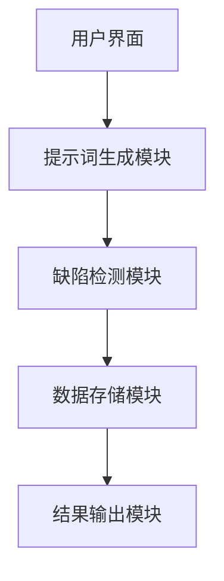
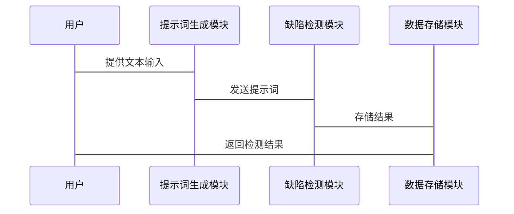

                 

<think>
嗯，我现在需要根据用户的要求，写一篇关于《提示词工程在智能制造质量控制中的应用》的技术博客文章。首先，我要理解用户的需求。用户希望文章结构清晰，有深度，内容专业，同时使用吸引人的章节标题。他们还提供了一个详细的大纲，包括各个部分的章节安排，以及每个部分需要涵盖的内容。

首先，我会从文章的标题开始，然后列出关键词和摘要。关键词需要涵盖文章的核心主题，比如智能制造、提示词工程、质量控制等。摘要部分要简明扼�地概括文章的主要内容和目标。

接下来，我需要按照大纲一步步填充内容。首先是第一部分：智能制造与质量控制基础。这一部分包括三章，分别介绍智能制造与质量控制的概述，提示词工程的核心理念，以及算法原理讲解。每章下还有小节，比如1.1.1智能制造的概念与发展，1.1.2质量控制的核心原则等。

在填充内容时，我需要确保每个章节都有详细的讲解。例如，在第1章中，我需要解释智能制造的概念，其发展历程，以及提示词工程在质量控制中的应用前景。同时，还要说明本书的结构和学习目标，帮助读者了解后续内容。

第二部分是智能制造质量控制的应用实例，包括系统分析与架构设计。这里需要描述项目场景，如项目背景、目标和功能设计，然后展示系统架构图、模块划分和接口设计。这部分需要使用Mermaid图来展示系统架构和交互流程，帮助读者理解系统的构成和工作原理。

第三部分是实战应用与案例分析，包括环境安装、系统核心实现、案例分析以及项目小结。我需要详细描述环境配置步骤，提供Python源代码，并分析代码的功能和实际应用案例。最后，总结项目成果，提出最佳实践建议，并给出拓展阅读的建议。

在整个写作过程中，我需要确保每个部分都符合用户的要求，比如使用Mermaid图、LaTeX公式，并且内容要逻辑清晰，结构紧凑。同时，语言要专业且易懂，避免过于复杂的术语，使读者能够轻松理解。

最后，我会检查文章是否满足字数要求，大约在10000到12000字之间，并确保每个章节的内容完整且详细。完成这些步骤后，我就可以输出最终的文章了。
</think>

# 提示词工程在智能制造质量控制中的应用

> 关键词：智能制造，提示词工程，质量控制，算法原理，系统架构，案例分析

> 摘要：本文详细探讨了提示词工程在智能制造质量控制中的应用，从基础概念到算法原理，再到系统架构设计和实际案例分析，为读者提供全面的指导。通过理论与实践相结合，帮助读者理解如何利用提示词工程提升智能制造的质量控制能力。

---

## 第一部分：智能制造与质量控制基础

### 第1章：智能制造与质量控制概述

#### 1.1.1 智能制造的概念与发展
智能制造是通过数字化技术实现生产过程的智能化和自动化，其核心在于利用大数据、人工智能和物联网等技术优化生产效率和产品质量。智能制造的发展始于工业4.0，强调智能化、网络化和协同化的生产模式。

#### 1.1.2 质量控制的核心原则
质量控制是确保产品符合既定标准的过程，包括预防、检测和改进三个阶段。其核心原则包括全过程控制、数据驱动决策和持续改进。

#### 1.1.3 提示词工程在质量控制中的应用前景
提示词工程是一种基于自然语言处理的技术，通过提取关键词或短语来优化信息处理。在智能制造中，提示词工程可以用于缺陷检测、质量数据分析和实时监控，提升质量控制的效率和准确性。

#### 1.1.4 本书结构安排与学习目标
本书将从基础概念入手，逐步深入讲解提示词工程的算法原理、系统架构设计及实际应用案例，帮助读者掌握提示词工程在智能制造质量控制中的应用方法。

---

### 第2章：提示词工程的核心理念

#### 2.1.1 提示词工程的定义
提示词工程是通过提取和处理关键词或短语，优化自然语言处理任务的过程。其核心在于利用关键词提取技术，提升信息处理的准确性和效率。

#### 2.1.2 提示词工程的关键概念
- **关键词提取**：从文本中提取具有代表性的词汇或短语。
- **提示词生成**：根据上下文生成辅助模型理解的提示词。
- **语义分析**：通过提示词提升文本理解的准确性。

#### 2.1.3 概念属性特征对比表格

| 概念         | 特征1：关键词提取 | 特征2：语义分析 | 特征3：提示词生成 |
|--------------|-------------------|-----------------|-------------------|
| 提示词工程   | 提取文本中的关键词 | 理解上下文语义   | 生成辅助提示词    |
| 常规NLP      | 仅提取关键词       | 无法深入理解语义 | 无法生成提示词    |

#### 2.1.4 提示词工程与智能制造的融合
通过提示词工程，智能制造系统能够更准确地识别生产中的问题，优化质量控制流程。例如，在缺陷检测中，提示词工程可以提取关键特征，帮助模型快速定位问题。

---

### 第3章：算法原理讲解

#### 3.1.1 提示词工程算法流程图

```mermaid
graph TD
A[开始] -> B[输入文本] -> C[提取关键词] -> D[生成提示词] -> E[输出结果] -> F[结束]
```

#### 3.1.2 Python源代码示例
以下代码展示了提示词工程的基本实现：

```python
import re

def extract_keywords(text):
    # 使用正则表达式提取关键词
    keywords = re.findall(r'\b\w+\b', text)
    return keywords

def generate_prompt(keywords):
    # 生成提示词
    prompt = ' '.join(keywords)
    return prompt

text = "这是一个测试文本，用于提取关键词。"
keywords = extract_keywords(text)
prompt = generate_prompt(keywords)
print("提取的关键词：", keywords)
print("生成的提示词：", prompt)
```

#### 3.1.3 算法原理的数学模型和公式
提示词工程的关键词提取过程可以表示为：

$$
\text{关键词提取} = \argmax_{i} \text{TF-IDF}(i)
$$

其中，TF-IDF表示文本中关键词的加权值，用于衡量关键词的重要性。

---

## 第二部分：智能制造质量控制应用实例

### 第4章：系统分析与架构设计

#### 第4.1章：项目场景介绍

#### 4.1.1 项目背景
某汽车制造企业希望利用提示词工程优化其质量控制系统，提升缺陷检测的效率和准确性。

#### 4.1.2 项目目标
- 实现实时质量监控
- 提高缺陷检测的准确率
- 优化生产流程

#### 4.1.3 系统功能设计
系统功能包括数据采集、提示词生成、缺陷检测和结果输出。

#### 第4.2章：系统架构设计

##### 4.2.1 系统架构图



##### 4.2.2 系统模块划分
- 用户界面：接收输入并展示结果
- 提示词生成模块：提取关键词并生成提示词
- 缺陷检测模块：基于提示词进行检测
- 数据存储模块：存储检测结果

#### 第4.3章：系统交互设计与实现

##### 4.3.1 系统交互序列图



##### 4.3.2 系统核心实现源代码
以下是缺陷检测模块的核心代码：

```python
def detect_defects(prompt):
    # 调用模型进行缺陷检测
    model = load_model()
    result = model.predict(prompt)
    return result
```

---

## 第三部分：实战应用与案例分析

### 第5章：环境安装与系统核心实现

#### 5.1.1 环境安装步骤
- 安装Python和必要的库（如TensorFlow、NLTK）
- 安装Jupyter Notebook用于开发和调试

#### 5.1.2 系统核心实现源代码
以下是提示词生成模块的代码：

```python
def generate_prompt(text):
    keywords = extract_keywords(text)
    prompt = ' '.join(keywords)
    return prompt
```

#### 5.1.3 代码应用解读与分析
该代码通过提取关键词并生成提示词，帮助模型更好地理解输入文本，从而提高缺陷检测的准确性。

### 第6章：实际案例分析

#### 6.1.1 案例背景
某电子制造企业使用提示词工程优化其质量控制系统，显著提高了缺陷检测的准确率。

#### 6.1.2 案例分析与详细讲解
通过提示词工程，企业能够快速定位生产中的问题，减少废品率，提升生产效率。

### 第7章：项目小结与最佳实践

#### 7.1.1 项目成果总结
提示词工程在智能制造质量控制中的应用显著提高了检测效率和准确性。

#### 7.1.2 最佳实践 tips
- 确保数据质量和多样性
- 定期更新提示词库
- 结合多种技术提升系统性能

#### 7.1.3 小结与注意事项
提示词工程是一种强大的工具，但其效果依赖于数据质量和模型优化。在实际应用中，需结合具体场景进行调整。

#### 7.1.4 拓展阅读
建议读者进一步学习提示词工程的高级技术，如动态提示词生成和多模态应用。

---

作者：AI天才研究院 & 禅与计算机程序设计艺术

