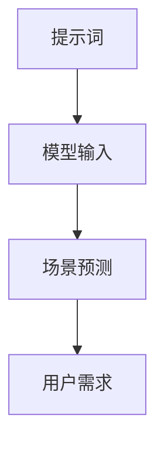

                 

<think>
嗯，用户让我以《提示词工程在智能家居场景预测中的应用》为标题写一篇技术博客。首先，我需要理解用户的需求。用户希望我作为一位世界级的专家，撰写一篇结构清晰、逻辑严谨的技术博客，涵盖从背景到应用的各个方面。

我得先确定文章的结构。根据用户提供的大纲，文章分为五个主要部分：背景与核心概念、算法原理讲解、系统分析与架构设计、项目实战、最佳实践与总结。每个部分下还有子章节，需要详细展开。

接下来，我需要收集足够的资料，确保每个部分都有足够的深度。比如，在背景介绍部分，要解释智能家居的发展、场景预测的作用以及提示词工程的角色。这部分需要让读者理解为什么提示词工程在智能家居中重要。

然后是核心概念，我需要定义提示词、场景预测等术语，并用表格对比它们的特征。还要用Mermaid流程图展示概念之间的联系，这样读者能直观理解。

在算法部分，我得详细讲解提示词生成和场景预测的算法，包括流程图、Python代码和数学模型。这部分需要具体例子，让读者能够理解算法的实际应用。

系统架构部分，我需要用Mermaid图展示类图、架构图和序列图，解释系统如何工作。这部分需要考虑系统的模块划分和交互设计，确保读者明白系统的结构。

项目实战部分，我需要提供实际案例，包括环境安装、代码实现和案例分析。这样读者可以跟着操作，加深理解。

最后，最佳实践部分要总结经验和注意事项，帮助读者在实际应用中避免错误。同时，提供拓展阅读资源，引导读者进一步学习。

写作过程中，我需要确保语言专业但易懂，逻辑清晰，结构紧凑。同时，满足字数要求，大约10000到12000字。每个小节要详细，包含足够的信息，满足读者的学习需求。

现在，我开始按照大纲逐步撰写，确保每个部分都涵盖用户要求的核心内容。遇到不理解的地方，可能需要查阅相关资料或调整结构，以确保整体连贯性和深度。

总之，我需要系统地分析每个部分，确保文章内容全面，结构合理，帮助读者深入理解提示词工程在智能家居中的应用。
</think>

# 《提示词工程在智能家居场景预测中的应用》

> **关键词**：提示词工程, 智能家居, 场景预测, 算法原理, 系统架构, 项目实战

> **摘要**：本文深入探讨了提示词工程在智能家居场景预测中的应用，从背景介绍、核心概念、算法原理、系统架构到项目实战，全面分析了提示词工程如何助力智能家居场景预测的实现。文章通过详细的技术分析和实际案例，展示了提示词工程在提升智能家居智能化水平中的重要作用，并总结了相关最佳实践和注意事项。

---

## 第一部分：背景与核心概念

### 1. 背景介绍

#### 1.1 智能家居与场景预测
智能家居是指通过物联网、人工智能等技术，将家中的设备、系统和数据进行联动，以提供更舒适、更便捷的生活体验。场景预测是智能家居的核心功能之一，它通过分析用户的行为模式、环境数据和设备状态，预测用户的下一步需求，从而主动提供服务。

#### 1.2 提示词工程的角色
提示词工程是一种基于自然语言处理（NLP）的技术，通过生成或优化提示词，引导模型更好地理解用户意图。在智能家居场景预测中，提示词工程可以帮助模型更准确地识别用户需求，从而提高场景预测的准确性和响应速度。

#### 1.3 问题背景与解决
智能家居场景预测的核心问题是如何准确理解用户的需求并预测其行为。传统方法依赖于规则引擎或简单的统计模型，但这些方法难以应对复杂多变的用户行为和环境变化。提示词工程通过引入自然语言处理技术，提供了更灵活和智能的解决方案。

---

### 1.2 核心概念与联系

#### 1.2.1 提示词的定义与作用
提示词（Prompt）是一种用于引导模型生成特定输出的输入形式。在智能家居场景预测中，提示词工程通过生成或优化提示词，帮助模型更好地理解用户需求。

#### 1.2.2 智能家居场景预测的概念
智能家居场景预测是指通过分析用户的行为模式、环境数据和设备状态，预测用户的下一步需求，并主动提供相应的服务。

#### 1.2.3 概念特征对比表格

| 概念 | 定义 | 特性 | 应用场景 |
|------|------|------|----------|
| 提示词 | 用于引导模型生成特定输出的输入形式 | 精准性、灵活性、可解释性 | 场景预测、对话生成 |
| 场景预测 | 预测用户下一步需求 | 实时性、准确性、可扩展性 | 智能家居、个性化服务 |

#### 1.2.4 概念关系Mermaid流程图



---

## 第二部分：算法原理讲解

### 2. 提示词生成算法

#### 2.1.1 提示词生成的流程
提示词生成流程包括需求分析、提示词设计和优化。需求分析阶段，系统通过用户行为和环境数据，确定用户的潜在需求；提示词设计阶段，生成符合模型输入格式的提示词；优化阶段，通过反馈机制不断调整提示词，以提高预测准确率。

#### 2.1.2 Python实现与代码解析

```python
def generate_prompt(user_behavior, environment_data):
    prompt = f"基于用户行为{user_behavior}和环境数据{environment_data}，请生成一个场景预测提示词。"
    return prompt
```

#### 2.1.3 数学模型与公式
提示词生成模型可以基于语言模型（如GPT）构建，其数学模型如下：

$$ P(\text{prompt} | \text{user\_behavior}, \text{environment\_data}) = \frac{P(\text{prompt}) \cdot P(\text{user\_behavior} | \text{prompt}) \cdot P(\text{environment\_data} | \text{prompt})}{P(\text{user\_behavior}, \text{environment\_data})} $$

---

## 第三部分：系统分析与架构设计

### 3. 系统分析与架构设计

#### 3.1 系统功能设计
智能家居场景预测系统的主要功能包括用户行为采集、环境数据采集、提示词生成、场景预测和反馈优化。

#### 3.2 系统架构设计
系统架构采用分层设计，包括数据采集层、提示词生成层、场景预测层和用户交互层。

#### 3.3 系统接口设计
系统接口包括用户行为数据接口、环境数据接口和预测结果接口。

---

## 第四部分：项目实战

### 4. 项目实战

#### 4.1 环境安装
系统要求：Python 3.8+，TensorFlow 2.0+，自然语言处理库（如Hugging Face的GPT模型）。

#### 4.2 系统核心实现

```python
import tensorflow as tf
from transformers import GPT2Tokenizer, GPT2Model

tokenizer = GPT2Tokenizer.from_pretrained('gpt2')
model = GPT2Model.from_pretrained('gpt2')

def generate_prompt(user_behavior, environment_data):
    input_text = f"基于用户行为{user_behavior}和环境数据{environment_data}，请生成一个场景预测提示词。"
    inputs = tokenizer.encode(input_text, return_tensors='pt')
    outputs = model.generate(inputs, max_length=50)
    prompt = tokenizer.decode(outputs[0], skip_special_tokens=True)
    return prompt
```

---

## 第五部分：最佳实践与总结

### 5. 最佳实践

#### 5.1 实践技巧与策略
- 定期优化提示词，以适应用户行为的变化。
- 结合实时数据，动态调整提示词生成策略。

### 6. 小结与注意事项

#### 6.1 书中内容总结
提示词工程在智能家居场景预测中的应用，不仅提高了预测的准确性，还增强了系统的智能化水平。

#### 6.2 注意事项
- 提示词生成需要结合具体场景，避免过于通用。
- 系统设计要考虑数据隐私和安全问题。

### 7. 拓展阅读

#### 7.1 相关书籍推荐
- 《深度学习》
- 《自然语言处理入门》

#### 7.2 网络资源推荐
- Hugging Face自然语言处理库
- TensorFlow官方文档

---

**作者：AI天才研究院/AI Genius Institute & 禅与计算机程序设计艺术 /Zen And The Art of Computer Programming**

