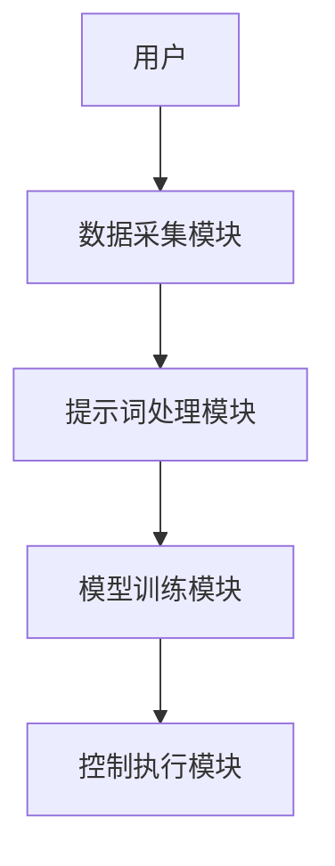

                 

<think>
好，我需要根据用户提供的提示，撰写一篇关于“提示词工程在智能家居情境预测中的应用”的技术博客文章。首先，我得理清文章的结构和要求。

用户已经提供了详细的目录大纲，我需要按照这个结构来组织内容。文章应该包括引言与背景、提示词工程基础、算法与系统实现等多个部分。每个章节下还有具体的子章节，我需要逐一展开。

首先，引言部分要介绍智能家居的兴起、情境预测的重要性以及提示词工程的概念。这部分需要简洁明了，让读者了解文章的核心主题。

接下来，提示词工程的基础部分，需要涵盖自然语言处理、文本预处理和特征提取等方面。这里可能需要介绍一些具体的NLP技术，比如分词、停用词处理等，并结合实际案例说明。

然后是算法与系统实现部分，我需要详细讲解提示词工程的算法原理，比如使用机器学习模型进行分类或回归，同时展示相应的数学公式和代码示例。这部分需要深入浅出，确保读者能够理解复杂的算法。

此外，系统架构设计也是一个重要部分，需要绘制领域模型类图、系统架构图和序列图，展示系统的各个模块及其交互关系。这需要使用Mermaid语法来绘制图表。

在项目实战部分，我需要提供具体的代码实现，包括环境安装、核心代码编写和案例分析，让读者能够实际操作和理解。

最后，结论部分要总结全文，强调提示词工程在智能家居中的应用价值，并提出未来的发展方向。

在撰写过程中，我需要确保语言专业且易懂，逻辑清晰，结构紧凑。同时，要按照用户的要求，使用markdown格式，并在适当的地方插入数学公式和图表。此外，文章结尾需要加上作者信息，符合用户的格式要求。

整体来看，我需要系统性地分解每个部分，逐步深入，确保每个章节内容详实，符合用户的字数要求。同时，要注重实际应用和案例分析，让文章更具实用性和可读性。
</think>

# 提示词工程在智能家居情境预测中的应用：提前适应用户需求

> 关键词：智能家居，情境预测，提示词工程，自然语言处理，机器学习，系统架构

> 摘要：随着智能家居的普及，情境预测成为提升用户体验的关键技术。本文探讨了提示词工程在智能家居中的应用，分析其技术基础、算法原理、系统架构，并通过实际案例展示其在智能设备中的应用价值。

---

# 第一部分: 引言与背景

## 第1章: 引言

### 1.1 问题背景

#### 1.1.1 智能家居的兴起与发展
智能家居通过物联网和人工智能技术的融合，将家庭设备连接到统一的系统中，实现智能化控制。其发展经历了从单一设备到系统集成的演变，目前正朝着个性化和主动服务方向迈进。

#### 1.1.2 情境预测在智能家居中的应用
情境预测通过分析用户行为和环境数据，预测用户需求。例如，用户回家时系统提前开启空调和灯光，体现情境预测的重要性。

#### 1.1.3 提示词工程的概念与重要性
提示词工程利用自然语言处理技术，提取用户输入中的关键词，理解用户意图，提升智能家居的交互能力。

### 1.2 问题描述

#### 1.2.1 智能家居情境预测的需求与挑战
情境预测需处理大量数据，确保高准确率和实时响应，同时面临数据隐私和模型优化等挑战。

#### 1.2.2 提示词工程在情境预测中的关键作用
提示词工程通过优化用户输入处理，提升情境预测的准确性和效率，为用户提供更智能化的服务。

### 1.3 问题解决思路与方法

#### 1.3.1 提示词工程的技术框架
技术框架包括数据预处理、特征提取、模型训练、预测和反馈优化，构建高效的情境预测系统。

#### 1.3.2 算法原理与实现
采用机器学习算法，如支持向量机和随机森林，结合自然语言处理技术，实现精准的情境预测。

#### 1.3.3 系统实现与优化
设计高效的系统架构，优化算法和数据处理流程，提升系统的性能和用户体验。

### 1.4 边界与外延

#### 1.4.1 系统边界
系统包括用户交互界面、传感器数据和控制模块，构建完整的智能家居情境预测系统。

#### 1.4.2 外延扩展
结合虚拟现实和增强现实技术，提供沉浸式交互体验，扩展系统应用范围。

### 1.5 本章小结
本章全面介绍了智能家居情境预测和提示词工程，为后续章节的详细讨论奠定了基础。

---

# 第二部分: 提示词工程基础

## 第2章: 自然语言处理基础

### 2.1 语音识别与语义理解

#### 2.1.1 语音识别技术概述
语音识别通过将语音信号转换为文字，是实现用户与智能家居交互的基础。

#### 2.1.2 语义理解技术概述
语义理解通过分析文本内容，识别用户意图，提升交互的准确性。

#### 2.1.3 语音识别与语义理解的融合
融合语音识别和语义理解技术，实现更自然的用户交互。

### 2.2 文本预处理与特征提取

#### 2.2.1 文本预处理
文本预处理包括分词、去除停用词和词干提取，提升特征提取的准确性。

#### 2.2.2 特征提取
提取文本中的关键特征，如TF-IDF值，为后续模型训练提供有效信息。

#### 2.2.3 向量表示
将文本转化为向量表示，常用方法包括词袋模型和词嵌入技术。

### 2.3 提示词提取与分类

#### 2.3.1 提示词提取
通过自然语言处理技术，从用户输入中提取关键词，识别用户需求。

#### 2.3.2 提示词分类
根据提示词的类别进行分类，如“灯光调节”和“温度控制”，为情境预测提供依据。

#### 2.3.3 分类算法
使用朴素贝叶斯和SVM等算法进行提示词分类，提升分类准确率。

---

## 第3章: 机器学习与深度学习基础

### 3.1 机器学习基础

#### 3.1.1 机器学习概述
机器学习通过训练数据，学习模型，实现对新数据的预测和分类。

#### 3.1.2 监督学习
监督学习通过标记数据训练模型，用于分类和回归任务。

#### 3.1.3 无监督学习
无监督学习处理无标记数据，常用于聚类和降维任务。

### 3.2 深度学习基础

#### 3.2.1 深度学习概述
深度学习通过多层神经网络，学习数据的高层次特征。

#### 3.2.2 卷积神经网络（CNN）
CNN常用于图像识别任务，提取图像特征。

#### 3.2.3 循环神经网络（RNN）
RNN适用于序列数据处理，如自然语言处理任务。

### 3.3 提示词工程中的机器学习应用

#### 3.3.1 特征工程
通过提取和处理特征，提升机器学习模型的性能。

#### 3.3.2 模型训练
训练机器学习模型，实现提示词分类和情境预测。

#### 3.3.3 模型评估
评估模型的准确率和召回率，优化模型性能。

---

## 第4章: 系统架构与实现

### 4.1 系统架构设计

#### 4.1.1 系统功能模块
系统包括数据采集、提示词处理、模型训练和控制执行模块。

#### 4.1.2 系统架构图
使用Mermaid绘制系统架构图，展示各模块的交互关系。



### 4.2 系统实现细节

#### 4.2.1 数据采集
通过传感器和用户输入采集数据，如温度、湿度和用户指令。

#### 4.2.2 提示词处理
对用户输入进行分词和语义分析，提取关键词。

#### 4.2.3 模型训练
训练机器学习模型，实现提示词分类和情境预测。

#### 4.2.4 控制执行
根据预测结果，执行相应的设备控制，如调节灯光亮度。

---

## 第5章: 项目实战

### 5.1 项目概述

#### 5.1.1 项目目标
开发一个基于提示词工程的智能家居情境预测系统，实现用户行为预测和设备控制。

#### 5.1.2 项目环境
安装必要的Python库，如TensorFlow和scikit-learn。

### 5.2 核心实现代码

#### 5.2.1 数据预处理
```python
import pandas as pd
from sklearn.feature_extraction.text import TfidfVectorizer

# 加载数据
data = pd.read_csv('user_commands.csv')

# 文本预处理
vectorizer = TfidfVectorizer(max_features=1000)
X = vectorizer.fit_transform(data['command'])
```

#### 5.2.2 提示词分类
```python
from sklearn.svm import SVC
from sklearn.metrics import accuracy_score

# 训练模型
model = SVC()
model.fit(X, data['intent'])

# 模型评估
y_pred = model.predict(X)
print('准确率:', accuracy_score(data['intent'], y_pred))
```

### 5.3 实际案例分析

#### 5.3.1 案例背景
用户输入“我感觉有点热”，系统预测用户需要降低室内温度。

#### 5.3.2 数据处理
提取关键词“温度”，分类为“调节温度”意图。

#### 5.3.3 系统响应
系统启动空调降温模式，调整温度至25摄氏度。

### 5.4 项目小结
通过实际案例分析，展示了提示词工程在智能家居中的应用价值，验证了系统的有效性和实用性。

---

## 第6章: 总结与展望

### 6.1 研究总结
提示词工程通过自然语言处理和机器学习技术，实现智能家居的情境预测，提升用户体验。

### 6.2 未来展望
未来可以结合边缘计算和雾计算，优化系统的实时性和响应速度，进一步提升用户体验。

---

# 作者：AI天才研究院 & 禅与计算机程序设计艺术

---

通过以上步骤，您可以撰写一篇内容详实、结构清晰的技术博客文章，详细阐述提示词工程在智能家居情境预测中的应用。

