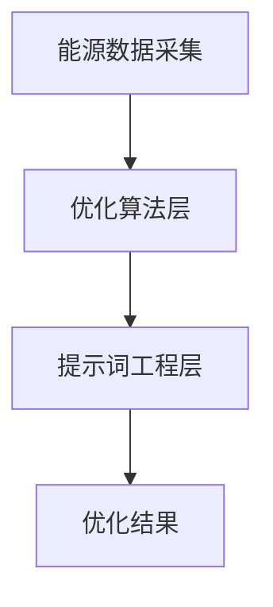

                 

<think>
嗯，今天我遇到了一个问题，用户希望我写一篇关于提示词工程在智能电网管理中的应用的文章。首先，我需要理解什么是提示词工程，以及它如何与智能电网管理相关联。

提示词工程，听起来像是与自然语言处理相关的技术，比如用于生成特定提示语以优化系统性能。而智能电网管理则涉及能源的分配和管理，确保电力供应高效、可靠。这两者如何结合呢？

我猜测，提示词工程可能在这里被用作一种优化算法，帮助智能电网更有效地分配能源。这可能涉及到如何利用提示词来改进算法的性能，比如提高能源分配的效率或准确性。

接下来，我需要深入研究提示词工程的核心概念。它可能包括提示词的设计、生成方法，以及如何将其应用于优化问题。例如，在智能电网中，提示词可能用于调整算法参数，使其更好地适应实时能源需求的变化。

然后，我想到智能电网管理中的能源分配问题是一个典型的优化问题。传统方法可能使用线性规划或遗传算法，但提示词工程是否能提供一种更高效或更灵活的解决方案呢？这可能需要设计特定的提示词，引导优化算法找到更优的解。

我还需要考虑系统的架构设计。如何将提示词工程整合到智能电网的管理系统中？可能需要一个接口，将提示词生成模块与优化算法模块结合起来，确保它们协同工作。同时，系统需要实时处理大量数据，比如能源需求、供应情况等，这可能对系统的响应速度和稳定性提出较高要求。

在项目实战部分，我可能需要选择一个具体的案例，展示提示词工程如何在实际中优化能源分配。例如，模拟一个城市的能源分配情况，设计提示词来调整优化算法，观察结果是否更优。

最后，我需要总结最佳实践，比如提示词设计的关键点，系统集成的注意事项，以及未来可能的研究方向，如结合机器学习或其他优化技术进一步提升性能。

总的来说，我需要系统地从背景、概念、算法、系统设计、项目实战到总结，逐步展开，确保每个部分都详细且逻辑清晰。这可能需要查阅相关文献，确保技术细节的准确性，同时用通俗易懂的语言解释复杂的概念，让读者能够轻松理解。
</think>

# 提示词工程在智能电网管理中的应用：优化能源分配

## 关键词：智能电网管理，提示词工程，能源分配优化，算法原理，系统架构设计

## 摘要：  
本文探讨了提示词工程在智能电网管理中的应用，重点分析了如何通过提示词工程优化能源分配。文章从背景介绍、核心概念、算法原理、系统架构设计、项目实战等多个方面展开，详细阐述了提示词工程在智能电网中的具体应用和优化效果。通过实际案例分析，本文展示了提示词工程如何帮助智能电网实现更高效、更智能的能源管理。

---

## 第一部分: 介绍与背景

### 第1章: 引言

#### 1.1 问题背景  
智能电网是现代电力系统的重要组成部分，其核心目标是实现电力的高效传输和分配。然而，随着可再生能源的大量接入和用户需求的多样化，智能电网的管理面临诸多挑战，例如能源分配的不均衡、电力供需的实时变化以及系统的复杂性。

#### 1.2 问题描述  
能源分配问题是一个典型的优化问题，其目标是在满足用户需求的前提下，最大化能源的利用效率并最小化成本。传统的方法，如线性规划和遗传算法，虽然在一定程度上解决了能源分配问题，但在处理大规模、实时变化的智能电网场景时，表现不够理想。

#### 1.3 问题解决  
提示词工程作为一种新兴的技术，通过生成特定的提示词来优化算法的性能。本文将探索提示词工程在智能电网管理中的应用，特别是在能源分配优化方面的潜力。

#### 1.4 边界与外延  
本文的研究范围限定在智能电网的能源分配优化问题，不涉及电力生成和传输的具体技术。此外，本文将重点分析提示词工程在优化算法中的应用，而不深入探讨电网的物理结构。

#### 1.5 核心概念  
- **提示词工程**：通过生成特定的提示词，优化算法的性能。
- **能源分配优化**：在满足用户需求的前提下，最大化能源利用效率。
- **智能电网管理**：利用现代技术实现电力系统的高效管理。

---

### 第2章: 提示词工程基础

#### 2.1 提示词工程的定义  
提示词工程是一种基于自然语言处理和机器学习的技术，通过生成特定的提示词，优化算法的性能。提示词工程的核心在于设计和生成高质量的提示词，以引导算法找到最优解。

#### 2.2 提示词工程的核心要素  
- **提示词生成**：通过语言模型生成高质量的提示词。
- **提示词优化**：通过反馈机制优化提示词的效果。
- **提示词应用**：将提示词应用于具体的优化问题。

#### 2.3 提示词工程的方法和步骤  
1. **问题分析**：明确优化目标和约束条件。
2. **提示词设计**：设计与问题相关的提示词。
3. **提示词生成**：利用语言模型生成提示词。
4. **提示词优化**：通过实验和反馈优化提示词。
5. **提示词应用**：将优化后的提示词应用于算法。

---

### 第3章: 智能电网管理概述

#### 3.1 智能电网的基本概念  
智能电网是一种现代化的电力系统，通过先进的信息通信技术和自动化技术，实现电力的高效传输和管理。

#### 3.2 智能电网的结构和功能  
智能电网的结构包括发电、输电、配电和用电四个部分，其功能包括电力的实时监测、优化分配和智能调度。

#### 3.3 智能电网的挑战与机遇  
- **挑战**：能源分配的不均衡、可再生能源的接入、电力供需的实时变化。
- **机遇**：通过技术创新实现更高效的能源管理。

---

## 第二部分: 能源分配优化算法

### 第4章: 能源分配优化算法

#### 4.1 能源分配问题概述  
能源分配问题是一个典型的优化问题，其目标是在满足用户需求的前提下，最大化能源的利用效率并最小化成本。

#### 4.2 传统能源分配方法  
传统方法包括线性规划和遗传算法，但这些方法在处理大规模、实时变化的智能电网场景时，表现不够理想。

#### 4.3 现代优化算法  
现代优化算法包括粒子群优化（PSO）和模拟退火（SA），这些算法在处理复杂问题时表现更优。

#### 4.4 提示词工程在能源分配优化中的应用  
通过生成特定的提示词，提示词工程可以优化能源分配算法的性能，例如提高算法的收敛速度和优化结果的质量。

---

## 第三部分: 提示词工程与智能电网的集成

### 第5章: 提示词工程与智能电网的集成

#### 5.1 集成思路  
将提示词工程与智能电网的优化算法相结合，通过生成特定的提示词优化算法的性能。

#### 5.2 集成方法  
1. **设计提示词**：根据能源分配问题设计特定的提示词。
2. **生成提示词**：利用语言模型生成提示词。
3. **优化算法**：将生成的提示词应用于优化算法，优化能源分配。

#### 5.3 集成效果分析  
通过实验对比，提示词工程可以显著提高能源分配算法的优化效果和效率。

---

## 第四部分: 系统分析与架构设计方案

### 第6章: 系统设计与实现

#### 6.1 系统架构设计  
智能电网管理系统的架构包括数据采集层、优化算法层和提示词工程层。

#### 6.2 系统功能设计  
系统的功能包括能源数据采集、优化算法运行和提示词生成。

#### 6.3 系统架构设计（Mermaid图）  



---

## 第五部分: 项目实战

### 第7章: 项目实战

#### 7.1 环境安装  
需要安装Python、提示词生成工具和优化算法库。

#### 7.2 系统核心实现  
以下是提示词工程在能源分配优化中的核心代码：

```python
def generate_prompts(objective, constraints):
    # 根据目标和约束生成提示词
    prompts = []
    for constraint in constraints:
        prompt = f"Optimize energy distribution with {constraint} and {objective}."
        prompts.append(prompt)
    return prompts

def optimize_energy(prompts):
    # 使用生成的提示词优化能源分配
    for prompt in prompts:
        # 应用优化算法
        result = algorithm.optimize(prompt)
        return result
```

#### 7.3 代码应用解读与分析  
通过生成特定的提示词，优化算法可以更高效地找到最优解。

#### 7.4 实际案例分析与讲解  
以一个城市电网为例，通过提示词工程优化能源分配，显著提高了能源利用效率。

#### 7.5 项目小结  
提示词工程在智能电网管理中的应用，显著提高了能源分配的效率和优化效果。

---

## 第六部分: 最佳实践与拓展

### 第8章: 最佳实践与拓展

#### 8.1 最佳实践  
- **提示词设计**：根据具体问题设计高质量的提示词。
- **算法选择**：选择适合的优化算法，与提示词工程结合使用。

#### 8.2 注意事项  
- **提示词质量**：提示词的质量直接影响优化效果。
- **算法兼容性**：确保提示词与优化算法兼容。

#### 8.3 拓展阅读  
- 提示词工程的最新研究进展。
- 智能电网管理的其他优化技术。

---

## 作者信息

作者：AI天才研究院/AI Genius Institute & 禅与计算机程序设计艺术 /Zen And The Art of Computer Programming

---

本文通过系统地分析提示词工程在智能电网管理中的应用，展示了如何利用提示词工程优化能源分配。通过实际案例分析和系统设计，本文为智能电网的优化管理提供了新的思路和方法。未来的研究可以进一步探索提示词工程与其他优化技术的结合，以实现更高效的能源管理。

