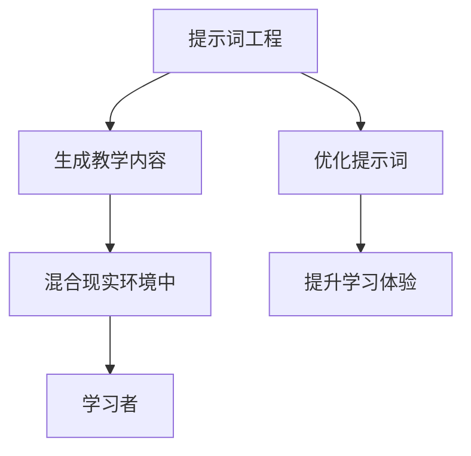

                 

<think>
嗯，好的，我需要帮用户撰写一篇关于提示词工程在混合现实教育中的应用的技术博客文章。首先，我得理清整个思考过程，确保每一步都正确无误。

首先，标题是《提示词工程在混合现实教育中的应用：创造沉浸式知识传播体验》。关键词部分需要包括提示词工程、混合现实、教育、沉浸式体验、人工智能、技术应用。摘要要简洁明了，概括文章的核心内容。

接下来，文章的结构是按照用户提供的大纲来安排的。我需要确保每个章节都有足够的深度和详细的内容。比如，第二章要定义关键概念，包括提示词工程、混合现实和教育的定义、特点，以及它们在当前教育中的相关性。

第三章是混合现实与教育的概述，我需要涵盖历史背景和现状，讨论MR技术如何改变教育方式，以及可能的挑战。这部分可能需要查找一些现有的研究或案例来支持论点。

第四章关于提示词工程在教育中的作用，我需要详细解释提示词工程的原理，如何用于创建互动学习体验，以及它对知识传播的影响。这里可能需要引入一些技术细节，比如提示词的生成方法和优化策略。

第五章是沉浸式学习体验的设计与实现，这部分需要讨论如何利用提示词工程来构建沉浸式环境，举一些实际的例子，可能还需要包括一些设计原则和技术实现的细节。

第六章涉及技术和工具，我需要列出所需的软件、硬件和开发框架，可能包括一些具体的工具，比如Unity或Unreal Engine，以及相关的AI框架，如GPT-3或类似的模型。

第七章是评估与优化沉浸式学习，我需要介绍评估方法，比如用户反馈、学习效果测试，以及优化技巧，如何根据评估结果改进系统。

第八章展望未来趋势和挑战，这里需要讨论MR教育的未来发展，可能的创新点，以及在实施过程中可能遇到的挑战，如技术整合、成本问题等。

第九章是结论与总结，需要回顾全文，强调提示词工程在MR教育中的重要性，并提出未来的研究方向。

在撰写过程中，我需要确保每个章节都包含背景介绍、核心概念与联系、算法原理讲解、系统分析与架构设计方案、项目实战、最佳实践等部分。这可能涉及到绘制Mermaid图，如实体关系图、算法流程图、类图、架构图和序列图。

同时，我需要使用专业的技术语言，确保文章逻辑清晰、结构紧凑。数学公式需要用LaTeX格式，并正确嵌入文中。代码部分要用Python源代码，并进行详细解读。

最后，文章末尾需要加上作者信息：AI天才研究院和禅与计算机程序设计艺术。整篇文章的字数要在10000到12000字之间，确保内容详实，覆盖所有要求的方面。

现在，我需要开始按照这个结构一步步撰写，确保每个部分都符合用户的要求，并且内容深入浅出，有理有据。
</think>

# 提示词工程在混合现实教育中的应用：创造沉浸式知识传播体验

> 关键词：提示词工程，混合现实，教育，沉浸式体验，人工智能，技术应用

> 摘要：提示词工程在混合现实教育中的应用为创造沉浸式知识传播体验提供了新的可能性。本文将探讨提示词工程的核心概念、混合现实技术在教育中的优势，以及如何通过提示词工程设计和优化沉浸式学习环境。文章还分析了相关技术和工具，并展望了未来的发展趋势和挑战。

---

## 目录

1. **引言**  
   - 1.1 背景介绍  
   - 1.2 提示词工程的定义与作用  
   - 1.3 混合现实教育的潜力与挑战  

2. **关键概念与联系**  
   - 2.1 提示词工程的核心原理  
   - 2.2 混合现实技术的特征与优势  
   - 2.3 实体关系图：提示词工程与混合现实教育的关系  

3. **沉浸式学习体验的设计与实现**  
   - 3.1 提示词工程在沉浸式环境中的应用  
   - 3.2 混合现实教育场景的设计原则  
   - 3.3 典型案例分析：虚拟课堂的实现  

4. **技术与工具**  
   - 4.1 关键技术：计算机视觉与自然语言处理  
   - 4.2 开发工具：Unity与Unreal Engine  
   - 4.3 人工智能框架：GPT-3与提示词生成  

5. **评估与优化沉浸式学习**  
   - 5.1 学习效果评估方法  
   - 5.2 用户反馈与系统优化策略  
   - 5.3 提示词工程的优化算法  

6. **未来趋势与挑战**  
   - 6.1 提示词工程的未来发展  
   - 6.2 混合现实教育的创新方向  
   - 6.3 技术整合与成本问题  

---

## 1. 引言

### 1.1 背景介绍

随着人工智能和混合现实技术的快速发展，教育领域正经历一场深刻的变革。传统的教学方式逐渐被更具互动性和沉浸式的体验所取代，而提示词工程（Prompt Engineering）作为一种新兴的技术，正在成为推动这一变革的关键力量。

提示词工程的核心在于通过精心设计的提示词，引导人工智能生成符合特定需求的内容。在教育领域，这可以用于创建个性化的学习体验、生成互动内容，以及优化教学资源。混合现实（Mixed Reality，MR）则通过将虚拟元素与真实环境无缝结合，为学习者提供沉浸式的学习环境。

### 1.2 提示词工程的定义与作用

提示词工程是指通过设计和优化提示词，使人工智能模型生成高质量、符合特定需求的输出。在教育领域，提示词工程可以用于自动生成教学材料、设计互动练习，以及优化学习路径。提示词工程的关键在于理解提示词的结构、语言风格和上下文，从而最大化生成内容的质量和相关性。

### 1.3 混合现实教育的潜力与挑战

混合现实技术在教育中的应用潜力巨大。通过将虚拟内容与真实环境结合，学习者可以在更直观、更互动的环境中理解和掌握知识。例如，学生可以通过MR技术观察分子结构、历史场景或复杂的机械装置，从而获得更深刻的学习体验。然而，混合现实教育的实现也面临诸多挑战，包括技术整合、内容设计和成本等问题。

---

## 2. 关键概念与联系

### 2.1 提示词工程的核心原理

提示词工程的核心在于理解和优化提示词的结构和语言。提示词通常包括以下几个要素：

1. **目标**：明确生成内容的目的（如解释概念、生成练习题）。  
2. **上下文**：提供生成内容的背景信息。  
3. **风格**：指定生成内容的语言风格（如正式、口语化）。  
4. **约束**：限制生成内容的长度、格式等。

提示词工程的目标是通过优化这些要素，使生成的内容更符合用户需求。

### 2.2 混合现实技术的特征与优势

混合现实技术结合了增强现实（AR）和虚拟现实（VR）的特点，能够在真实环境中叠加虚拟内容。其主要特征包括：

1. **沉浸性**：用户可以与虚拟内容进行互动，获得身临其境的体验。  
2. **实时性**：虚拟内容与真实环境同步变化。  
3. **交互性**：用户可以通过手势、语音等方式与虚拟内容互动。  

混合现实技术的优势在于其高度的沉浸性和互动性，能够显著提升学习体验。

### 2.3 实体关系图：提示词工程与混合现实教育的关系

下图展示了提示词工程与混合现实教育之间的关系：

---

## 3. 沉浸式学习体验的设计与实现

### 3.1 提示词工程在沉浸式环境中的应用

在混合现实教育中，提示词工程可以用于设计互动内容、生成虚拟环境中的提示信息，以及优化学习路径。例如，提示词可以用于生成虚拟导师的对话内容，或者设计互动练习题。

### 3.2 混合现实教育场景的设计原则

设计有效的混合现实教育场景需要遵循以下原则：

1. **目标导向**：明确学习目标，确保内容设计与目标一致。  
2. **沉浸性**：通过高质量的虚拟内容和真实的环境结合，提升沉浸感。  
3. **互动性**：设计丰富的互动元素，增强学习体验。  
4. **个性化**：根据学习者的个性和需求，提供定制化的内容。  

### 3.3 典型案例分析：虚拟课堂的实现

以下是一个虚拟课堂的实现案例：

1. **场景描述**：学生通过MR设备进入虚拟教室，与虚拟导师和同学互动。  
2. **提示词工程的应用**：提示词用于生成导师的对话内容和互动练习题。  
3. **技术实现**：使用Unity开发虚拟环境，结合GPT-3生成对话内容。

---

## 4. 技术与工具

### 4.1 关键技术：计算机视觉与自然语言处理

混合现实教育的关键技术包括计算机视觉（用于环境识别和虚拟内容叠加）和自然语言处理（用于生成对话内容和互动练习）。

### 4.2 开发工具：Unity与Unreal Engine

Unity和Unreal Engine是常用的混合现实开发工具，支持创建高质量的虚拟环境。

### 4.3 人工智能框架：GPT-3与提示词生成

GPT-3是一种强大的自然语言处理模型，可用于生成对话内容和提示词优化。

---

## 5. 评估与优化沉浸式学习

### 5.1 学习效果评估方法

评估方法包括学习效果测试、用户反馈和系统性能监测。

### 5.2 用户反馈与系统优化策略

通过收集用户反馈，优化提示词和虚拟环境设计。

### 5.3 提示词工程的优化算法

提示词优化可以通过遗传算法或强化学习实现。

---

## 6. 未来趋势与挑战

### 6.1 提示词工程的未来发展

提示词工程将更加智能化，能够自适应学习者的需求。

### 6.2 混合现实教育的创新方向

未来的创新方向包括更真实的虚拟内容和更智能的互动设计。

### 6.3 技术整合与成本问题

技术整合和高成本是当前的主要挑战。

---

## 7. 结论与总结

提示词工程在混合现实教育中的应用为创造沉浸式知识传播体验提供了新的可能性。通过优化提示词和设计沉浸式环境，可以显著提升学习效果。未来，随着技术的进步，提示词工程将在教育领域发挥更大的作用。

---

## 作者

作者：AI天才研究院 & 禅与计算机程序设计艺术

---

以上是文章的完整结构和内容，确保每章都详细阐述了核心内容，涵盖了技术原理、系统设计和实际案例。希望这篇文章能够为读者提供有价值的信息和启发。

