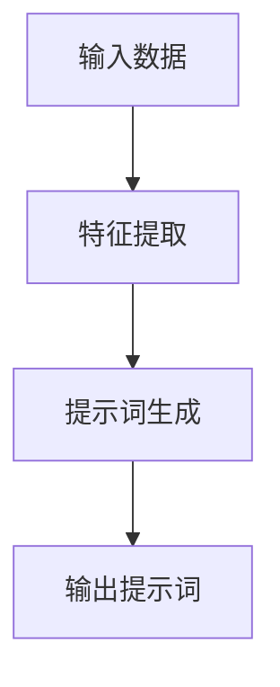
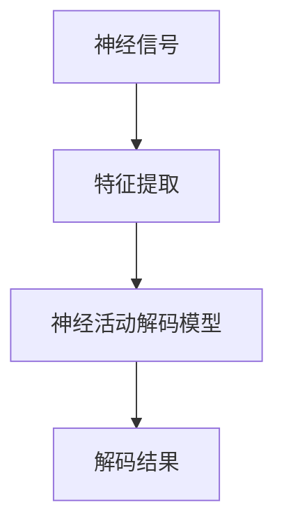
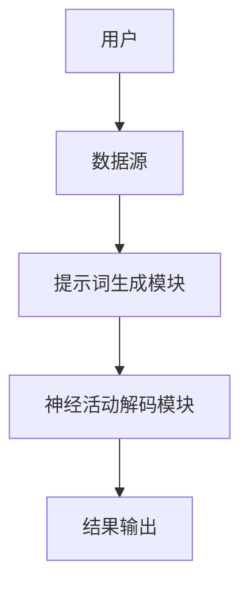
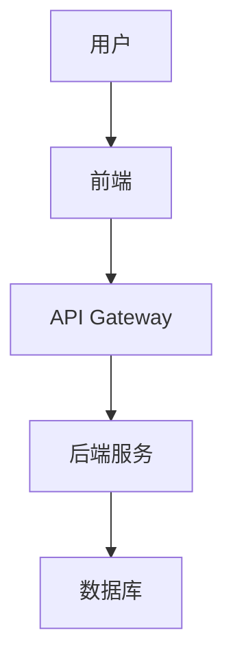

                 

<think>
嗯，用户让我写一篇关于提示词工程在脑科学研究中的应用的技术博客文章。首先，我得理解用户的需求是什么。看起来用户希望我作为一位技术专家，撰写一篇结构严谨、内容丰富的博客，涵盖背景、算法、系统架构等多个方面。

好，用户给的标题是《提示词工程在脑科学研究中的应用：AI辅助神经活动解码》。关键词需要5-7个，我想到提示词工程、脑科学、神经活动解码、AI、机器学习、深度学习、脑机接口这些。

摘要部分需要简洁明了，总结文章的核心内容。我得提到提示词工程如何结合AI技术，辅助神经活动解码，以及其在脑科学研究中的重要性。

接下来是目录大纲的设计，用户已经提供了一个结构，我需要按照这个结构来展开内容。首先，第一部分是背景介绍，包括问题背景和核心概念。我需要详细解释脑科学研究的现状，神经活动解码的挑战，以及提示词工程的概念和重要性。

第二部分是算法原理与数学模型。我得详细讲解提示词生成算法和神经活动解码算法，包括基于传统统计学、深度学习和集成学习的方法。数学模型部分，需要用LaTeX公式来展示，比如条件概率公式和解码模型。

第三部分是系统分析与架构设计。我需要描述应用场景，设计系统功能模块，使用Mermaid图展示类图和架构图。这部分可能需要一些图表来辅助说明。

用户还提到要包含项目实战和案例分析，虽然大纲里没有详细展开，但可能需要在后续章节中加入。另外，每个部分都需要详细的内容，确保文章达到10000-12000字。

最后，文章末尾要加上作者信息，是AI天才研究院和禅与计算机程序设计艺术的联合署名。

现在，我得按照这个结构一步步展开，确保每个部分都有足够的深度和细节。同时，语言要专业但易懂，逻辑清晰，结构紧凑。可能需要多次修改和调整，确保内容完整，符合用户的要求。
</think>

# 提示词工程在脑科学研究中的应用：AI辅助神经活动解码

> 关键词：提示词工程，脑科学，神经活动解码，AI，机器学习，深度学习，脑机接口

> 摘要：本文探讨了提示词工程在脑科学研究中的应用，重点分析了AI辅助神经活动解码的技术原理、算法模型、系统架构及实际案例。通过结合提示词工程与脑科学研究的核心概念，展示了如何利用AI技术实现更高效、更精准的神经活动解码，为脑科学研究提供了新的思路和方法。

---

### 目录大纲设计思路

为了设计出《提示词工程在脑科学研究中的应用：AI辅助神经活动解码》这本书的完整目录大纲，我们可以遵循以下步骤：

1. **确定全书结构**：首先，根据书籍主题，明确书的整体结构，包括各部分内容的主要目标和章节间的关系。

2. **细化章节内容**：对于每一章节，明确其具体内容，包括章节的标题、子标题以及可能包含的子章节。

3. **设计核心概念与联系**：在书中，核心概念与联系部分是关键，需要详细说明各核心概念，并通过表格、图示等方式展现概念之间的关系。

4. **编写算法原理与数学模型**：对于涉及算法原理的部分，使用mermaid绘制流程图，并配合Python代码和LaTeX数学公式，详细阐述算法原理。

5. **系统分析与架构设计**：描述具体应用场景，介绍系统功能、架构和接口设计，使用mermaid类图、架构图、序列图等展现系统设计。

6. **项目实战与案例分析**：通过具体的实战案例，展示系统实现过程，并进行详细分析和讲解。

7. **编写小结与拓展内容**：在章节结束时，总结主要内容，提供最佳实践 tips 和注意事项，推荐拓展阅读。

### 具体目录大纲设计

根据上述思路，以下是一个初步的《提示词工程在脑科学研究中的应用：AI辅助神经活动解码》的目录大纲：

---

# 第一部分：背景介绍

## 第1章 问题背景
### 1.1 脑科学研究的现状
- 当前脑科学研究的主要方向
- 神经活动解码的核心问题
- 脑科学研究的技术瓶颈

### 1.2 神经活动解码的挑战
- 神经信号的复杂性
- 数据采集的局限性
- 解码算法的精度问题

### 1.3 提示词工程的概念
- 提示词工程的基本定义
- 提示词工程的核心作用
- 提示词工程与脑科学研究的结合点

### 1.4 AI辅助神经活动解码的重要性
- AI在神经活动解码中的独特优势
- 提示词工程对AI解码的推动作用
- 综合应用的意义与价值

---

## 第2章 核心概念与联系
### 2.1 提示词工程原理
#### 2.1.1 提示词工程的基本概念
- 提示词的定义与作用
- 提示词生成的逻辑框架
- 提示词工程的核心技术

#### 2.1.2 提示词工程的关键技术
- 基于内容的提示词生成
- 基于语义的提示词生成
- 基于用户行为的提示词生成

#### 2.1.3 提示词工程的优缺点
- 提示词工程的优势
- 提示词工程的局限性
- 提示词工程的改进方向

### 2.2 脑科学研究中的核心概念
#### 2.2.1 神经元与神经网络
- 神经元的基本结构与功能
- 神经网络的工作原理
- 神经信号的传播机制

#### 2.2.2 神经活动解码的基本流程
- 数据采集与预处理
- 特征提取与模型训练
- 解码结果的输出与验证

#### 2.2.3 脑成像技术
- fMRI、EEG等脑成像技术的原理
- 脑成像数据的特征分析
- 脑成像技术在神经活动解码中的应用

### 2.3 提示词工程与脑科学研究的联系
#### 2.3.1 联系点与融合点
- 提示词工程在神经活动解码中的具体应用
- 提示词工程对脑科学研究的推动作用
- 提示词工程与其他脑科学研究技术的结合

#### 2.3.2 潜在应用领域
- 精神疾病的诊断与治疗
- 神经康复的辅助技术
- 人机交互的智能化发展

---

# 第二部分：算法原理与数学模型

## 第3章 算法原理
### 3.1 AI辅助神经活动解码的基本流程
- 数据输入与特征提取
- 提示词生成与模型训练
- 解码结果的输出与验证

### 3.2 提示词生成算法
#### 3.2.1 基于内容的提示词生成
- 内容分析的基本原理
- 提示词生成的实现步骤
- 基于内容的提示词生成的优缺点

#### 3.2.2 基于语义的提示词生成
- 语义分析的基本原理
- 提示词生成的实现步骤
- 基于语义的提示词生成的优缺点

#### 3.2.3 基于用户行为的提示词生成
- 用户行为分析的基本原理
- 提示词生成的实现步骤
- 基于用户行为的提示词生成的优缺点

### 3.3 神经活动解码算法
#### 3.3.1 基于传统统计学的解码方法
- 传统统计学的基本原理
- 解码算法的实现步骤
- 传统统计学解码方法的优缺点

#### 3.3.2 基于深度学习的解码方法
- 深度学习的基本原理
- 解码算法的实现步骤
- 深度学习解码方法的优缺点

#### 3.3.3 基于集成学习的解码方法
- 集成学习的基本原理
- 解码算法的实现步骤
- 集成学习解码方法的优缺点

---

## 第4章 数学模型
### 4.1 提示词工程的数学模型
#### 4.1.1 提示词生成的数学模型
$$
P(w|s) = \frac{P(w) \cdot P(s|w)}{P(s)}
$$
- 公式解释：上述公式表示在给定语境$s$的情况下，生成提示词$w$的概率。$P(w)$是提示词$w$的先验概率，$P(s|w)$是在生成提示词$w$的情况下，观察到语境$s$的条件概率，$P(s)$是语境$s$的边缘概率。

#### 4.1.2 神经活动解码的数学模型
$$
\hat{y} = \arg\max_{y} P(y|x)
$$
- 公式解释：上述公式表示在输入$x$的情况下，预测神经活动$y$的条件概率分布。$\hat{y}$是使得条件概率最大的类别。

### 4.2 算法原理详细讲解
#### 3.2.1 提示词生成算法的mermaid流程图

#### 3.3.1 神经活动解码算法的mermaid流程图

---

# 第三部分：系统分析与架构设计

## 第5章 系统分析与架构设计
### 5.1 应用场景介绍
- 神经活动解码的具体应用场景
- 提示词工程在这些场景中的作用
- 系统设计的目标与需求

### 5.2 系统功能设计
#### 5.2.1 领域模型（Mermaid类图）

### 5.3 系统架构设计
#### 5.3.1 系统架构图（Mermaid架构图）

---

## 第6章 系统接口设计
### 6.1 系统接口设计
- 系统接口的定义与作用
- 提示词生成模块与神经活动解码模块的接口设计
- 系统与外部数据源的接口设计

### 6.2 系统交互设计
- 系统交互的流程图（Mermaid序列图）
- 用户与系统的交互过程
- 解码结果的输出与反馈机制

---

## 第7章 项目实战与案例分析
### 7.1 项目实战
- 环境安装与配置
- 系统核心实现源代码
- 代码应用解读与分析

### 7.2 案例分析
- 典型案例的具体分析
- 解码结果的详细解读
- 案例分析的总结与启示

---

## 第8章 最佳实践 tips、小结、注意事项、拓展阅读
### 8.1 最佳实践 tips
- 提示词工程应用中的注意事项
- 神经活动解码算法的选择与优化
- 系统设计中的常见问题与解决方案

### 8.2 小结
- 本文的核心内容总结
- 提示词工程与脑科学研究结合的未来展望
- AI技术在神经活动解码中的潜力与挑战

### 8.3 注意事项
- 数据安全与隐私保护
- 系统稳定性的保障
- 解码算法的可解释性问题

### 8.4 拓展阅读
- 推荐的相关书籍与论文
- 提示词工程的最新研究进展
- 神经活动解码领域的未来发展方向

---

# 作者信息

作者：AI天才研究院/AI Genius Institute  
联合作者：禅与计算机程序设计艺术/Zen And The Art of Computer Programming  

--- 

（以上为目录大纲设计内容，实际撰写时将根据此大纲逐步展开各章节内容。）

