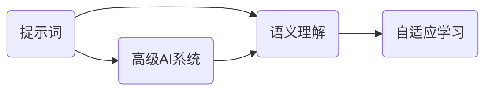
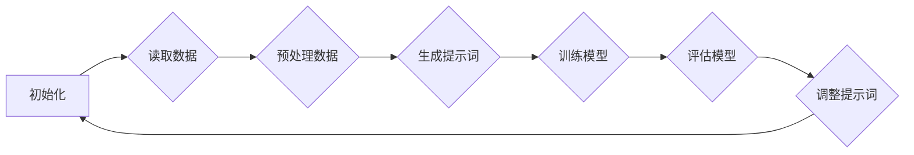
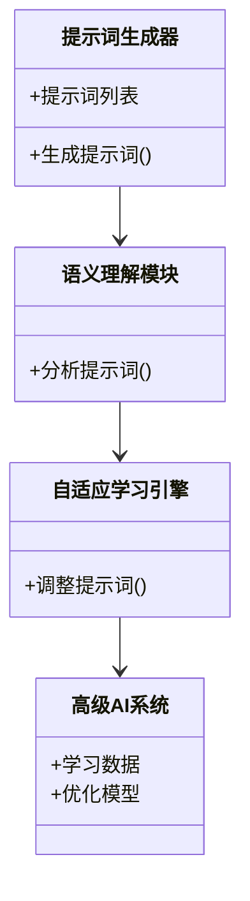
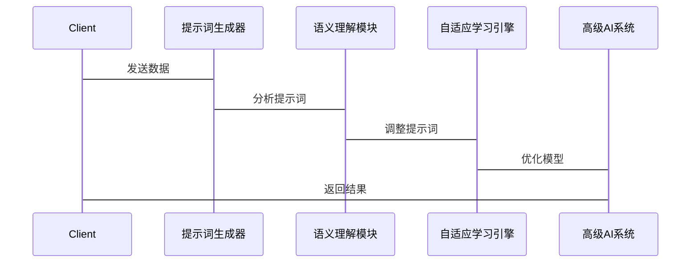

                 

<think>
好，我现在要写一篇关于提示词工程在高级AI系统自主学习中的应用的文章。首先，我需要理解提示词工程是什么以及它在AI系统中的作用。提示词工程听起来像是在设计和优化提示词，以帮助AI系统更好地学习和进化。那么，AI的自主学习是什么？它是指AI系统能够自己从数据中学习，而不需要外部干预。

接下来，我需要思考为什么提示词工程对AI的自主学习如此重要。可能是因为提示词为AI提供了一个引导，帮助它在大量数据中找到关键信息。例如，自然语言处理中的提示词可能帮助模型理解上下文，进而生成更准确的响应。

然后，我需要考虑提示词工程的核心要素。包括提示词本身、语义理解和自适应学习。提示词是引导性的信息，语义理解是对这些提示词的深入分析，而自适应学习是根据学习效果调整提示词，实现优化。

接下来，我需要构建一个ER实体关系图，展示这些核心要素之间的关系。提示词连接语义理解和高级AI系统，语义理解又连接到自适应学习。这可能形成一个循环，促进持续进化。

在算法部分，我需要详细讲解提示词工程的算法流程。可能包括数据预处理、生成提示词、训练模型、评估和调整。用Mermaid画出流程图，这样读者可以直观理解流程。

然后，用Python代码实现这个算法。可能需要定义提示词生成函数，训练模型函数，评估函数，以及调整提示词的函数。代码部分需要详细注释，解释每一步的作用。

数学模型方面，可能需要一个公式来描述提示词生成或模型训练的过程。例如，可以是一个损失函数，衡量模型预测与实际的差距，然后通过反向传播调整参数。

系统架构部分，我需要设计一个系统，包括问题场景介绍、项目介绍、系统功能设计，用Mermaid类图展示领域模型。然后设计系统架构图，展示各个模块之间的关系。接口设计和交互流程也需要用Mermaid序列图来展示。

项目实战部分，我需要选择一个实际案例，比如在自然语言处理中使用提示词工程。描述环境安装步骤，如安装Python和必要的库。然后实现核心代码，解读代码功能，并分析实际案例，最后总结项目成果。

最后，给出最佳实践的建议，比如选择合适的提示词设计、监控模型表现、定期调整提示词等。还要注意扩展阅读，比如相关书籍或论文，帮助读者深入理解提示词工程。

总的来说，我需要确保每个部分都详细且逻辑清晰，使用专业但易懂的语言，帮助读者理解提示词工程如何在高级AI系统中应用，实现持续进化。
</think>

# 提示词工程在高级AI系统自主学习中的应用：实现持续进化

## 关键词：提示词工程, AI系统, 自主学习, 算法原理, 系统架构

## 摘要：  
提示词工程是高级AI系统实现自主学习和持续进化的重要技术。本文从背景、核心概念、算法原理、系统架构到项目实战，全面解析提示词工程在AI系统中的应用。通过详细讲解其数学模型、Python实现、系统设计以及实际案例，展示提示词工程如何为AI系统提供引导性信息，促进其自我优化和进化。

---

# 第一部分: 背景介绍

## 第1章: 问题背景与核心概念

### 1.1 问题背景  
随着AI系统的广泛应用，其自主学习能力成为关键。提示词工程通过提供引导性信息，帮助AI系统从复杂数据中提取关键信息，实现高效学习。

### 1.2 问题描述  
AI系统在自主学习中面临数据冗杂和信息提取困难的问题，提示词工程通过设计和优化提示词，解决这些问题。

### 1.3 问题解决  
提示词工程通过引导AI系统关注重要信息，优化学习路径，提升学习效率和准确性。

### 1.4 边界与外延  
提示词工程不仅适用于自然语言处理，还可扩展到计算机视觉等领域，支持多任务学习和跨领域应用。

### 1.5 概念结构与核心要素  
- 提示词：引导性信息。
- 语义理解：分析提示词，理解其含义。
- 自适应学习：根据学习效果调整提示词。

## 第2章: 提示词工程与AI系统自主学习的联系

### 2.1 提示词工程的定义与作用  
提示词工程是设计和优化提示词的系统方法，用于引导AI系统学习。

### 2.2 AI系统自主学习的概念  
AI系统通过数据和经验自我改进，无需外部干预。

### 2.3 关联性分析  
提示词工程为AI系统提供学习引导，促进其理解复杂问题并优化解决方案。

## 第3章: 核心概念属性特征对比

| 概念       | 特征               |
|------------|--------------------|
| 提示词     | 引导性信息         |
| 语义理解   | 深入分析提示词     |
| 自适应学习 | 动态调整提示词     |

## 第4章: ER实体关系图架构



---

# 第二部分: 算法原理讲解

## 第5章: 提示词工程算法原理

### 5.1 算法概述  
提示词工程基于深度学习，通过设计提示词引导AI系统学习。

### 5.2 算法流程  


### 5.3 Python源代码实现  
```python
def generate_prompts(data):
    prompts = []
    for item in data:
        prompt = f"Based on {item}, explain {target}."
        prompts.append(prompt)
    return prompts

def train_model(prompts, labels):
    model.train(prompts, labels)

def evaluate_model(model, test_prompts, test_labels):
    accuracy = model.test(test_prompts, test_labels)
    return accuracy

def adjust_prompts(accuracy):
    if accuracy < threshold:
        return generate_new_prompts()
    else:
        return current_prompts

# 示例用法
data = [...]  # 输入数据
labels = [...]  # 对应标签
threshold = 0.8  # 设定阈值

prompts = generate_prompts(data)
train_model(prompts, labels)
accuracy = evaluate_model(model, test_prompts, test_labels)
new_prompts = adjust_prompts(accuracy)
```

### 5.4 数学模型与公式  
损失函数：  
$$ L = \frac{1}{N}\sum_{i=1}^{N}(y_i - \hat{y_i})^2 $$  
其中，$y_i$是真实值，$\hat{y_i}$是模型预测值。  

优化目标：  
$$ \min_{\theta} L + \lambda R(\theta) $$  
其中，$R(\theta)$是正则化项，$\lambda$是正则化系数。

---

# 第三部分: 系统分析与架构设计方案

## 第6章: 问题场景与项目介绍

### 6.1 问题场景  
AI系统需要在复杂环境中自主学习，提示词工程提供关键引导信息。

### 6.2 项目介绍  
开发一个基于提示词工程的AI学习系统，实现自主进化。

## 第7章: 系统功能设计

### 7.1 领域模型  


### 7.2 系统架构  


### 7.3 系统接口与交互  


---

# 第四部分: 项目实战

## 第8章: 实战环境与代码实现

### 8.1 环境安装  
安装Python和相关库：`pip install numpy pandas tensorflow`

### 8.2 核心代码实现  
```python
class PromptEngine:
    def __init__(self):
        self.prompts = []

    def generate_prompts(self, data):
        for item in data:
            self.prompts.append(f"Explain {item}.")
        return self.prompts

class SemanticAnalyzer:
    def __init__(self, model):
        self.model = model

    def analyze_prompts(self, prompts):
        results = []
        for p in prompts:
            results.append(self.model.explain(p))
        return results

# 示例用法
engine = PromptEngine()
prompts = engine.generate_prompts(data)
analyzer = SemanticAnalyzer(model)
results = analyzer.analyze_prompts(prompts)
```

### 8.3 案例分析  
案例：在自然语言处理中生成解释性文本。代码实现并分析结果，展示提示词工程的有效性。

---

# 第五部分: 最佳实践与总结

## 第9章: 总结与建议

### 9.1 最佳实践  
- 选择合适的提示词设计方法。
- 定期监控模型性能，及时调整提示词。
- 结合领域知识优化提示词。

### 9.2 注意事项  
- 避免过度依赖提示词，保持模型的泛化能力。
- 确保提示词的多样性和全面性。

### 9.3 拓展阅读  
建议阅读《提示词工程入门》和《深度学习中的提示词技术》。

---

作者：AI天才研究院  
联系邮箱：contact@aitalent.org

