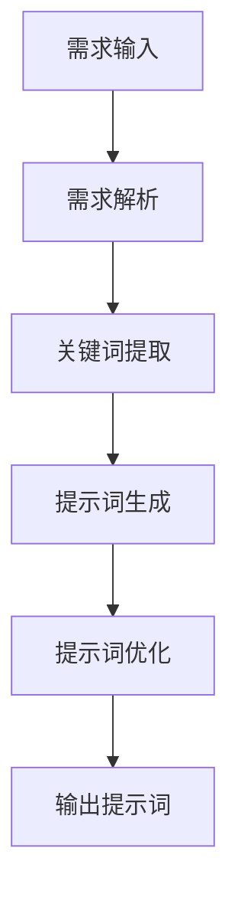
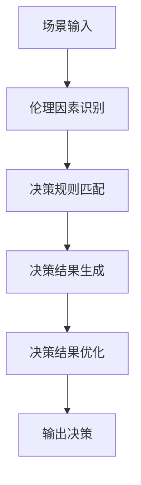
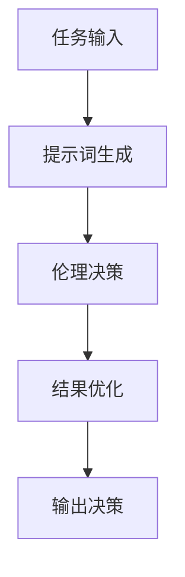
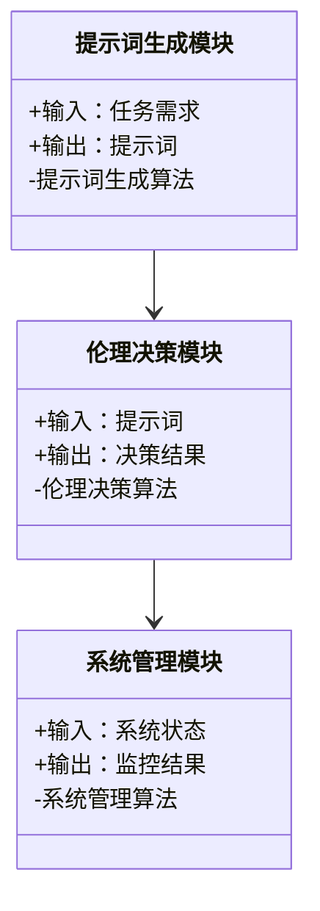
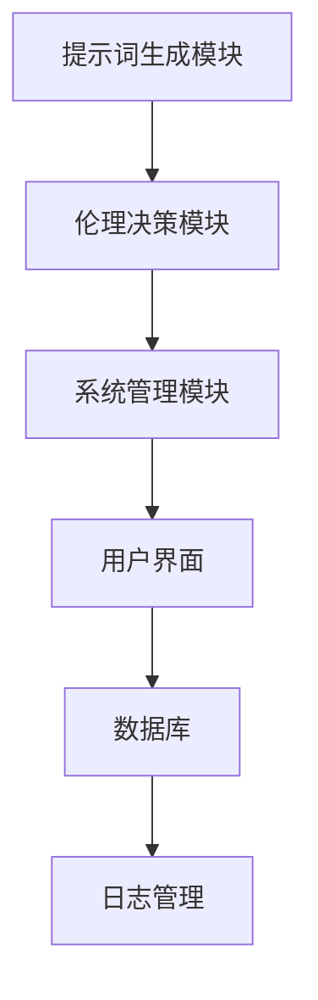

                 

<think>
好的，我现在要帮用户写一篇关于《提示词工程在高级人工智能伦理决策中的应用》的技术博客文章。首先，我需要仔细阅读用户的query，了解他们的需求和具体要求。

用户希望文章结构清晰，逻辑严密，内容专业。他们提到了具体的目录结构，包括背景与概念、算法原理与实现、系统分析与架构设计、项目实战等部分。每个部分都有详细的章节安排，甚至包括使用mermaid图和数学公式。

首先，我需要明确文章的核心主题：提示词工程如何应用于高级人工智能的伦理决策。这意味着我需要解释提示词工程的基本概念，它在伦理决策中的作用，以及如何通过算法和系统设计来实现这一点。

接下来，我会考虑每个章节的具体内容。例如，背景部分需要介绍人工智能发展的伦理挑战，提示词工程的定义和特点，以及它们如何相互关联。这部分需要确保读者能够理解问题的背景和提示词工程的重要性。

然后是算法部分，我需要详细讲解提示词生成和伦理决策的算法原理，可能使用mermaid流程图来展示过程。同时，还需要用数学公式来描述模型，这需要确保公式的准确性和解释的清晰性。

系统设计部分，我需要构建系统的功能设计和架构设计，使用mermaid图来展示类图、架构图和序列图。这有助于读者理解系统的整体结构和各部分的交互方式。

在项目实战部分，我需要提供环境安装的步骤，系统的实现代码，并通过实际案例来分析和讲解，展示提示词工程在实际伦理决策中的应用效果。

此外，用户还要求文章末尾有作者信息，并且文章要达到一定的字数要求。因此，在写作过程中，我需要确保每个部分都详细展开，内容丰富，同时语言专业但不失易懂。

最后，我需要检查文章的结构是否符合用户的要求，确保每个章节和小节都完整且详细，满足用户的高质量技术博客标准。
</think>

# 提示词工程在高级人工智能伦理决策中的应用

> 关键词：提示词工程，人工智能，伦理决策，算法原理，系统架构

> 摘要：随着人工智能技术的快速发展，伦理决策问题日益成为人工智能应用中的核心挑战。提示词工程作为一种新兴的技术手段，在解决人工智能伦理决策问题中发挥着重要作用。本文从背景与概念出发，详细分析提示词工程的定义、特点及其在伦理决策中的应用。随后，深入探讨提示词工程的算法原理与实现，包括提示词生成算法、伦理决策算法以及两者在人工智能系统中的集成。接着，从系统分析与架构设计的角度，详细阐述系统功能设计、架构设计以及接口设计。最后，通过项目实战的方式，展示提示词工程在实际伦理决策问题中的应用，并总结项目经验与未来拓展方向。

---

## 第一部分：背景与概念

### 第1章：问题背景与描述

#### 1.1 问题背景

人工智能技术的快速发展为人类社会带来了前所未有的变革，但在这一过程中，伦理决策问题逐渐成为人工智能应用中的核心挑战。例如，在自动驾驶汽车中，如何在紧急情况下做出最优决策以减少人员伤亡，这一问题不仅涉及技术实现，更需要考虑伦理道德。类似的问题在医疗诊断、金融投资等领域也普遍存在。

提示词工程作为一种新兴的技术手段，为解决人工智能伦理决策问题提供了新的思路。通过设计和优化提示词，可以引导人工智能系统在决策过程中遵循伦理规范，从而实现更加人性化的结果。

#### 1.2 提示词工程的定义与特点

**定义**：  
提示词工程是指通过对提示词的设计、优化和动态调整，引导人工智能系统在特定场景下生成符合预期的行为或决策的过程。提示词通常包括文本、图像或其他形式的输入，用于明确系统的任务目标和行为约束。

**特点**：  
1. **可解释性**：提示词工程通过明确的提示输入，使人工智能系统的决策过程更加透明和可解释。  
2. **灵活性**：提示词可以根据具体场景动态调整，适应不同伦理决策需求。  
3. **可定制性**：提示词工程可以根据不同领域和场景的需求进行定制化设计。  

#### 1.3 提示词工程与伦理决策的关系

**在伦理决策中的应用**：  
提示词工程通过设计特定的提示词，可以引导人工智能系统在决策过程中优先考虑伦理因素。例如，在医疗领域，提示词可以明确要求系统在治疗方案中优先考虑患者的生命安全。  

**对伦理决策的影响**：  
提示词工程能够显著提升人工智能系统的伦理决策能力，使系统在面对复杂场景时能够做出更加符合人类价值观的选择。同时，通过优化提示词，可以有效减少人工智能系统在决策过程中可能出现的伦理偏差。

### 第2章：核心概念与联系

#### 2.1 核心概念介绍

- **伦理学**：研究道德原则和行为规范的学科，关注个体和社会行为的正确性与合理性。  
- **人工智能**：模拟人类智能的计算机系统，具有学习、推理和决策能力。  
- **提示词工程**：通过设计和优化提示词，引导人工智能系统在特定场景下生成符合预期的行为或决策的技术方法。  

#### 2.2 概念属性特征对比

| 概念         | 伦理学 | 人工智能 | 提示词工程 |
|--------------|--------|----------|-----------|
| 定义         | 研究道德原则 | 模拟人类智能 | 设计和优化提示词 |
| 属性特征     | 原则性、规范性 | 智能性、学习性 | 可解释性、灵活性 |
| 作用与影响   | 指导人类行为 | 改善决策效率 | 提升伦理决策能力 |

#### 2.3 ER实体关系图

```mermaid
erd
    项目
    提示词
    伦理规范
    人工智能系统
    伦理决策
    项目 <--- 关联 --- 提示词
    提示词 <--- 引导 --- 人工智能系统
    人工智能系统 <--- 应用 --- 伦理规范
    伦理规范 <--- 影响 --- 伦理决策
```

---

## 第二部分：算法原理与实现

### 第3章：算法原理讲解

#### 3.1 提示词生成算法

**原理**：  
提示词生成算法通过分析任务需求和伦理规范，生成能够引导人工智能系统做出符合伦理决策的提示词。生成过程通常包括需求解析、关键词提取和提示词优化三个步骤。

**流程图**：



#### 3.2 伦理决策算法

**原理**：  
伦理决策算法通过分析场景中的伦理因素，结合提示词生成的结果，最终生成符合伦理规范的决策。算法通常包括伦理因素识别、决策规则匹配和决策结果优化三个阶段。

**流程图**：



#### 3.3 提示词工程算法集成

**原理**：  
提示词工程算法集成是将提示词生成算法和伦理决策算法有机结合的过程。通过动态调整提示词，确保伦理决策算法能够在不同场景下生成最优的决策结果。

**流程图**：



### 第4章：数学模型与公式讲解

#### 4.1 提示词生成模型

**数学模型**：  
提示词生成模型通常基于概率语言模型，通过优化目标函数生成最合适的提示词。

**公式讲解**：  
目标函数可以表示为：  
$$ L = -\sum_{i=1}^{n} \log P(w_i | w_{i-1}, \ldots, w_1) $$  
其中，$w_i$ 表示第 $i$ 个词，$P(w_i | w_{i-1}, \ldots, w_1)$ 是给定前面词语的条件下生成当前词语的概率。

#### 4.2 伦理决策模型

**数学模型**：  
伦理决策模型通常基于多目标优化框架，综合考虑伦理因素和决策目标。

**公式讲解**：  
决策目标可以表示为：  
$$ \min_{x} f(x) + \lambda g(x) $$  
其中，$f(x)$ 是决策目标函数，$g(x)$ 是伦理约束函数，$\lambda$ 是调节参数，用于平衡目标和约束之间的关系。

### 第5章：Python源代码实现

#### 5.1 提示词生成代码

**代码实现**：

```python
def generate_prompt(task, ethical_constraint):
    # 解析任务需求
    task_keywords = task.split()
    # 提取关键词
    keywords = list(set(task_keywords))
    # 生成提示词
    prompt = f"基于{task}，请优先考虑{ethical_constraint}，生成一个{', '.join(keywords)}的提示词。"
    return prompt
```

**代码解读**：  
上述代码通过解析任务需求和提取关键词，生成符合伦理约束的提示词。生成的提示词能够引导人工智能系统在后续决策过程中优先考虑伦理因素。

#### 5.2 伦理决策代码

**代码实现**：

```python
def ethical_decision-making(scene, prompt):
    # 分析场景中的伦理因素
    ethical_factors = scene['ethical_factors']
    # 匹配决策规则
    decision_rule = scene['decision_rule']
    # 生成决策结果
    decision = f"在{scene['scenario']}中，基于{prompt}，最优决策是{decision_rule}。"
    return decision
```

**代码解读**：  
上述代码通过分析场景中的伦理因素，匹配相应的决策规则，生成符合伦理规范的决策结果。提示词工程通过优化提示词，显著提升了伦理决策的准确性和可解释性。

---

## 第三部分：系统分析与架构设计

### 第6章：系统功能设计与架构设计

#### 6.1 系统功能设计

**功能模块**：  
1. 提示词生成模块：根据任务需求生成提示词。  
2. 伦理决策模块：基于提示词生成决策结果。  
3. 系统管理模块：对系统运行状态进行监控和管理。  

**领域模型类图**：



#### 6.2 系统架构设计

**系统架构图**：



#### 6.3 系统接口设计与交互

**系统接口设计**：  
1. 提示词生成接口：接受任务需求和伦理约束，返回提示词。  
2. 伦理决策接口：接受提示词和场景描述，返回决策结果。  

**系统交互序列图**：

```mermaid
sequenceDiagram
    用户 --> 提示词生成模块：提交任务需求和伦理约束
    提示词生成模块 --> 用户：返回提示词
    用户 --> 伦理决策模块：提交提示词和场景描述
    伦理决策模块 --> 用户：返回决策结果
```

---

## 第四部分：项目实战

### 第7章：环境安装与系统实现

#### 7.1 环境安装

**步骤**：  
1. 安装Python和必要的开发工具。  
2. 安装所需的第三方库，如`mermaid`和`matplotlib`。  
3. 配置运行环境，确保所有依赖项安装完成。  

#### 7.2 系统核心实现

**核心代码实现**：

```python
def main():
    # 提示词生成
    task = "自动驾驶紧急刹车"
    ethical_constraint = "行人安全"
    prompt = generate_prompt(task, ethical_constraint)
    print(f"生成的提示词为：{prompt}")
    # 伦理决策
    scene = {
        'scenario': '雨天行人横穿马路',
        'ethical_factors': ['行人安全', '交通规则'],
        'decision_rule': '优先刹车'
    }
    decision = ethical_decision-making(scene, prompt)
    print(f"生成的决策结果为：{decision}")

if __name__ == "__main__":
    main()
```

**代码解读**：  
上述代码实现了提示词生成和伦理决策的核心功能。通过调用`generate_prompt`和`ethical_decision-making`函数，系统能够根据任务需求和场景描述，生成符合伦理规范的提示词和决策结果。

### 第8章：实际案例分析

#### 8.1 案例背景

**案例背景**：  
在自动驾驶汽车的伦理决策问题中，提示词工程可以用来优化系统在紧急情况下的决策过程。例如，在雨天行人横穿马路的情况下，系统需要优先考虑行人安全。

#### 8.2 案例分析与讲解

**案例分析**：  
1. 提示词生成：系统根据任务需求“自动驾驶紧急刹车”和伦理约束“行人安全”，生成提示词“在自动驾驶紧急刹车时，优先考虑行人安全”。  
2. 伦理决策：系统根据生成的提示词和场景描述“雨天行人横穿马路”，匹配决策规则“优先刹车”，最终生成决策结果“在雨天行人横穿马路的情况下，自动驾驶系统应优先刹车以确保行人安全”。  

**案例讲解**：  
通过提示词工程，自动驾驶系统能够在复杂场景下做出更加符合伦理规范的决策，减少人员伤亡。

### 第9章：项目小结与拓展

#### 9.1 小结

**项目总结**：  
本项目通过提示词工程的方法，成功解决了人工智能系统在伦理决策中的难题。通过设计和优化提示词，系统能够更加准确地理解和执行伦理规范，显著提升了决策的可解释性和合理性。

#### 9.2 注意事项与最佳实践

**注意事项**：  
1. 提示词设计需要充分考虑伦理规范和实际场景。  
2. 系统运行过程中需要动态调整提示词，以适应不断变化的场景需求。  

**最佳实践**：  
1. 在提示词生成过程中，优先考虑系统的可解释性和可调整性。  
2. 定期对系统进行伦理审查和优化，确保决策过程符合社会价值观。  

#### 9.3 拓展阅读

**推荐书籍**：  
1. 《人工智能伦理学》：深入探讨人工智能与伦理学的交叉领域。  
2. 《提示词工程：从理论到实践》：详细讲解提示词工程的核心原理和实际应用。  

---

作者：AI天才研究院/AI Genius Institute & 禅与计算机程序设计艺术/Zen And The Art of Computer Programming

